# 基本設計書 - AI Assistant Avatar

## 1. システム構成とモジュール設計
本システムは Qt6 C++ フレームワークを使用し、UI（画面表示）とビジネスロジックを分離した構造を持つ。スレッド安全性と拡張性を確保するため、全体を以下のモジュールに分割する。

```mermaid
graph TD
    UI[UIモジュール: AvatarWindow/バルーン]
    Core[コアモジュール: CoreModule]
    Twitch[Twitchモジュール: TwitchReader]
    Discord[Discordモジュール: DiscordReader]
    STT[STTモジュール: STTManager]
    AI[AIモジュール: AIClientManager]
    SM[AIモジュール内部: SearchManager]

    %% 要求フロー (スレッド呼び出し)
    UI -- 1. スレッド呼び出し --> Core
    Core -- 2. 要求 --> Twitch
    Core -- 2. 要求 --> Discord
    Core -- 2. 要求 --> STT
    Core -- 2. 要求 --> AI
    AI -. 2.5 検索実行 .-> SM

    %% イベント通知フロー (非同期通知)
    Twitch -- 3. on_notify_events --> Core
    Discord -- 3. on_notify_events --> Core
    STT -- 3. on_notify_events --> Core
    AI -- 3. on_notify_events --> Core
    Core -- 4. on_notify_events --> UI
```

### 1.1 モジュール責務一覧

| モジュール名 | 主要クラス名 | 動作スレッド | 主な責務 |
| :--- | :--- | :--- | :--- |
| **UIモジュール** | `AvatarWindow` | メイン（GUI）スレッド | ・アバターウィンドウの描画（750x480の左右2ペイン構成）<br>・直接テキスト入力欄（チャットタブ）の提供<br>・設定タブ（設定保存・適用、Twitch OAuth認可、WebHook設定、Discord連携設定）の提供<br>・ナレッジ管理UI（登録済みナレッジ一覧、削除機能）の提供<br>・OBS配信連携用WebSocketサーバー（ブロードキャスト）の提供<br>・最新AI応答表示領域（吹き出し風装飾されたQTextBrowser）の提供<br>・アバター状態変化やAI応答テキストの外部WebHookへのPOST送信（非同期）<br>・ユーザー操作の受付とコアへの要求発行、イベント受信による表示更新 |
| **Twitchモジュール**| `TwitchReader` | Twitchスレッド | ・認証トークンがない場合等にブラウザでOAuth画面（`force_verify=true`）を開き、一時HTTPサーバーを構築してリダイレクトを受け、JavaScript付きHTMLを返してURLハッシュ（フラグメント）からアクセストークンを受信・保存する<br>・取得したトークンを用いたTwitchチャット接続（WebSocket）<br>・コメント監視およびウェイクワード判定<br>・マッチしたコメントのイベント通知 |
| **Discordモジュール**| `DiscordReader` | Discordスレッド | ・Discordボット接続（WebSocketゲートウェイ）の維持および定期ハートビート送信<br>・対象チャンネルでのメッセージ受信（`MESSAGE_CREATE`）監視とイベント通知<br>・AI応答を指定されたDiscordチャンネルへ非同期でPOST送信（REST API） |
| **コアモジュール** | `CoreModule` | コアスレッド | ・システム全体の制御および他モジュールの管理<br>・UIからの要求のハンドリング<br>・各モジュールからのイベント受信と処理フローの進行<br>・UIへの完了イベント通知 |
| **STTモジュール** | `STTManager` | STTスレッド | ・マイクからの音声キャプチャ（QAudioSource等を使用）<br>・`whisper.cpp` または `Windows SAPI` による音声認識<br>・文字起こし結果のイベント通知 |
| **AIモジュール** | `AIClientManager`<br>`IAIClient`<br>`SearchManager` | AIスレッド | ・**【2段構成＆検索連携】**<br>・**1段目（Manager）**: コアからの要求受付、AIクライアントの動的切り替え、共通イベント化と通知。および翻訳コマンド (`trans`) の検出と履歴・コンテキストのバイパス制御。また、リセット時の長期記憶アーカイブ（サマリ＆詳細）生成と想起の制御。さらに、UI直接入力（Direct Input）に限定した対話型Markdownナレッジ登録（10分タイマー監視、メタデータ管理、本登録）の制御<br>・**2段目（Client）**: 各AI API固有 of HTTPリクエスト構築とレスポンスパース、Function Calling (web_search) 時の再問い合わせ制御、およびナレッジ本登録ツール・フォルダオープンツール呼び出しの制御<br>・**検索マネージャ**: Tavily/DuckDuckGoを組み合わせたハイブリッドWeb検索および自動フォールバックの実行 |

---

## 2. スレッドモデル
Qtの `QThread` および `QObject::moveToThread` を活用したワーカーオブジェクトモデルを採用する。

1. **常駐スレッドのライフサイクル**
   - アプリケーション起動時（`main.cpp` または `AvatarWindow` の初期化時）に、各スレッド（`CoreThread`, `TwitchThread`, `STTThread`, `AIThread`）を生成・開始（`QThread::start()`）する。
   - 各ワーカーオブジェクト（`CoreModule`, `TwitchReader` 等）を生成し、対応するスレッドに `moveToThread` する。
2. **安全な終了処理（クリーンアップ）**
   - アプリケーション終了時（`closeEvent` の検知時）、UIからコアモジュールへ終了要求を送る。
   - コアモジュールは各モジュールに停止シグナルを送り、ループや接続を安全に終了させる。
   - その後、各 `QThread` に対して `quit()` を呼び出し、`wait()` でスレッドの完全終了（JOIN）を待機してからオブジェクトを破棄する。

---

## 3. イベント駆動モデル (データ連携)
モジュール間の連携には、Qtの **シグナルとスロット (QueuedConnection)** を利用した非同期イベント通信を用いる。

### 3.1 共通イベント構造体 `AppEvent`
モジュール間でやり取りするデータは、以下の構造体に統合して伝達する。

```cpp
enum class EventType {
    TwitchCommentReceived,  // トリガーとなるTwitchチャットを受信した
    VoiceInputStarted,       // 音声入力が開始された
    VoiceInputCompleted,     // 音声認識が完了しテキストが得られた
    AIRequestSent,          // AIへのAPIリクエストを送信した
    AIResponseReceived,     // AIからの応答テキストを受信した
    ErrorOccurred           // エラーが発生した
};

struct AppEvent {
    EventType type;
    QString text;           // 受信したチャット文、音声認識結果、AIの返答など
    QString source;         // イベント送信元モジュール名
    QVariantMap extraData;  // その他のメタデータ（ユーザー名、エラーコード等）
};
```

### 3.2 イベントの流れとシグナル・スロット接続

1. **個別モジュールからコアモジュールへの通知**
   - 各個別モジュールは `notifyEvent(const AppEvent& event)` シグナルを持つ。
   - コアモジュールはスロット `void on_notify_events(const AppEvent& event)` を持ち、各モジュールのシグナルと接続する。
2. **コアモジュールからUIモジュールへの通知**
   - コアモジュールは `notifyEventToUI(const AppEvent& event)` シグナルを持つ。
   - UIモジュールはスロット `void on_notify_events(const AppEvent& event)` を持ち、コアモジュールのシグナルと接続する。

---

## 4. クラス設計と拡張性

### 4.1 音声入力のエンジン抽象化 (`ISTTEngine`)
`whisper.cpp` と `Windows SAPI` を設定によって柔軟に切り替えるため、インターフェースクラスを導入する。

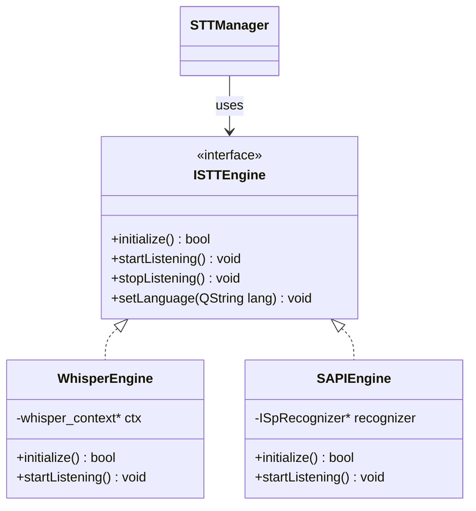
```mermaid
classDiagram
    class ISTTEngine {
        <<interface>>
        +initialize() bool
        +startListening() void
        +stopListening() void
        +setLanguage(QString lang) void
    }
    class WhisperEngine {
        -whisper_context* ctx
        +initialize() bool
        +startListening() void
    }
    class SAPIEngine {
        -ISpRecognizer* recognizer
        +initialize() bool
        +startListening() void
    }
    ISTTEngine <|.. WhisperEngine
    ISTTEngine <|.. SAPIEngine
    STTManager --> ISTTEngine : uses
```

### 4.2 AIモジュールの2段構成設計 (`AIClientManager` と `IAIClient`)
コアモジュールからの呼び出しインタフェースを一本化しつつ、接続先AI（Mistral AI、将来的な他のAI、テスト用ダミー等）の切り替えや各API固有の処理を隠蔽するため、**2段構成**を採用する。

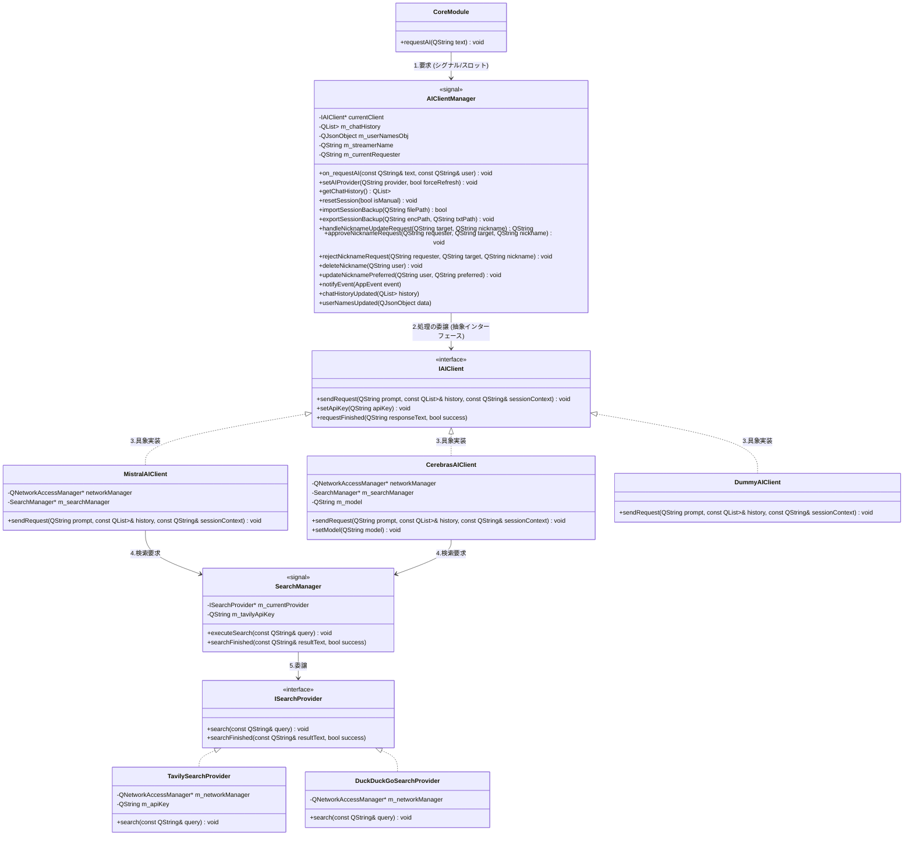
```mermaid
classDiagram
    class CoreModule {
        +requestAI(QString text) void
    }
    class AIClientManager {
        -IAIClient* currentClient
        -QList<QPair<QString, QString>> m_chatHistory
        -QJsonObject m_userNamesObj
        -QString m_streamerName
        -QString m_currentRequester
        +on_requestAI(const QString& text, const QString& user) void
        +setAIProvider(QString provider, bool forceRefresh) void
        +getChatHistory() QList<QPair<QString, QString>>
        +resetSession(bool isManual) void
        +importSessionBackup(QString filePath) bool
        +exportSessionBackup(QString encPath, QString txtPath) void
        +handleNicknameUpdateRequest(QString target, QString nickname) QString
        +approveNicknameRequest(QString requester, QString target, QString nickname) void
        +rejectNicknameRequest(QString requester, QString target, QString nickname) void
        +deleteNickname(QString user) void
        +updateNicknamePreferred(QString user, QString preferred) void
        <<signal>>
        +notifyEvent(AppEvent event)
        +chatHistoryUpdated(QList<QPair<QString, QString>> history)
        +userNamesUpdated(QJsonObject data)
    }
    class IAIClient {
        <<interface>>
        +sendRequest(QString prompt, const QList<QPair<QString, QString>>& history, const QString& sessionContext) void
        +setApiKey(QString apiKey) void
        <<signal>>
        +requestFinished(QString responseText, bool success)
    }
    class MistralAIClient {
        -QNetworkAccessManager* networkManager
        -SearchManager* m_searchManager
        +sendRequest(QString prompt, const QList<QPair<QString, QString>>& history, const QString& sessionContext) void
    }
    class CerebrasAIClient {
        -QNetworkAccessManager* networkManager
        -SearchManager* m_searchManager
        -QString m_model
        +sendRequest(QString prompt, const QList<QPair<QString, QString>>& history, const QString& sessionContext) void
        +setModel(QString model) void
    }
    class DummyAIClient {
        +sendRequest(QString prompt, const QList<QPair<QString, QString>>& history, const QString& sessionContext) void
    }
    class SearchManager {
        -ISearchProvider* m_currentProvider
        -QString m_tavilyApiKey
        +executeSearch(const QString& query) void
        <<signal>>
        +searchFinished(const QString& resultText, bool success)
    }
    class ISearchProvider {
        <<interface>>
        +search(const QString& query) void
        <<signal>>
        +searchFinished(const QString& resultText, bool success)
    }
    class TavilySearchProvider {
        -QNetworkAccessManager* m_networkManager
        -QString m_apiKey
        +search(const QString& query) void
    }
    class DuckDuckGoSearchProvider {
        -QNetworkAccessManager* m_networkManager
        +search(const QString& query) void
    }

    CoreModule --> AIClientManager : 1.要求 (シグナル/スロット)
    AIClientManager --> IAIClient : 2.処理の委譲 (抽象インターフェース)
    IAIClient <|.. MistralAIClient : 3.具象実装
    IAIClient <|.. CerebrasAIClient : 3.具象実装
    IAIClient <|.. DummyAIClient : 3.具象実装
    MistralAIClient --> SearchManager : 4.検索要求
    CerebrasAIClient --> SearchManager : 4.検索要求
    SearchManager --> ISearchProvider : 5.委譲
    ISearchProvider <|.. TavilySearchProvider
    ISearchProvider <|.. DuckDuckGoSearchProvider
```

#### 2段構成の責務分担

1. **1段目：`AIClientManager`（スレッド窓口・共通管理）**
   - コアスレッドからの要求をスロット（`on_requestAI`）で受信。コアモジュールからは常にこのクラスのみが見える。
   - 現在の設定に基づき、適切な `IAIClient` 具象クラス（2段目）へ処理を委譲する。
   - 2段目から返ってきた処理結果（テキストや成否フラグ）を受け取り、共通の `AppEvent` 構造体に組み立ててコアモジュールへ通知する。
   - APIキーの管理や、タイムアウト制御などの各AIで共通する処理をここで吸収する。

2. **2段目：`IAIClient` 具象クラス（各AI API固有の個別処理）**
   - HTTPのヘッダーおよびペイロード（JSON）の構築。
   - `QNetworkAccessManager` を使用した各API固有のエンドポイントへの通信。
   - 各API固有のJSONレスポンスのパースと、最終的な返答テキストの抽出。

3. **ユーティリティ：`AIRandomUtils`（AI向けランダム値取得 I/F モジュール）**
   - `Random(min, max)`: 閉区間 $[min, max]$ の乱数抽出エンジン。
   - `RandomList(max, count)`: 閉区間 $[0, max]$ から重複なく `count` 個抽出する乱数リスト生成エンジン。
   - プロンプト・テキスト中のマクロ式自動評価器。

5. **マークダウン汎用データストレージ：`MarkdownTableEngine` (F-29)**
   - **データストレージの完全単一責務化**: `knowledge/` フォルダ配下のマークダウンテーブル群を純粋な構造化データストレージ（情報源）として管理。プログラム内に固有機能ロジック（占い・ガチャ等）を持たせず、抽象度の高い抽出 API のみに特化。
   - **自由管理用ディレクトリツリーのパース ＆ インデックス化**:
     - `knowledge/[Group]/[Category]/[Table].md` 階層構造をメタデータとして多次元マップ化。
     - ヘッダー行とデータ行をパースし、各レコードを構造化インデックスとしてスキャン可能に保持。
   - **セキュリティ・サンドボックス境界**:
     - ルートパスを `knowledge/` フォルダ専用に完全固定し、パス文字列検証（`QDir::cleanPath` / `canonicalFilePath`）により `knowledge/` 外へのトラバーサル（抜け出し）をプログラムレベルで物理遮断。
   - **ナレッジ文章連携 ＆ 高速検索・抽出マクロ/API**:
     - `TableSearch(group, category, table, searchKey, targetColumn)`: キー検索による特定カラムのピンポイント抽出。
     - `TableSelectRandom(group, category, table, targetColumn)`: 異領域/指定テーブルからの1件ランダム抽出。
     - ナレッジ機能（プロンプト・指示文章）側が「どのフォルダのどのデータから何を抽出してどう扱うか」を文章とマクロで自在に指示可能。

6. **UIアーキテクチャ・共通設定 ＆ OBS用URL化 (F-30)**
   - 設定ダイアログ画面 (`AvatarWindow::initSettingsTab`) の構成を再整理。
   - 「アバター共通・基本設定」グループボックスを新設し、アバター名・アバタースキン (Skin & Builderボタン)・名前反応・ウェイクワード・判定モードを一括統合。
   - 「OBS / 描画設定」から不要なHTTP有効化チェックボックスを排除して常時起動化し、OBS用アバター表示欄を `http://localhost:<port>/avatar_obs.html` のURL表示（コピー機能付き）へ切り替え。
   - 「Twitch 連携設定」グループボックスを純粋な接続パラメータのみにスリム化。

7. **TaskFlow 独立連携 ＆ 全プラットフォーム拡張設計 (F-31)**
   - 「TaskFlow 連携設定」グループボックスを新規独立配置し、有効化チェックボックスと任意可変 API URL 設定項目を設ける。
   - `AIClientManager` での予定取得（`getTaskFlowSchedulesContext`）を一般化し、Discord チャットに限らず **Twitch チャットや UI 直接入力** からの「予定」「スケジュール」「タスク」「進捗」等の問い合わせに対しても TaskFlow API から情報を動的取得してAIプロンプトにインジェクションする。

8. **新規 AI プロバイダ統合設計 (F-32)**
   - `IAIClient` インターフェースを実装する `HuggingFaceAIClient`, `OpenRouterAIClient`, `SakuraAIClient` を新設。
   - `AIClientManager` にて既存のプロバイダと並列して登録・管理し、レートリミットトラッカー (`RateLimitTracker`) や自動フォールバック機構、AIルーティング (`AIRouter`) への組み込みを行う。
   - UI 設定ダイアログに HuggingFace, OpenRouter, さくらAI の個別設定フィールドおよびプロバイダ選択オプションを追加。

### 4.3 アバター画像と表示状態の管理設計
アバター画像（静止画）の切り替えによる簡易アニメーションを制御するため、アバターの「表示状態」を定義し、UIモジュール側で状態に応じた画像を管理する。

#### A. アバター表示状態の定義
アバターはシステムの状態（イベント）と連動し、以下の4つの状態を遷移する。

| 状態名 (`AvatarState`) | 説明 | 連動するイベントの例 | 表示画像の例 |
| :--- | :--- | :--- | :--- |
| `Idle` | 通常の待機状態 | アプリ起動時、バルーン非表示時 | `pic/idle.png` |
| `Listening` | 音声認識の待ち受け状態 | `VoiceInputStarted` 受信時 | `pic/listening.png` |
| `Thinking` | AI応答の待機中（思考中） | `AIRequestSent` 受信時 | `pic/thinking.png` |
| `Speaking` | バルーンにAIの応答を表示中 | `AIResponseReceived` 受信時 | `pic/speaking.png` |

#### B. 画像ファイルの管理方式
アバターの状態に応じた画像や透過用パラメータ、および描画基準点を外部のJSON設定ファイル（例: `pic/avatar_settings.json`）で定義します。

**JSON設定ファイル構造例:**
```json
{
  "idle": {
    "file": "idle.png",
    "anchorX": 120,
    "anchorY": 180,
    "transparentX": 0,
    "transparentY": 0
  },
  "listening": {
    "file": "listening.png",
    "anchorX": 120,
    "anchorY": 180,
    "transparentX": 0,
    "transparentY": 0
  },
  "thinking": {
    "file": "thinking.png",
    "anchorX": 120,
    "anchorY": 182,
    "transparentX": 0,
    "transparentY": 0
  },
  "speaking": {
    "file": "speaking.png",
    "anchorX": 124,
    "anchorY": 180,
    "transparentX": 0,
    "transparentY": 0
  }
}
```

* **【自動背景透過処理 (Flood Fill または カラーキー透過)】**
  * 各画像のロード時に、設定された座標（例: `transparentX`, `transparentY`。未指定の場合は左上 `(0,0)`）のピクセル色に基づき、外側の連結成分のみを透明にする **Flood Fill 方式** または全体透過処理を行います。
  * **画像ロード時（メモリ展開時）にこの透過処理を一括して完了させ、透過済みの `QPixmap` としてキャッシュに保持します。**
  * アニメーション（画像切り替え）の瞬間には、すでに透過処理が完了している `QPixmap` を描画領域にセットするだけであるため、切り替え時に背景のクロマキー色（緑やピンクなど）が一瞬映り込んだり、描画の遅延で**ちらついたりする現象（フリッカー）は発生しません。**

* **【アンカーポイントによる位置ズレ補正描画】**
  * 画像ごとにキャラクターの「足元」や「重心」などの基準座標をアンカー（`anchorX`, `anchorY`）として定義します。
  * 状態変化に伴い画像のサイズが異なる場合でも、デスクトップ上のマスコットの目標位置 `(targetX, targetY)` にアンカーが重なるように、ウィンドウ（または画像描画ラベル）の座標を `(targetX - anchorX, targetY - anchorY)` に動的に補正・移動させます。これにより、切り替え時の不自然なキャラクターの位置ズレやガタつきを防止します。

- UIモジュール（`AvatarWindow`）が透過処理済みの `QPixmap` とアンカー設定をキャッシュし、コアモジュールからのイベント（`AppEvent`）検知時に表示画像と描画位置を補正して切り替えます。

---

## 5. 主要シーケンス

### 5.1 音声入力またはTwitchコメントからの処理フロー


```mermaid
sequenceDiagram
    autonumber
    actor User as ユーザー / 視聴者
    participant UI as UIモジュール (AvatarWindow)
    participant Core as コアモジュール (CoreModule)
    participant STT as STTモジュール (STTManager)
    participant AI as AIモジュール (AIClientManager)

    %% 音声入力の例
    User->>UI: マイクに向かって話す (音声入力トリガー押下)
    UI->>Core: スレッド経由で処理要求 (startVoiceInput)
    Core->>STT: 音声キャプチャ & 認識開始要求

    STT->>STT: 音声バッファを取得 & SAPI/Whisperでテキスト化
    STT->>Core: notifyEvent (VoiceInputCompleted, text)
    
    %% コアがAI要求を発行
    Core->>Core: on_notify_eventsで受信・文言チェック
    Core->>UI: notifyEventToUI (アバターを考え中アニメに変更)
    Core->>AI: AIリクエスト要求 (text)

    AI->>AI: APIリクエスト送信 (Mistral API)
    AI->>Core: notifyEvent (AIResponseReceived, ai_text)

    %% コアがUIへ通知
    Core->>Core: on_notify_eventsで受信・履歴保存等
    Core->>UI: notifyEventToUI (AIResponseReceived, ai_text)
    UI->>UI: on_notify_eventsで受信
    UI->>UI: 右ペインのテキストエリアにai_textをマークダウン表示、アバターを通常アニメに変更
```

### 5.2 テキスト直接入力からの処理フロー

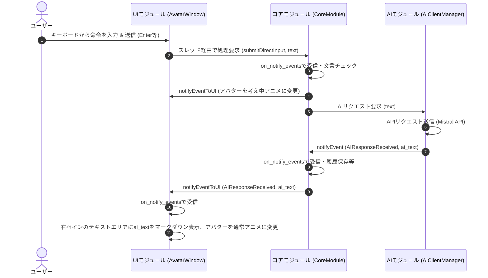
```mermaid
sequenceDiagram
    autonumber
    actor User as ユーザー
    participant UI as UIモジュール (AvatarWindow)
    participant Core as コアモジュール (CoreModule)
    participant AI as AIモジュール (AIClientManager)

    User->>UI: キーボードから命令を入力 & 送信 (Enter等)
    UI->>Core: スレッド経由で処理要求 (submitDirectInput, text)
    
    %% コアが直接AI要求を発行 (STTをバイパス)
    Core->>Core: on_notify_eventsで受信・文言チェック
    Core->>UI: notifyEventToUI (アバターを考え中アニメに変更)
    Core->>AI: AIリクエスト要求 (text)

    AI->>AI: APIリクエスト送信 (Mistral API)
    AI->>Core: notifyEvent (AIResponseReceived, ai_text)

    %% コアがUIへ通知
    Core->>Core: on_notify_eventsで受信・履歴保存等
    Core->>UI: notifyEventToUI (AIResponseReceived, ai_text)
    UI->>UI: on_notify_eventsで受信
    UI->>UI: 右ペインのテキストエリアにai_textをマークダウン表示、アバターを通常アニメに変更
```

### 5.3 起動時出自証明およびコピーライト動的適用シーケンス

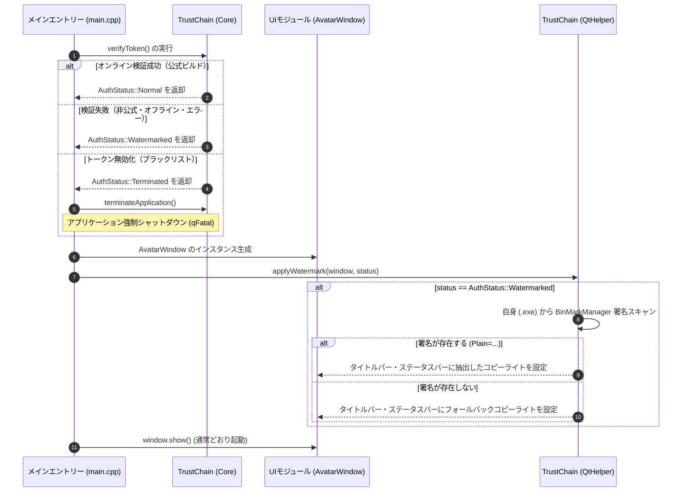
```mermaid
sequenceDiagram
    autonumber
    participant Main as メインエントリー (main.cpp)
    participant TC as TrustChain (Core)
    participant UI as UIモジュール (AvatarWindow)
    participant Helper as TrustChain (QtHelper)

    Main->>TC: verifyToken() の実行
    alt オンライン検証成功（公式ビルド）
        TC-->>Main: AuthStatus::Normal を返却
    else 検証失敗（非公式・オフライン・エラー）
        TC-->>Main: AuthStatus::Watermarked を返却
    else トークン無効化（ブラックリスト）
        TC-->>Main: AuthStatus::Terminated を返却
        Main->>TC: terminateApplication()
        Note over Main,TC: アプリケーション強制シャットダウン (qFatal)
    end

    Main->>UI: AvatarWindow のインスタンス生成
    Main->>Helper: applyWatermark(window, status)
    
    alt status == AuthStatus::Watermarked
        Helper->>Helper: 自身 (.exe) から BinMarkManager 署名スキャン
        alt 署名が存在する (Plain=...)
            Helper-->>UI: タイトルバー・ステータスバーに抽出したコピーライトを設定
        else 署名が存在しない
            Helper-->>UI: タイトルバー・ステータスバーにフォールバックコピーライトを設定
        end
    end
    Main->>UI: window.show() (通常どおり起動)
```

### 5.4 セッションリセットシーケンス

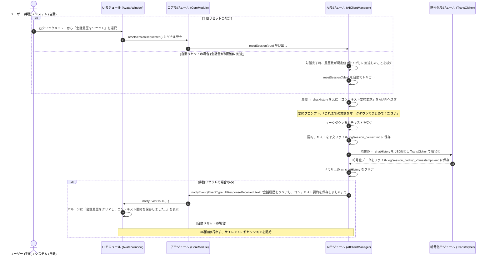
```mermaid
sequenceDiagram
    autonumber
    actor User as ユーザー (手動) / システム (自動)
    participant UI as UIモジュール (AvatarWindow)
    participant Core as コアモジュール (CoreModule)
    participant AI as AIモジュール (AIClientManager)
    participant TC as 暗号化モジュール (TransCipher)

    alt 手動リセットの場合
        User->>UI: 右クリックメニューから「会話履歴をリセット」を選択
        UI->>Core: resetSessionRequested() シグナル発火
        Core->>AI: resetSession(true) 呼び出し
    else 自動リセットの場合 (会話量が制限値に到達)
        AI->>AI: 対話完了時、履歴数が規定値 (例: 10件) に到達したことを検知
        AI->>AI: resetSession(false) を自動でトリガー
    end

    %% AIによるマークダウン要約の生成
    AI->>AI: 履歴 m_chatHistory を元に「コンテキスト要約要求」をAI APIへ送信
    Note over AI: 要約プロンプト: 「これまでの対話をマークダウンでまとめてください」
    AI-->>AI: マークダウン要約テキストを受信
    AI->>AI: 要約テキストを平文ファイル log/session_context.md に保存

    %% バックアップとクリア処理
    AI->>TC: 現在の m_chatHistory を JSON化し TransCipher で暗号化
    TC-->>AI: 暗号化データをファイル log/session_backup_<timestamp>.enc に保存
    AI->>AI: メモリ上の m_chatHistory をクリア

    %% イベント通知
    alt 手動リセットの場合のみ
        AI->>Core: notifyEvent (EventType::AIResponseReceived, text: "会話履歴をクリアし、コンテキスト要約を保存しました。")
        Core->>UI: notifyEventToUI (...)
        UI->>UI: バルーンに「会話履歴をクリアし、コンテキスト要約を保存しました。」を表示
    else 自動リセットの場合
        Note over AI,UI: UI通知は行わず、サイレントに新セッションを開始
    end
```

### 5.5 セッションインポートシーケンス

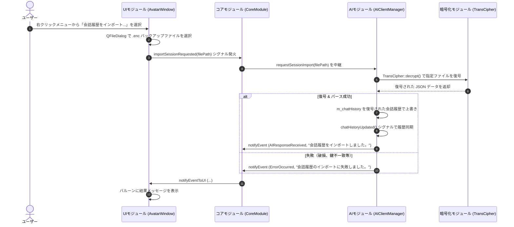
```mermaid
sequenceDiagram
    autonumber
    actor User as ユーザー
    participant UI as UIモジュール (AvatarWindow)
    participant Core as コアモジュール (CoreModule)
    participant AI as AIモジュール (AIClientManager)
    participant TC as 暗号化モジュール (TransCipher)

    User->>UI: 右クリックメニューから「会話履歴をインポート...」を選択
    UI->>UI: QFileDialog で .enc バックアップファイルを選択
    UI->>Core: importSessionRequested(filePath) シグナル発火
    Core->>AI: requestSessionImport(filePath) を中継
    AI->>TC: TransCipher::decrypt() で指定ファイルを復号
    TC-->>AI: 復号された JSON データを返却
    alt 復号 & パース成功
        AI->>AI: m_chatHistory を復号された会話履歴で上書き
        AI->>AI: chatHistoryUpdated() シグナルで履歴同期
        AI->>Core: notifyEvent (AIResponseReceived, "会話履歴をインポートしました。")
    else 失敗（破損、鍵不一致等）
        AI->>Core: notifyEvent (ErrorOccurred, "会話履歴のインポートに失敗しました。")
    end
    Core->>UI: notifyEventToUI (...)
    UI->>UI: バルーンに結果メッセージを表示
```

### 5.6 セッションエクスポート（復号）シーケンス

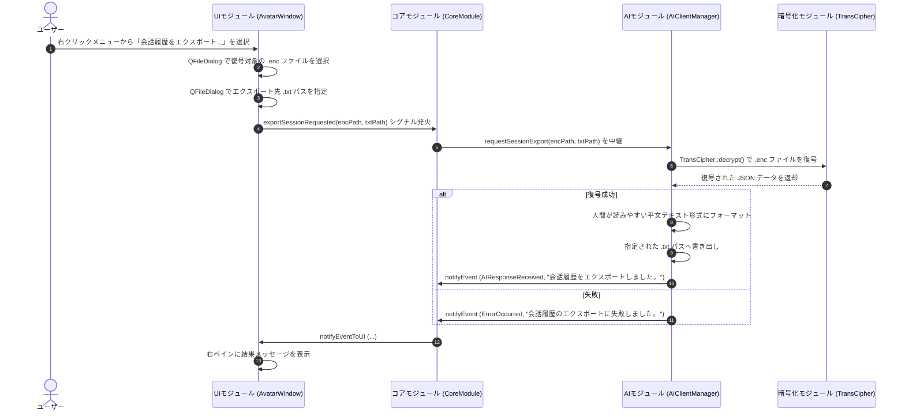
```mermaid
sequenceDiagram
    autonumber
    actor User as ユーザー
    participant UI as UIモジュール (AvatarWindow)
    participant Core as コアモジュール (CoreModule)
    participant AI as AIモジュール (AIClientManager)
    participant TC as 暗号化モジュール (TransCipher)

    User->>UI: 右クリックメニューから「会話履歴をエクスポート...」を選択
    UI->>UI: QFileDialog で復号対象の .enc ファイルを選択
    UI->>UI: QFileDialog でエクスポート先 .txt パスを指定
    UI->>Core: exportSessionRequested(encPath, txtPath) シグナル発火
    Core->>AI: requestSessionExport(encPath, txtPath) を中継
    AI->>TC: TransCipher::decrypt() で .enc ファイルを復号
    TC-->>AI: 復号された JSON データを返却
    alt 復号成功
        AI->>AI: 人間が読みやすい平文テキスト形式にフォーマット
        AI->>AI: 指定された .txt パスへ書き出し
        AI->>Core: notifyEvent (AIResponseReceived, "会話履歴をエクスポートしました。")
    else 失敗
        AI->>Core: notifyEvent (ErrorOccurred, "会話履歴のエクスポートに失敗しました。")
    end
    Core->>UI: notifyEventToUI (...)
    UI->>UI: 右ペインに結果メッセージを表示
```

### 5.7 設定更新およびTwitch再認可シーケンス (Implicit Flow)

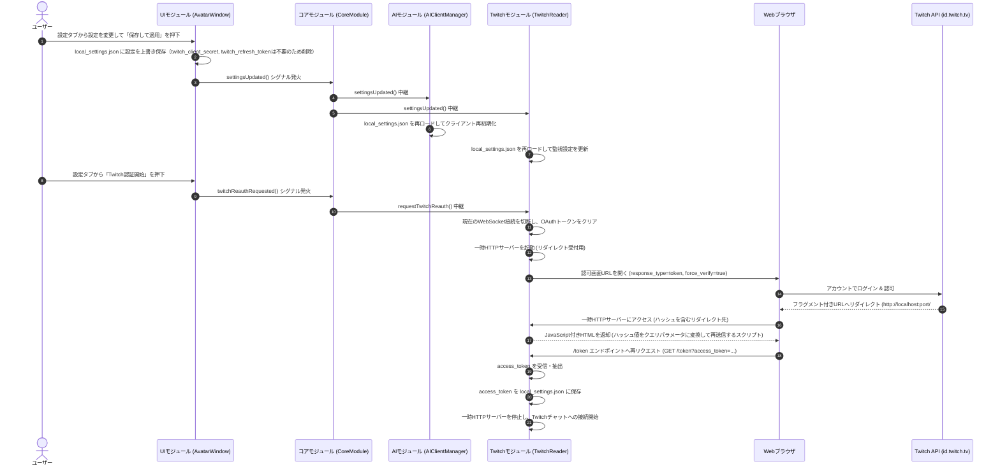
```mermaid
sequenceDiagram
    autonumber
    actor User as ユーザー
    participant UI as UIモジュール (AvatarWindow)
    participant Core as コアモジュール (CoreModule)
    participant AI as AIモジュール (AIClientManager)
    participant Twitch as Twitchモジュール (TwitchReader)
    participant Browser as Webブラウザ
    participant TwitchAPI as Twitch API (id.twitch.tv)

    %% 設定更新
    User->>UI: 設定タブから設定を変更して「保存して適用」を押下
    UI->>UI: local_settings.json に設定を上書き保存（twitch_client_secret, twitch_refresh_tokenは不要のため削除）
    UI->>Core: settingsUpdated() シグナル発火
    Core->>AI: settingsUpdated() 中継
    Core->>Twitch: settingsUpdated() 中継
    AI->>AI: local_settings.json を再ロードしてクライアント再初期化
    Twitch->>Twitch: local_settings.json を再ロードして監視設定を更新

    %% Twitch再認可 (Implicit Flow)
    User->>UI: 設定タブから「Twitch認証開始」を押下
    UI->>Core: twitchReauthRequested() シグナル発火
    Core->>Twitch: requestTwitchReauth() 中継
    Twitch->>Twitch: 現在のWebSocket接続を切断し、OAuthトークンをクリア
    Twitch->>Twitch: 一時HTTPサーバーを起動 (リダイレクト受付用)
    Twitch->>Browser: 認可画面URLを開く (response_type=token, force_verify=true)
    Browser->>TwitchAPI: アカウントでログイン & 認可
    TwitchAPI-->>Browser: フラグメント付きURLへリダイレクト (http://localhost:port/#access_token=...)
    Browser->>Twitch: 一時HTTPサーバーにアクセス (ハッシュを含むリダイレクト先)
    Twitch-->>Browser: JavaScript付きHTMLを返却 (ハッシュ値をクエリパラメータに変換して再送信するスクリプト)
    Browser->>Twitch: /token エンドポイントへ再リクエスト (GET /token?access_token=...)
    Twitch->>Twitch: access_token を受信・抽出
    Twitch->>Twitch: access_token を local_settings.json に保存
    Twitch->>Twitch: 一時HTTPサーバーを停止し、Twitchチャットへの接続開始
```

### 5.8 Twitch接続エラー時の手動再認可要求シーケンス

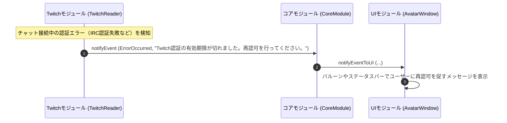
```mermaid
sequenceDiagram
    autonumber
    participant Twitch as Twitchモジュール (TwitchReader)
    participant Core as コアモジュール (CoreModule)
    participant UI as UIモジュール (AvatarWindow)

    Note over Twitch: チャット接続中の認証エラー（IRC認証失敗など）を検知
    Twitch->>Core: notifyEvent (ErrorOccurred, "Twitch認証の有効期限が切れました。再認可を行ってください。")
    Core->>UI: notifyEventToUI (...)
    UI->>UI: バルーンやステータスバーでユーザーに再認可を促すメッセージを表示
```

### 5.9 OBS配信連携用WebSocket・WebHook配信シーケンス

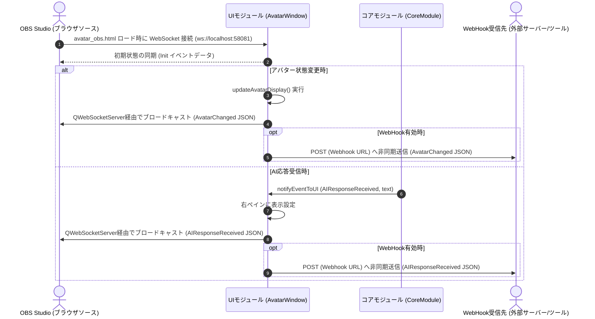
```mermaid
sequenceDiagram
    autonumber
    actor OBS as OBS Studio (ブラウザソース)
    participant UI as UIモジュール (AvatarWindow)
    participant Core as コアモジュール (CoreModule)
    actor WH as WebHook受信先 (外部サーバー/ツール)

    OBS->>UI: avatar_obs.html ロード時に WebSocket 接続 (ws://localhost:58081)
    UI-->>OBS: 初期状態の同期 (Init イベントデータ)

    alt アバター状態変更時
        UI->>UI: updateAvatarDisplay() 実行
        UI->>OBS: QWebSocketServer経由でブロードキャスト (AvatarChanged JSON)
        opt WebHook有効時
            UI->>WH: POST (Webhook URL) へ非同期送信 (AvatarChanged JSON)
        end
    else AI応答受信時
        Core->>UI: notifyEventToUI (AIResponseReceived, text)
        UI->>UI: 右ペインに表示設定
        UI->>OBS: QWebSocketServer経由でブロードキャスト (AIResponseReceived JSON)
        opt WebHook有効時
            UI->>WH: POST (Webhook URL) へ非同期送信 (AIResponseReceived JSON)
        end
    end
```

### 5.9 ハイブリッドWeb検索（Function Calling）シーケンス

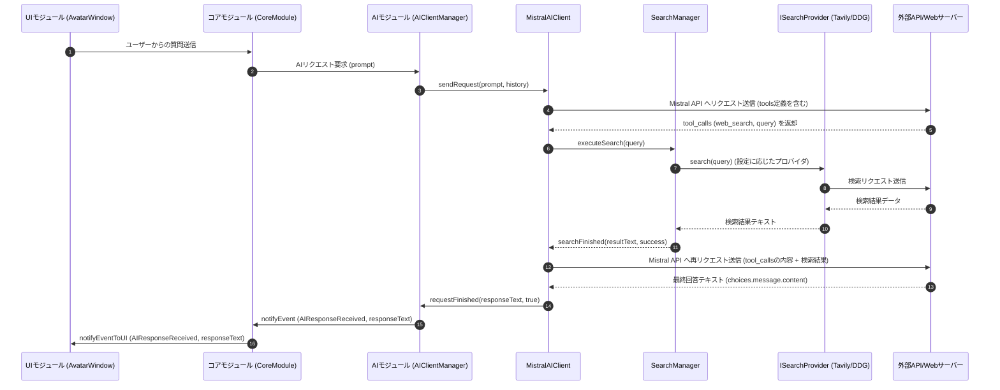
```mermaid
sequenceDiagram
    autonumber
    participant UI as UIモジュール (AvatarWindow)
    participant Core as コアモジュール (CoreModule)
    participant AI as AIモジュール (AIClientManager)
    participant Client as MistralAIClient
    participant SM as SearchManager
    participant Provider as ISearchProvider (Tavily/DDG)
    participant Web as 外部API/Webサーバー

    UI->>Core: ユーザーからの質問送信
    Core->>AI: AIリクエスト要求 (prompt)
    AI->>Client: sendRequest(prompt, history)
    Client->>Web: Mistral API へリクエスト送信 (tools定義を含む)
    Web-->>Client: tool_calls (web_search, query) を返却
    Client->>SM: executeSearch(query)
    SM->>Provider: search(query) (設定に応じたプロバイダ)
    Provider->>Web: 検索リクエスト送信
    Web-->>Provider: 検索結果データ
    Provider-->>SM: 検索結果テキスト
    SM-->>Client: searchFinished(resultText, success)
    Client->>Web: Mistral API へ再リクエスト送信 (tool_callsの内容 + 検索結果)
    Web-->>Client: 最終回答テキスト (choices.message.content)
    Client->>AI: requestFinished(responseText, true)
    AI->>Core: notifyEvent (AIResponseReceived, responseText)
    Core->>UI: notifyEventToUI (AIResponseReceived, responseText)
```

### 5.10 Tavilyエラー時の自動フォールバックシーケンス

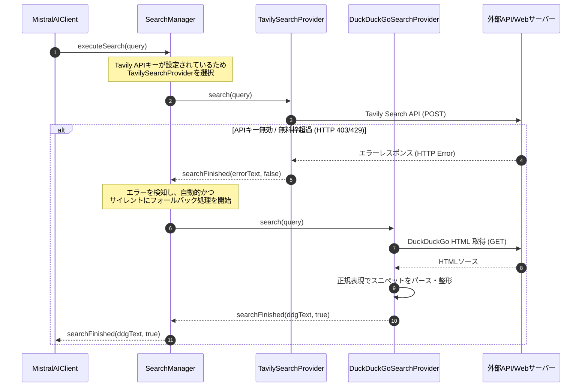
```mermaid
sequenceDiagram
    autonumber
    participant Client as MistralAIClient
    participant SM as SearchManager
    participant Tavily as TavilySearchProvider
    participant DDG as DuckDuckGoSearchProvider
    participant Web as 外部API/Webサーバー

    Client->>SM: executeSearch(query)
    Note over SM: Tavily APIキーが設定されているため<br/>TavilySearchProviderを選択
    SM->>Tavily: search(query)
    Tavily->>Web: Tavily Search API (POST)
    alt APIキー無効 / 無料枠超過 (HTTP 403/429)
        Web-->>Tavily: エラーレスポンス (HTTP Error)
        Tavily-->>SM: searchFinished(errorText, false)
        Note over SM: エラーを検知し、自動的かつ<br/>サイレントにフォールバック処理を開始
        SM->>DDG: search(query)
        DDG->>Web: DuckDuckGo HTML 取得 (GET)
        Web-->>DDG: HTMLソース
        DDG->>DDG: 正規表現でスニペットをパース・整形
        DDG-->>SM: searchFinished(ddgText, true)
        SM-->>Client: searchFinished(ddgText, true)
    end
```

---


## 6. セキュリティとライセンス検証 (TrustChain & BinMarkManager)
本システムは、配布バイナリの出自を保証し改ざんを検知するため、`TrustChain` モジュールを組み込む。

1. **出自証明のライフサイクル**:
   - ビルド時に、開発環境の Git コミットハッシュと GitHub リモートマスタを照合し、事前登録したトークン (`tc_43f73638ed2a119f983e999b`) とともにコンパイルマクロとしてバイナリに安全に注入する。
   - 起動時に、注入された情報を用いて、オンライン検証サーバーへ認証を問い合わせる。
2. **改ざん検知時のUI表示**:
   - 改ざん（検証失敗、オフライン、非公式ビルド）検知時は、自身の実行バイナリ末尾から `BinMarkManager` 形式の平文コピーライトを動的抽出し、メインウィンドウ（`AvatarWindow`）のタイトルバーとステータスバーに強制的に表示する。
   - アプリケーションとしての機能制限は一切加えず、表示の強制変更のみに留める。

### 5.11 翻訳コマンド処理フロー

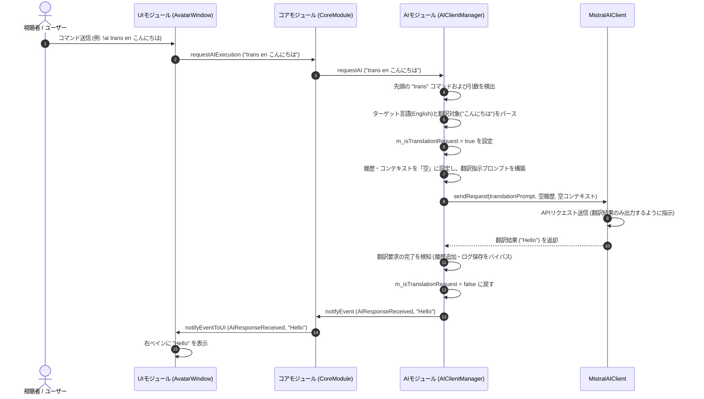
```mermaid
sequenceDiagram
    autonumber
    actor User as 視聴者 / ユーザー
    participant UI as UIモジュール (AvatarWindow)
    participant Core as コアモジュール (CoreModule)
    participant AI as AIモジュール (AIClientManager)
    participant Client as MistralAIClient

    User->>UI: コマンド送信 (例: !ai trans en こんにちは)
    UI->>Core: requestAIExecution ("trans en こんにちは")
    Core->>AI: requestAI ("trans en こんにちは")

    AI->>AI: 先頭の "trans" コマンドおよび引数を検出
    AI->>AI: ターゲット言語(English)と翻訳対象("こんにちは")をパース
    AI->>AI: m_isTranslationRequest = true を設定
    AI->>AI: 履歴・コンテキストを「空」に設定し、翻訳指示プロンプトを構築

    AI->>Client: sendRequest(translationPrompt, 空履歴, 空コンテキスト)
    Client->>Client: APIリクエスト送信 (翻訳結果のみ出力するように指示)
    Client-->>AI: 翻訳結果 ("Hello") を返却

    AI->>AI: 翻訳要求の完了を検知 (履歴追加・ログ保存をバイパス)
    AI->>AI: m_isTranslationRequest = false に戻す
    AI->>Core: notifyEvent (AIResponseReceived, "Hello")
    Core->>UI: notifyEventToUI (AIResponseReceived, "Hello")
    UI->>UI: 右ペインに "Hello" を表示
```

---

## 7. 今後の課題（詳細設計に向けた検討）
1. **ライブラリのビルド環境設定:**
   - Qt6 C++ および C++20 環境の構築。
   - `whisper.cpp` の C++ プロジェクトへの静的/動的リンク手法。
   - Windows SAPI (COMインターフェース) の利用設定。
   - Mistral API（HTTPS）を叩くための `QNetworkAccessManager` (Qt Networkモジュール) の追加。
2. **透過ウィンドウの実現性:**
   - Qtにおける透明度やクリック透過の設定（`Qt::WA_NoSystemBackground`, `Qt::WA_TranslucentBackground`）。

### 5.12 ニックネーム自動登録および承認保留シーケンス

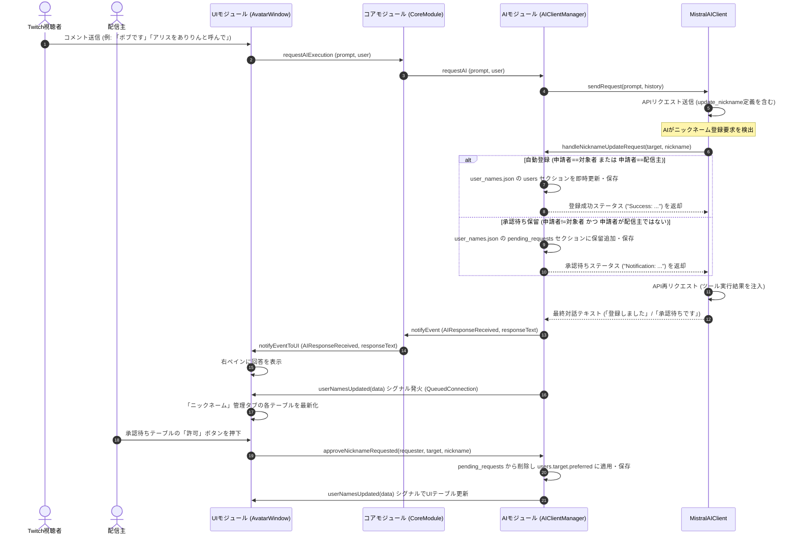
```mermaid
sequenceDiagram
    autonumber
    actor User as Twitch視聴者
    actor Streamer as 配信主
    participant UI as UIモジュール (AvatarWindow)
    participant Core as コアモジュール (CoreModule)
    participant AI as AIモジュール (AIClientManager)
    participant Client as MistralAIClient

    User->>UI: コメント送信 (例: 「ボブです」「アリスをありりんと呼んで」)
    UI->>Core: requestAIExecution (prompt, user)
    Core->>AI: requestAI (prompt, user)
    
    %% AIによるツール検出
    AI->>Client: sendRequest(prompt, history)
    Client->>Client: APIリクエスト送信 (update_nickname定義を含む)
    Note over Client: AIがニックネーム登録要求を検出
    Client->>AI: handleNicknameUpdateRequest(target, nickname)

    alt 自動登録 (申請者==対象者 または 申請者==配信主)
        AI->>AI: user_names.json の users セクションを即時更新・保存
        AI-->>Client: 登録成功ステータス ("Success: ...") を返却
    else 承認待ち保留 (申請者!=対象者 かつ 申請者が配信主ではない)
        AI->>AI: user_names.json の pending_requests セクションに保留追加・保存
        AI-->>Client: 承認待ちステータス ("Notification: ...") を返却
    end

    Client->>Client: API再リクエスト (ツール実行結果を注入)
    Client-->>AI: 最終対話テキスト (「登録しました」/「承認待ちです」)
    AI->>Core: notifyEvent (AIResponseReceived, responseText)
    Core->>UI: notifyEventToUI (AIResponseReceived, responseText)
    UI->>UI: 右ペインに回答を表示

    %% GUI側の非同期同期
    AI->>UI: userNamesUpdated(data) シグナル発火 (QueuedConnection)
    UI->>UI: 「ニックネーム」管理タブの各テーブルを最新化

    %% 配信主による手動承認
    Streamer->>UI: 承認待ちテーブルの「許可」ボタンを押下
    UI->>AI: approveNicknameRequested(requester, target, nickname)
    AI->>AI: pending_requests から削除し users.target.preferred に適用・保存
    AI->>UI: userNamesUpdated(data) シグナルでUIテーブル更新
```

### 5.13 ニックネーム管理データ構造 (`user_names.json`)

ニックネームの愛称リストおよび保留中のリクエストは、以下のスキーマの JSON 形式で永続化する。

```json
{
  "users": {
    "alice": {
      "nicknames": [
        "ありちゃん",
        "ありりん"
      ],
      "preferred": "ありりん"
    }
  },
  "pending_requests": [
    {
      "requester": "bob",
      "target": "alice",
      "nickname": "ありんこ",
      "timestamp": "2026-06-29T23:00:00Z"
    }
  ]
}

### 5.14 Discord独立会話処理シーケンス

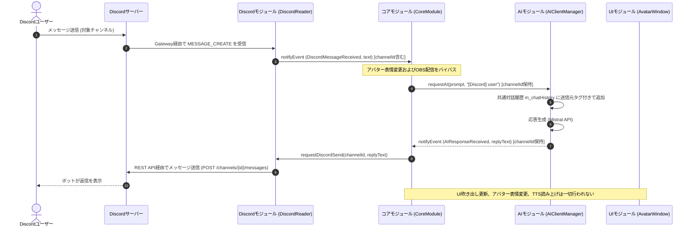
```mermaid
sequenceDiagram
    autonumber
    actor User as Discordユーザー
    participant Discord as Discordサーバー
    participant DR as Discordモジュール (DiscordReader)
    participant Core as コアモジュール (CoreModule)
    participant AI as AIモジュール (AIClientManager)
    participant UI as UIモジュール (AvatarWindow)

    User->>Discord: メッセージ送信 (対象チャンネル)
    Discord->>DR: Gateway経由で MESSAGE_CREATE を受信
    DR->>Core: notifyEvent (DiscordMessageReceived, text) [channelId含む]
    
    %% コアがアバター表示をバイパスしてAIへ直接要求
    Note over Core: アバター表情変更およびOBS配信をバイパス
    Core->>AI: requestAI(prompt, "[Discord] user") [channelId保持]

    AI->>AI: 共通対話履歴 m_chatHistory に送信元タグ付きで追加
    AI->>AI: 応答生成 (Mistral API)
    AI-->>Core: notifyEvent (AIResponseReceived, replyText) [channelId保持]

    %% コアからDiscordへ直接返信
    Core->>DR: requestDiscordSend(channelId, replyText)
    DR->>Discord: REST API経由でメッセージ送信 (POST /channels/{id}/messages)
    Discord-->>User: ボットが返信を表示

    Note over Core,UI: UI吹き出し更新、アバター表情変更、TTS読み上げは一切行われない
```

### 5.15 長期記憶アーカイブ（サマリ＆詳細）生成と動的想起シーケンス

#### A. セッションリセット（記憶アーカイブ生成）
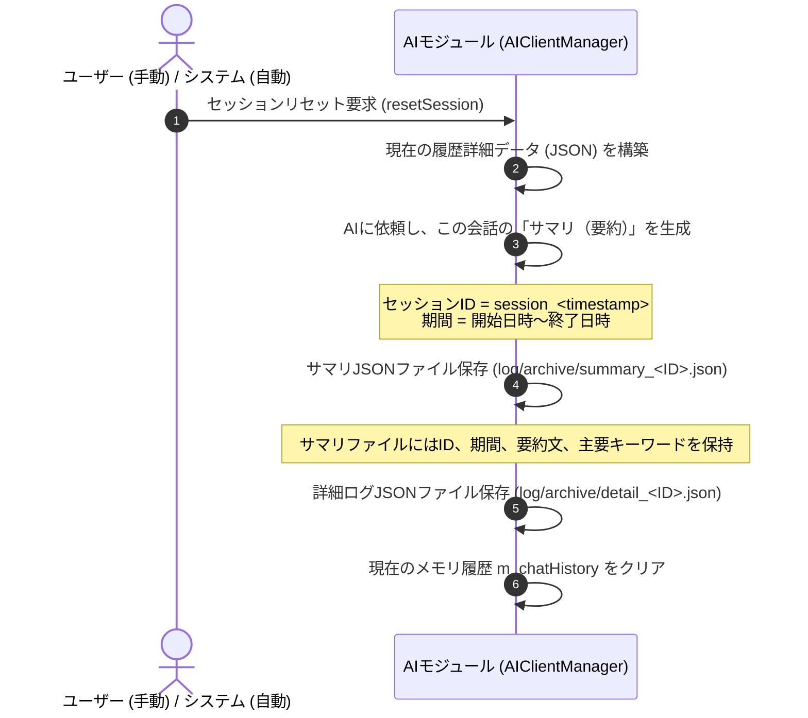
```mermaid
sequenceDiagram
    autonumber
    actor User as ユーザー (手動) / システム (自動)
    participant AI as AIモジュール (AIClientManager)
    
    User->>AI: セッションリセット要求 (resetSession)
    AI->>AI: 現在の履歴詳細データ (JSON) を構築
    AI->>AI: AIに依頼し、この会話の「サマリ（要約）」を生成
    
    %% アーカイブファイル保存 (ID・時間範囲の付与)
    Note over AI: セッションID = session_<timestamp><br/>期間 = 開始日時〜終了日時
    AI->>AI: サマリJSONファイル保存 (log/archive/summary_<ID>.json)
    Note over AI: サマリファイルにはID、期間、要約文、主要キーワードを保持
    AI->>AI: 詳細ログJSONファイル保存 (log/archive/detail_<ID>.json)
    
    AI->>AI: 現在のメモリ履歴 m_chatHistory をクリア
```

#### B. 過去の記憶の動的想起（会話時）
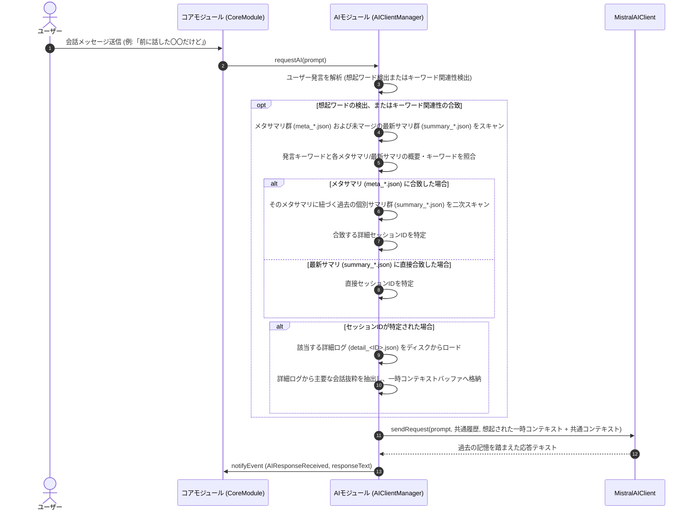
```mermaid
sequenceDiagram
    autonumber
    actor User as ユーザー
    participant Core as コアモジュール (CoreModule)
    participant AI as AIモジュール (AIClientManager)
    participant Client as MistralAIClient

    User->>Core: 会話メッセージ送信 (例:「前に話した〇〇だけど」)
    Core->>AI: requestAI(prompt)
    
    AI->>AI: ユーザー発言を解析 (想起ワード検出またはキーワード関連性検出)
    opt 想起ワードの検出、またはキーワード関連性の合致
        AI->>AI: メタサマリ群 (meta_*.json) および未マージの最新サマリ群 (summary_*.json) をスキャン
        AI->>AI: 発言キーワードと各メタサマリ/最新サマリの概要・キーワードを照合
        alt メタサマリ (meta_*.json) に合致した場合
            AI->>AI: そのメタサマリに紐づく過去の個別サマリ群 (summary_*.json) を二次スキャン
            AI->>AI: 合致する詳細セッションIDを特定
        else 最新サマリ (summary_*.json) に直接合致した場合
            AI->>AI: 直接セッションIDを特定
        end
        
        alt セッションIDが特定された場合
            AI->>AI: 該当する詳細ログ (detail_<ID>.json) をディスクからロード
            AI->>AI: 詳細ログから主要な会話抜粋を抽出し、一時コンテキストバッファへ格納
        end
    end

    %% 一時的に過去記憶をインジェクションしてAIへ送信
    AI->>Client: sendRequest(prompt, 共通履歴, 想起された一時コンテキスト + 共通コンテキスト)
    Client-->>AI: 過去の記憶を踏まえた応答テキスト
    AI->>Core: notifyEvent (AIResponseReceived, responseText)
```

### 5.16 長期記憶ファイルデータ構造

セッションリセット時に `log/archive/` ディレクトリ配下に以下の形式でサマリファイルおよび詳細ログファイルを対で保存する。

#### A. サマリメタデータファイル (`summary_<session_id>.json`)
```json
{
  "session_id": "session_20260629_233000",
  "time_range": {
    "start": "2026-06-29T23:00:00Z",
    "end": "2026-06-29T23:30:00Z"
  },
  "keywords": [
    "りんご",
    "ゲーム開発",
    "Qt6"
  ],
  "summary": "ユーザーとアバター開発について対話し、Qt6でのマルチスレッド設計やニックネーム機能の追加を決定した。また、ユーザーはりんごが好きであると述べた。"
}
```

#### B. 詳細ログファイル (`detail_<session_id>.json`)
```json
{
  "session_id": "session_20260629_233000",
  "chat_history": [
    {
      "source": "[Twitch] alice",
      "message": "りんごって美味しいよね",
      "timestamp": "2026-06-29T23:05:00Z"
    },
    {
      "source": "[AI]",
      "message": "aliceさん、りんごは甘くて美味しいですよね！",
      "timestamp": "2026-06-29T23:05:05Z"
    }
  ]
}
```

#### C. メタサマリファイル (`meta_summary_<meta_id>.json`)
保存された個別サマリファイルが規定数（例: 10件）に達した際、これらをさらに統合してマージした「サマリのサマリ」ファイル。
```json
{
  "meta_id": "meta_2026_Q2",
  "time_range": {
    "start": "2026-04-01T00:00:00Z",
    "end": "2026-06-29T23:59:59Z"
  },
  "keywords": [
    "りんご",
    "ゲーム開発",
    "Qt6",
    "ニックネーム機能",
    "認証"
    "child_sessions": [
    "session_20260629_233000",
    "session_20260629_120000"
  ]
}
```

### 5.17 対話型ナレッジ登録状態遷移と10分タイマー制御
本登録フローでは、ユーザーによる誤操作や放置を検知するため、`AIClientManager` が登録状態を管理し、10分（600,000ミリ秒）のタイムアウト監視（`QTimer`）を実行する。

*   **`Idle` (通常状態):** ユーザーとの通常の雑談、Twitch/Discordコメント受付。
*   **`AwaitingFileAndExplanation` (一時フォルダ開放・ファイル配置・説明待ち状態):** 
    *   `/open_folder` コマンドによって移行。
    *   10分タイマーが作動開始。
    *   この時間内に、ユーザーがファイルを配置し、チャットで「ファイル名」と「その説明」を入力するのを待機。
    *   10分間何も入力がなければ `CancelConfirmation` 状態に遷移。
*   **`CancelConfirmation` (キャンセル確認状態):**
    *   タイムアウト時に移行。AIが「10分経過しましたが、キャンセルしますか？」と発話。
    *   ユーザーが「キャンセルする（または無反応）」の場合は `Idle` に戻る。「キャンセルしない」の場合は `AwaitingFileAndExplanation` に戻り、タイマーが再始動する。
*   **`QandAMode` (対話Q&Aモード):**
    *   ファイル配置が確認され、かつ説明がチャットで入力されたら移行（10分タイマーは停止）。
    *   AIがファイル内容とユーザーの説明を読み込み、曖昧な点を質問する対話を開始。
    *   完了指示を受け、AIが `finalize_knowledge_import` ツールを呼ぶことで本登録を完了し、`Idle` に戻る。

### 5.18 スラッシュコマンド（半角）のC++ネイティブ前処理
UIの直接チャット入力（Direct Input）において、半角スラッシュ（`/`）で始まる文字列が送信された場合、**AIへのAPIリクエストを完全にバイパスしてC++側で即時判定を行う。**

*   入力の先頭が `/` である場合、`AIClientManager::on_requestAI` にて文字列の完全一致比較を実施する。
*   **`/open_folder`**: ナレッジ入力フォルダ（`log/knowledge_input/`）を作成・オープン（`QDesktopServices::openUrl`）。10分タイマーを開始し、状態を `AwaitingFileAndExplanation` に移行。AIの応答を待たずに「フォルダを開きました。ファイルを置いて、ファイル名と説明を教えてください。」と即座にUIへシステム応答を返す。
*   **`/cancel`**: インポート状態をリセットし、タイマーを停止して通常会話状態に戻る。即座に「ナレッジ登録をキャンセルしました。」とシステム応答を返す。
*   **`/twitch connect`**: `TwitchConnectRequested` イベントを発火し、TwitchReaderへ「挨拶付き再接続」を要求する。TwitchReaderは `m_shouldGreet = true` をセットしてチャンネルに再接続し、JOIN確認後にチャンネルへ挨拶を行う。即座に「Twitchチャンネルへ接続します。」とシステム応答を返す。
*   **`/discord connect`**: `DiscordConnectRequested` イベントを発火し、DiscordReaderへ「挨拶付き再接続」を要求する。DiscordReaderは `m_shouldGreet = true` をセットして再接続し、READY受信後にチャンネルへ挨拶を行う。即座に「Discordチャンネルへ接続します。」とシステム応答を返す。
*   **その他の `/` で始まる不一致コマンド**: AIへのリクエストを送信せず、即座に「無効なコマンドです。」とシステム応答を返す。
*   **Twitch/Discordからの `/` 入力**: セキュリティ確保のため、完全無視し、通常の文字列チャットとして扱うか、または一切の処理をバイパスする。

#### 挨拶トリガー条件

| 条件 | Twitch | Discord |
| :--- | :---: | :---: |
| アプリ起動時の初回接続 | ✕（挨拶なし） | ✕（挨拶なし） |
| `/twitch connect` / `/discord connect` 入力時 | ✅ | ✅ |
| 設定画面でチャンネルを変更して保存した場合 | ✅（変更後の初回JOIN時のみ） | ✅（変更後のREADY受信時のみ） |
| 自動再接続（切断後の自動復旧） | ✕（挨拶なし） | ✕（挨拶なし） |

##### 挨拶の実装方式
`TwitchReader`（JOIN確認後）または `DiscordReader`（READY受信後）が、`TwitchCommentReceived` / `DiscordMessageReceived` イベントを挨拶プロンプトとして発火する。AIがこれを受け取り、自然な挨拶文を生成してチャンネルへ送信する。

##### 接続時挨拶の有効判定と設定
接続時挨拶は、`local_settings.json` の以下の個別設定値に従って処理を有効化する。
- Twitch側: `"twitch_greeting_enabled": true/false`
- Discord側: `"discord_greeting_enabled": true/false`

**後方互換性(フォールバック):**
旧設定値 `"greeting_enabled": true/false` が存在し、かつ個別設定値が未定義の場合は、旧設定値をデフォルト値として採用する。個別キーも旧キーも存在しない場合は `false`（挨拶なし）とする。

### 5.19 スラッシュコマンド判定とフォルダオープン・インポートシーケンス

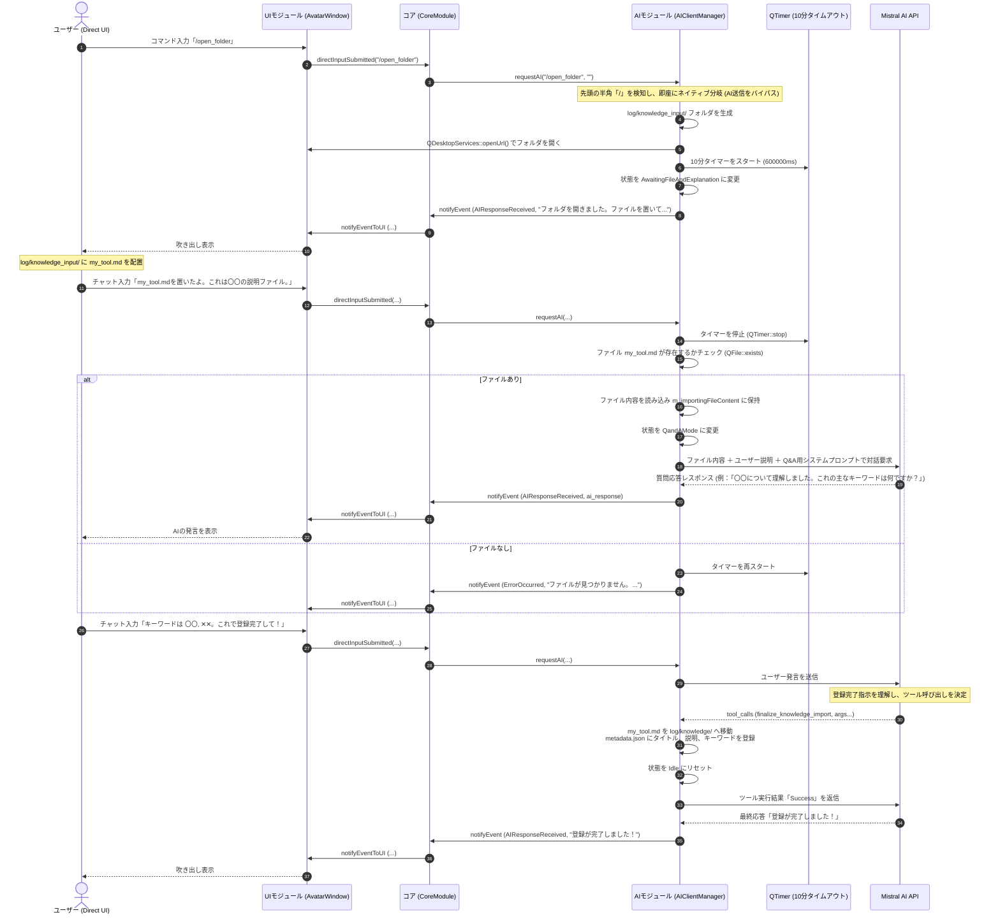
```mermaid
sequenceDiagram
    autonumber
    actor User as ユーザー (Direct UI)
    participant UI as UIモジュール (AvatarWindow)
    participant Core as コア (CoreModule)
    participant AI as AIモジュール (AIClientManager)
    participant Timer as QTimer (10分タイムアウト)
    participant Mistral as Mistral AI API

    %% 1. フォルダオープンコマンド
    User->>UI: コマンド入力「/open_folder」
    UI->>Core: directInputSubmitted("/open_folder")
    Core->>AI: requestAI("/open_folder", "")
    Note over AI: 先頭の半角「/」を検知し、即座にネイティブ分岐 (AI送信をバイパス)
    AI->>AI: log/knowledge_input/ フォルダを生成
    AI->>UI: QDesktopServices::openUrl() でフォルダを開く
    AI->>Timer: 10分タイマーをスタート (600000ms)
    AI->>AI: 状態を AwaitingFileAndExplanation に変更
    AI->>Core: notifyEvent (AIResponseReceived, "フォルダを開きました。ファイルを置いて...")
    Core->>UI: notifyEventToUI (...)
    UI-->>User: 吹き出し表示

    %% 2. ユーザーによるファイル配置と説明チャット
    Note over User: log/knowledge_input/ に my_tool.md を配置
    User->>UI: チャット入力「my_tool.mdを置いたよ。これは〇〇の説明ファイル。」
    UI->>Core: directInputSubmitted(...)
    Core->>AI: requestAI(...)
    AI->>Timer: タイマーを停止 (QTimer::stop)
    AI->>AI: ファイル my_tool.md が存在するかチェック (QFile::exists)
    alt ファイルあり
        AI->>AI: ファイル内容を読み込み m_importingFileContent に保持
        AI->>AI: 状態を QandAMode に変更
        AI->>Mistral: ファイル内容 ＋ ユーザー説明 ＋ Q&A用システムプロンプトで対話要求
        Mistral-->>AI: 質問応答レスポンス (例：「〇〇について理解しました。これの主なキーワードは何ですか？」)
        AI->>Core: notifyEvent (AIResponseReceived, ai_response)
        Core->>UI: notifyEventToUI (...)
        UI-->>User: AIの発言を表示
    else ファイルなし
        AI->>Timer: タイマーを再スタート
        AI->>Core: notifyEvent (ErrorOccurred, "ファイルが見つかりません。...")
        Core->>UI: notifyEventToUI (...)
    end

    %% 3. Q&A対話と本登録 (完了)
    User->>UI: チャット入力「キーワードは 〇〇, ✕✕。これで登録完了して！」
    UI->>Core: directInputSubmitted(...)
    Core->>AI: requestAI(...)
    AI->>Mistral: ユーザー発言を送信
    Note over Mistral: 登録完了指示を理解し、ツール呼び出しを決定
    Mistral-->>AI: tool_calls (finalize_knowledge_import, args...)
    AI->>AI: my_tool.md を log/knowledge/ へ移動<br/>metadata.json にタイトル、説明、キーワードを登録
    AI->>AI: 状態を Idle にリセット
    AI->>Mistral: ツール実行結果「Success」を返信
    Mistral-->>AI: 最終応答「登録が完了しました！」
    AI->>Core: notifyEvent (AIResponseReceived, "登録が完了しました！")
    Core->>UI: notifyEventToUI (...)
    UI-->>User: 吹き出し表示
```

### 5.20 登録済みナレッジのメタデータデータ構造 (`knowledge_metadata.json`)
登録されたナレッジは `log/knowledge/` にコピーされ、以下のスキーマの JSON メタデータファイルで一元管理される。

```json
{
  "knowledges": [
    {
      "id": "knowledge_20260707_233906",
      "title": "TwitchChannelManagementTool API仕様",
      "description": "TwitchChannelManagementToolのプラグイン用インターフェースとAPIリファレンス。",
      "keywords": [
        "TwitchChannelManagementTool",
        "プラグイン",
        "API",
        "仕様"
      ],
      "file_name": "knowledge_20260707_233906.md",
      "registered_at": "2026-07-07T23:39:06Z"
    }
  ]
}
```
*   `file_name`: 実際のMarkdownファイルは、名前の競合や安全性を考慮し、IDベースの名前（例: `knowledge_20260707_233906.md`）にリネームされて `log/knowledge/` ディレクトリ配下に格納される。

### 5.21 AIルーティング層 — ProviderStatus・RateLimitTracker・AIRouter 設計

#### A. ProviderStatus データ構造

```cpp
// src/ai/provider_status.h

struct ProviderStatus {
    QString provider;       // "groq" / "cerebras" / "mistral" / "dummy"
    bool    available;      // レートリミット未到達なら true

    // リクエスト制限
    int rpmMax;             // 設定値またはAPIから取得した最大RPM
    int rpmRemaining;       // APIレスポンスヘッダーから更新される残余RPM
    int rpdMax;
    int rpdRemaining;

    // トークン制限
    int tpmMax;
    int tpmRemaining;
    int tpdMax;
    int tpdRemaining;

    // モデル仕様（自動取得 or 手動設定）
    int    contextWindow;   // コンテキストウィンドウ（tokens）
    bool   toolCall;        // Function Calling サポート
    bool   supportsDiff;    // Diff出力サポート（将来拡張用）
    double cost;            // コスト（0.0 = 無料）
    int    latencyMs;       // 実測移動平均レイテンシ（ms）

    QDateTime nextResetAt;  // 最短リセット時刻（全枯渇時のメッセージ生成に使用）
};
```

各クライアントは `IAIClient::defaultStatus()` で自身のデフォルト値を返す。
APIキー設定後に `/models` エンドポイントから自動取得可能な値は上書きされる。

#### B. APIレスポンスヘッダーによる残量自動更新

Groq / Cerebras / Mistral はいずれも OpenAI互換APIであり、以下のヘッダーを返す（一部プロバイダでは省略の場合あり）:

| ヘッダー | 対応フィールド |
| :--- | :--- |
| `x-ratelimit-limit-requests` | `rpmMax` |
| `x-ratelimit-remaining-requests` | `rpmRemaining` |
| `x-ratelimit-limit-tokens` | `tpmMax` |
| `x-ratelimit-remaining-tokens` | `tpmRemaining` |
| `x-ratelimit-reset-requests` | `nextResetAt`（RPM） |

APIコールが完了するたびに `RateLimitTracker::updateFromHeaders()` を呼び、`ProviderStatus` を更新する。
ヘッダーが存在しない場合は手動設定値（`local_settings.json`）を維持する。

#### C. レイテンシ計測

```
APIコール開始時: QElapsedTimer::start()
APIコール完了時: elapsed() でミリ秒を取得
latencyMs を移動平均（直近5回）で更新
```

#### D. RateLimitTracker の責務

- 各クライアントの `ProviderStatus` を保持・更新
- `isAvailable(clientId)`: 残余 > 0 かどうかを確認
- `earliestResetTime(clientIds)`: 全クライアント枯渇時に最短リセット時刻を算出
- `formatWaitMessage(resetAt)`: 「X分後に使用可能になります」形式の文字列を生成
- 日・週・月単位の使用量を `log/usage_stats.json` に永続化・読み込み

#### E. AIRouter の選択ロジック

```
AIRouter::selectClient(role, tracker) の処理:
  1. 設定された優先度リストを走査（Groq→Cerebras→Mistral）
  2. tracker.isAvailable(clientId) == true の最初のクライアントを返す
  3. 全クライアントが unavailable → 空文字を返す

Worker選択とManager選択は独立して行う（別ロール）:
  - Workerロール: 実際の会話応答を担当
  - Managerロール: どのWorkerを使うか決定（現フェーズはC++ロジックで選択）
```

#### F. デフォルト優先度と制限値（無料枠基準）

| クライアント | priority | RPM | RPD | TPM | TPD | context |
| :--- | :---: | ---: | ---: | ---: | ---: | ---: |
| Groq (`llama-3.1-8b-instant`) | 1 | 30 | 14,400 | 131,072 | 500,000 | 131,072 |
| Cerebras (`llama3.1-8b`) | 2 | 30 | 1,000 | 60,000 | 1,000,000 | 131,072 |
| Mistral (`mistral-small-latest`) | 3 | 1 | — | — | — | 131,072 |
| DummyAI | 99 | ∞ | ∞ | ∞ | ∞ | — |

#### G. 全クライアント枯渇時の応答フォーマット（C++生成・AI呼び出しなし）

```
現在、すべてのAIクライアントがレート制限に達しています。
最短で 2分後 に使用可能になります（Groq RPM 制限解除）。
```

---

### 5.22 AIルーティング リクエスト処理シーケンス

```mermaid
sequenceDiagram
    autonumber
    actor User as ユーザー
    participant UI as UIモジュール
    participant Core as CoreModule
    participant AI as AIClientManager
    participant Router as AIRouter (C++)
    participant Tracker as RateLimitTracker
    participant Manager as Manager AI (将来対応)
    participant Worker as 選択された Worker AI

    User->>UI: テキスト入力・送信
    UI->>Core: directInputSubmitted(prompt)
    Core->>AI: requestAI(prompt, user)

    AI->>Tracker: isAvailable("groq"), isAvailable("cerebras"), ...
    Tracker-->>AI: 各クライアントの available 状態

    alt 少なくとも1つ利用可能
        AI->>Router: selectClient(Worker, statuses)
        Router-->>AI: "groq"（優先度最高の利用可能クライアント）

        Note over AI,Manager: 現フェーズ: Manager AI API呼び出しなし (C++で直接選択)
        Note over AI,Manager: 将来フェーズ: ManagerにWorker一覧を渡し "use:groq" を取得

        AI->>Worker: sendRequest(prompt, history, context)
        Worker-->>AI: responseText + レスポンスヘッダー

        AI->>Tracker: updateFromHeaders(clientId, headers)
        AI->>Tracker: recordLatency(clientId, elapsedMs)

        AI->>Core: notifyEvent(AIResponseReceived, responseText)
        Core->>UI: notifyEventToUI(...)
        UI-->>User: 吹き出し表示

    else 全クライアントが制限に達した場合
        AI->>Tracker: earliestResetTime(allClients)
        Tracker-->>AI: resetAt, clientId, limitType
        AI->>Core: notifyEvent(AIResponseReceived, "最短でX分後に使用可能...")
        Core->>UI: notifyEventToUI(...)
        UI-->>User: 待機メッセージ表示
    end
```

#### Manager AI フォールバックシーケンス（将来フェーズ）

```mermaid
sequenceDiagram
    autonumber
    participant AI as AIClientManager
    participant Router as AIRouter
    participant Tracker as RateLimitTracker
    participant MgrGroq as Groq (Manager役)
    participant MgrCerebras as Cerebras (Manager代行)

    AI->>Tracker: isAvailable("groq") → false（RPM到達）
    AI->>Router: selectClient(Manager, statuses)
    Router-->>AI: "cerebras"（次の優先クライアント）

    AI->>MgrCerebras: 最小プロンプト「使用可能: [groq(worker), mistral]。どれを使う？」
    Note over MgrCerebras: Manager AIは「use:groq」を返すのみ（最小トークン消費）
    MgrCerebras-->>AI: "use:groq"

    AI->>Tracker: recordUsage("cerebras", tokens=minimal)

## 10. 外部スケジュール API 連携機能設計

Twitchコメント、Discord、およびUIチャット（直接入力・音声入力）経由での対話において、ユーザーから予定やタスク進捗に関する発言があった際、外部 API からスケジュール情報を自動取得し、RAG（検索拡張生成）技術を用いて AI のシステムプロンプトにコンテキストとして注入します。

### 10.1 連携構成と処理フロー

```mermaid
sequenceDiagram
    autonumber
    participant Input as Twitch/Discord/UI
    participant Manager as AIClientManager
    participant API as 外部スケジュールAPI
    participant TC as TransCipher (復号エンジン)
    participant LLM as 各AIクライアント

    Input->>Manager: 1. チャット受信 (例:「今後の予定教えて」)
    Note over Manager: トリガーキーワード（予定、進捗等）が含まれるか検証
    
    rect rgb(240, 240, 240)
        Note over Manager: キーワード検知時のみAPI連携処理を実行
        Manager->>API: 2. GET /schedules.php (work & stream)
        API-->>Manager: 3. JSONレスポンス返却 (暗号化title含む)
        Manager->>TC: 4. 暗号化titleの復号要求 (キー: test_secret_key_12345)
        TC-->>Manager: 5. プレーンテキスト返却
    end
    
    Note over Manager: 復号後のタイトルを含んだMarkdown形式のスケジュールテキストをシステムプロンプトへ動的注入
    
    Manager->>LLM: 6. APIリクエスト (会話履歴 + 注入されたシステム指示)
    LLM-->>Manager: 7. 最新の予定データに基づいた自然な回答を生成
    Manager->>Input: 8. 回答メッセージ返信
```

### 10.2 復号とデータ形式
- **難読化解除キー**: `TRANSCIPHER_SECRET_KEY` に設定された `"test_secret_key_12345"`
- **データ形式**: API から返される Base64 文字列をバイナリデータ（QByteArray）にデコードし、`CipherEngine::decrypt` メソッドによって元の UTF-8 文字列に復号します。


## 11. レイド・クリエイター自動紹介機能設計 (F-22)

Twitchでのレイド受信時、または「〇〇さんを紹介して」などの手動/会話指定を受け、相手の公式プロフィール（Bioや公式SNS/YouTube概要）を安全に収集してAIが紹介文を生成・投稿する機能の設計です。

### 11.1 処理フローとシーケンス

```mermaid
sequenceDiagram
    autonumber
    participant Twitch as TwitchReader
    participant Manager as AIClientManager
    participant Helix as Twitch Helix API
    participant LLM as AIクライアント
    participant UI as AvatarWindow (GUI)

    alt レイド自動検知
        Twitch->>Manager: 1. USERNOTICE (raid) イベント通知 (送られた配信者名)
    else コマンド / 会話発動
        Twitch->>Manager: 1. コマンド(!so) / 会話「〇〇さんを紹介して」検知
    end

    rect rgb(240, 240, 240)
        Note over Manager: 相手クリエイターの情報取得 (同名別人混入防止)
        Manager->>Helix: 2. GET /users (Bio取得) & GET /channels (配信タイトル/ゲーム名取得)
        Helix-->>Manager: 3. Bio & 配信カテゴリ情報を返却
        Note over Manager: Bio内から公式 Twitter(X) / YouTube URLを抽出しピンポイント解析
    end

    Manager->>LLM: 4. クリエイター情報 + トーン/長さ指示で紹介文生成要求
    LLM-->>Manager: 5. 魅力的な紹介文（Shoutoutコメント）を返却

    par チャット投稿 ＆ 音声/吹き出し表現
        Manager->>Twitch: 6a. アナウンス指定色(通常/青/緑/橙/紫/ランダム)で /announce 送信
        Manager->>UI: 6b. アバター吹き出し描画 ＆ TTS発声イベント通知
    end

    opt /shoutout コマンド連携 (有効時)
        alt クールタイム外 (120秒経過済)
            Manager->>Twitch: 7a. /shoutout [ユーザー名] を自動送信
            Manager->>Manager: 7b. 120秒クールタイムタイマーを開始
        else クールタイム中
            Manager->>Manager: 7c. 待機キューに追加 ＆ クールタイム解除タイマー待機
            Manager->>UI: 7d. UI(キュー一覧)へ待機中ユーザーと残り時間を同期通知
        end
    end

    opt /shoutout 成功検知 ＆ フォロー呼びかけ (有効時)
        Twitch-->>Manager: 8a. /shoutout 成功 NOTICE (msg-id=shoutout_success)
        Manager->>Twitch: 8b. 「ぜひ {name} さんをフォローしてね！」等のフォロー呼びかけコメントを投稿
    end

## 12. アバタースキン切替・ディレクトリ構成設計 (F-23)

アバターのアセット管理およびスキンの完全同期切替機能の設計です。

### 12.1 ディレクトリ構成

```text
pic/
 └── [SkinName]/ (例: FishEatCatSkin)
      ├── base.png, Front01.png... (アバター画像)
      ├── avatar_settings.json (アニメーション設定)
      └── avatar_obs.html (OBS表示用HTML)
```

### 12.2 アプリ本体とOBS配信画面の完全同期アーキテクチャ

1. **設定管理 (`local_settings.json`)**:
   - `"avatar_skin"` に選択されたスキンフォルダ名（デフォルト: `"FishEatCatSkin"`）を保持する。
2. **UI (AvatarWindow)**:
   - 設定タブにスキン選択 QComboBox を配置。`pic/` 直下のスキンフォルダ一覧を動的に取得・選択可能とする。
3. **リロード制御**:
   - スキン切替時、アバター描画エンジンのアセット読み込みパスおよび OBS HTTP サーバー (`ObsHttpServer`) の Document Root を `pic/[SkinName]` に一貫して変更する。
   - これにより、アプリ本体の描画とOBS配信画面の双方が全く同じスキン画像・設定で100%統一表示される。
## 13. アバター画像指定3モード ＆ 状態タイマー制御設計 (F-24)

### 13.1 画像指定3モードのアーキテクチャ
- **Single モード**: 単一画像指定。常に該当画像1枚を表示。
- **Random モード**: 複数画像指定。リスト内から1枚をランダム抽選して表示。
- **Sequence モード**: 複数画像指定。指定したコマ送り速度 (`frame_interval_ms`) で連続描画しアニメーション化。

### 13.2 状態遷移および表示時間制御シーケンス
1. ユーザー入力受信時 ➔ `Listening` 表示 (指定ミリ秒 `duration_ms`)
2. AI処理・検索中 ➔ `Thinking` 表示 (指定ミリ秒 `duration_ms`)
3. AI応答出力・音声発声中 ➔ `Speaking` 表示 (指定ミリ秒 `duration_ms`)
4. 各タイマー完了 ➔ `Idle` 状態（Front/Back/Right/Left からランダム抽選表示）へ自動復帰。

## 14. アバタースキン自動生成・GUI編集設計 (F-25)

### 14.1 モジュール構成と画面インターフェース
- **`AvatarSkinBuilderDialog` / `SkinBuilderWidget`**:
  - スキン作成・編集用のグラフィカルUIコンポーネント。
  - 各状態・方向のファイル参照ボタン、モード切替ドロップダウン、プレビューキャンバス、アンカー/透過位置調整スライダーを配置。

### 14.2 自動生成シーケンス (Generator Sequence)
1. ユーザーがスキン名と各状態の画像を選択し、「生成・保存」を押下。
2. ディレクトリ生成エンジン (`SkinGenerator`) が `pic/[SkinName]/` フォルダを作成。
3. 指定画像を `pic/[SkinName]/` へコピー。
4. JSON自動生成モジュールが指定パラメータを構造化した `avatar_settings.json` を生成・保存。
5. テンプレートエンジンが OBS用 `avatar_obs.html` を `pic/[SkinName]/` 内へ複製配置。
6. 設定リストを自動更新し、即座に新スキンを選択・適用可能な状態にする。

## 15. 多層スコア判定・文脈保護・中立検索連携フィルタリング設計 (F-26)

### 15.1 パイプライン・処理フロー
```text
[ユーザー入力 / チャットコメント]
        │
        ▼
[① 形態素・キーワード抽出 & カテゴリスコア計算 (blacklist.txt)]
        │
        ▼
[② 危険意図判定 (instruction / personal_info 等)]
        │
        ▼
[③ 文脈補正判定 (whitelist.txt / 直近会話履歴 history_context)]
   ※ 危険意図検出時は history_context 減点を強制無効化 (Jailbreak Guard)
        │
        ▼
[④ 最終危険度スコア判定 (Score Calculation)]
   ├── 0 〜 29点 (SAFE)  ➔ 通過。政治/宗教フラグ検知時は⑦へ
   ├── 30 〜 69点 (WARN) ➔ 一部伏字化 (****) 編集 ➔ ⑦へ
   └── 70点以上 (BLOCK)  ➔ AI要求ブロック (応答拒否メッセージ)
        │
        ▼
[⑤ 時事・政治・宗教検索 & 中立インジェクション]
   - Tavily/DuckDuckGo で最新ファクト取得
   - システムプロンプトへ「中立・客観的立場維持ガイドライン」をインジェクション
        │
        ▼
[⑥ AI対話エンジン送信]
```


