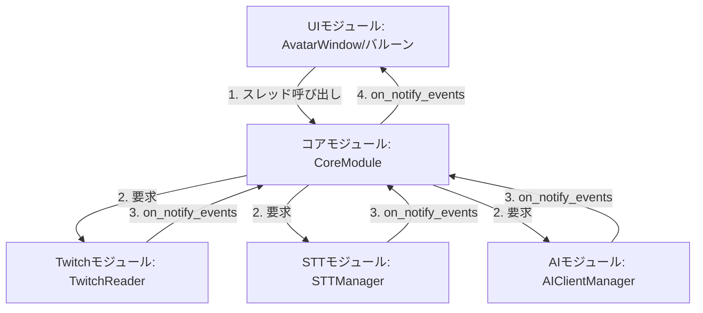
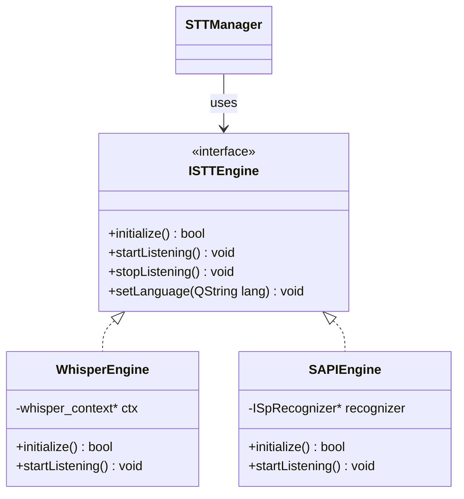
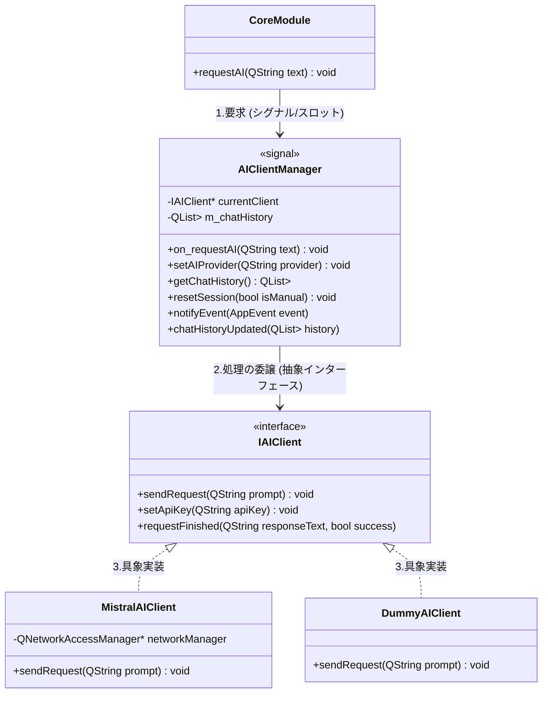
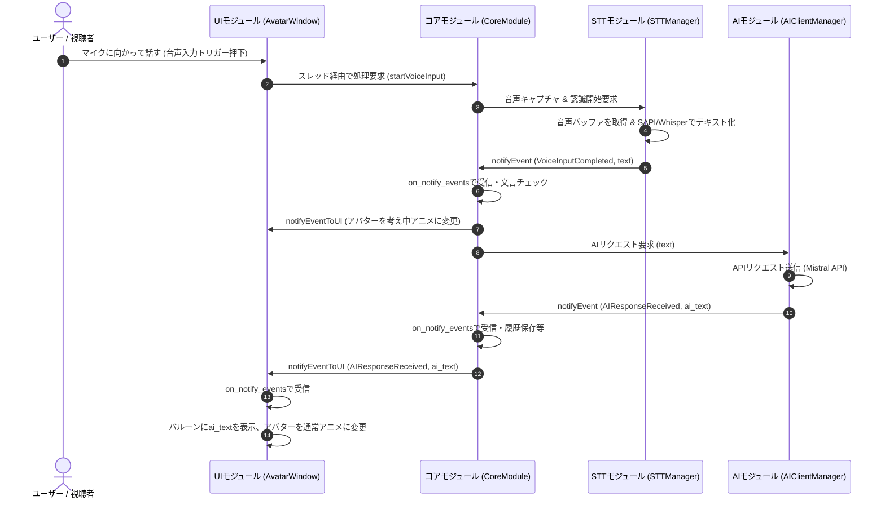
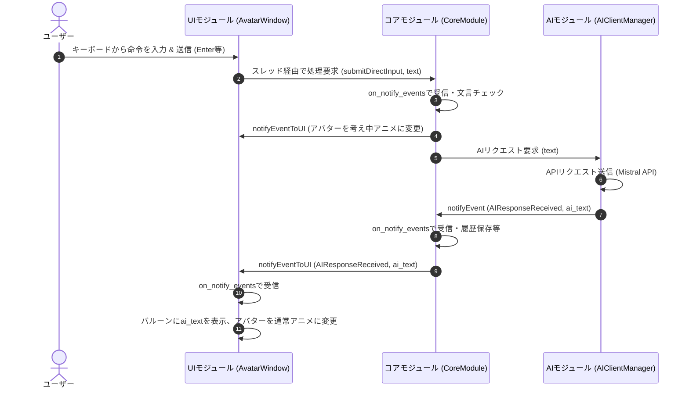
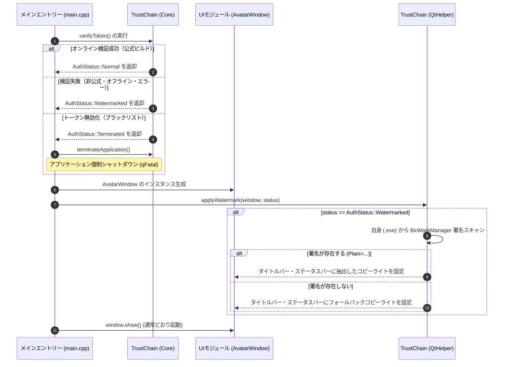
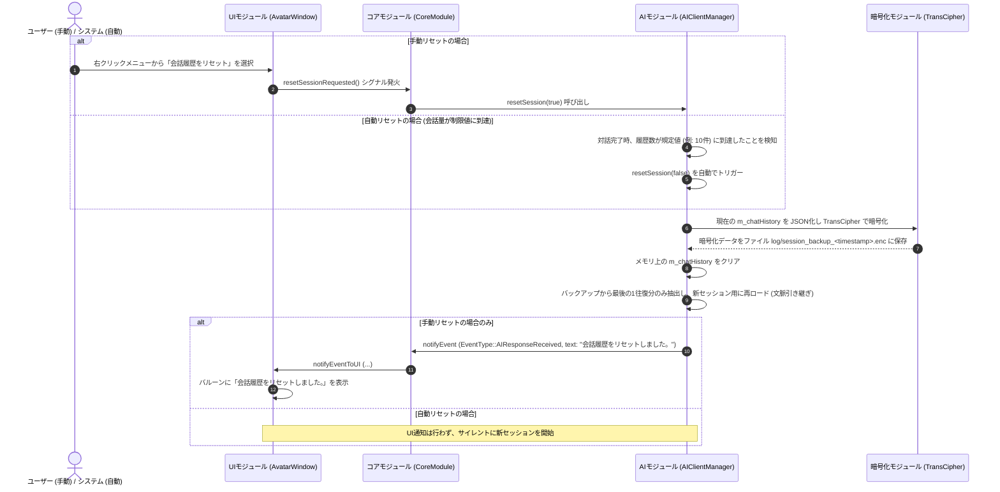

# 基本設計書 - AI Assistant Avatar

## 1. システム構成とモジュール設計
本システムは Qt6 C++ フレームワークを使用し、UI（画面表示）とビジネスロジックを分離した構造を持つ。スレッド安全性と拡張性を確保するため、全体を以下のモジュールに分割する。



### 1.1 モジュール責務一覧

| モジュール名 | 主要クラス名 | 動作スレッド | 主な責務 |
| :--- | :--- | :--- | :--- |
| **UIモジュール** | `AvatarWindow`<br>`BalloonWidget` | メイン（GUI）スレッド | ・背景透過アバターウィンドウの描画<br>・テキストバルーンの表示および**直接テキスト入力欄（キーボード用）の提供**<br>・ユーザー操作（設定変更、ボタン押下、テキスト入力）の受付とコアへの要求発行<br>・イベント受信(`on_notify_events`)による表示更新 |
| **Twitchモジュール**| `TwitchReader` | Twitchスレッド | ・認証トークンがない場合にブラウザでOAuth画面を開き、リダイレクトを受ける一時HTTPサーバーを構築してアクセストークンを自動取得<br>・取得したトークンを用いたTwitchチャット接続（WebSocket）<br>・コメント監視およびウェイクワード判定<br>・マッチしたコメントのイベント通知 |
| **コアモジュール** | `CoreModule` | コアスレッド | ・システム全体の制御および他モジュールの管理<br>・UIからの要求のハンドリング<br>・各モジュールからのイベント受信と処理フローの進行<br>・UIへの完了イベント通知 |
| **STTモジュール** | `STTManager` | STTスレッド | ・マイクからの音声キャプチャ（QAudioSource等を使用）<br>・`whisper.cpp` または `Windows SAPI` による音声認識<br>・文字起こし結果のイベント通知 |
| **AIモジュール** | `AIClientManager`<br>`IAIClient` | AIスレッド | ・**【2段構成】**<br>・**1段目（Manager）**: コアからの要求受付、AIクライアントの動的切り替え、共通イベント化と通知<br>・**2段目（Client）**: 各AI API固有のHTTPリクエスト構築とレスポンスパース |

---

## 2. スレッドモデル
Qtの `QThread` および `QObject::moveToThread` を活用したワーカーオブジェクトモデルを採用する。

1. **常駐スレッドのライフサイクル**
   - アプリケーション起動時（`main.cpp` または `AvatarWindow` の初期化時）に、各スレッド（`CoreThread`, `TwitchThread`, `STTThread`, `AIThread`）を生成・開始（`QThread::start()`）する。
   - 各ワーカーオブジェクト（`CoreModule`, `TwitchReader` 等）を生成し、対応するスレッドに `moveToThread` する。
2. **安全な終了処理（クリーンアップ）**
   - アプリケーション終了時（`closeEvent` の検知時）、UIからコアモジュールへ終了要求を送る。
   - コアモジュールは各モジュールに停止シグナルを送り、ループや接続を安全に終了させる。
   - その後、各 `QThread` に対して `quit()` を呼び出し、`wait()` でスレッドの完全終了（JOIN）を待機してからオブジェクトを破棄する。

---

## 3. イベント駆動モデル (データ連携)
モジュール間の連携には、Qtの **シグナルとスロット (QueuedConnection)** を利用した非同期イベント通信を用いる。

### 3.1 共通イベント構造体 `AppEvent`
モジュール間でやり取りするデータは、以下の構造体に統合して伝達する。

```cpp
enum class EventType {
    TwitchCommentReceived,  // トリガーとなるTwitchチャットを受信した
    VoiceInputStarted,       // 音声入力が開始された
    VoiceInputCompleted,     // 音声認識が完了しテキストが得られた
    AIRequestSent,          // AIへのAPIリクエストを送信した
    AIResponseReceived,     // AIからの応答テキストを受信した
    ErrorOccurred           // エラーが発生した
};

struct AppEvent {
    EventType type;
    QString text;           // 受信したチャット文、音声認識結果、AIの返答など
    QString source;         // イベント送信元モジュール名
    QVariantMap extraData;  // その他のメタデータ（ユーザー名、エラーコード等）
};
```

### 3.2 イベントの流れとシグナル・スロット接続

1. **個別モジュールからコアモジュールへの通知**
   - 各個別モジュールは `notifyEvent(const AppEvent& event)` シグナルを持つ。
   - コアモジュールはスロット `void on_notify_events(const AppEvent& event)` を持ち、各モジュールのシグナルと接続する。
2. **コアモジュールからUIモジュールへの通知**
   - コアモジュールは `notifyEventToUI(const AppEvent& event)` シグナルを持つ。
   - UIモジュールはスロット `void on_notify_events(const AppEvent& event)` を持ち、コアモジュールのシグナルと接続する。

---

## 4. クラス設計と拡張性

### 4.1 音声入力のエンジン抽象化 (`ISTTEngine`)
`whisper.cpp` と `Windows SAPI` を設定によって柔軟に切り替えるため、インターフェースクラスを導入する。



### 4.2 AIモジュールの2段構成設計 (`AIClientManager` と `IAIClient`)
コアモジュールからの呼び出しインタフェースを一本化しつつ、接続先AI（Mistral AI、将来的な他のAI、テスト用ダミー等）の切り替えや各API固有の処理を隠蔽するため、**2段構成**を採用する。



#### 2段構成の責務分担

1. **1段目：`AIClientManager`（スレッド窓口・共通管理）**
   - コアスレッドからの要求をスロット（`on_requestAI`）で受信。コアモジュールからは常にこのクラスのみが見える。
   - 現在の設定に基づき、適切な `IAIClient` 具象クラス（2段目）へ処理を委譲する。
   - 2段目から返ってきた処理結果（テキストや成否フラグ）を受け取り、共通の `AppEvent` 構造体に組み立ててコアモジュールへ通知する。
   - APIキーの管理や、タイムアウト制御などの各AIで共通する処理をここで吸収する。

2. **2段目：`IAIClient` 具象クラス（各AI API固有の個別処理）**
   - HTTPのヘッダーおよびペイロード（JSON）の構築。
   - `QNetworkAccessManager` を使用した各API固有のエンドポイントへの通信。
   - 各API固有のJSONレスポンスのパースと、最終的な返答テキストの抽出。

### 4.3 アバター画像と表示状態の管理設計
アバター画像（静止画）の切り替えによる簡易アニメーションを制御するため、アバターの「表示状態」を定義し、UIモジュール側で状態に応じた画像を管理する。

#### A. アバター表示状態の定義
アバターはシステムの状態（イベント）と連動し、以下の4つの状態を遷移する。

| 状態名 (`AvatarState`) | 説明 | 連動するイベントの例 | 表示画像の例 |
| :--- | :--- | :--- | :--- |
| `Idle` | 通常の待機状態 | アプリ起動時、バルーン非表示時 | `pic/idle.png` |
| `Listening` | 音声認識の待ち受け状態 | `VoiceInputStarted` 受信時 | `pic/listening.png` |
| `Thinking` | AI応答の待機中（思考中） | `AIRequestSent` 受信時 | `pic/thinking.png` |
| `Speaking` | バルーンにAIの応答を表示中 | `AIResponseReceived` 受信時 | `pic/speaking.png` |

#### B. 画像ファイルの管理方式
アバターの状態に応じた画像や透過用パラメータ、および描画基準点を外部のJSON設定ファイル（例: `pic/avatar_settings.json`）で定義します。

**JSON設定ファイル構造例:**
```json
{
  "idle": {
    "file": "idle.png",
    "anchorX": 120,
    "anchorY": 180,
    "transparentX": 0,
    "transparentY": 0
  },
  "listening": {
    "file": "listening.png",
    "anchorX": 120,
    "anchorY": 180,
    "transparentX": 0,
    "transparentY": 0
  },
  "thinking": {
    "file": "thinking.png",
    "anchorX": 120,
    "anchorY": 182,
    "transparentX": 0,
    "transparentY": 0
  },
  "speaking": {
    "file": "speaking.png",
    "anchorX": 124,
    "anchorY": 180,
    "transparentX": 0,
    "transparentY": 0
  }
}
```

* **【自動背景透過処理 (Flood Fill または カラーキー透過)】**
  * 各画像のロード時に、設定された座標（例: `transparentX`, `transparentY`。未指定の場合は左上 `(0,0)`）のピクセル色に基づき、外側の連結成分のみを透明にする **Flood Fill 方式** または全体透過処理を行います。
  * **画像ロード時（メモリ展開時）にこの透過処理を一括して完了させ、透過済みの `QPixmap` としてキャッシュに保持します。**
  * アニメーション（画像切り替え）の瞬間には、すでに透過処理が完了している `QPixmap` を描画領域にセットするだけであるため、切り替え時に背景のクロマキー色（緑やピンクなど）が一瞬映り込んだり、描画の遅延で**ちらついたりする現象（フリッカー）は発生しません。**

* **【アンカーポイントによる位置ズレ補正描画】**
  * 画像ごとにキャラクターの「足元」や「重心」などの基準座標をアンカー（`anchorX`, `anchorY`）として定義します。
  * 状態変化に伴い画像のサイズが異なる場合でも、デスクトップ上のマスコットの目標位置 `(targetX, targetY)` にアンカーが重なるように、ウィンドウ（または画像描画ラベル）の座標を `(targetX - anchorX, targetY - anchorY)` に動的に補正・移動させます。これにより、切り替え時の不自然なキャラクターの位置ズレやガタつきを防止します。

- UIモジュール（`AvatarWindow`）が透過処理済みの `QPixmap` とアンカー設定をキャッシュし、コアモジュールからのイベント（`AppEvent`）検知時に表示画像と描画位置を補正して切り替えます。

---

## 5. 主要シーケンス

### 5.1 音声入力またはTwitchコメントからの処理フロー



### 5.2 テキスト直接入力からの処理フロー



### 5.3 起動時出自証明およびコピーライト動的適用シーケンス



### 5.4 セッションリセットシーケンス



---


## 6. セキュリティとライセンス検証 (TrustChain & BinMarkManager)
本システムは、配布バイナリの出自を保証し改ざんを検知するため、`TrustChain` モジュールを組み込む。

1. **出自証明のライフサイクル**:
   - ビルド時に、開発環境の Git コミットハッシュと GitHub リモートマスタを照合し、事前登録したトークン (`tc_43f73638ed2a119f983e999b`) とともにコンパイルマクロとしてバイナリに安全に注入する。
   - 起動時に、注入された情報を用いて、オンライン検証サーバーへ認証を問い合わせる。
2. **改ざん検知時のUI表示**:
   - 改ざん（検証失敗、オフライン、非公式ビルド）検知時は、自身の実行バイナリ末尾から `BinMarkManager` 形式の平文コピーライトを動的抽出し、メインウィンドウ（`AvatarWindow`）のタイトルバーとステータスバーに強制的に表示する。
   - アプリケーションとしての機能制限は一切加えず、表示の強制変更のみに留める。

---

## 7. 今後の課題（詳細設計に向けた検討）
1. **ライブラリのビルド環境設定:**
   - Qt6 C++ および C++20 環境の構築。
   - `whisper.cpp` の C++ プロジェクトへの静的/動的リンク手法。
   - Windows SAPI (COMインターフェース) の利用設定。
   - Mistral API（HTTPS）を叩くための `QNetworkAccessManager` (Qt Networkモジュール) の追加。
2. **透過ウィンドウの実現性:**
   - Qtにおける透明度やクリック透過の設定（`Qt::WA_NoSystemBackground`, `Qt::WA_TranslucentBackground`）。
