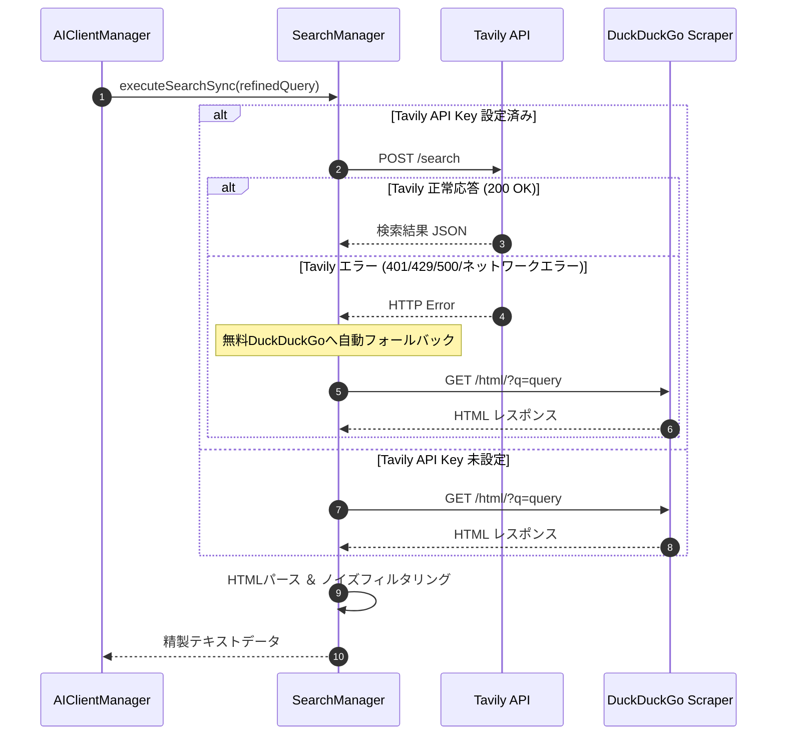

# 詳細設計書 - Web検索 ＆ ナレッジ RAG モジュール (DetailedDesign/Search.md)

## 1. 概要
本ドキュメントは、AI Assistant Avatar における Web 検索プロバイダ群 (`SearchManager`)、検索結果ノイズ除去アルゴリズム、Tavily から DuckDuckGo への自動フォールバック制御、およびマークダウン型ローカルデータベースエンジン (`MarkdownTableEngine`) の詳細設計を定義する。

---

## 2. Web 検索アーキテクチャ (`SearchManager`)

### 2.1 検索プロバイダと優先度
1. **Tavily Search API** (有料/APIキー必須・高精度構造化検索)
2. **DuckDuckGo HTML Scraping** (無料・APIキー不要フォールバック)

### 2.2 Tavily ➔ DuckDuckGo 自動フォールバック制御

---

## 3. DuckDuckGo HTMLパース ＆ ノイズ除去アルゴリズム

### 3.1 HTMLエンティティデコード ＆ 不要要素削除
- `QRegularExpression` を用いて、`URL: https://...` や `[1]`, `( )` などのマークダウンノイズを全除去。
- アメダス、ランキング、利用規約、広告フッターなどの不要な行キーワード（「アメダス」「コイン」「ヘルプ」「プライバシー」等）をフィルタリングし、有用な上位 10 行のテキスト情報を抽出。

---

## 4. マークダウンナレッジエンジン (`MarkdownTableEngine`)

### 4.1 トリガー照合 ＆ テーブル抽出
- ローカルの Markdown ファイル群から、ユーザー発言のキーワード（トリガー）に合致するテーブルデータおよびナレッジテキストを高速抽出する。
- 抽出結果は `TaskType::KnowledgeSearch` としてタスクパイプラインへ統合される。
