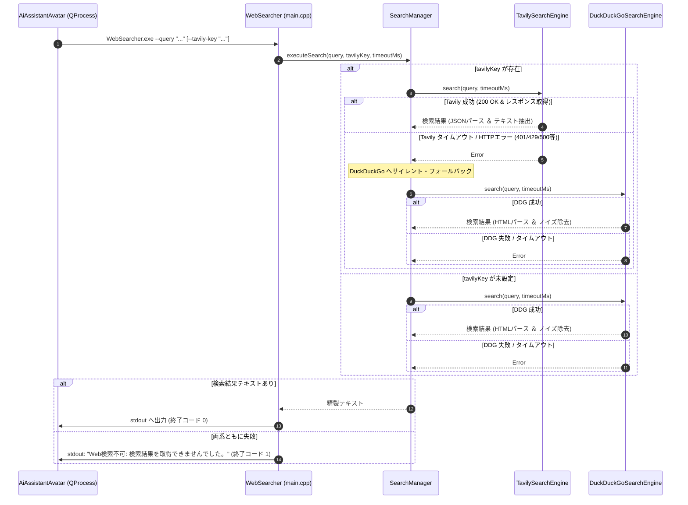

# 詳細設計書 - Web検索 ＆ ナレッジ RAG モジュール (DetailedDesign/Search.md)

## 1. 概要
本ドキュメントは、AI Assistant Avatar における独立 Web 検索コンソールアプリケーション (`WebSearcher.exe`)、メインアプリ側のプロセス呼び出しラッパー (`SearchClientWrapper` / `SearchManager`)、検索結果ノイズ除去アルゴリズム、Tavily から DuckDuckGo への自動フォールバック制御、およびマークダウン型ローカルデータベースエンジン (`MarkdownTableEngine`) の詳細設計を定義する。

---

## 2. Web 検索コンソールアプリケーション (`WebSearcher.exe`) 詳細設計

### 2.1 構成とクラス設計
`WebSearcher.exe` は GUI に依存しない軽量な Qt Core / Network ベースのコンソールアプリケーション（`QCoreApplication`）として構築する。

```text
[WebSearcher.exe]
  ├── main.cpp (QCommandLineParser による引数パース、QCoreApplication イベントループ管理)
  └── SearchManager (内部検索コーディネーター)
        ├── TavilySearchEngine (QNetworkAccessManager による REST API 呼び出し)
        └── DuckDuckGoSearchEngine (QNetworkAccessManager による HTML スクレイピング)
```

### 2.2 CLI 引数仕様とパース設計 (`QCommandLineParser`)
- `--query`, `-q` (`QString`): 検索キーワード（必須）。未指定時は usage を表示し終了コード 2 を返却。
- `--tavily-key`, `-k` (`QString`): Tavily API キー（任意）。
- `--timeout`, `-t` (`int`): 通信タイムアウト時間（ミリ秒、デフォルト: 5000）。

### 2.3 フォールバック実行シーケンス


### 2.4 メインアプリ側プロセス呼び出しラッパー (`SearchClientWrapper`)
- メインアプリ（`AiAssistantAvatar.exe`）および `AIClientManager` からは、同期実行メソッド `executeSearchSync(query, tavilyKey, timeoutMs)` または非同期シグナル `searchFinished(success, resultText)` を通じて `QProcess` を起動する。
- `QProcess` の起動パス解決:
  ```cpp
  QString exePath = QCoreApplication::applicationDirPath() + "/WebSearcher.exe";
  if (!QFile::exists(exePath)) {
      exePath = "WebSearcher.exe";
  }
  ```
- プロセス実行全体のタイムアウト時間は、CLI に指定したタイムアウトの 2 倍 + 1000ms（デフォルト: 11000ms）とし、タイムアウト時は `process.kill()` を実行して安全に「Web検索不可」扱いとする。

---

## 3. 検索結果ノイズ除去・クレンジングアルゴリズム

### 3.1 フィルタリングルール
1. **マークダウンおよび参照インデックスの除去**:
   - `[1]`, `[2]`, `(https://...)`, `URL: ...` などの装飾パターンを正規表現で削除。
2. **広告・フッター・無関係キーワードの除外**:
   - 行単位で「アメダス」「コイン」「利用規約」「プライバシー」「ヘルプ」等のノイズ行をスキップ。
3. **行数・文字数制限**:
   - 有効な行を最大 10〜12 行（200〜300 文字程度）に圧縮し、改行区切りで結合。

---

## 4. マークダウンナレッジエンジン (`MarkdownTableEngine`)

### 4.1 トリガー照合 ＆ テーブル抽出
- ローカルの Markdown ファイル群から、ユーザー発言のキーワード（トリガー）に合致するテーブルデータおよびナレッジテキストを高速抽出する。
- 抽出結果は `TaskType::KnowledgeSearch` としてタスクパイプラインへ統合される。
- `knowledge/` ディレクトリ直下の第1階層ディレクトリ（例: `knowledge/Omikuji/`, `knowledge/Zodiac/`）をグループとして走査し、フォルダ退避・移動による機能ON/OFFに対応する。

### 4.2 プレースホルダーおよび日替わりマクロ展開アルゴリズム
1. **プレースホルダー置換**:
   - `{Date}`: `QDate::currentDate().toString("yyyy-MM-dd")` により現在ローカル日付に置換。
   - `{User}`: 発言元のユーザー名（Twitch ID、Discord ユーザー名等）に置換。
2. **`DailyTableSelect` 決定論的行選択アルゴリズム**:
   - 構文: `DailyTableSelect("グループ", "テーブル", "カラム", "シード")` または `DailyTableSelect("グループ", "カテゴリ", "テーブル", "カラム", "シード")`
   - シード文字列 `seed` を `qHash(seed)` または `QCryptographicHash` により 32bit 符号なし整数へ変換。
   - テーブル内の候補行数 $N$ に対し、選択インデックス $idx = \text{hash} \pmod N$ を算出して行を特定し、指定カラムのセル値を返す。
   - これにより、同一日・同一シードであれば常に同一行（同一結果）が決定論的に取得される。
3. **`DailyRandom(min, max, "seed")` 決定論的乱数アルゴリズム**:
   - シード文字列のハッシュ値から、範囲 `[min, max]` 内の整数値を決定論的に算出する。

### 4.3 最良エントリ選定スコアリングアルゴリズム (`resolveBestEntryForTrigger`)
ユーザーの入力プロンプトに対して複数のナレッジ（Markdown ファイル）が候補に挙がる場合、単なる `priority` 比較ではなく以下の複合スコアリングを実施して最良のエントリを選定する：
1. **完全一致スコア**:
   - プロンプトとトリガーが完全一致する場合（大文字小文字無視）：$+1000$ 点。
2. **部分一致（最長キーワード長スコア）**:
   - プロンプトに含まれるマッチしたトリガー文字列の長さ（文字数 $\times 10$ 点）。より具体的・詳細なキーワード（例:「山羊座」「星座占い」等）を高く評価。
3. **マッチトリガー件数スコア**:
   - 同一エントリ内でマッチしたトリガーの個数 $\times 50$ 点。
4. **優先度（Priority）の加算**:
   - ファイル内に記載された `priority` 値（例: 100）を加算。
5. **最終判定**:
   - 総合スコア（$\text{Total Score} = \text{MatchScore} + \text{Priority}$）が最大のエントリを採用。同点の場合は先着またはより長いトリガーを持つエントリを優先。
