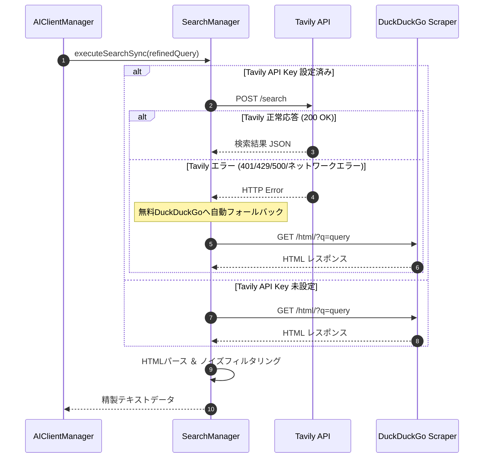

# 詳細設計書 - Web検索 ＆ ナレッジ RAG モジュール (DetailedDesign/Search.md)

## 1. 概要
本ドキュメントは、AI Assistant Avatar における Web 検索プロバイダ群 (`SearchManager`)、検索結果ノイズ除去アルゴリズム、Tavily から DuckDuckGo への自動フォールバック制御、およびマークダウン型ローカルデータベースエンジン (`MarkdownTableEngine`) の詳細設計を定義する。

---

## 2. Web 検索アーキテクチャ (`SearchManager`)

### 2.1 検索プロバイダと優先度
1. **Tavily Search API** (有料/APIキー必須・高精度構造化検索)
2. **DuckDuckGo HTML Scraping** (無料・APIキー不要フォールバック)

### 2.2 Tavily ➔ DuckDuckGo 自動フォールバック制御

---

## 3. DuckDuckGo HTMLパース ＆ ノイズ除去アルゴリズム

### 3.1 HTMLエンティティデコード ＆ 不要要素削除
- `QRegularExpression` を用いて、`URL: https://...` や `[1]`, `( )` などのマークダウンノイズを全除去。
- アメダス、ランキング、利用規約、広告フッターなどの不要な行キーワード（「アメダス」「コイン」「ヘルプ」「プライバシー」等）をフィルタリングし、有用な上位 10 行のテキスト情報を抽出。

---

## 4. マークダウンナレッジエンジン (`MarkdownTableEngine`)

### 4.1 トリガー照合 ＆ テーブル抽出
- ローカルの Markdown ファイル群から、ユーザー発言のキーワード（トリガー）に合致するテーブルデータおよびナレッジテキストを高速抽出する。
- 抽出結果は `TaskType::KnowledgeSearch` としてタスクパイプラインへ統合される。
- `knowledge/` ディレクトリ直下の第1階層ディレクトリ（例: `knowledge/Omikuji/`, `knowledge/Zodiac/`）をグループとして走査し、フォルダ退避・移動による機能ON/OFFに対応する。

### 4.2 プレースホルダーおよび日替わりマクロ展開アルゴリズム
1. **プレースホルダー置換**:
   - `{Date}`: `QDate::currentDate().toString("yyyy-MM-dd")` により現在ローカル日付に置換。
   - `{User}`: 発言元のユーザー名（Twitch ID、Discord ユーザー名等）に置換。
2. **`DailyTableSelect` 決定論的行選択アルゴリズム**:
   - 構文: `DailyTableSelect("グループ", "テーブル", "カラム", "シード")` または `DailyTableSelect("グループ", "カテゴリ", "テーブル", "カラム", "シード")`
   - シード文字列 `seed` を `qHash(seed)` または `QCryptographicHash` により 32bit 符号なし整数へ変換。
   - テーブル内の候補行数 $N$ に対し、選択インデックス $idx = \text{hash} \pmod N$ を算出して行を特定し、指定カラムのセル値を返す。
   - これにより、同一日・同一シードであれば常に同一行（同一結果）が決定論的に取得される。
3. **`DailyRandom(min, max, "seed")` 決定論的乱数アルゴリズム**:
   - シード文字列のハッシュ値から、範囲 `[min, max]` 内の整数値を決定論的に算出する。

### 4.3 最良エントリ選定スコアリングアルゴリズム (`resolveBestEntryForTrigger`)
ユーザーの入力プロンプトに対して複数のナレッジ（Markdown ファイル）が候補に挙がる場合、単なる `priority` 比較ではなく以下の複合スコアリングを実施して最良のエントリを選定する：
1. **完全一致スコア**:
   - プロンプトとトリガーが完全一致する場合（大文字小文字無視）：$+1000$ 点。
2. **部分一致（最長キーワード長スコア）**:
   - プロンプトに含まれるマッチしたトリガー文字列の長さ（文字数 $\times 10$ 点）。より具体的・詳細なキーワード（例:「山羊座」「星座占い」等）を高く評価。
3. **マッチトリガー件数スコア**:
   - 同一エントリ内でマッチしたトリガーの個数 $\times 50$ 点。
4. **優先度（Priority）の加算**:
   - ファイル内に記載された `priority` 値（例: 100）を加算。
5. **最終判定**:
   - 総合スコア（$\text{Total Score} = \text{MatchScore} + \text{Priority}$）が最大のエントリを採用。同点の場合は先着またはより長いトリガーを持つエントリを優先。

