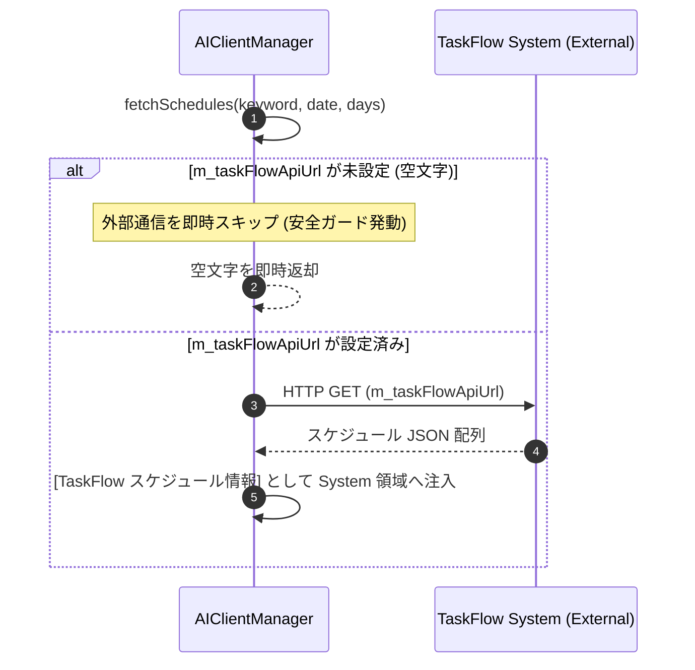

# 詳細設計書 - 予定管理 TaskFlow 連携モジュール (DetailedDesign/TaskFlow.md)

## 1. 概要
本ドキュメントは、AI Assistant Avatar における外部予定管理システム (TaskFlow) 連携仕様、通信保護メカニズム、およびコンテキスト注入フローの詳細設計を定義する。

---

## 2. 安全接続 ＆ 通信保護メカニズム (`F-20-1`)

### 2.1 デフォルト URL ハードコードの完全撤廃
- TaskFlow はマルチユーザー非対応の独立システムであるため、特定個人のドメイン (`https://streamers-tool.sakura.ne.jp/TaskFlow/...`) をコード内にデフォルト URL として保持・使用することを完全に全廃・禁止する。

### 2.2 URL 未設定時の安全接続ガード仕様 (`AIClientManager::fetchSchedules`)
```cpp
QString AIClientManager::fetchSchedules(const QString &keyword, const QDate &startDate, int days) {
    // m_taskFlowApiUrl が未設定 (空文字) の場合は、外部通信を一切行わずに即時復帰
    if (m_taskFlowApiUrl.trimmed().isEmpty()) {
        qDebug() << "[AIClientManager] TaskFlow API URL is empty. Skipping schedule fetch safely.";
        return QString();
    }
    // 設定済みの場合のみ HTTP GET リクエストを発行
    ...
}
```

---

## 3. スケジュール取得 ＆ コンテキスト注入フロー

### 3.1 HTTP リクエスト ＆ JSON パース
- `m_taskFlowApiUrl` へ `keyword`, `start_date`, `days` パラメータを付与して HTTP GET 送信。
- 返却された JSON 配列から、タイトル・日時・詳細テキストを抽出し、`[TaskFlow スケジュール情報]` として整形。

### 3.2 処理フロー

