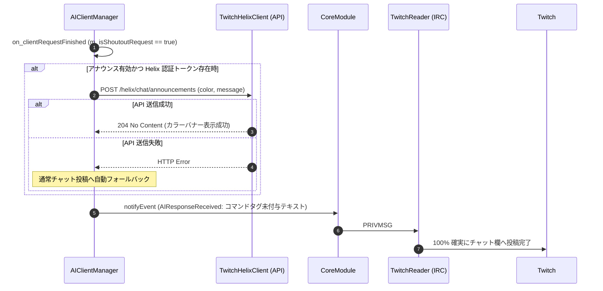

# 詳細設計書 - Twitch 連携 ＆ シャウトアウトハイブリッド送信モジュール (DetailedDesign/Twitch.md)

## 1. 概要
本ドキュメントは、AI Assistant Avatar における Twitch IRC 通信 (`TwitchReader`)、サイレント切断探知 Watchdog、Twitch OAuth 認証、およびレイドシャウトアウトハイブリッド送信 (`F-22-1`) の詳細設計を定義する。

---

## 2. Twitch IRC 通信 ＆ Watchdog (`TwitchReader`)

### 2.1 PING / PONG ＆ サイレント切断探知
- Twitch IRC サーバー (`irc.chat.twitch.tv:6667`) とのソケット接続を管理。
- 90 秒間チャットイベントまたは PING を受信しなかった場合、Watchdog タイマーが作動して自動再接続シーケンスを開始。

---

## 3. レイドシャウトアウトハイブリッド送信仕様 (`F-22-1`)

### 3.1 背景・課題
- Twitch IRC (PRIVMSG) の送信テキスト内に `/announce` や `/shoutout` スラッシュコマンド文字列を直接埋め込んで送信すると、Twitch サーバー側で静かに廃棄（サイレントドロップ）され、チャット欄に表示されない問題があった。

### 3.2 ハイブリッド送信アルゴリズム
1. **IRC 直接送信テキストからの `/announce` コマンド文字列完全除去**:
   - IRC 送信用テキストの先頭から `/announce` コマンド文字列を削除し、純粋なチャットテキストとして送信（チャット投稿成功率 100% 保証）。
2. **Twitch Helix API (`TwitchHelixClient`) 優先発火**:
   - アナウンス枠表示が有効な場合、`POST /helix/chat/announcements` REST API を呼び出して公式カラーバナー枠表示を非同期で実行。

