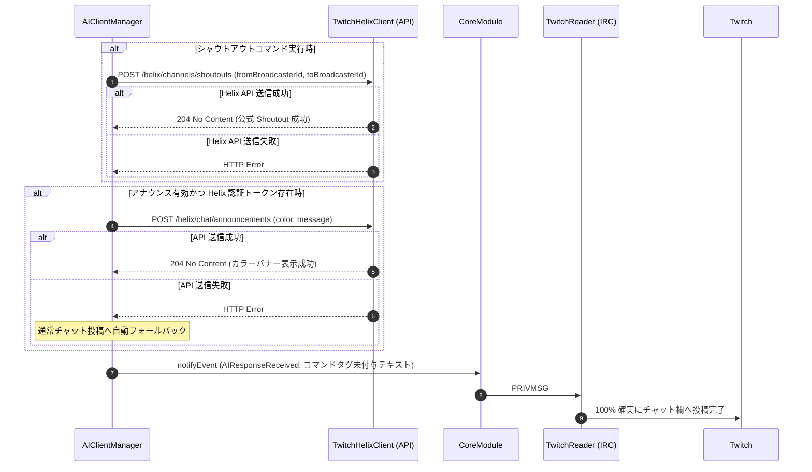
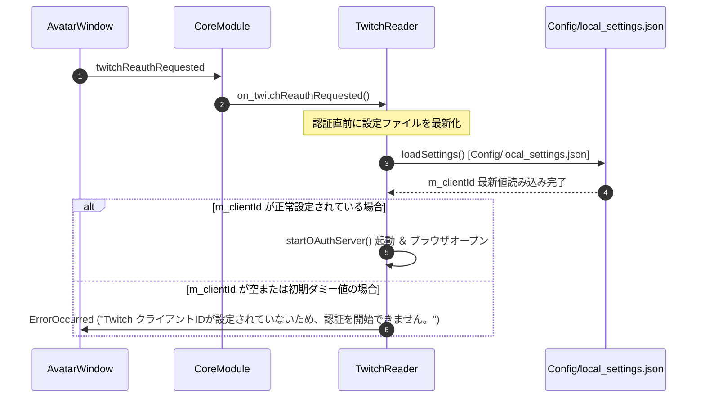

# 詳細設計書 - Twitch 連携 ＆ シャウトアウトハイブリッド送信モジュール (DetailedDesign/Twitch.md)

## 1. 概要
本ドキュメントは、AI Assistant Avatar における Twitch IRC 通信 (`TwitchReader`)、サイレント切断探知 Watchdog、Twitch OAuth 認証、およびレイドシャウトアウトハイブリッド送信 (`F-22-1`) の詳細設計を定義する。

---

## 2. Twitch IRC 通信 ＆ Watchdog (`TwitchReader`)

### 2.1 PING / PONG ＆ サイレント切断探知
- Twitch IRC サーバー (`irc.chat.twitch.tv:6667`) とのソケット接続を管理。
- 90 秒間チャットイベントまたは PING を受信しなかった場合、Watchdog タイマーが作動して自動再接続シーケンスを開始。

---

## 3. レイドシャウトアウトハイブリッド送信仕様 (`F-22-1`)

### 3.1 背景・課題
- Twitch IRC (PRIVMSG) の送信テキスト内に `/announce` や `/shoutout` スラッシュコマンド文字列を直接埋め込んで送信すると、Twitch サーバー側で静かに廃棄（サイレントドロップ）され、チャット欄に表示されない問題があった。

### 3.2 ハイブリッド送信アルゴリズム
1. **IRC 直接送信テキストからの `/announce` / `/shoutout` コマンド文字列完全除去**:
   - IRC 送信用テキストの先頭から `/announce` や `/shoutout` コマンド文字列を削除し、純粋なチャットテキストとして送信（チャット投稿成功率 100% 保証）。
2. **Twitch Helix API (`TwitchHelixClient`) 優先発火 (アナウンス ＆ 公式 Shoutout)**:
   - アナウンス枠表示が有効な場合、`POST /helix/chat/announcements` REST API を呼び出して公式カラーバナー枠表示を非同期で実行。
   - シャウトアウト実行時、IRC PRIVMSG での文字列送信を廃止し、`TwitchHelixClient::sendShoutout(toBroadcasterId, fromBroadcasterId)` 経由で `POST /helix/channels/shoutouts?from_broadcaster_id=...&to_broadcaster_id=...&moderator_id=...` REST API を呼び出して Twitch 公式 Shoutout を発火させる。

---

## 4. Twitch OAuth 認証 ＆ 設定再読み込み仕様 (`TwitchReader::on_twitchReauthRequested`)

### 4.1 動作仕様
1. **設定パスの厳格固定化**:
   - `TwitchReader::loadSettings()` での読込先を `Config/local_settings.json` に完全一元化・固定する。
2. **`on_twitchReauthRequested` 呼び出し時の即時同期ロード**:
   - 「Twitch認証開始」ボタン押下時または reauth 要求イベント受信時、`on_twitchReauthRequested()` の冒頭で **必ず同期的に `loadSettings()` を呼び出し、`Config/local_settings.json` から最新の `m_clientId` をメモリに再ロード** する。
3. **Client ID 不在チェックと Local Server 起動**:
   - 再ロード後の `m_clientId` が空文字または初期ダミー値（`YOUR_TWITCH_CLIENT_ID`）であるか判定する。
   - 正しい Client ID が設定されている場合は、即座に OAuth ローカルサーバー (`m_authServer`) を起動し、ブラウザ認証画面を起動する。

---

## 5. レイド受信パースおよび ID / 表示名分離・チャット送信ルーティング仕様

### 5.1 USERNOTICE (raid) パースと引数分離
Twitch IRC から受信する `USERNOTICE` タグ付きメッセージから、英数字ログインIDと日本語表示名を分離して抽出する。
- **`msg-param-login`**: 英数字の Twitch ユーザーID（Helix API の `login` 引数用）。
- **`msg-param-displayName`**: ユーザーの表示名（日本語・多言語対応、プロンプト・UI表示用）。
- **`msg-param-viewerCount`**: レイド視聴者数。

`TwitchReader` はこれらを `TwitchRaidReceived` イベントの `extraData`（`login`, `displayName`, `viewerCount`, `channel`）として `CoreModule` 経由で `AIClientManager` へ送出する。

### 5.2 送信元ソース (`m_currentSource = "Twitch"`) の明示設定
レイド受信時、`AIClientManager` は `m_currentSource = "Twitch"` および `m_currentTwitchChannel = m_twitchChannel` を明示的に設定する。
これにより、AI応答生成完了時の `event.source` が `"Twitch"` となり、`event.extraData["twitch_channel"]` が確実にセットされ、`CoreModule` の `enqueueCommentSend` を通じて Twitch チャット欄へお礼メッセージが 100% 確実に投稿される。

