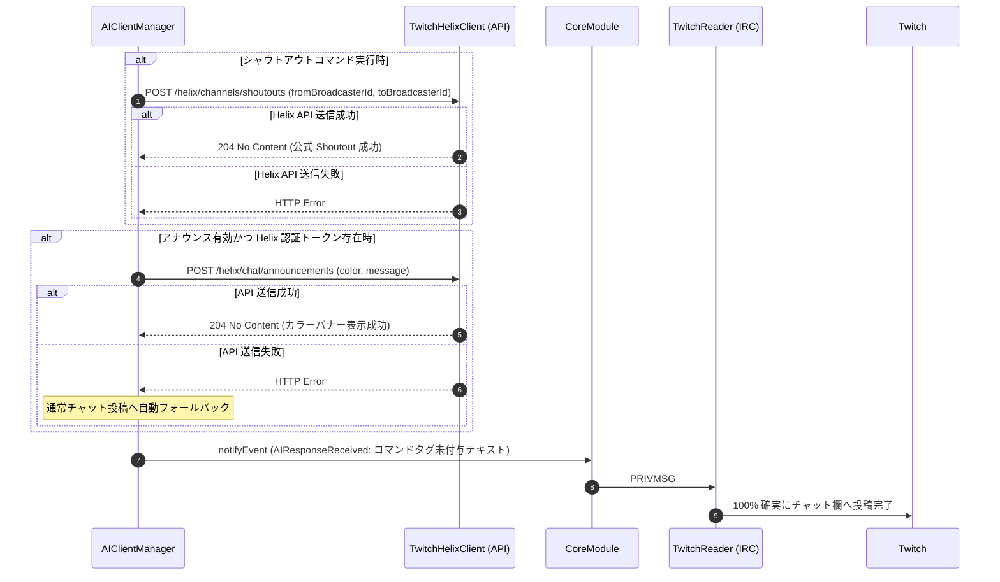
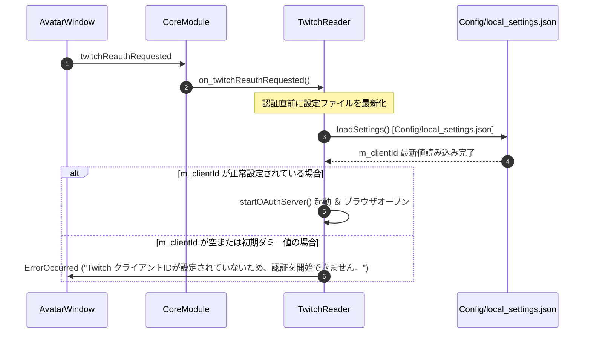

# 詳細設計書 - Twitch 連携 ＆ シャウトアウトハイブリッド送信モジュール (DetailedDesign/Twitch.md)

## 1. 概要
本ドキュメントは、AI Assistant Avatar における Twitch IRC 通信 (`TwitchReader`)、サイレント切断探知 Watchdog、Twitch OAuth 認証、およびレイドシャウトアウトハイブリッド送信 (`F-22-1`) の詳細設計を定義する。

---

## 2. Twitch IRC 通信 ＆ Watchdog (`TwitchReader`)

### 2.1 PING / PONG ＆ サイレント切断探知
- Twitch IRC サーバー (`irc.chat.twitch.tv:6667`) とのソケット接続を管理。
- 90 秒間チャットイベントまたは PING を受信しなかった場合、Watchdog タイマーが作動して自動再接続シーケンスを開始。

---

## 3. レイドシャウトアウトハイブリッド送信仕様 (`F-22-1`)

### 3.1 背景・課題
- Twitch IRC (PRIVMSG) の送信テキスト内に `/announce` や `/shoutout` スラッシュコマンド文字列を直接埋め込んで送信すると、Twitch サーバー側で静かに廃棄（サイレントドロップ）され、チャット欄に表示されない問題があった。

### 3.2 ハイブリッド送信アルゴリズム
1. **IRC 直接送信テキストからの `/announce` / `/shoutout` コマンド文字列完全除去**:
   - IRC 送信用テキストの先頭から `/announce` や `/shoutout` コマンド文字列を削除し、純粋なチャットテキストとして送信（チャット投稿成功率 100% 保証）。
2. **Twitch Helix API (`TwitchHelixClient`) 優先発火 (アナウンス ＆ 公式 Shoutout)**:
   - アナウンス枠表示が有効な場合、`POST /helix/chat/announcements` REST API を呼び出して公式カラーバナー枠表示を非同期で実行。
   - シャウトアウト実行時、IRC PRIVMSG での文字列送信を廃止し、`TwitchHelixClient::sendShoutout(toBroadcasterId, fromBroadcasterId)` 経由で `POST /helix/channels/shoutouts?from_broadcaster_id=...&to_broadcaster_id=...&moderator_id=...` REST API を呼び出して Twitch 公式 Shoutout を発火させる。



---

## 4. Twitch OAuth 認証 ＆ 設定再読み込み仕様 (`TwitchReader::on_twitchReauthRequested`)

### 4.1 動作仕様
1. **設定パスの厳格固定化**:
   - `TwitchReader::loadSettings()` での読込先を `Config/local_settings.json` に完全一元化・固定する。
2. **`on_twitchReauthRequested` 呼び出し時の即時同期ロード**:
   - 「Twitch認証開始」ボタン押下時または reauth 要求イベント受信時、`on_twitchReauthRequested()` の冒頭で **必ず同期的に `loadSettings()` を呼び出し、`Config/local_settings.json` から最新の `m_clientId` をメモリに再ロード** する。
3. **Client ID 不在チェックと Local Server 起動**:
   - 再ロード後の `m_clientId` が空文字または初期ダミー値（`YOUR_TWITCH_CLIENT_ID`）であるか判定する。
   - 正しい Client ID が設定されている場合は、即座に OAuth ローカルサーバー (`m_authServer`) を起動し、ブラウザ認証画面を起動する。



---

## 5. レイド受信パースおよび ID / 表示名分離・チャット送信ルーティング仕様

### 5.1 USERNOTICE (raid) パースと引数分離
Twitch IRC から受信する `USERNOTICE` タグ付きメッセージから、英数字ログインIDと日本語表示名を分離して抽出する。
- **`msg-param-login`**: 英数字の Twitch ユーザーID（Helix API の `login` 引数用）。
- **`msg-param-displayName`**: ユーザーの表示名（日本語・多言語対応、プロンプト・UI表示用）。
- **`msg-param-viewerCount`**: レイド視聴者数。

`TwitchReader` はこれらを `TwitchRaidReceived` イベントの `extraData`（`login`, `displayName`, `viewerCount`, `channel`）として `CoreModule` 経由で `AIClientManager` へ送出する。

### 5.2 送信元ソース (`m_currentSource = "Twitch"`) の明示設定
レイド受信時、`AIClientManager` は `m_currentSource = "Twitch"` および `m_currentTwitchChannel = m_twitchChannel` を明示的に設定する。
これにより、AI応答生成完了時の `event.source` が `"Twitch"` となり、`event.extraData["twitch_channel"]` が確実にセットされ、`CoreModule` の `enqueueCommentSend` を通じて Twitch チャット欄へお礼メッセージが 100% 確実に投稿される。

---

## 6. Twitch Helix 認証トークン正規化 ＆ エラー耐性仕様

### 6.1 OAuth トークン文字列の自動正規化 (`setCredentials`)
Twitch Helix API (`https://api.twitch.tv/helix/...`) に対する HTTP リクエストでは、`Authorization: Bearer <token>` 形式のヘッダーが必須となる。
設定ファイル（`local_settings.json`）や外部入力ではトークンに `oauth:` プレフィックスが付与されている場合があるため、`TwitchHelixClient::setCredentials` において以下の正規化を強制する：

```cpp
void TwitchHelixClient::setCredentials(const QString &oauthToken, const QString &clientId) {
    m_oauthToken = oauthToken.trimmed();
    if (m_oauthToken.startsWith("oauth:", Qt::CaseInsensitive)) {
        m_oauthToken = m_oauthToken.mid(6).trimmed();
    }
    m_clientId = clientId.trimmed();
}
```

これにより、ヘッダー生成時に `Authorization: Bearer oauth:xxxx` のような不正形式になることを完全に防止し、401 Unauthorized (`Host requires authentication`) エラーを根絶する。

### 6.2 `/shoutout` REST API エンドポイント ＆ クエリパラメータ仕様
- **エンドポイント**: `POST https://api.twitch.tv/helix/chat/shoutouts`
- **クエリパラメータ**:
  - `from_broadcaster_id`: 配信主（レイドを受け取ったチャンネル）の Twitch User ID
  - `to_broadcaster_id`: レイド主（シャウトアウト対象）の Twitch User ID
  - `moderator_id`: コマンドを実行するモデレーターまたは配信主の Twitch User ID
- **ヘッダー**:
  - `Client-ID`: `<m_clientId>`
  - `Authorization`: `Bearer <m_oauthToken>`
  - `Content-Type`: `application/json`
- **レスポンス**: `204 No Content`（成功時）

---

## 7. Twitch クリエイター紹介文生成コンソールアプリ (`TwitchIntroGenerator`) 詳細設計

### 7.1 概要・責務
`TwitchIntroGenerator` は、Twitch 配信におけるクリエイター紹介文生成（プロフィール収集 ＋ プロンプト構築 ＋ AI生成）に特化したスタンドアロンのコンソールアプリケーションである。
メインアプリ（GUI）および他ツールから独立したサブプロセスとして呼び出され、標準出力へ結果テキスト（または JSON）を出力して終了する。

### 7.2 コマンドライン引数仕様
```text
TwitchIntroGenerator [options]
Options:
  --user <login>        [必須] 対象クリエイターの Twitch ユーザーID (英数字)
  --mode <mode>         [任意] 文脈モード ("raid" または "conversation", デフォルト: "conversation")
  --length <length>     [任意] 紹介文の長さ ("short", "standard", "long", デフォルト: "standard")
  --tone <tone_text>    [任意] トーン・口調指示 (デフォルト: "明るく元気な口調で！")
  --config <path>       [任意] 設定ファイルパス (デフォルト: "Config/local_settings.json")
  --format <format>     [任意] 出力形式 ("text" または "json", デフォルト: "text")
  --help, -h            ヘルプ表示
```

### 7.3 内部処理シーケンス
1. **設定および認証情報のロード**:
   - `--config` で指定された設定ファイル（または引数）から Twitch Client ID、OAuth Token、および AI プロバイダ設定（APIキー、モデル名）をロード。
2. **クリエイター情報収集 (`TwitchHelixClient`)**:
   - `GET /helix/users?login=<user>` $\rightarrow$ ユーザーID, 表示名, 自己紹介 (Bio), SNS抽出
   - `GET /helix/channels?broadcaster_id=<id>` $\rightarrow$ 現在の配信カテゴリ, 配信タイトル
   - `GET /helix/videos?user_id=<id>&type=archive` $\rightarrow$ 最近プレイしたゲーム一覧（最大5件）
3. **プロンプト構築 (`AIClientManager` 共通ロジック)**:
   - `--mode raid`: レイド歓迎プロンプト（迎え入れ・感謝の文脈）
   - `--mode conversation`: 会話紹介プロンプト（チャットでの紹介文脈）
4. **AI クライアントによる推論**:
   - 設定された Worker AI クライアント（Mistral / Groq 等）にプロンプトを送信し、紹介文テキストを生成。
5. **標準出力（stdout）への出力 ＆ 終了**:
   - `--format text`: 生成された紹介文テキストのみを UTF-8 で出力。
   - `--format json`: `{ "status": "success", "username": "...", "displayName": "...", "text": "..." }` を出力。
   - 終了コード: 正常時 `0`、エラー時 `1`。

### 7.4 メインアプリ (`AIClientManager`) との非同期プロセス連携
- **実行ファイル探索パス (`tools/` 優先)**:
  - `AIClientManager` は `appDir + "/tools/TwitchIntroGenerator.exe"` を最優先で探索し、存在しない場合は `appDir + "/TwitchIntroGenerator.exe"` または `appDir + "/build/TwitchIntroGenerator.exe"` を探索する。
- **DLL 共有環境変数の注入**:
  - `QProcessEnvironment` の `PATH` 先頭に `appDir` を前置し、`tools/` 配下の `TwitchIntroGenerator.exe` がルート階層の Qt6 / MinGW DLL 群を自動参照できるようにする。
- **非同期実行とタイムアウト監視**:
  - メインアプリは `QProcess` を使用して `TwitchIntroGenerator.exe` を非同期で起動する。
  - 15秒以内に終了しない場合はプロセスを強制終了（`kill()`）し、フォールバックメッセージ（例: `「〇〇さん、レイドありがとうございます！」`）を出力する。
- **レイド時 `/shoutout` との連動**:
  - メインアプリは、CLI の完了を待たずに（または並行して）Twitch 公式 `/shoutout` API の発火および 120 秒クールタイム待機キュー処理を独立して実行する。


