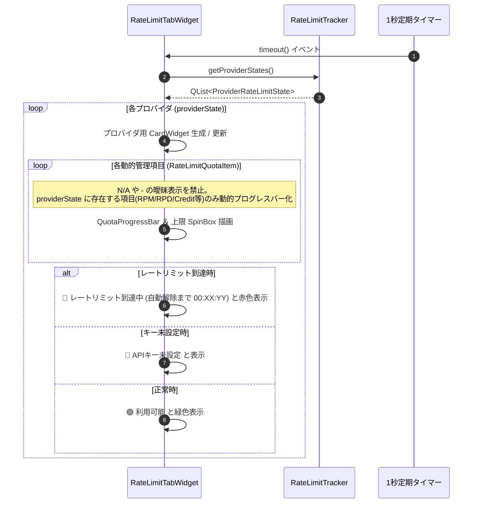

# 詳細設計書 - UI ＆ 表示・設定・アバターモジュール (DetailedDesign/UI.md)

## 1. 概要
本ドキュメントは、AI Assistant Avatar におけるメインアバターウィンドウ (`AvatarWindow`)、会話履歴ビューア (`HistoryViewerDialog`)、レートリミット管理専用タブ (`RateLimitTabWidget`)、画像の透過処理 (Flood Fill)、および出自検証・コピーライト動的スキャン (`TrustChain`) の詳細設計を定義する。

---

## 2. メインアバターウィンドウ (`AvatarWindow`)

### 2.1 ウィンドウ透過 ＆ ドラッグ操作
- `Qt::FramelessWindowHint` および `Qt::WindowStaysOnTopHint` フラグによる枠なし・最前面化。
- マウスドラッグ移動、右クリックコンテキストメニューによる設定画面起動。

### 2.2 透過アルゴリズム (Flood Fill 透過処理)
- アバター画像の背景特定色をシード値として Flood Fill アルゴリズムを実行し、Alpha 値を 0 に置換して完全透過化。

---

## 3. 会話履歴ビューア (`HistoryViewerDialog` - F-30)

### 3.1 左右 2 ペイン分割レイアウト
- **左側ペイン**: セッション履歴一覧リスト (`QListWidget`)。
- **右側ペイン**: 吹き出し風装飾スタイルの会話ログ表示エリア (`QTextBrowser`)。

---

## 4. レートリミット管理専用タブ (`RateLimitTabWidget` - F-16-10)

### 4.1 概要・基本仕様
- 設定画面に新設される専用タブ。ユーザーがクリック操作を行わなくても全プロバイダの状態が一目で監視できる「ノー・クリック（操作不要）」可変カードリスト形式。
- C++ コード側でプロバイダごとの項目を固定ハードコードせず、API I/F や仕様に応じて提供されている管理項目 (`RateLimitQuotaItem`) のみを動的に生成描画。
- ユーザーの混乱や不信感を防止するため、仕様上存在しない項目への `N/A` や `-` 等の曖昧表示を完全全廃。
- 開発・テスト用のダミープロバイダ (`dummy`) は監視対象から完全に除外・フィルタリング。

### 4.2 動的カード描画 ＆ ステータス更新フロー


---

## 6. アバター共通 ＆ OBS設定のUI非表示化詳細仕様 (`AvatarWindow`)

### 6.1 基本設定 ＆ OBS UIレイアウト (`initSettingsTab`)
- **アバター共通・基本設定**:
  - グループボックス内にアバター名 (`m_avatarNameEdit`)、アバタースキン選択/構築 (`m_comboAvatarSkin`, `m_btnSkinBuilder`) のみを配置。
  - 名前反応 (`m_nameReactionCheckbox`)、ウェイクワード (`m_twitchWakeWordEdit`)、判定モード (`m_twitchWakeWordModeCombo`) の画面UIコントロールを完全削除。
- **OBS / 描画設定**:
  - WebSocketポート (`m_wsPortEdit`) および HTTP配信ポート (`m_obsHttpPortEdit`) の画面UIコントロールを完全削除。

### 6.2 ロード ＆ 保存仕様 (`loadSettingsToUI` / `saveSettingsFromUI`)
- **ファイルパスの厳格固定**:
  - 設定の読み込み・保存先パスを `Config/local_settings.json` に完全固定・一元化する（ルート直下等の古いフォールバック探索を排除）。
  - ファイルが存在しない場合は `Config/local_settings.json.sample` より自動的に複製生成して初期化した上で処理を実行する。
- **`loadSettingsToUI`**:
  - UI非表示項目 (`name_reaction_enabled`, `ws_port`, `obs_http_port`, `twitch_wakeword`, `twitch_wakeword_mode`) のUIコントロールへの描画・ロードをスキップし、バックエンド層で `Config/local_settings.json` を直接読み込み。
  - Twitch 接続時挨拶チェックボックス (`m_twitchGreetingCheckbox`) の状態を `Config/local_settings.json` の `"twitch_greeting_enabled"` (フォールバック: `"greeting_enabled"`) より取得して UI 上に復元。
- **`saveSettingsFromUI`**:
  - 既存の `Config/local_settings.json` をロードして既存設定値をマージする際、`JsonCommentRemover::stripHashComments(...)` を通してコメント行（`#` 行）を除去してからパースを実行し、パース失敗による設定初期化・消失を防止する。
  - UIフォーム上に直接の入力欄を持たない設定項目（`twitch_client_id`, `twitch_port`, `twitch_wakeword`, `twitch_wakeword_mode` 等）は、既存 JSON オブジェクトに保持されている値をそのまま保護・維持して上書き保存する。
  - `m_twitchGreetingCheckbox->isChecked()` のチェック状態を取得し、`Config/local_settings.json` の `"twitch_greeting_enabled"` キーへ正しく反映して保存。

---

## 7. Discord 複数チャンネル動的レイアウト構築詳細仕様 (`rebuildDiscordLayout`)

### 7.1 動的追加・削除制御 (`rebuildDiscordLayout` / シグナル接続)
- **`m_discordChannelsLayout` 清掃と再構築**:
  - `channelCount` またはリスト要素数に応じて、`m_discordChannelSettings` 構造体リスト（`QLineEdit* channelIdEdit`, `QCheckBox* greetingCheckbox`, `QPushButton* removeBtn`）を動的にアロケート。
  - 各行に「接続チャンネル X」ラベル、QLineEdit、起動時挨拶 QCheckBox、`[-]` ボタンを水平レイアウト (QHBoxLayout) で配置。
- **`[+ チャンネル追加]` ボタン**:
  - 押下時に `m_discordChannelSettings` に要素を追加し、`rebuildDiscordLayout` を再呼出。
- **`[-]` ボタン**:
  - 押下時に該当行の要素を削除し、再レイアウト（1件以下の場合は削除を無効化・非活性化）。

### 7.2 JSON 配列相互変換 (`saveSettingsFromUI` / `loadSettingsToUI`)
- `loadSettingsToUI`: `local_settings.json` の `"discord_channels"` 配列を読み込み、配列長に応じて `rebuildDiscordLayout` を起動して画面展開。
- `saveSettingsFromUI`: 画面上の各行の入力値を取得し、`"discord_channels": [ {"channel_id": "...", "greeting_enabled": true}, ... ]` の JSON 配列として保存。

---


## 6. AI設定タブ UI 詳細構造 (`AvatarWindow::initAiSettingsTab`)

### 6.1 Worker AI 設定グループのインライン行レイアウト ＆ 左端位置アラインメント構造
`QFormLayout` のフォームラベルとフィールド領域を活用し、1行目の `[レ] 有効` チェックボックスの左端位置と、2行目の `モデル:` コンボボックスの左端位置がピッタリ縦位置合わせ（アラインメント統一）されるようレイアウトを構築する。

#### ワーカーAIプロバイダ項目レイアウト仕様
| プロバイダ | QFormLayout ラベル | 右側フィールド (`QFormLayout` 領域) の構成 |
| :--- | :--- | :--- |
| **Mistral AI** | `Mistral AI:` | 1行目: `[レ] 有効` (CheckBox) ＋ `[●●●●●●●● (APIキー)]` (LineEdit) |
| **Groq** | `Groq AI:`<br>`モデル:` | 1行目: `[レ] 有効` (CheckBox) ＋ `[●●●●●●●● (APIキー)]`<br>2行目: `[ llama-3.3-70b-versatile (推奨) ▼ ]` (ComboBox - 左端位置を有効CBと統一) |
| **HuggingFace** | `HuggingFace:`<br>`モデル:` | 1行目: `[レ] 有効` (CheckBox) ＋ `[●●●●●●●● (APIキー)]`<br>2行目: `[ meta-llama/Llama-3.1-8B-Instruct ▼ ]` (ComboBox - 左端位置を有効CBと統一) |
| **OpenRouter** | `OpenRouter:`<br>`モデル:` | 1行目: `[レ] 有効` (CheckBox) ＋ `[●●●●●●●● (APIキー)]`<br>2行目: `[ google/gemma-4-31b-it:free ▼ ]` (ComboBox - 左端位置を有効CBと統一) |
| **さくらAI** | `さくらAI:`<br>`モデル:` | 1行目: `[レ] 有効` (CheckBox) ＋ `[●●●●●●●● (APIキー全幅)]`<br>2行目: `[ llm-jp-3.1-8x13b-instruct4 ▼ ]` (左端を有効CB位置と整列) |
| **Tavily (検索補助)** | `Tavily キー (任意):` | `[●●●●●●●● (APIキー入力欄)]` (変更なし・単独行配置) |

### 6.2 データ駆動構造体 (`ProviderConfigSpec`) および全自動処理仕様

#### 6.2.1 構造体定義 (`ProviderConfigSpec`)
```cpp
struct ProviderConfigSpec {
    QString id;                 // プロバイダ識別ID ("mistral", "groq" 等)
    QString displayName;        // 表示ラベル ("Mistral AI", "Groq AI" 等)
    QString keyPlaceholder;     // APIキー入力欄プレースホルダー
    bool hasModelCombo = false; // モデル選択コンボボックスの有無
    QStringList defaultModels;  // デフォルト候補モデル一覧
    bool isModelEditable = false; // モデル名の自由編集可能フラグ

    // 動的生成UI参照インスタンスポインタ
    QCheckBox *checkbox = nullptr;
    QLineEdit *keyEdit = nullptr;
    QComboBox *modelCombo = nullptr;
};
```

#### 6.2.2 全自動ループ処理 ＆ モデル自動選択アルゴリズム
1. **全自動 UI 生成・アラインメント整列ループ**:
   - `QList<ProviderConfigSpec>` を `for` ループで走査し、`QHBoxLayout` による「`[レ] 有効` ＋ `APIキー入力欄`」の生成および 2行目の「`モデル:` コンボボックス」のアラインメント位置あわせ配置を全自動実行。
   - モデル選択コンボボックスの先頭インデックス（index 0）に「`自動選択 (推奨)`」を全プロバイダ共通で追加。
2. **全自動モデル選定 (Auto Model Selection) ロジック**:
   - コンボボックスが「`自動選択 (推奨)`」に設定されている、または空文字の場合、各 AI クライアント（Groq, OpenRouter, HuggingFace, Sakura 等）はクライアント側で規定されている最新・推奨推論モデルを自動選択して推論を実行。

---

## 8. 音声入力 (STT) PTT ＆ 共有マイクアクセス詳細設計 (F-2)

### 8.1 「音声」ボタンの PTT 状態・イベント発火設計 (`AvatarWindow`)
- **ボタンイベント割り当て**:
  - `m_sttButton` の `pressed` シグナル ➔ `onSttPressed()`
  - `m_sttButton` の `released` シグナル ➔ `onSttReleased()`
- **UI 表示 ＆ スタイル制御**:
  - 押下時 (`onSttPressed`): ボタンテキストを `🎤 録音中...` に変更し、背景色 `#e74c3c` (赤色) のスタイルシートを適用し、`startSTTRequested()` シグナルを発火。
  - 解放時 (`onSttReleased`): ボタンテキストを `音声` に戻し、標準スタイルシートへ復元し、`stopSTTRequested()` シグナルを発火。

### 8.2 共有マイクアクセス ＆ 会話状態遷移ルーティング詳細設計 (`CoreModule` / `STTManager`)
- **`SAPIEngine` 共有キャプチャ制御**:
  - `CLSID_SpSharedRecognizer` を使用して認識エンジンを初期化し、WASAPI 共有モードでマイク入力をキャプチャ。他の音声アプリ（OBS, Discord 等）のマイク占有・遮断を回避する。
- **会話状態遷移制御 (State Machine)**:
  - `CoreModule` 内に会話アクティブ状態フラグ `m_isVoiceActive` (bool) および無音タイムアウト用タイマー `m_voiceSilenceTimer` (QTimer) を保持する。
  - **待機状態 (`m_isVoiceActive == false`)**:
    - 受信した音声テキスト (`event.text`) にアバター名 (`avatar_name`) または `twitch_wakeword` が含まれているか判定。
    - **日本語表記ゆれ自動吸収・正規化照合処理**:
      - 音声認識エンジン（Google WebSTT, SAPI, Whisper等）が出力する「ブルタロー」「プルタロー」「ブル太郎」「プル太郎」「ブルタロウ」等の漢字・カタカナ・濁音/半濁音・長音表記のゆれを自動吸収するため、判定時に以下の正規化手順を実行する：
        1. **かな文字の統一**: 入力テキストおよび設定値を「ひらがな/カタカナ相互変換」し、仮名レベルでの一致を判定する。
        2. **濁音/半濁音・定番漢字・長音マッピング**: 「ぶ/ブル/プル」「たろう/太郎/タロー」等の同音・同義の表記ゆらぎパターンを自動抽出し、設定がひらがな（例: `ぶるたろう`）であってもカタカナ・長音符・漢字混在テキスト（例: `ブルタロー`, `プルタロー`）を正しくウェイクワードとして検出する。
    - アバター名等が含まれない場合、呼びかけ意図のない発言（「テスト」「独り言」等）として処理を中断し破棄する。
    - アバター名が含まれている場合、テキストからアバター名および敬称を除去し、`requestAIExecution` を発火して `m_isVoiceActive = true` へ遷移し、`m_voiceSilenceTimer` を開始する。
  - **アクティブ状態 (`m_isVoiceActive == true`)**:
    - アバター名の指定がない発言であっても、そのまま `requestAIExecution` へ転送して連続会話を実行し、`m_voiceSilenceTimer` を再スタート (Reset) する。
  - **無音タイムアウト処理**:
    - 設定値 `voice_silence_timeout_ms` (デフォルト: `1000ms`) の間新たな発言がない場合、`m_voiceSilenceTimer` の `timeout()` シグナルが発火し、`m_isVoiceActive = false` (待機状態) へ自動復帰する。
  - **PTT入力のバイパス制御**:
    - UI の「音声」ボタン PTT 経由での入力（`extraData["is_ptt"] == true`）の場合、意図的な操作であるため状態遷移・アバター名判定をバイパスし、即座に AI へ送信する。
- **設定値 `voice_silence_timeout_ms` の自動補完 (Auto-Injection)**:
  - 設定ファイル読み込み時、`local_settings.json` に `voice_silence_timeout_ms` キーが存在しない場合、`# 音声入力の無音タイムアウト時間（ミリ秒指定。指定時間を経過するとウェイクワード待機へ復帰）` コメントと共に初期値 `1000` を自動的に追記保存する。
- **サブPC（別マシン）動作 ＆ HTTP/WebSocket STT 注入**:
  - ローカル HTTP サーバー (`HttpServer`) に `POST /stt` エンドポイントを実装し、JSON パラメータ `{"text": "音声認識テキスト"}` を受け取った場合も、同一の `VoiceInputCompleted` イベントを生成して `CoreModule` 経由で AI にリクエストを配信する。

### 8.3 ブラウザ用 WebSTT 音声認識 ＆ ウェイクワード常時監視 Web 画面詳細設計
- **HTML 返却ロジック (`ObsHttpServer::handleRequest`)**:
  - `GET /stt` リクエスト時、クエリパラメータ `?text=...` が含まれない場合は「マイク音声認識 ＆ ウェイクワード常時監視 Web ページ (HTML)」を Content-Type: `text/html; charset=utf-8` で返答する。
- **ブラウザ側 JavaScript 仕様 (Web Speech API)**:
  1. `window.SpeechRecognition || window.webkitSpeechRecognition` を初期化し、`continuous = true`, `interimResults = true` で常時マイク認識ループを稼働する。
  2. マイクから取得されたテキストにウェイクワード（アバター名等）が含まれるか、あるいは発話が確定したタイミングで `fetch('/stt_input?text=' + encodeURIComponent(finalText))` を非同期呼出する。
  3. アプリケーション側で `sttTextReceived` シグナルを発火し、`CoreModule` の会話状態遷移回路を経由して AI アバターが会話・応答を起動する。


3. **全自動排他制御シグナル接続ループ**:
   - チェックボックス `toggled(bool)` シグナル接続時に、他プロバイダの `checkbox->setChecked(false)` を自動実行。
4. **全自動 JSON 設定ロード ＆ セーブ**:
   - `loadSettingsToUI()` / `saveSettings()` において、`id` に基づく API キー・モデル名・有効フラグの読込／保存を単一ループで全自動実行。

---

## 9. レートリミットタブ 3 段階直感モニタリング詳細設計 (`RateLimitTabWidget`)

### 9.1 3 段階ステータス・色分け判定 (`updateProviderCard`)
`RateLimitTabWidget::updateProviderCard` において、`status.available` および `status.rpmRemaining` / `status.rpmMax` の比率から以下の 3 段階で画面描画を行う：
1. **🟢 利用可能 [これはいっぱい使える！]**:
   - 条件: `status.available == true` かつ 残り枠比率 `rpmRemaining / rpmMax >= 0.3` (または `-1` 無制限)
   - ラベルテキスト: `🟢 利用可能`
   - プログレスバー色: **緑色 (`#43a047`)**
2. **🟡 もうすぐ上限 [もうすぐ使えなくなるよ！]**:
   - 条件: `status.available == true` かつ 残り枠比率 `rpmRemaining / rpmMax < 0.3` (残り枠 30% 未満)
   - ラベルテキスト: `🟡 もうすぐ上限 (残り %1 回)`.arg(rpmRemaining)
   - プログレスバー色: **オレンジ色/黄色 (`#fb8c00`)**
3. **🔴 レートリミット到達中 [今使えないよ！]**:
   - 条件: `status.available == false` または `rpmRemaining <= 0`
   - ラベルテキスト: `🔴 レートリミット到達中 (解除まで あと %1分%2秒)`
   - プログレスバー色: **赤色 (`#e53935`)**

### 9.2 プロバイダ上限値の自動修復・最低安全ガード
`AIClientManager` 設定読み込み時および `RateLimitTracker::setMaxValues` 内で、Mistral 等の `rpmMax` が `1` などの不正値に汚染されている場合、規定値（Mistral: 30, Groq: 30, HuggingFace: 60, OpenRouter: 60, Sakura: 60）を下回る値を自動的にクレンジング・最低値ガードする。

---

## 10. 入力ソース別出力先分離（ルーティング絶縁）詳細仕様

### 10.1 `AppEvent` およびリクエストキューにおける入力ソース保持仕様
- `AvatarWindow::enqueueRequest(const QString &text, const QString &user, const QString &source)` において、入力ソース識別子 `source`（`"UI"`, `"Twitch"`, `"Discord"`）を受け取り、キュー要素 `(text, user, source)` として保持する。
- `processNextRequest()` から発火される `requestAIExecution` シグナルへ `source` パラメータを伝搬する。
- `AIClientManager` は応答生成完了時、発行する `EventType::AIResponseReceived` の `AppEvent.source` に元の入力ソース識別子（`"UI"`, `"Twitch"`, `"Discord"`）を設定する。

### 10.2 `AvatarWindow` での OBS 出力制御仕様 (`broadcastToOBS`)
- `AvatarWindow::onEventReceived` (`EventType::AIResponseReceived`) において、`event.source` をチェックする：
  - `event.source == "Twitch"` の場合のみ `broadcastToOBS(resObj)` を実行し、OBS オーバーレイ（吹き出し画面）へ応答テキストを配信する。
  - `event.source == "UI"` または `event.source == "Discord"` の場合は `broadcastToOBS(resObj)` の実行をスキップし、OBS オーバーレイへの出力を遮断する。

### 10.3 `AIClientManager` での外部チャット送信制御仕様
- `AIClientManager::on_clientRequestFinished` 内での外部プラットフォーム送信判定：
  - `source == "Twitch"` の場合のみ `sendTwitchChatMessage(...)` を呼び出す。
  - `source == "Discord"` の場合のみ `sendDiscordMessage(...)` を呼び出す。
  - `source == "UI"` の場合は外部プラットフォームへの送信処理（Twitch / Discord）を一切呼び出さず、UI のみへイベントを発火する。

---

## 11. UI応答専用Webテキスト表示詳細設計 (F-31)

### 11.1 HTTP エンドポイントハンドラ (`ObsHttpServer::handleRequest`)
- `/ui_text` および `/text_overlay.html` リクエスト受信時、アバター画像を含まず応答テキストのみを表示する軽量なWebページ (HTML/JS) を返却する。
- 同一LAN内の端末からのアクセスに対応し、レスポンシブな暗色（ダークモード）テキストカード UI を構築する。

### 11.2 WebSocket メッセージ形式 ＆ 出力制御 (`AvatarWindow::broadcastToOBS`)
- `AvatarWindow::onEventReceived` (`EventType::AIResponseReceived`) において：
  - `event.source == "UI"` (音声入力・UI入力) の場合、`{"type": "UIResponse", "text": event.text, "source": "UI"}` オブジェクトを構築し、`broadcastToOBS(json)` 経由で WebSocket クライアントへ配信する。
- **Webクライアント側のフィルタリング ＆ 独立表示仕様**:
  - `avatar_obs.html` (Twitch配信アバター画面): `type == "UIResponse"` メッセージをドロップ（表示スキップ）し、Twitchチャット応答専用のアバター画面として動作する。
  - `/ui_text` (UIテキスト専用Web画面): `type == "UIResponse"`（または `type == "AIResponse"`）を受信し、画面中央のカード領域にテキスト本文のみを拡大・自動スクロール描画する。外部ブラウザ（サブPC・タブレット・スマホ等）での閲覧のほか、配信主が意図する場合は本URLをOBSのブラウザソースとして個別に指定・表示させることも可能とする。

---

## 12. ウェイクワード共通判定 ＆ 動的応答ルーティング詳細設計 (F-32)

### 12.1 共通ウェイクワード照合 ＆ 日本語音素正規化エンジン (`WakewordMatcher` / `STTTextNormalizer`)
- **共通インターフェース設計**:
  `src/utils/wakeword_matcher.h` / `.cpp` および `src/stt/stt_text_normalizer.h` を定義し、以下の静的共通メソッドを提供する。
  - `WakewordMatcher::matchAndStrip(const QString &inputText, const QString &targetKeyword, const QStringList &aliases)`
  - `STTTextNormalizer::normalizePhonetics(const QString &inputText)`
- **段階的音素正規化・曖昧照合アルゴリズム**:
  1. **かな一括変換 (`toKatakana`)**: ひらがな ↔ カタカナを相互変換。
  2. **四つ仮名 ＆ 濁音/半濁音マッピング (`normalizePhonetics`)**:
     - 四つ仮名統一: `ぢ` ➔ `じ`, `づ` ➔ `ず`
     - 半濁音/濁音統一: `プ` ➔ `ブ`, `ペ` ➔ `ベ`, `パ` ➔ `バ`, `ピ` ➔ `ビ`, `ポ` ➔ `ボ`
  3. **同音・母音融合・長音マッピング**:
     - 長音・母音融合同音化: `太郎` / `タロー` / `たろー` ➔ `タロウ`, `ロー` ➔ `ロウ`
     - 長音符 `ー`・記号除去
  4. **エイリアス辞書照合 (Alias Matching)**:
     - ユーザー指定のアバター名別名パターン（例: `"ぶちたろう"`, `"ぶすたろう"`, `"プルタロー"`）と事前マッチング。
  5. **音素編集距離 (Levenshtein Distance) 曖昧照合 (Fuzzy Matching)**:
     - 「し/ち」「す/つ」「ら行」「ん」などの子音・摩擦音類似による1〜2文字の誤認識が発生した場合、音素文字列に対する編集距離（Levenshtein Distance）を計算し、類似度スコアが閾値（例: 75% 以上）を満たしていれば同義発言・ウェイクワードとして合格判定する。

### 12.2 メタデータ駆動マルチターゲット応答ルーティング (`ReplyTarget` / `ResponseRouter`)
- **`ReplyTarget` フラグ構成 ([src/app_event.h](file:///d:/prog/C++/AiAssistantAvatar/src/app_event.h))**:
  ```cpp
  enum class ReplyTarget : uint32_t {
      None        = 0,
      UI          = 1 << 0,  // 本体アプリUI表示
      WebText     = 1 << 1,  // /ui_text 専用Webテキスト
      OBSOverlay  = 1 << 2,  // avatar_obs.html アバター画面
      TwitchChat  = 1 << 3,  // Twitchチャット返信
      DiscordChat = 1 << 4,  // Discordメッセージ返信
      TTSVoice    = 1 << 5   // 音声読み上げ Engine
  };
  ```
- **入力ソース別デフォルト応答ターゲットマッピング**:
  - `VoiceInputCompleted` (STT音声入力): `ReplyTarget::UI | ReplyTarget::WebText`
  - `DirectInputSubmitted` (UI直接入力): `ReplyTarget::UI | ReplyTarget::WebText`
  - `TwitchCommentReceived` (Twitchチャット): `ReplyTarget::UI | ReplyTarget::OBSOverlay | ReplyTarget::TwitchChat`
  - `DiscordMessageReceived` (Discordメッセージ): `ReplyTarget::UI | ReplyTarget::DiscordChat`
- **動的ルーティング処理フロー**:
  - イベント生成時またはハンドラにおいて `replyTarget`（または `extraData["reply_target"]`）を設定・上書き可能とする。
  - AIからの回答受信時 (`AIResponseReceived`)、ルーティングエンジンがフラグ判定を行い、設定されたすべてのターゲットへ一斉・非同期で応答を分散配信する。

---

## 13. 棒読みちゃん (Bouyomi-chan) 独立モジュール詳細設計 (`BouyomiChanClient` - F-33)

### 13.1 クラス設計 ＆ API インターフェース ([src/tts/bouyomichan_client.h](file:///d:/prog/C++/AiAssistantAvatar/src/tts/bouyomichan_client.h))
```cpp
#pragma once
#include <QObject>
#include <QString>
#include <QNetworkAccessManager>

class BouyomiChanClient : public QObject {
    Q_OBJECT
public:
    explicit BouyomiChanClient(QObject *parent = nullptr);
    void sendText(const QString &text, bool enabled, const QString &baseUrl);

private:
    QNetworkAccessManager m_networkManager;
};
```

### 13.2 HTTP GET 送信 ＆ URL エンコード処理フロー
1. **設定値検証**: `enabled == true` かつ `baseUrl` が空でない場合のみ処理を実行する。
2. **URLパラメータ組み立て ＆ パーセントエンコード**:
   - `baseUrl`（例: `"http://localhost:50080/talk"`）の末尾パラメータを解析。
   - `QUrl::toPercentEncoding(text)` により日本語回答テキストを URL エンコードし、`?text=...` クエリ文字列を生成。
3. **非同期 HTTP リクエスト発行**:
   - `QNetworkAccessManager::get(QNetworkRequest(url))` を使用して非同期送信し、メインスレッドをブロックしない構造とする。

### 13.3 起動時設定自動補完処理 (`ensureBouyomiChanSettingsExist`)
- アプリケーション起動時（`loadSettingsToUI` 内）に `local_settings.json` のテキストを直接確認し、`"bouyomichan_url"` または `"bouyomichan_enabled"` が未定義の場合、日本語説明コメント付きで該当キーをファイル末尾に自動追記・補完保存する。

