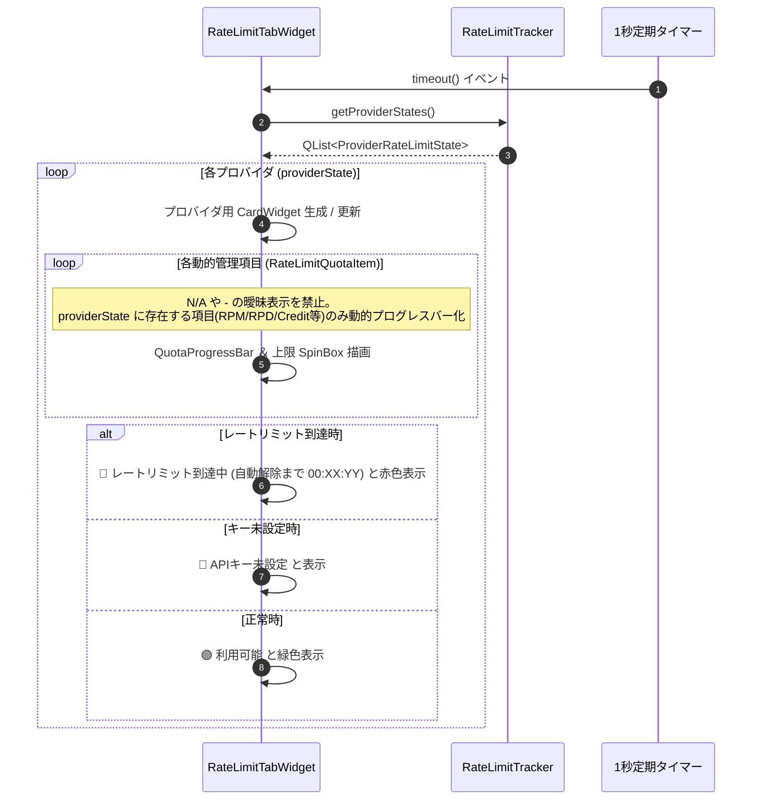

# 詳細設計書 - UI ＆ 表示・設定・アバターモジュール (DetailedDesign/UI.md)

## 1. 概要
本ドキュメントは、AI Assistant Avatar におけるメインアバターウィンドウ (`AvatarWindow`)、会話履歴ビューア (`HistoryViewerDialog`)、レートリミット管理専用タブ (`RateLimitTabWidget`)、画像の透過処理 (Flood Fill)、および出自検証・コピーライト動的スキャン (`TrustChain`) の詳細設計を定義する。

---

## 2. メインアバターウィンドウ (`AvatarWindow`)

### 2.1 ウィンドウ透過 ＆ ドラッグ操作
- `Qt::FramelessWindowHint` および `Qt::WindowStaysOnTopHint` フラグによる枠なし・最前面化。
- マウスドラッグ移動、右クリックコンテキストメニューによる設定画面起動。

### 2.2 透過アルゴリズム (Flood Fill 透過処理)
- アバター画像の背景特定色をシード値として Flood Fill アルゴリズムを実行し、Alpha 値を 0 に置換して完全透過化。

---

## 3. 会話履歴ビューア (`HistoryViewerDialog` - F-30)

### 3.1 左右 2 ペイン分割レイアウト
- **左側ペイン**: セッション履歴一覧リスト (`QListWidget`)。
- **右側ペイン**: 吹き出し風装飾スタイルの会話ログ表示エリア (`QTextBrowser`)。

---

## 4. レートリミット管理専用タブ (`RateLimitTabWidget` - F-16-10)

### 4.1 概要・基本仕様
- 設定画面に新設される専用タブ。ユーザーがクリック操作を行わなくても全プロバイダの状態が一目で監視できる「ノー・クリック（操作不要）」可変カードリスト形式。
- C++ コード側でプロバイダごとの項目を固定ハードコードせず、API I/F や仕様に応じて提供されている管理項目 (`RateLimitQuotaItem`) のみを動的に生成描画。
- ユーザーの混乱や不信感を防止するため、仕様上存在しない項目への `N/A` や `-` 等の曖昧表示を完全全廃。
- 開発・テスト用のダミープロバイダ (`dummy`) は監視対象から完全に除外・フィルタリング。

### 4.2 動的カード描画 ＆ ステータス更新フロー


---

## 6. アバター共通・基本設定および設定UIロード・保存仕様 (`AvatarWindow`)

### 6.1 基本設定UIレイアウト (`initSettingsTab`)
- **グループボックス構造**: 「アバター共通・基本設定」 (`QGroupBox`) 内に、アバター名 (`m_avatarNameEdit`)、アバタースキン選択/構築 (`m_comboAvatarSkin`, `m_btnSkinBuilder`)、および名前反応チェックボックス (`m_nameReactionCheckbox`) のみを集約配置する。
- **ウェイクワードUIの完全削除**:
  - 設定画面UI上の `m_twitchWakeWordEdit` (QLineEdit) および `m_twitchWakeWordModeCombo` (QComboBox) を完全廃止・除去する。

### 6.2 ロード ＆ 保存仕様 (`loadSettingsToUI` / `saveSettingsFromUI`)
- **`loadSettingsToUI`**:
  - `local_settings.json` の `twitch_wakeword` は `TwitchReader` やバックエンド層で直接参照・ロードし、UIフォームへの描画は行わない。
- **`saveSettingsFromUI`**:
  - UI上のコントロールが存在しないため、保存処理において `local_settings.json` の `twitch_wakeword` を空文字で上書き破壊せず、既存の設定ファイル値をそのまま維持保持する。

### 6.3 ウェイクワード判定ハードコーディング仕様
- コメント受信時のウェイクワードマッチング（`TwitchReader::processChatMessage`）における判定モード選択を廃止し、プログラム内ハードコーディングルールに従って判定処理を実行する。

---


## 6. AI設定タブ UI 詳細構造 (`AvatarWindow::initAiSettingsTab`)

### 6.1 Worker AI 設定グループのインライン行レイアウト ＆ 左端位置アラインメント構造
`QFormLayout` のフォームラベルとフィールド領域を活用し、1行目の `[レ] 有効` チェックボックスの左端位置と、2行目の `モデル:` コンボボックスの左端位置がピッタリ縦位置合わせ（アラインメント統一）されるようレイアウトを構築する。

#### ワーカーAIプロバイダ項目レイアウト仕様
| プロバイダ | QFormLayout ラベル | 右側フィールド (`QFormLayout` 領域) の構成 |
| :--- | :--- | :--- |
| **Mistral AI** | `Mistral AI:` | 1行目: `[レ] 有効` (CheckBox) ＋ `[●●●●●●●● (APIキー)]` (LineEdit) |
| **Cerebras AI** | `Cerebras AI:`<br>`モデル:` | 1行目: `[レ] 有効` (CheckBox) ＋ `[●●●●●●●● (APIキー)]`<br>2行目: `[ llama3.1-8b (推奨) ▼ ]` (ComboBox - 左端位置を有効CBと統一) |
| **Groq** | `Groq AI:`<br>`モデル:` | 1行目: `[レ] 有効` (CheckBox) ＋ `[●●●●●●●● (APIキー)]`<br>2行目: `[ llama-3.3-70b-versatile (推奨) ▼ ]` (ComboBox - 左端位置を有効CBと統一) |
| **HuggingFace** | `HuggingFace:`<br>`モデル:` | 1行目: `[レ] 有効` (CheckBox) ＋ `[●●●●●●●● (APIキー)]`<br>2行目: `[ meta-llama/Llama-3.1-8B-Instruct ▼ ]` (ComboBox - 左端位置を有効CBと統一) |
| **OpenRouter** | `OpenRouter:`<br>`モデル:` | 1行目: `[レ] 有効` (CheckBox) ＋ `[●●●●●●●● (APIキー)]`<br>2行目: `[ google/gemma-4-31b-it:free ▼ ]` (ComboBox - 左端位置を有効CBと統一) |
| **さくらAI** | `さくらAI:`<br>`モデル:` | 1行目: `[レ] 有効` (CheckBox) ＋ `[●●●●●●●● (APIキー全幅)]`<br>2行目: `[ llm-jp-3.1-8x13b-instruct4 ▼ ]` (左端を有効CB位置と整列) |
| **Tavily (検索補助)** | `Tavily キー (任意):` | `[●●●●●●●● (APIキー入力欄)]` (変更なし・単独行配置) |

### 6.2 データ駆動構造体 (`ProviderConfigSpec`) および全自動処理仕様

#### 6.2.1 構造体定義 (`ProviderConfigSpec`)
```cpp
struct ProviderConfigSpec {
    QString id;                 // プロバイダ識別ID ("mistral", "cerebras", "groq" 等)
    QString displayName;        // 表示ラベル ("Mistral AI", "Cerebras AI" 等)
    QString keyPlaceholder;     // APIキー入力欄プレースホルダー
    bool hasModelCombo = false; // モデル選択コンボボックスの有無
    QStringList defaultModels;  // デフォルト候補モデル一覧
    bool isModelEditable = false; // モデル名の自由編集可能フラグ

    // 動的生成UI参照インスタンスポインタ
    QCheckBox *checkbox = nullptr;
    QLineEdit *keyEdit = nullptr;
    QComboBox *modelCombo = nullptr;
};
```

#### 6.2.2 全自動ループ処理 ＆ モデル自動選択アルゴリズム
1. **全自動 UI 生成・アラインメント整列ループ**:
   - `QList<ProviderConfigSpec>` を `for` ループで走査し、`QHBoxLayout` による「`[レ] 有効` ＋ `APIキー入力欄`」の生成および 2行目の「`モデル:` コンボボックス」のアラインメント位置あわせ配置を全自動実行。
   - モデル選択コンボボックスの先頭インデックス（index 0）に「`自動選択 (推奨)`」を全プロバイダ共通で追加。
2. **全自動モデル選定 (Auto Model Selection) ロジック**:
   - コンボボックスが「`自動選択 (推奨)`」に設定されている、または空文字の場合、各 AI クライアント（Groq, Cerebras, OpenRouter, HuggingFace, Sakura 等）はクライアント側で規定されている最新・推奨推論モデルを自動選択して推論を実行。
3. **全自動排他制御シグナル接続ループ**:
   - チェックボックス `toggled(bool)` シグナル接続時に、他プロバイダの `checkbox->setChecked(false)` を自動実行。
4. **全自動 JSON 設定ロード ＆ セーブ**:
   - `loadSettingsToUI()` / `saveSettings()` において、`id` に基づく API キー・モデル名・有効フラグの読込／保存を単一ループで全自動実行。
