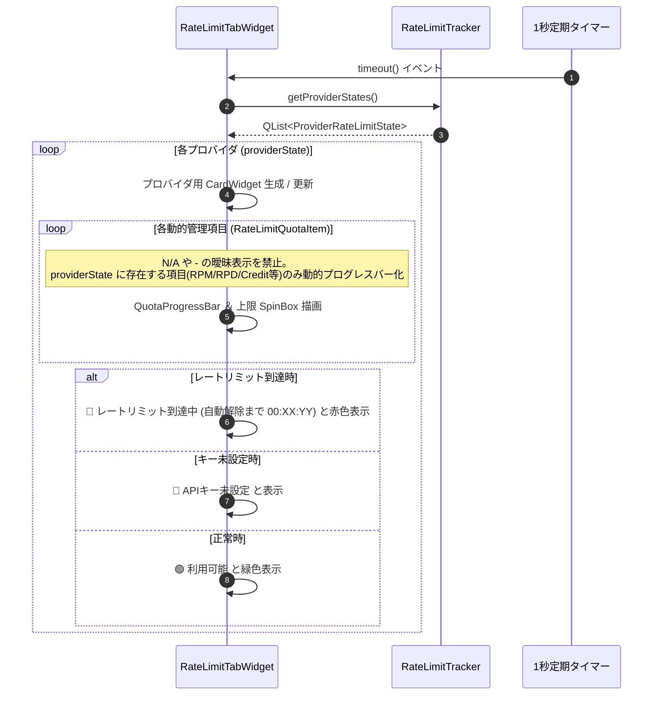

# 詳細設計書 - UI ＆ 表示・設定・アバターモジュール (DetailedDesign/UI.md)

## 1. 概要
本ドキュメントは、AI Assistant Avatar におけるメインアバターウィンドウ (`AvatarWindow`)、会話履歴ビューア (`HistoryViewerDialog`)、レートリミット管理専用タブ (`RateLimitTabWidget`)、画像の透過処理 (Flood Fill)、および出自検証・コピーライト動的スキャン (`TrustChain`) の詳細設計を定義する。

---

## 2. メインアバターウィンドウ (`AvatarWindow`)

### 2.1 ウィンドウ透過 ＆ ドラッグ操作
- `Qt::FramelessWindowHint` および `Qt::WindowStaysOnTopHint` フラグによる枠なし・最前面化。
- マウスドラッグ移動、右クリックコンテキストメニューによる設定画面起動。

### 2.2 透過アルゴリズム (Flood Fill 透過処理)
- アバター画像の背景特定色をシード値として Flood Fill アルゴリズムを実行し、Alpha 値を 0 に置換して完全透過化。

---

## 3. 会話履歴ビューア (`HistoryViewerDialog` - F-30)

### 3.1 左右 2 ペイン分割レイアウト
- **左側ペイン**: セッション履歴一覧リスト (`QListWidget`)。
- **右側ペイン**: 吹き出し風装飾スタイルの会話ログ表示エリア (`QTextBrowser`)。

---

## 4. レートリミット管理専用タブ (`RateLimitTabWidget` - F-16-10)

### 4.1 概要・基本仕様
- 設定画面に新設される専用タブ。ユーザーがクリック操作を行わなくても全プロバイダの状態が一目で監視できる「ノー・クリック（操作不要）」可変カードリスト形式。
- C++ コード側でプロバイダごとの項目を固定ハードコードせず、API I/F や仕様に応じて提供されている管理項目 (`RateLimitQuotaItem`) のみを動的に生成描画。
- ユーザーの混乱や不信感を防止するため、仕様上存在しない項目への `N/A` や `-` 等の曖昧表示を完全全廃。
- 開発・テスト用のダミープロバイダ (`dummy`) は監視対象から完全に除外・フィルタリング。

### 4.2 動的カード描画 ＆ ステータス更新フロー


---

## 6. アバター共通 ＆ OBS設定のUI非表示化詳細仕様 (`AvatarWindow`)

### 6.1 基本設定 ＆ OBS UIレイアウト (`initSettingsTab`)
- **アバター共通・基本設定**:
  - グループボックス内にアバター名 (`m_avatarNameEdit`)、アバタースキン選択/構築 (`m_comboAvatarSkin`, `m_btnSkinBuilder`) のみを配置。
  - 名前反応 (`m_nameReactionCheckbox`)、ウェイクワード (`m_twitchWakeWordEdit`)、判定モード (`m_twitchWakeWordModeCombo`) の画面UIコントロールを完全削除。
- **OBS / 描画設定**:
  - WebSocketポート (`m_wsPortEdit`) および HTTP配信ポート (`m_obsHttpPortEdit`) の画面UIコントロールを完全削除。

### 6.2 ロード ＆ 保存仕様 (`loadSettingsToUI` / `saveSettingsFromUI`)
- **`loadSettingsToUI`**:
  - UI非表示項目 (`name_reaction_enabled`, `ws_port`, `obs_http_port`, `twitch_wakeword`, `twitch_wakeword_mode`) のUIコントロールへの描画・ロードをスキップし、バックエンド層で設定ファイルを直接読み込み。
- **`saveSettingsFromUI`**:
  - UIフォームからの値取得で既存設定ファイルを空文字・デフォルト値に上書き破壊せず、既存 JSON オブジェクトに保持されている値をそのまま保護維持して保存。

---

## 7. Discord 複数チャンネル動的レイアウト構築詳細仕様 (`rebuildDiscordLayout`)

### 7.1 動的追加・削除制御 (`rebuildDiscordLayout` / シグナル接続)
- **`m_discordChannelsLayout` 清掃と再構築**:
  - `channelCount` またはリスト要素数に応じて、`m_discordChannelSettings` 構造体リスト（`QLineEdit* channelIdEdit`, `QCheckBox* greetingCheckbox`, `QPushButton* removeBtn`）を動的にアロケート。
  - 各行に「接続チャンネル X」ラベル、QLineEdit、起動時挨拶 QCheckBox、`[-]` ボタンを水平レイアウト (QHBoxLayout) で配置。
- **`[+ チャンネル追加]` ボタン**:
  - 押下時に `m_discordChannelSettings` に要素を追加し、`rebuildDiscordLayout` を再呼出。
- **`[-]` ボタン**:
  - 押下時に該当行の要素を削除し、再レイアウト（1件以下の場合は削除を無効化・非活性化）。

### 7.2 JSON 配列相互変換 (`saveSettingsFromUI` / `loadSettingsToUI`)
- `loadSettingsToUI`: `local_settings.json` の `"discord_channels"` 配列を読み込み、配列長に応じて `rebuildDiscordLayout` を起動して画面展開。
- `saveSettingsFromUI`: 画面上の各行の入力値を取得し、`"discord_channels": [ {"channel_id": "...", "greeting_enabled": true}, ... ]` の JSON 配列として保存。

---


## 6. AI設定タブ UI 詳細構造 (`AvatarWindow::initAiSettingsTab`)

### 6.1 Worker AI 設定グループのインライン行レイアウト ＆ 左端位置アラインメント構造
`QFormLayout` のフォームラベルとフィールド領域を活用し、1行目の `[レ] 有効` チェックボックスの左端位置と、2行目の `モデル:` コンボボックスの左端位置がピッタリ縦位置合わせ（アラインメント統一）されるようレイアウトを構築する。

#### ワーカーAIプロバイダ項目レイアウト仕様
| プロバイダ | QFormLayout ラベル | 右側フィールド (`QFormLayout` 領域) の構成 |
| :--- | :--- | :--- |
| **Mistral AI** | `Mistral AI:` | 1行目: `[レ] 有効` (CheckBox) ＋ `[●●●●●●●● (APIキー)]` (LineEdit) |
| **Cerebras AI** | `Cerebras AI:`<br>`モデル:` | 1行目: `[レ] 有効` (CheckBox) ＋ `[●●●●●●●● (APIキー)]`<br>2行目: `[ llama3.1-8b (推奨) ▼ ]` (ComboBox - 左端位置を有効CBと統一) |
| **Groq** | `Groq AI:`<br>`モデル:` | 1行目: `[レ] 有効` (CheckBox) ＋ `[●●●●●●●● (APIキー)]`<br>2行目: `[ llama-3.3-70b-versatile (推奨) ▼ ]` (ComboBox - 左端位置を有効CBと統一) |
| **HuggingFace** | `HuggingFace:`<br>`モデル:` | 1行目: `[レ] 有効` (CheckBox) ＋ `[●●●●●●●● (APIキー)]`<br>2行目: `[ meta-llama/Llama-3.1-8B-Instruct ▼ ]` (ComboBox - 左端位置を有効CBと統一) |
| **OpenRouter** | `OpenRouter:`<br>`モデル:` | 1行目: `[レ] 有効` (CheckBox) ＋ `[●●●●●●●● (APIキー)]`<br>2行目: `[ google/gemma-4-31b-it:free ▼ ]` (ComboBox - 左端位置を有効CBと統一) |
| **さくらAI** | `さくらAI:`<br>`モデル:` | 1行目: `[レ] 有効` (CheckBox) ＋ `[●●●●●●●● (APIキー全幅)]`<br>2行目: `[ llm-jp-3.1-8x13b-instruct4 ▼ ]` (左端を有効CB位置と整列) |
| **Tavily (検索補助)** | `Tavily キー (任意):` | `[●●●●●●●● (APIキー入力欄)]` (変更なし・単独行配置) |

### 6.2 データ駆動構造体 (`ProviderConfigSpec`) および全自動処理仕様

#### 6.2.1 構造体定義 (`ProviderConfigSpec`)
```cpp
struct ProviderConfigSpec {
    QString id;                 // プロバイダ識別ID ("mistral", "cerebras", "groq" 等)
    QString displayName;        // 表示ラベル ("Mistral AI", "Cerebras AI" 等)
    QString keyPlaceholder;     // APIキー入力欄プレースホルダー
    bool hasModelCombo = false; // モデル選択コンボボックスの有無
    QStringList defaultModels;  // デフォルト候補モデル一覧
    bool isModelEditable = false; // モデル名の自由編集可能フラグ

    // 動的生成UI参照インスタンスポインタ
    QCheckBox *checkbox = nullptr;
    QLineEdit *keyEdit = nullptr;
    QComboBox *modelCombo = nullptr;
};
```

#### 6.2.2 全自動ループ処理 ＆ モデル自動選択アルゴリズム
1. **全自動 UI 生成・アラインメント整列ループ**:
   - `QList<ProviderConfigSpec>` を `for` ループで走査し、`QHBoxLayout` による「`[レ] 有効` ＋ `APIキー入力欄`」の生成および 2行目の「`モデル:` コンボボックス」のアラインメント位置あわせ配置を全自動実行。
   - モデル選択コンボボックスの先頭インデックス（index 0）に「`自動選択 (推奨)`」を全プロバイダ共通で追加。
2. **全自動モデル選定 (Auto Model Selection) ロジック**:
   - コンボボックスが「`自動選択 (推奨)`」に設定されている、または空文字の場合、各 AI クライアント（Groq, Cerebras, OpenRouter, HuggingFace, Sakura 等）はクライアント側で規定されている最新・推奨推論モデルを自動選択して推論を実行。

---

## 8. 音声入力 (STT) PTT ＆ 共有マイクアクセス詳細設計 (F-2)

### 8.1 「音声」ボタンの PTT 状態・イベント発火設計 (`AvatarWindow`)
- **ボタンイベント割り当て**:
  - `m_sttButton` の `pressed` シグナル ➔ `onSttPressed()`
  - `m_sttButton` の `released` シグナル ➔ `onSttReleased()`
- **UI 表示 ＆ スタイル制御**:
  - 押下時 (`onSttPressed`): ボタンテキストを `🎤 録音中...` に変更し、背景色 `#e74c3c` (赤色) のスタイルシートを適用し、`startSTTRequested()` シグナルを発火。
  - 解放時 (`onSttReleased`): ボタンテキストを `音声` に戻し、標準スタイルシートへ復元し、`stopSTTRequested()` シグナルを発火。

### 8.2 共有マイクアクセス ＆ 音声認識ルーティング設計 (`CoreModule` / `STTManager`)
- **`SAPIEngine` 共有キャプチャ制御**:
  - `CLSID_SpSharedRecognizer` を使用して認識エンジンを初期化し、WASAPI 共有モードでマイク入力をキャプチャ。他の音声アプリ（OBS, Discord 等）のマイク占有・遮断を回避する。
- **音声認識完了イベント (`VoiceInputCompleted`) の自動AI連動回路**:
  - `CoreModule::on_notify_events` で `EventType::VoiceInputCompleted` イベントを受信した際、イベントのテキスト内容 (`event.text`) を確認し、空でない場合即座に `requestAIExecution(event.text, "Streamer (Voice)")` シグナルを発火して AI 応答フローに自動直結する。
- **サブPC（別マシン）動作 ＆ HTTP/WebSocket STT 注入**:
  - ローカル HTTP サーバー (`HttpServer`) に `POST /stt` エンドポイントを実装し、JSON パラメータ `{"text": "音声認識テキスト"}` を受け取った場合も、同一の `VoiceInputCompleted` イベントを生成して `CoreModule` 経由で AI にリクエストを配信する。

### 8.3 ブラウザ用 WebSTT 音声認識 ＆ ウェイクワード常時監視 Web 画面詳細設計
- **HTML 返却ロジック (`ObsHttpServer::handleRequest`)**:
  - `GET /stt` リクエスト時、クエリパラメータ `?text=...` が含まれない場合は「マイク音声認識 ＆ ウェイクワード常時監視 Web ページ (HTML)」を Content-Type: `text/html; charset=utf-8` で返答する。
- **ブラウザ側 JavaScript 仕様 (Web Speech API)**:
  1. `window.SpeechRecognition || window.webkitSpeechRecognition` を初期化し、`continuous = true`, `interimResults = true` で常時マイク認識ループを稼働する。
  2. マイクから取得されたテキストにウェイクワード（アバター名等）が含まれるか、あるいは発話が確定したタイミングで `fetch('/stt_input?text=' + encodeURIComponent(finalText))` を非同期呼出する。
  3. アプリケーション側で `sttTextReceived` シグナルを発火し、`CoreModule` 経由で AI アバターが会話・応答を起動する。


3. **全自動排他制御シグナル接続ループ**:
   - チェックボックス `toggled(bool)` シグナル接続時に、他プロバイダの `checkbox->setChecked(false)` を自動実行。
4. **全自動 JSON 設定ロード ＆ セーブ**:
   - `loadSettingsToUI()` / `saveSettings()` において、`id` に基づく API キー・モデル名・有効フラグの読込／保存を単一ループで全自動実行。

---

## 9. レートリミットタブ 3 段階直感モニタリング詳細設計 (`RateLimitTabWidget`)

### 9.1 3 段階ステータス・色分け判定 (`updateProviderCard`)
`RateLimitTabWidget::updateProviderCard` において、`status.available` および `status.rpmRemaining` / `status.rpmMax` の比率から以下の 3 段階で画面描画を行う：
1. **🟢 利用可能 [これはいっぱい使える！]**:
   - 条件: `status.available == true` かつ 残り枠比率 `rpmRemaining / rpmMax >= 0.3` (または `-1` 無制限)
   - ラベルテキスト: `🟢 利用可能`
   - プログレスバー色: **緑色 (`#43a047`)**
2. **🟡 もうすぐ上限 [もうすぐ使えなくなるよ！]**:
   - 条件: `status.available == true` かつ 残り枠比率 `rpmRemaining / rpmMax < 0.3` (残り枠 30% 未満)
   - ラベルテキスト: `🟡 もうすぐ上限 (残り %1 回)`.arg(rpmRemaining)
   - プログレスバー色: **オレンジ色/黄色 (`#fb8c00`)**
3. **🔴 レートリミット到達中 [今使えないよ！]**:
   - 条件: `status.available == false` または `rpmRemaining <= 0`
   - ラベルテキスト: `🔴 レートリミット到達中 (解除まで あと %1分%2秒)`
   - プログレスバー色: **赤色 (`#e53935`)**

### 9.2 プロバイダ上限値の自動修復・最低安全ガード
`AIClientManager` 設定読み込み時および `RateLimitTracker::setMaxValues` 内で、Mistral 等の `rpmMax` が `1` などの不正値に汚染されている場合、規定値（Mistral: 30, Groq: 30, Cerebras: 30, HuggingFace: 60, OpenRouter: 60, Sakura: 60）を下回る値を自動的にクレンジング・最低値ガードする。

