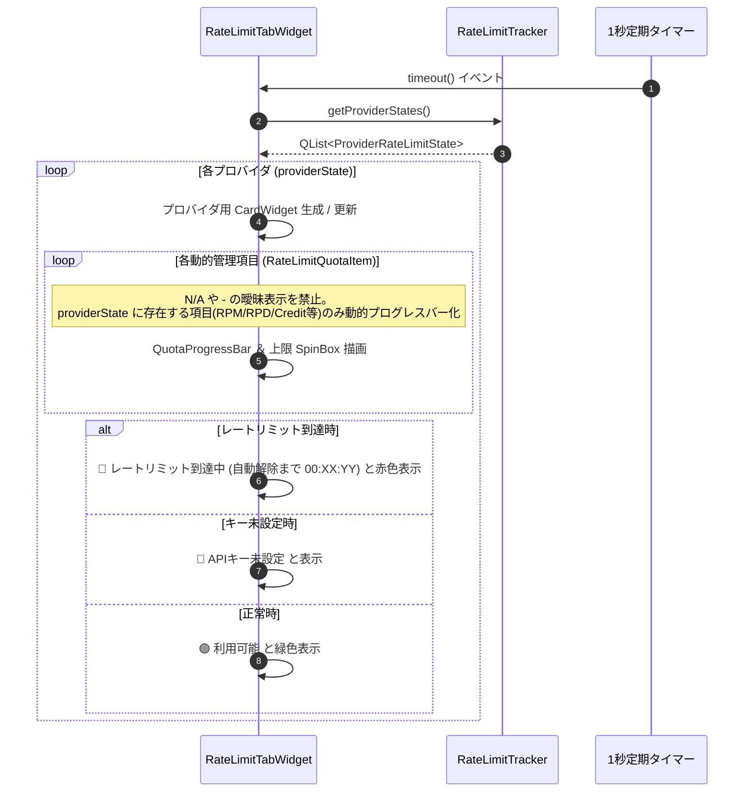

# 詳細設計書 - UI ＆ 表示・設定・アバターモジュール (DetailedDesign/UI.md)

## 1. 概要
本ドキュメントは、AI Assistant Avatar におけるメインアバターウィンドウ (`AvatarWindow`)、会話履歴ビューア (`HistoryViewerDialog`)、レートリミット管理専用タブ (`RateLimitTabWidget`)、画像の透過処理 (Flood Fill)、および出自検証・コピーライト動的スキャン (`TrustChain`) の詳細設計を定義する。

---

## 2. メインアバターウィンドウ (`AvatarWindow`)

### 2.1 ウィンドウ透過 ＆ ドラッグ操作
- `Qt::FramelessWindowHint` および `Qt::WindowStaysOnTopHint` フラグによる枠なし・最前面化。
- マウスドラッグ移動、右クリックコンテキストメニューによる設定画面起動。

### 2.2 透過アルゴリズム (Flood Fill 透過処理)
- アバター画像の背景特定色をシード値として Flood Fill アルゴリズムを実行し、Alpha 値を 0 に置換して完全透過化。

---

## 3. 会話履歴ビューア (`HistoryViewerDialog` - F-30)

### 3.1 左右 2 ペイン分割レイアウト
- **左側ペイン**: セッション履歴一覧リスト (`QListWidget`)。
- **右側ペイン**: 吹き出し風装飾スタイルの会話ログ表示エリア (`QTextBrowser`)。

---

## 4. レートリミット管理専用タブ (`RateLimitTabWidget` - F-16-10)

### 4.1 概要・基本仕様
- 設定画面に新設される専用タブ。ユーザーがクリック操作を行わなくても全プロバイダの状態が一目で監視できる「ノー・クリック（操作不要）」可変カードリスト形式。
- C++ コード側でプロバイダごとの項目を固定ハードコードせず、API I/F や仕様に応じて提供されている管理項目 (`RateLimitQuotaItem`) のみを動的に生成描画。
- ユーザーの混乱や不信感を防止するため、仕様上存在しない項目への `N/A` や `-` 等の曖昧表示を完全全廃。

### 4.2 動的カード描画 ＆ ステータス更新フロー

---

## 5. 出自検証 ＆ コピーライト動的スキャン (`TrustChain`)

### 5.1 スキャンアルゴリズム (`extractCopyrightFromFile`)
- 実行ファイルのバイナリ内から正規認証シグネチャおよび著作権表記 (`TRUSTCHAIN_CREATOR_NAME`) を動的にスキャン・抽出・検証。
