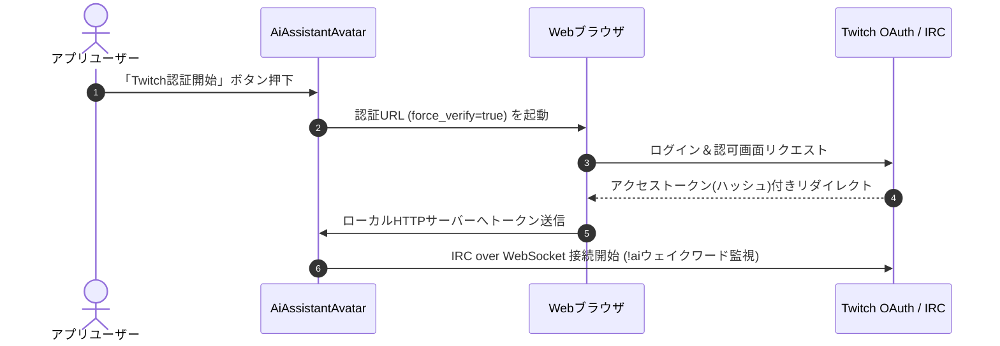
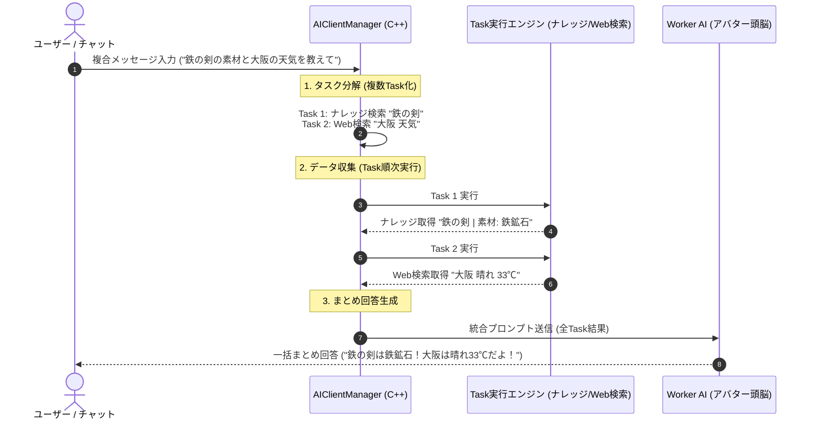

# 要件定義書 - AI Assistant Avatar

## 1. システム概要
本システムは、外部AI APIと連携し、Twitchのチャットコメントやマイクからの音声入力を処理して、アバター（伺か風のデスクトップマスコット）が応答するC++アプリケーションである。

## 2. 機能要件
### F-1: Twitchコメント取得・連携機能 (Implicit Flow)
- OAuthインプリシットフロー (Implicit Flow) を用いてTwitchチャット（IRC over WebSocket）に接続する。
  - 認証に必要な「クライアントID」は設定画面から入力・保存可能とする（クライアントシークレットは不要）。
  - 初回認証時または再認証時には、認証URLに `force_verify=true` パラメータを付与してWebブラウザでTwitchの認可画面を開き、アカウント切り替えやログインの確認を毎回確実に行えるようにする。
  - ローカルに一時的に構築するリダイレクト待ち受け用HTTPサーバー（ポート番号は設定可能）で、ブラウザからリダイレクトされるURLハッシュ（フラグメント）からアクセストークンをJavaScript経由で受信し、ローカル設定に保存する。
  - トークンの有効期限が切れた場合、または認証エラーが発生した場合は、自動更新は行わず、ユーザーが手動で設定画面の「Twitch認証開始」ボタンを押し、再認可を行うことでチャット監視を再開可能とする。
- 特定の文言（アバターの名前や特定のコマンドなど）を検知したコメントのみをAIの入力対象（処理トリガー）とする。
  - トリガーとなる文言（ウェイクワード）は設定ファイル（`local_settings.json`）にて設定・変更可能とし、判定動作はプログラム内ハードコーディング仕様とする（UIからの編集項目は削除）。
  - **接続時挨拶**: Twitchへの初回接続時およびチャンネル変更接続時に自動挨拶を行う機能を個別にON/OFF可能とする（`twitch_greeting_enabled`）。
- **AI応答コメント送信の500文字自動分割 ＆ スローモード（レート制限）遅延キュー送出要件**:
  - Twitch チャットへ AI 応答コメントを自動送信する際、テキスト長が 500 文字（Unicode文字数）を超える場合は、句読点（`。` `！` `？`）または改行コードを優先境界として 500 文字以内のブロックに自動分割する。
  - チャットがスローモード（slow mode）に設定されている場合や連続送信エラーを防止するため、分割された各メッセージは設定された送出インターバルタイマー（送信遅延キュー）を挟んで安全に順次送信する。

### F-2: 音声入力（STT）機能
- **マイク共有非独占仕様（WASAPI Shared Mode / SAPI SpSharedRecognizer）**:
  - OBS や Discord 等の配信・通話ソフトのマイク使用を一切独占・阻害しない共有モードアクセス方式を採用する。
- **2種類の音声認識モードのサポート**:
  - **モード①（ウェイクワード起動 ＆ 会話状態遷移モード）**: 
    - マイクを常時監視待機し、待機状態（Idle）ではアバター名（例: ぶるたろう）またはウェイクワードが検出されない発言（例: 雑談や独り言）を自動的に無視・破棄する。
    - 音声認識エンジン（Google WebSTT, SAPI, Whisper等）がアバター名「ぶるたろう」（頭文字: ぶ/bu）に対して「ブルタロー」（頭文字: ブ/bu）や「プルタロー」（頭文字: プ/pu）、「ブル太郎」「プル太郎」「ブルタロウ」等の漢字・カタカナ・清濁音・長音表記（ロー ↔ ロウ）で認識結果を出力した場合でも、ひらがな・カタカナ・濁音/半濁音・長音表記・代表的漢字表記のゆらぎを自動吸収・正規化してウェイクワードとして正しく判定する。
- **STT日本語音素類似 ＆ 誤認識吸収正規化処理 (`STTTextNormalizer`)**:
  - ウェイクワード判定のみならず、音声認識テキスト全般において発話しやすさ・マイク特性等に起因する音素類似パターン（四つ仮名 `ぢ`➔`じ`/`づ`➔`ず`、音素類似 `し/ち`, `す/つ`, `ら行` の揺れ、長音・母音融合 `お/う`, `ん` の後続音変化）を段階的に正規化・補正する処理エンジンを提供する。
  - アバター名の表記ゆれエイリアス辞書（別名登録）および音素編集距離（レーベンシュタイン距離）による曖昧照合（Fuzzy Matching）をサポートし、誤認識が発生した場合でも意図した発言内容・ウェイクワードとして柔軟にマッチング・判定可能とする。
    - アバター名またはウェイクワードが検出された場合、アバター名を除去したテキストを AI へ自動送信して会話を開始し、「会話アクティブ状態（Active）」へ遷移する。
    - 会話アクティブ状態ではアバター名を省略して連続会話を可能とし、最後の発言から設定された無音タイムアウト時間（`voice_silence_timeout_ms`、初期値: 1000ms）が経過すると、自動的に「ウェイクワード待機状態（Idle）」へ復帰する。
  - **モード②（プッシュ・トゥー・トーク [PTT] 方式）**: UIの「音声」ボタンを押している間だけマイク録音（`🎤 録音中...`）を行い、ボタンを離した瞬間にアバター名の有無にかかわらず認識結果テキストを AI アシスタントへダイレクト送信する。
- **設定ファイル永続化 ＆ 自動補完仕様**:
  - 無音タイムアウト時間を設定ファイル（`Config/local_settings.json`）の `"voice_silence_timeout_ms"` キー（初期値 `1000`）として保存・管理し、設定ファイルに該当項目が存在しない場合は、コメント付きで自動補完（自動追加）する。
  - 音声入力時の待機状態（Idle）トリガー対象を個別に有効化・無効化する設定項目を提供する：
    - `"voice_name_reaction_enabled"`: アバター名に反応するかどうか（bool、初期値: `true`）
    - `"voice_wakeword_enabled"`: ウェイクワードに反応するかどうか（bool、初期値: `true`）
    - `"voice_wakeword"`: 音声入力用ウェイクワード（string、初期値: `"AIアシスタント"`。省略時は `twitch_wakeword` を流用）
  - 設定ファイルに該当項目が存在しない場合、起動時に説明コメント付きで自動補完（自動追記保存）する。
  - これにより、「アバター名のみ」「ウェイクワードのみ」「両方（どちらでも反応）」「両方無効（PTTボタン押し時のみ）」を用途に応じて柔軟に切り替え可能とする。
- **音声認識完了時の AI 自動応答連携回路**:
  - 音声認識完了イベント (`VoiceInputCompleted`) 受信時、認識テキストを `CoreModule` 経由で即座に AI 問いかけ処理 (`requestAIExecution`) へルーティングし、AI 返答の生成、吹き出し表示、OBS 連携、読み上げを一貫実行する。
- **別マシン（サブPC）動作およびネットワーク STT 注入サポート**:
  - アバターを配信PCとは別のサブPCで動かすスタンドアロン動作に対応し、ローカルマイク入力デバイスの選択を可能とする。
  - ローカル HTTP (`http://<IP>:58082/stt`) および WebSocket API 経由で外部からの音声認識テキスト注入を受け入れる。
- **音声認識エンジンの拡張構成**:
  - 標準エンジンとして「Windows標準SAPI (Speech API)」を採用し、設定により「whisper.cpp」や外部クラウドSTTへの切り替えを可能とする。

### F-32: ウェイクワード共通判定エンジン ＆ 動的応答ルーティング仕様 (`WakewordMatcher` / `ReplyTarget`)
- **ウェイクワード判定処理のモジュール共通化 (`WakewordMatcher`)**:
  - 音声入力 (STT)、Twitchチャット、Discordメッセージ、UI直接入力等のすべての入力ソースに対し、統一されたアルゴリズムでウェイクワード照合・アバター名除去・日本語表記ゆれ補正（ひらがな/カタカナ変換、清濁音統一、長音同音化 `ロー` ↔ `ロウ`、四つ仮名 `ぢ`➔`じ`/`づ`➔`ず`、エイリアス辞書、音素編集距離曖昧照合）を実行する共通クラス `WakewordMatcher` を定義する。
- **イベント送受信メタデータ (`ReplyTarget`) による動的応答ルーティング**:
  - 入力イベント (`AppEvent`) ごとに応答の出力先を示すターゲットフラグ (`replyTarget` / `extraData["reply_target"]`) を標準化する。
  - 出力先ターゲット（`UI`: 本体アプリ, `WebText`: `/ui_text`, `OBSOverlay`: `avatar_obs.html`, `TwitchChat`: Twitchコメント, `DiscordChat`: Discordメッセージ, `TTSVoice`: 音声読み上げ）をビットフラグとして合成・保持可能とし、送信元や将来的な機能追加に応じて出力先を動的に拡張・変更できる柔軟なルーティング構造を提供する。

### F-33: 棒読みちゃん (Bouyomi-chan) 独立モジュール HTTP 読み上げ連携仕様 (`BouyomiChanClient`)
- **独立モジュール化 (`BouyomiChanClient`)**:
  - 棒読みちゃん（Bouyomi-chan）へのアクセス処理を独立した専用モジュール `BouyomiChanClient`（`src/tts/bouyomichan_client.h` / `.cpp`）として切り出し、他モジュールから完全分離する。
- **設定ファイル管理 ＆ 自動補完仕様**:
  - 棒読みちゃんアクセス用 URL および有効化フラグを設定ファイル (`Config/local_settings.json`) の `"bouyomichan_enabled"` (初期値: `false`) および `"bouyomichan_url"` (初期値: `"http://localhost:50080/talk"`) キーとして保存・管理する。
  - 設定ファイルにキーが存在しない場合、アプリケーション起動時に日本語説明コメント付きで該当キーを自動補完（自動追記保存）する。同PC上の固定パス運用だけでなく、別PCへの展開時にも IP アドレスを書き換えるだけで対応可能とする。
- **音声応答イベント連動 ＆ 非同期 HTTP 送信**:
  - AI 応答イベント (`AIResponseReceived`) 受信時、応答ターゲットに `ReplyTarget::TTSVoice`（または音声入力・UI入力からの応答）が含まれる場合、回答本文テキストを URL エンコード処理（`QUrl::toPercentEncoding`）し、指定された Bouyomi-chan URL へ非同期 HTTP GET リクエストを送信して音声読み上げを実行する。

### F-3: 外部AI API連携機能
- 取得したテキストデータを外部AI APIに送信する。
  - 対応プロバイダ: Mistral AI、Cerebras AI、Groq、HuggingFace、OpenRouter、さくらAI (Sakura AI) をサポートする。
- AIから応答テキストを受信する。
- **ユーザー明示的選択プロバイダの独立通信・サイレントフォールバック禁止**:
  - ユーザーがUIの設定画面から明示的に特定プロバイダ（HuggingFace, OpenRouter, Sakura AI, Mistral, Cerebras, Groq等）を選択・指定している場合、エラー発生時にユーザーに無断で他のプロバイダへ裏で自動切り替え（サイレントフォールバック）を行ってはならない。
  - 選択されたプロバイダ自身で通信・応答を受信し、エラーが発生した場合は該当プロバイダのエラー文面・コードをそのまま正確に通知・表示しなければならない。
- **レートリミット自動枠復帰 ＆ UI表示トリガー要求・ルーター側イベント駆動ステータス評価制御**:
  - レートリミット制限の解除予定時刻（`nextResetAt`）はすべて UTC（協定世界時）に統一して管理・計算し、ローカル時刻とのタイムゾーン不一致によるカウントダウン停止・誤表示を防ぐ。
  - タイマーによる連続監視は行わず、マネージャー・ルーター（`AIClientManager` / `RateLimitTracker`）が選定・状態参照・レスポンス受信を行うたびに現在 UTC 時間（`currentDateTimeUtc()`）で各プロバイダの期限切れ（`nextResetAt <= nowUtc`）を判定評価する。
  - ユーザーが「レートリミット」タブを開いた際（`showEvent` / タブ選択時）、UI 側からマネージャーへステータス更新要求シグナルを発火し、その場で各プロバイダのリセット判定・枠再補充（`rpmRemaining = rpmMax`）と `available = true` 復帰を行わせて最新ステータスを即時取得・描画更新する。
  - チャット入力や音声コマンドで「レートリミット表示して」「レートリミットの更新して」と指示・質問された場合、システムプロンプトおよび `SystemResponseManager` により「レートリミット表示機能は実装されている」ことを正しく認識し、「レートリミット」タブの表示を動的更新するとともに、最新の利用枠・残容量の案内メッセージを返答する。
- **AI 応答 ＆ マネージャー AI 評価リクエスト送出インターバル制御 (1秒未満の時差遅延)**:
  - Groq や他プロバイダへの短時間高頻度リクエストによる Bot 対策アラート（不正アクセス判定）およびレートリミット超過を防ぐため、AI リクエスト発行時およびマネージャー AI 評価時に 1 秒未満（約 600ms）の人間らしい送出遅延（時差）を挟んで安全に送信・応答制御を行う。
- **Mistral AI RPM 制限値の適正化 (30 RPM)**:
  - Mistral AI の 1分あたりの最大リクエスト枠（`rpmMax`）が `1` となっていた誤制限を是正し、標準的な `30` RPM に適正化してスムーズな連続応答を可能にする。
- **マネージャー AI 使用プロバイダの Worker (クライアント) 優先度自動降格制御**:
  - マネージャー AI として指定・有効化されているプロバイダ（例: Groq）が存在する場合、会話用 Worker AI (クライアント) の自動選定およびフォールバック順序において、該当プロバイダの優先順序を自動的に最下位（末尾）へ降格・配置する。これにより、マネージャーとクライアントで同一プロバイダへのリクエストが集中するのを自動回避する。
- **話者・対話コンテキスト構造化管理機能**:
  - 「誰が話したか (Speaker: 配信者/視聴者/AI/システム)」「誰に話しかけたか (Target: AI/配信者/全体)」「発言種別 (Category: 配信コメント/音声入力/AI回答/システム通知)」を識別するメタデータ構造 (`SpeakerContext`) を導入する。
  - プロンプトおよび対話履歴に `[発言者: X | 宛先: Y | 種別: Z]` の識別タグを自動付与するとともに、システムプロンプトへコンテキスト理解ルールを注入し、「呼びかけた人の誤認」および「視聴者の指摘を呼びかけた人の問題だと誤解する」ハルシネーションを完全に防止する。
- **`local_settings.json` の `#` による 1 行コメントサポート ＆ 既存ファイル直接ピンポイント更新保存機能**:
  - JSON 設定ファイル `local_settings.json` 内で `#` から始まる 1 行コメントを記述可能にする。
  - JSON パース前に `#` コメント行および行末コメントを自動除去（ただし、文字列クォーテーション内の `"key": "val#1"` 等の `#` 文字は保護・維持）して正常に読み込めるフィルター処理を提供する。
  - GUI 画面から設定変更を保存する際、ファイル全体を丸ごと再生成上書きするのではなく、既存の `local_settings.json` のテキスト構造（`#` コメント行、インデント、改行等）をそのまま尊重・維持し、変更されたキーの値のみをピンポイントで書き換え（新規項目のみ追加）する保存保護機能を提供する。

- **レートリミット解除時刻超過（残り0秒）時の確実な自動復帰制御**:
  - `rpmMax` や `tpmMax` が `-1`（無制限/ヘッダー未提供）に設定されたプロバイダ（HuggingFace, OpenRouter, Mistral等）が一時的なエラーや手動制限でレートリミット状態（`available = false`）になった場合、リセット時刻（`nextResetAt`）が現在時刻を超過した（残り0秒到達）時点で確実に `rpmRemaining = -1`, `nextResetAt = QDateTime()` にリセットし、`available = true`（🟢 利用可能）へ即時自動復帰させる。
- **残枠保持時の `available` 正常維持 ＆ ローカル消費減算時の自動リセットタイマー起動**:
  - 1回リクエストを送信・消費して `rpmRemaining` が減算された際、残枠が存在する間（`rpmRemaining > 0`）は `available = true`（🟢 利用可能）を保持し、1回使うごとに即座に「レートリミット到達中」に誤判定される不具合を防止する。
  - 初回減算時にリセット時刻（`nextResetAt`）が未設定の場合、自動的に 60 秒後のカウントダウンタイマーを起動し、1分経過後に枠を全量自動再補充（リセット）させる。
- **「レートリミットタブ」3 段階直感モニタリング ＆ 誤上限値補正機能**:
  - レートリミットタブの表示を「これはいっぱい使えるよ？」「もうすぐ使えなくなるよ？」「今使えないよ？」を直感的に判別できる 3 段階形式（🟢 **利用可能** [残量70%以上: 緑色], 🟡 **もうすぐ上限 (残りX回)** [残量30%未満: オレンジ色], 🔴 **今使えないよ (解除まで あとXX秒)** [残量0回/429エラー時: 赤色]）へ刷新する。
  - 過去のデータ等で Mistral の RPM 上限が `1` などに汚染されている場合は、起動時に正しい標準上限（Mistral/Groq/Cerebras: 30 RPM, HuggingFace/OpenRouter/Sakura: 60 RPM）へ自動補正する。
- **未消費・初期残量 (-1) 保持時の `available = true` 評価固定化**:
  - `tpmRemaining` や `rpmRemaining` 等が初期値 `-1` (無制限/全量枠) を保持している際、上限値 (`tpmMax > 0`) が設定されていても誤って `available = false` (🔴 到達中 あと00分00秒) に固定化されるバグを防止し、確実に `available = true` (🟢 利用可能) に評価・表示させる。

- **疑似ファンクション呼び出しタグの自動解読・実行・本文除去**:
  - さくらAIや HuggingFace 等のプロバイダから応答テキスト内に `<function=update_nickname>...</function>` などの擬似ツール呼び出しタグが含まれて返された場合、裏でニックネーム自動更新処理を呼び出し実行したうえで、ユーザーの吹き出しや対話履歴からは該当タグ部分を完全に消去して出力する。
- 会話履歴および対話コンテキストの管理をサポートする。
  - 右側ペインを吹き出し形状のデザインとし、そこに最新のAI回答のみをマークダウン形式で表示する。
  - 会話の往復（頻度）ごとに、外部から最新の会話ログとコンテキストを取得可能なインターフェースを提供する。
  - 会話履歴をクリアして新しいセッションを開始する「セッションリセット」機能を提供する。
    - リセット実行時は、メモリ上の履歴を `TransCipher` で暗号化バックアップ（ログファイル出力）するとともに、AIにこれまでの会話のコンテキスト（要約、前提知識、キャラクター設定など）をマークダウン形式で要約させ、平文の `log/session_context.md` として書き出す。
    - 平文の `log/session_context.md` はユーザーがテキストエディタ等で自由に参照・編集可能な構造とする。
    - 新セッションの開始時、会話の要求時、またはセッションインポート時に、この `session_context.md` を読み込み、APIの `system` プロンプト（前提条件）としてAIにインジェクション（注入）して読ませることで、過去の文脈を引き継いだ会話を継続する。
    - リセットは、UIから実行する「手動リセット」（バルーン通知を表示）と、会話履歴の蓄積量（規定メッセージ数）に達した際に裏でサイレントに実行する「自動リセット」（バルーン非表示）の2パターンをサポートする。
    - 暗号化されたセッションバックアップファイル（.enc）をUIから指定してインポートし、メモリ上の会話履歴を復号復元できる機能を提供する。
    - 保存された暗号化ログファイル（.enc）をUIから指定し、ユーザーが指定した任意のテキストファイル（.txt）に平文で復号書き出し（エクスポート）できる機能を提供する。

### F-4: 応答出力（アバター表現）機能
- デスクトップ上にキャラクター画像を表示し、右側の吹き出し風ペインにAIからの応答内容（最新の回答）を出力する。アバター頭上に直接重ねる吹き出し（バルーン）は廃止する。
- **音声合成（TTS：読み上げ）や、会話と同期したリップシンク・感情に応じた表情変化などの複雑な演出は行わない。**
- **キャラクター画像は、数パターンの静止画を切り替える簡易的なアニメーションのみとする。**

### F-5: コントロール統合UIおよびタブ式設定機能
- マイクが使用できない環境や、音声入力が難しい場合のため、UIからキーボードで直接テキストを入力してAIに命令を送信する機能を提供する。
- **ウィンドウの左側ペインに `QTabWidget` を配置し、「チャット」タブ、「設定」タブ、「AI設定」タブなどを切り替えて利用可能とする。**
  - **チャットタブ**: 直接テキスト入力フォーム（QLineEdit）、送信・音声・⚙（メニュー）ボタンを配置する。
  - **設定タブ**: `local_settings.json` の設定値（WebSocketポート、Twitchチャンネル等）をGUIから編集・適用可能とする（※TwitchクライアントID、OAuth用ポート、およびウェイクワード・判定モード設定はGUI上からは削除し、設定ファイル管理およびハードコーディング判定仕様とする）。また、Twitch/Discordの接続時挨拶の有効/無効を個別のチェックボックスで編集・保存可能とする。

  - **AI設定タブ**: AIに関する設定値（AIプロバイダ（Mistral AI / Cerebras AI を選択する排他チェックボックス）、各APIキー（Mistral / Cerebras）、Cerebras モデル選択（プルダウン）、Tavily APIキー）をGUIから編集・適用可能とする。
  - **セキュリティ保護**: 秘密情報である「Mistral APIキー」、「Cerebras APIキー」、および「Tavily APIキー」の入力欄は、パスワード入力モード（文字を隠すマスク表示）とする（※TwitchクライアントIDはUI上から削除され設定ファイルでのみ管理される）。
  - **設定ファイル群の保存場所 (`Config/` フォルダ)**: `local_settings.json` や `user_names.json`、モデレーション用単語ファイル（`blacklist.txt`, `whitelist.txt`）は、実行ファイルと同階層の `Config/` フォルダ配下（`Config/local_settings.json` 等）に完全一元化して保存・管理する（読み込み・保存時にルート直下等を探す古いフォールバック処理を全廃し、`Config/` 配下のパスのみを厳格参照する）。また、初回起動時または `Config/local_settings.json` が存在しない場合、`Config/local_settings.json.sample` より自動複製・生成して初期化する。
  - **Twitch OAuth 再認可ボタン**: 設定タブ内にボタンを配置し、押下時に既存トークンを破棄し、ディスク上の `Config/local_settings.json` から最新の設定（`twitch_client_id` 等）を即座に同期再読み込み（`loadSettings()`）した上で、ブラウザでTwitch認証画面を開き、自動認証フローを即時再実行する。
- **右クリックメニューからは、不要となった「バリアント切り替え」、「アニメーション」に加えて、重複となる「直接テキスト入力」および「音声入力開始(STT)」を削除し、メニューのシンプル化を図る。**

### F-6: OBS配信連携用WebSocketサーバー機能
- アプリケーション内部（GUIスレッド）に WebSocket サーバーを搭載する。
- ポート番号は設定タブより変更可能（デフォルト：`58081`）とする。
- 接続されたOBSのブラウザソース（HTML+JS）に対し、アバターの状態変更（画像名、アンカー座標、状態など）やAIの最新応答テキストなどのイベントを、JSON形式でリアルタイムにプッシュ配信する機能を提供する。

### F-7: ハイブリッドWeb検索機能（Function Calling）
- AIが最新の時事情報や追加の知識を必要と判断した際に、自動でWeb検索を実行して回答に統合する機能をサポートする。
- Mistral AI API の Function Calling を利用し、C++のクライアント側で検索ツール（`web_search`）の要求を検出し、検索を実行して結果をAIに返す。
- **ハイブリッド構成**:
  - APIキー不要かつ無制限に検索可能な **DuckDuckGo (HTML版) スクレイピング**をデフォルト（基本）とする。
  - より高精度なAI検索である **Tavily Search API**（無料枠あり、自動課金リスクなし）を設定画面に入力があれば優先使用する。
  - **自動フォールバック**: Tavilyの無料枠上限到達や通信エラー発生時は、自動的かつサイレントに DuckDuckGo 検索にフォールバックして処理を継続する。ユーザーにはフォールバックしたことを示さない（またはログレベルでの記録に留める）。

### F-8: WebHook外部連携および状態通知機能
- 設定画面に「WebHook URL」の設定項目を追加し、かつOBS配信連携用の WebSocket サーバーのポート番号設定を GUI から変更可能とする。
- アプリケーションは、アバターの状態変化（`Idle`, `Listening`, `Thinking`, `Speaking`、表示画像、アンカー座標など）やAIの最新応答テキストなどの状態イベントを、指定された WebHook URL に対して JSON 形式で POST 送信する。
- 送信処理は非同期かつノンブロッキングで行い、送信の失敗や応答の遅延がアプリケーション本体の挙動（UI描画や会話処理）に影響を与えないようにする。
- WebHook の有効・無効を切り替える設定をサポートする。
- **外部 HTTP (`/stt`) 経由の音声認識 Web 画面 ＆ テキスト注入対応**:
  - HTTP サーバー（デフォルトポート 58082）にて、ブラウザ（スマホ/PC）から `/stt` へ直接アクセした際に **WebSpeech API 対応のマイク音声認識 ＆ ウェイクワード常時監視付き Web ページ (HTML)** を提供する。
  - Web ページ上のブラウザマイクで取得した音声認識テキスト（または `?text=...` / JSON POST）を受け、即座に AI 応答を自動起動する機能を提供する。

## 3. 非機能要件・アーキテクチャ制約
### N-1: GUIフレームワーク
- **Qt6 C++** を使用する。
- **ウィンドウのサイズを 750x480 に拡張し、左右2ペインの構成とする。**
  - **左側ペイン**: アバターの立ち絵表示、および `QTabWidget` を用いた「チャット」タブ（テキスト入力・送信・音声・⚙ボタン）、「設定」タブ、「AI設定」タブなどを配置する。アバター頭上の重ね合わせ式テキストバルーン表示は行わない。
  - **右側ペイン**: 吹き出し風のデザイン（角丸・半透明白背景等）に装飾し、その中に最新のAI回答をマークダウン形式で表示するテキスト表示領域（QTextBrowser）を配置する。

### N-2: スレッド・イベントモデルと制御フロー
UIの応答性を保ち、かつ各処理の結合度を下げるため、以下の設計制約を適用する。

#### A. スレッド処理（画面からモジュールへの要求）
- UIのボタンアクション等に対応した `on_XXXX_Clicked` のような関数から、処理を行う**「コアモジュール」**へスレッド呼び出しを行う。
- コアモジュールから、各モジュール（Twitch, STT, AI API等）へ要求を行う。
- 各モジュール用などの必要なスレッドは、**アプリケーション起動時にすべて立ち上げておく**。

#### B. イベント処理（モジュールから画面への通知）
- 各モジュールから画面へのデータ伝達は、すべて**イベント処理**とする。
- 各モジュールから発生したイベントは、コアモジュールが `on_notify_events()` にて受信し、必要な処理を実施する。
- その後、画面（UI）側が `on_notify_events()` にてイベントを受信し、最終的な画面描画処理等を行う。

#### C. スレッドのクリーンアップ
- アプリケーション終了時には、起動したすべてのスレッドを適切に終了させ、完全に解放（クリーンアップ）しなければならない。

### N-3: セキュリティ・出自証明 (TrustChain & BinMarkManager 連携)
- アプリケーション起動時に `TrustChain` モジュールを用いて、公式ビルドの出自検証（トークンおよび Git ハッシュを用いたオンライン検証）を行う。
- 非公式ビルド、オフライン、または通信エラー等による検証失敗時（改ざん検知状態）は、自身の実行バイナリ（PEオーバーレイ領域）から `BinMarkManager` 形式の署名を動的スキャンしてコピーライトを抽出する。
- 抽出されたコピーライトをタイトルバーとステータスバーに強制表示する。
- 改ざん検知時であっても機能制限やオフライン用停止処理は行わず、単にコピーライトを表示するのみとして、アプリケーションとしての通常動作は妨げない。

### F-9: AI入出力ブラックリストフィルタリング機能
- 不適切な言葉（卑猥な言葉、暴力的な言葉など）のAI入出力に対する伏字化（マスク）処理をサポートする。
  - **ブラックリスト設定**: ユーザーが `blacklist.txt`（UTF-8形式、1行1ワード）に記述した単語をブラックリストとして読み込む。
  - **ホワイトリスト設定**: ユーザーが `whitelist.txt`（UTF-8形式、1行1単語または1フレーズ）に記述した単語・フレーズをホワイトリスト（例外許可リスト）として読み込む。
  - **除外制御（ホワイトリスト）**: ホワイトリストに含まれる単語やフレーズ（例: `WTF` や `holy shit` など、ブラックリストワードを含んでいても、特定の組み合わせや文脈・感情表現として許容される表現）は、伏字化（マスク）の対象外として保護される。
  - **入力マスク（要求側）**: AIに送信する前のプロンプト内にブラックリストの単語が含まれている場合、一律で3〜4個のアスタリスク（例: `****`）に置換して送信する。ただし、ホワイトリストに一致する単語・フレーズは保護され、マスクされない。
  - **出力マスク（応答側）**: AIから返ってきた応答テキスト内にブラックリストの単語が含まれている場合、一律で3〜4個のアスタリスク（例: `****`）に置換してから、会話履歴、ログ、アバターへの通知イベントに適用する。ただし、ホワイトリストに一致する単語・フレーズは保護され、マスクされない。
  - **機能の有効・無効**: `local_settings.json` の `blacklist_enabled`（デフォルト: `true`）によって、本機能の有効・無効を切り替え可能とする。

### F-10: コメント翻訳コマンド機能
- チャット欄またはアプリ画面直接入力に翻訳コマンドが送信された場合に、AIによる翻訳処理を実行してその結果のみを出力する。
  - **コマンド形式**: `[WakeWord] trans [言語] [テキスト]` （例: `!ai trans en こんにちは`）および `trans [言語] [テキスト]`。
  - **前置記号・ウェイクワード正規化**: 先頭にウェイクワード（`!ai` 等）やスラッシュ等の前置記号・スペースのゆらぎが含まれている場合でも、判定時に前置記号を正規化除去し、確実に翻訳リクエスト（`m_isTranslationRequest = true`）として識別・実行する。
  - **言語の省略**: `[WakeWord] trans [テキスト]` や `trans [テキスト]` のように言語を省略した場合は、デフォルトで「日本語」に翻訳する。
  - **履歴・コンテキストの非汚染**: 翻訳リクエストは会話履歴メモリ（`m_chatHistory`）およびセッションコンテキスト（`m_sessionContext`）に一切反映・追加せず、自動リセット判定のカウントにも含めない。暗号化バックアップログへの蓄積も行わない。また、過去の会話履歴や前提知識に引きずられないようにするため、APIへのリクエスト時は履歴およびコンテキスト情報を空にして送信する。
  - **ヘルプ回答機能**: 英語や日本語などで「どのように翻訳してもらうか？」などの使い方をAIへ質問した際、AIが「`!ai trans [言語] [翻訳テキスト]`」というコマンドの使い方を正しく回答できるよう、システムプロンプト等を通じてAI自身にこの仕様を認識させる。

### F-10-2: リクエスト単位の状態初期化 ＆ プラットフォーム誤送信防止制御 (State Cleanup & Channel Scope Isolation)
- **応答完了時・中断時の状態クリア**: AIリクエストの応答処理が完了した際（正常応答、エラー発生時、タイムアウト、翻訳処理完了時を問わず）、保持していた返信先チャンネル変数（`m_currentTwitchChannel`, `m_currentDiscordChannelId`）および発言者識別変数（`m_currentRequester`）を**必ず `.clear()` して完全初期化**する。
- **UI直接入力・音声入力の非中継保証**: アプリ画面UIの入力欄およびマイク音声入力から送信されたリクエストは、返信先プラットフォーム（Twitch/Discord）のチャンネル属性を設定せず `""` とし、AIからの応答がTwitchやDiscordチャットへ誤送信されるのを防止して、デスクトップアプリ画面・マスコット吹き出しへの出力に限定制御する。

### F-20: Discord 連携機能および複数チャンネル動的管理 (Discord Multi-Channel Dynamic Management)
- **Discord 接続機能**: Discord Bot トークンを利用して接続し、設定された Discord チャンネルのメッセージを監視・AI応答する機能を提供する。
- **GUI上での複数チャンネル動的追加・削除機能**:
  - 設定画面の「Discord 連携設定」グループ内に `[+ チャンネル追加]` ボタンを設置し、押下時に「接続チャンネル X」と「起動時挨拶 (接続時挨拶)」チェックボックスのセットを動的に画面追加可能とする。
  - 各チャンネルセット行に `[-]` 削除ボタンを設置し、任意の項目を削除可能とする（最低1チャンネル表示を維持）。
  - 設定されたチャンネルリスト（チャンネルID、挨拶有効化フラグ）は `local_settings.json` の `"discord_channels"` JSON 配列として相互ロード・保存・永続化する。

### F-11: ニックネーム自動登録・GUI承認呼びかけ機能
- Twitchのコメントから、ユーザー自身のニックネーム指定（「〇〇と呼んで」「〇〇です」などの自己紹介・名乗り）や、他者へのニックネーム指定（「〇〇を✕✕と呼んで」など）を自動検知して処理する機能を提供する。
  - AI（Mistral）の Function Calling（`update_nickname` ツール）を用いて、自己紹介を含む呼び名登録要求をパースし、申請者・対象者・ニックネームを抽出する。
- 登録・承認の選別ロジック（配信主の別管理）:
  - 配信主（`local_settings.json` の `twitch_channel` で設定された値）からの他者への指示、またはユーザー本人自身への指示（申請者 == 対象者）の場合は、`user_names.json` の `users` セクションに**自動で即時反映・登録**する。
  - 本人以外の第三者からの指示（申請者 != 対象者）の場合は、`pending_requests` にリクエストを一時保存（保留）し、配信主による承認を待つ。AIに対してはリクエストが配信主に送信され承認待ちである旨の通知（Notification）を返し、AIがそれに沿って自然に対話を進行できるようにする。
- GUIでのニックネーム管理と承認操作:
  - ウィンドウ左側の `QTabWidget` に **「ニックネーム」** タブを新設する。
  - **登録済みユーザーの呼び名設定テーブル**: ユーザーID、優先呼び名、愛称リストを表示し、優先呼び名の直接編集や削除、手動追加を行えるようにする。
  - **他者からの呼び名変更リクエストテーブル**: 保留中の申請を表示し、配信主が「許可」または「却下」をワンクリックで選択して処理できるようにする。
- AIによる呼びかけ（プロンプトインジェクション）:
  - リクエスト送信時、`user_names.json` の設定から優先呼び名（または愛称リストからランダム選出）が指定されている場合のみ、AIプロンプトに「〇〇さん、」等と呼びかける指示をインジェクトする。
  - 優先呼び名が未設定（未登録）の場合、冒頭での強制的な名前呼びかけは行わず、日本語として自然な文章（例:「それは〇〇だよ」「〇〇です！」）で直接回答する省略応答を許可・指示する。
  - UIに表示・保存される元のプロンプトやログからは、このシステム指示部分を排除して綺麗なテキストに保つ。

### F-12: Discord連携機能（独立入出力）
- Twitchや音声入力とは独立した会話インターフェースとして、Discordボットによる連携機能を提供する。
  - **設定管理**: `local_settings.json` にDiscordボットトークン（パスワードマスク表示）、対象チャンネルID、有効化フラグ、および個別接続時挨拶有効化フラグ（`discord_greeting_enabled`）をGUIの設定画面から設定可能とする。
  - **独立入出力**: Discordチャンネルからのテキストメッセージを受信してAIへ処理を渡し、生成された回答は入力元であるDiscordチャンネルへのみテキストとして返信する。
  - **アバター非連動**: Discordからの入出力処理時は、本ツールのアバター画像変更（Thinking等への遷移）、吹き出し（QTextBrowser）表示、TTS音声読み上げ、およびOBSへのWebSocket送信などの表示・配信演出は一切行わせず、バックグラウンドで処理する。
  - **送信元判別付き履歴結合**: 対話履歴メモリ（`m_chatHistory`）自体は共通のものを使用しコンテキストを共有するが、AIが送信元を判別できるよう、履歴レコードに「`[Twitch]`」「`[Discord]`」「`[STT]`」「`[Direct]`」等の送信元タグを明示的に付与して管理する。

### F-34: プラットフォーム別ID対応付け・手動統合機能（既存ニックネームタブ拡張）
- 配信主（UI操作者）が既存の「ニックネーム」管理タブから、Twitch ID と Discord 名を同一人物のプロファイルとして手動対応付け（紐づけ）できる機能を提供する。
  - **既存「ニックネーム」タブの拡張**: 登録済みユーザーテーブル（`m_usersTable`）の列を `{"管理ID", "優先呼び名", "Twitch ID", "Discord 名", "愛称リスト", "操作"}` に拡張し、テーブル上で直接セルを編集可能とする。
  - **片方IDおよび未設定の許容**: 優先呼び名が未設定（空）の状態や、片方のプラットフォームIDのみが設定された状態での保存・管理を許容する。
  - **自動マージ（統合）機能**: 空欄セルへ対応する相手のIDを入力した際、同じIDを持つ別レコードが自動検出され、1つのレコードへ自動的にマージ（統合）され、重複行が排除される。
  - **プラットフォーム別呼びかけ**: 
    - 優先呼び名（`preferred`）が設定されている場合：発言元を問わず優先呼び名（例: `「ありちゃん」さん`）で呼びかける。
    - 優先呼び名が未設定（空）または未登録の場合：AIによる勝手なカタカナ推測変換や冒頭での強制的な名前連呼を行わず、日本語として自然な文章で直接回答する（呼びかけの省略を許可）。

### F-13: 長期記憶アーカイブ（サマリ＆詳細）と動的参照機能
- セッションリセット時の長期記憶の保管と、過去の対話内容の動的参照（想起）機能をサポートする。
  - **記憶保管（サマリと詳細の分離）**: 
    - 会話セッションリセット時（手動または自動）、それまでの詳細な会話履歴ログファイルと、その対話をまとめた「サマリファイル」を別々に保存する。
    - サマリ情報には、一意のセッションIDおよび「いつからいつまでの会話か」を示す対象日時範囲（開始日時〜終了日時）を明記したメタデータを含めて保存する。
  - **動的参照ロジック（想起）**:
    - ユーザーから過去の会話を想起させる発言（例:「以前話した〇〇だけど」「前回の会話で…」など）があった場合、または現在の会話内容に関連する過去の話題を検知した場合に、保存されているサマリファイル群をスキャンする。
    - 該当するサマリが存在する場合、AIが必要と判断したタイミングで、紐づく詳細会話ログファイルをロードして対話コンテキストに一時的に注入（インジェクション）する。
    - これにより、現在の対話履歴を肥大化させることなく、必要な過去の記憶のみを必要に応じて引き出して会話に反映させることができる。
  - **サマリの階層化（メタサマリの生成）**:
    - 保存された個別サマリファイル（`summary_*.json`）が規定数（例: 10件）に達した際、これらを統合した「サマリのサマリ（メタサマリ）」をAIに生成させる。
    - メタサマリはマージ対象となった個別サマリを木構造（親子ツリー）として管理し、過去の想起スキャン時はまず「メタサマリ＋マージされていない最新の個別サマリ」のみを第一段階として高速スキャンすることで、サマリの無限肥大化によるロード負荷とAPIトークン消費を抑制する。

### F-14: OBS連携用簡易HTTPサーバー機能
- 別PCのOBS（ブラウザソース）からローカルファイルを介さず、IPとポートのURLを入力するだけでアバターを表示させられるよう、本アプリに簡易HTTP静的Webサーバーを組み込む。
  - **常時起動とポート変更**:
    - `local_settings.json` に `obs_http_enabled` (既定: `true`) および `obs_http_port` (既定: `58082`) を保持。
    - UI上の有効化チェックボックスは廃止し、簡易HTTPサーバーは常に有効（常時起動）とする。設定画面GUI（`AvatarWindow`）ではHTTPポートおよびアバターURLのみを表示・設定可能とする。
  - **HTML/JSのWebSocket動的解決**:
    - `avatar_obs.html` 内の WebSocket 接続先 (`wsUri`) を `ws://localhost:58081` から `ws://` + `window.location.hostname` + `:58081` に書き換え、ロードされた元のホストIPアドレスを自動検出して接続するように動的化する。

### F-15: Groq AI API連携機能
- Groq Cloud API（OpenAI互換エンドポイント）を新たなAIクライアントとして追加する。
  - エンドポイント: `https://api.groq.com/openai/v1/chat/completions`
  - 認証: Bearer トークン（Groq APIキー）
  - AI設定タブからAPIキーおよび使用モデルをGUIで設定可能とする。

- **[F-32] 新規 AI プロバイダ統合 (HuggingFace / OpenRouter / さくらAI 統合)**:
  - HuggingFace (`https://router.huggingface.co/v1/chat/completions`)、OpenRouter (`https://openrouter.ai/api/v1/chat/completions`)、およびさくらAI (`https://api.ai.sakura.ad.jp/v1/chat/completions`) を AI クライアントエンジンとして追加統合。
  - 設定画面から API Key およびモデル名を自由に切り替えて会話・配信アバターが動作する機能。
  - **モデル指定UIのプルダウン化**: HuggingFace, OpenRouter, さくらAI のモデル指定欄を、推奨モデルをワンクリックで選択できる編集可能プルダウン (QComboBox: editable) 化し、初心者でも容易に選択できるように改善。さくらAI には `llm-jp-3.1-8x13b-instruct4`, `gpt-oss-120b`, `preview/gemma-4-31B-it` 等の公式最新モデル一覧を完全網羅。
  - Groqはその高速推論速度と無料枠の大きさから、Manager AIおよびWorker AIの両ロールで使用可能とする。

### F-16: AIルーティング管理機能（Manager AI + レートリミット制御）
本機能は複数のAIプロバイダを統合管理し、自動的に最適なクライアントへルーティングする。

#### F-16-1: ProviderStatus管理
各AIクライアントの状態を以下の情報で管理する。
- `provider`: プロバイダ識別子（"groq" / "cerebras" / "mistral"）
- `available`: 現在使用可能かどうか（レートリミット到達でfalse）
- `rpm_remaining`: 残りリクエスト数（1分あたり）
- `context`: コンテキストウィンドウサイズ（tokens）
- `tool_call`: Function Callingサポートの有無
- `supports_diff`: Diff出力サポートの有無（将来拡張用）
- `cost`: コスト（0 = 無料）
- `latency_ms`: 実測平均レイテンシ（ミリ秒）

#### F-16-2: レートリミット自動追跡 ＆ 3段階ハイブリッド制御（Web暫定値・ローカル計算・適応学習）
- **1. APIレスポンスヘッダー直接更新 (Primary)**:
  - APIレスポンスヘッダー（`x-ratelimit-remaining-requests`等）を含むプロバイダ（Groq, Mistral, Cerebras等）はヘッダー情報に基づき即時同期・更新する。
- **2. 暫定上限のWeb/設定取得 (Secondary Fallback)**:
  - レスポンスヘッダーに制限情報が含まれないプロバイダ（HuggingFace, OpenRouter, Sakura等）は、Web公開仕様や設定ファイル（`provider_limits`）で定義された暫定上限値（RPM/RPD/TPM/TPD）を初期適用する。
- **3. ローカル内部消費計算 (Internal Consumption Calculation)**:
  - レスポンスヘッダーが取得できない場合、1リクエスト完了ごとにローカル内部で残枠をカウントダウン減算する。
  - リクエスト件数 ($RPM_{rem} \leftarrow RPM_{rem} - 1$, $RPD_{rem} \leftarrow RPD_{rem} - 1$) を即時消費。
  - 送受信テキストの文字数からトークン数を概算推算し、$TPM_{rem}, TPD_{rem}$ をローカル減算する。
- **4. 学習・精度向上機構 (Adaptive Calibration Engine)**:
  - **HTTP 429（制限超過）検知時の学習補正**: 429エラー発生時に制限境界（実質上限）を学習ラベルとして捉え、自律的に消費安全係数 $\alpha$ を上方修正するとともに、制限解除予測時間を適応更新する。
  - **使えば使うほど精度向上**: 実際のAPI利用・エラーフィードバック・時間経過に伴うリセット挙動を自動蓄積し、消費推算およびリセット予測時間の精度を運用継続により向上させる。
- **5. 永続化とウィンドウ管理**:
  - 日・週・月単位の使用量は `log/usage_stats.json` に永続化し、再起動後も引き継ぐ。
  - 分・時単位のカウンタおよび学習パラメータはメモリおよびステートファイルへ保存管理する。

#### F-16-3: Manager AI
- AI設定タブで「マネージャにAIを使用」を有効化すると、Manager AIロールが有効になる。
  - Manager AIが使用するプロバイダとモデルをプルダウンで選択可能（推奨モデルに「推奨」マーク表示）。
  - APIキーはWorker設定欄と共用する。
- Manager AIの役割は「どのWorker AIを使うか」の決定のみとし、最小限のトークン消費で動作させる。
- Manager AI自体がレートリミットに達した場合、次に優先度の高い利用可能なクライアントがManager役を代行する。
- **現フェーズ**: C++のルーティングロジックでWorker選択を行い、Manager AIによるAPI呼び出しは将来対応とする。
- **将来フェーズ**: タスク分割・役割割り当て・複数AIのオーケストレーションに拡張する。

#### F-16-4: ルーティングとフォールバック
- Worker AIを優先度順（Groq > Cerebras > Mistral）に選択する。
- あるクライアントのレートリミットに達した場合、次の優先クライアントへ自動的にフォールバックする。
- 全クライアントがレートリミットに達した場合、AIを呼び出さずC++が以下のメッセージを生成して返す:
  - 「現在、すべてのAIクライアントがレート制限に達しています。最短で[X分後/X時間後]に使用可能になります（[プロバイダ名] [制限種別]解除）。」

#### F-16-5: プロバイダ設定UI
- AI設定タブに「プロバイダ設定」セクションを追加し、各クライアントの上限値を手動設定可能とする。
  - RPM上限・RPD上限・TPM上限・TPD上限・コンテキストウィンドウ・ツール呼び出し対応・コスト
- **「自動取得」ボタン**: 押下時にプロバイダの `/models` エンドポイントへアクセスし、取得できた値をUIに自動入力する。取得できなかった場合は「取得できませんでした。手動で設定してください。」と通知する。
- 現在の使用量（残り件数）をUIにリアルタイム表示する。

#### F-16-6: 全 AI プロバイダ共通 事前Web検索ノイズ除去・Userロール最適化ダイレクト応答
- 天気（現在情報）、最新ニュース、株価・為替、Wikipedia的知識、日付依存の質問（「今日の○○」等）の各種検索クエリに対し、`AIClientManager` レイヤーにて事前 Tavily 検索を一括実行する。
- 検索結果から URL リスト、`[1]`, `[2]` 等のマークアップ、各種ノイズ指数、無関係な未来日付等を一元的にクレンジング除去し、最長 12〜15 行（約 200〜300 文字）の短文テキストへスリム化する。
- スリム化された参考情報をユーザープロンプトの直前に `【参考情報】...\n\n[質問]` として一元結合し、全 AI プロバイダ（Groq, OpenRouter, Mistral, Cerebras, HuggingFace, Sakura 等）へ渡すことで、AIモデルの安全拒否ガードを 100% 回避して指定アバターキャラクターの言葉で直接応答させる。
- 回答テキスト内の計算式・数式において LaTeX コマンド（`\text`, `\times` 等）が使われて表示崩れを起こすのを防ぐため、一括プロンプト制約および一元応答テキストクレンジング（`\times` ➔ `×` 等）を共通適用する。

#### F-16-7: 段階的タスク実行パイプライン機能 (文章 → 複数Task化 → 順次実行 → まとめ回答)
- 単一のメッセージ内に複数の質問や話題（例：「鉄の剣の素材と今日の大阪の天気を教えて」等）が含まれている場合、AIの思考ループによるレスポンス遅延（自律思考型の欠点）を回避するため、以下の3段階パイプラインを実行する。
  1. **タスク分解**: 入力テキストに含まれる独立した質問・トピックを複数の実行タスクリスト (`QList<Task>`) へ分離・分解する。
  2. **データ収集 (Task順次実行)**: 各タスクに対応するデータ取得（`MarkdownTableEngine` によるナレッジ検索、`SearchManager` による事前Web検索等）を C++ 側でミリ秒単位の高速で順次/並列実行する。
  3. **一括まとめ回答生成**: 収集された全てのタスク実行結果を構造化テキスト (`【参考情報】`) として一括マージし、Worker AI（アバター頭脳）へ渡すことで、1回の呼び出しで回答の省略・スキップなく完璧なまとめ回答を生成させる。

### F-20: 外部スケジュール API 連携機能 (全入力ソース対応)
- Twitchコメント、Discord、またはチャット入力画面（直接入力・音声入力）の全入力ソースから予定や作業・配信の状況について質問（ウェイクワード等を含み、かつキーワードとして「予定」「スケジュール」「タスク」「状況」「進捗」「配信」「作業」などを検出した場合）を受けた際、自動的に外部スケジュール API から最新データを取得し、回答に統合する機能を提供する。
  - **外部 API 連携**:
    - URL: `GET https://streamers-tool.sakura.ne.jp/TaskFlow/public/schedules.php?category={category}&start_date={start_date}&days={days}`
    - パラメータ値: `category` には `"work"`（作業）と `"stream"`（配信）の2パターンを指定し、双方を取得してマージする。`start_date` には本日日付 (`YYYY-MM-DD` 形式)、`days` には `7`（直近7日間）を指定する。
    - API 取得のタイムアウト時間は **5秒** とし、タイムアウトや通信エラー発生時は自動でフォールバック（予定なし等として親切に回答）する。
  - **難読化解除 (TransCipher 連携)**:
    - レスポンスの `"title"` 項目は `TransCipher V1.0.0` によって暗号化されているため、復号キー `"test_secret_key_12345"` を用いて Base64 デコード後に復号化を行い、プレーンテキストに直してから AI のコンテキストプロンプト（`system` ロール）にインジェクションして回答を構築させる。

### F-21: システム固定自動応答機能
- AIを介さず、C++（システム側）で事前に定義されたルールに従って固定の返答を返す機能を提供する。
  - **目的と拡張性**: 
    - 単純な問い合わせ（バージョン確認など）に対して、APIコールのレイテンシやトークン消費を抑え、即座かつ正確に回答することを目的とする。
    - 将来的に他の簡易コマンドやキーワード自動応答を追加・拡張しやすい設計（モジュール化）とする。
  - **応答ルールとトリガー**:
    - 翻訳機能のトリガー（特定のコマンドや名前との連携）と同様に、単なるキーワードの部分一致ではなく、**呼びかけ（アバター名・呼称）があることを前提に、そのあとの指示語（修飾語）が何を指しているか**によってトリガーを判定し、無関係なゲームやシステムなどへの質問での誤検知（誤爆）を防止する。
    - **バージョン情報の問い合わせ**:
      - 「`version`」「`バージョン`」「`ばーじょん`」などの単体入力。
      - **または**、アバター名（例：「AIアシスタント」「アバター」やカスタム設定名）への呼びかけがあり、かつ「`バージョン`」「`version`」などのキーワードが同時に含まれる.
      - **かつ**、修飾語（「対象のバージョン」における対象名詞）を抽出し、それがアバター自身（`アバター`、`君`、`あなた`、`本体`など）以外の具体的な他者（ゲーム名や他システムなど）を指していないことを条件とする。（指示語がなければ自分のバージョンとみなして返答する）。
      - トリガー検知時、AIをバイパスして `version.h` の `PROJECT_VERSION` を用いた固定応答（例:「`現在のバージョンは v0.9.0 です。`」）を即座に返却する。
    - **使用中AI情報の問い合わせ**:
      - アバター名（「AIアシスタント」「アバター」など）への呼びかけがあり、かつ「`ai`」「`モデル`」「`プロバイダ`」のいずれかが同時に含まれる。
      - **かつ**、修飾語がアバター自身以外の他者（例：「ゲームのAI」など）を指しておらず、「`使っている`」「`使用している`」「`動いている`」などの動作動詞、または所有格が同時に含まれる。
      - トリガー検知時、稼働中のAIプロバイダ名に加え、全自動選出または指定された最新の動的モデル名を含めた応答テキスト（例:「`現在稼働しているAIは Hugging Face (モデル: Qwen/Qwen2.5-Coder-32B-Instruct) です。`」や「`現在稼働しているAIは OpenRouter (モデル: google/gemma-2-9b-it:free) です。`」）を即座に返却する。

### F-22: レイド・クリエイター自動紹介機能 (Raid & Creator Shoutout)
- Twitchでのレイド（Raid）を受信した際、またはチャット・対話から指定された際に、相手クリエイターの公開情報を元にアバターが自動で紹介文を生成・投稿する機能。
- **情報取得ロジック (同名別人混入防止)**:
  - 相手の Twitch Bio（自己紹介文）、直近の配信カテゴリ（ゲーム名）、配信タイトルを取得する。
  - Bioやプロフィール内に記載された公式 Twitter(X) / YouTube の特定URLから概要（Bio）のみを抽出・解析する（不確実なキーワードWeb検索を行わず、誤混入を防止する）。
- **トリガー条件**:
  - **レイド自動検知**: Twitchのレイドイベント（`USERNOTICE` raid）受信時に自動発動。
  - **手動コマンド**: `!so [ユーザー名]` や `/so [ユーザー名]`
  - **会話検知**: 設定が有効な場合、「[アバター名]、[ユーザー名]さんを紹介して」などの自然言語で発動。

### F-30: 右クリックメニュー廃止 ＆ ページネーション対応会話履歴ビューア機能
- **F-30-1: 右クリックメニュー (ContextMenu) の廃止**:
  - アバター画像上の右クリックメニュー（`contextMenuEvent`）を廃止し、標準のメインウィンドウ・タスクトレイ・設定ダイアログでの操作に集約・整理する。
- **F-30-2: 会話履歴ビューア (HistoryViewerDialog)**:
  - 設定画面から「会話履歴を表示」ボタンを押すことで、専用の独立ダイアログを起動できる。
  - **ページネーション (ページ切り替え)**:
    - 1ページあたり 10件 / 50件 / 100件 の切り替えプルダウンと「前へ」「次へ」ボタンを設置。
    - 大量の会話ログが存在する場合でも UI がフリーズしないよう、現在ページのログのみを `QTextEdit`（閲覧専用）に描画・表示する。
- **F-30-3: サマリ化状態の可視化**:
  - 各メッセージの先頭に `[サマリ化済]` または `[未サマリ]` の状態タグを表示。
  - ダイアログ上部に未サマリメッセージ数と全メッセージ数（例: `未サマリ: 12件 / 全150件`）を表示する。
- **F-30-4: 平文エクスポート (.txt)**:
  - 「平文エクスポート (.txt)」ボタンを押下時、`QFileDialog` 経由で会話ログをテキストファイルとして高速書き出し保存する。
- **F-30-5: 強制サマリ化**:
  - 「今すぐサマリ化」ボタンを押下時、現在の未サマリ会話ログを即座にサマリ化処理（トークン要約圧縮）し、記憶コンテキストへ統合する。
- **応援・シャウトアウト機能**:
  - 設定により、紹介時に Twitch 公式の `/shoutout [ユーザー名]` コマンドをチャットに自動投稿可能とする。
  - **`/shoutout` クールタイム制御 & 自動キューイング**:
    - AIによる紹介テキスト投稿・吹き出し表示・TTS読み上げは、クールタイム中であっても待たせることなく即座にリアルタイムで実行する。
    - Twitch公式の120秒クールタイム中に発生した `/shoutout` コマンド要求は破棄せず、内部の**待機キュー（待ち行列）に自動追加**し、クールタイムが解除された直後に順次自動でチャット送信を行う。

### F-27: AI向けランダム値取得 I/F (Random / RandomList)
- AI（およびプロンプト・マクロ・システムコマンド）側からランダム値や重複なしランダムリストを取得・評価できるインターフェースを提供する。
- **機能概要**:
  - `Random(min, max)`: 最小値 `min` から最大値 `max` の範囲（閉区間 $[min, max]$）で整数を 1 個ランダム抽選する。
  - `RandomList(max, count)`: `0` から `max` の範囲（閉区間 $[0, max]$）から、重複のない整数を `count` 個取得しリスト形式（カンマ区切りまたは配列）で返却する。
- **仕様詳細**:
  - `Random(min, max)`:
    - `min > max` の場合は自動的に反転・補正して正しい区間で抽選する。
    - 同一値 `min == max` の場合はその値を返す。
  - `RandomList(max, count)`:
    - `max` までの選択肢数（`max + 1` 個）を超える `count` が指定された場合は、重複なく取得できる最大個数（`max + 1` 個）までを返す。
    - `count <= 0` や `max < 0` の場合は空リストを返す。
- **マクロ式自動評価**:
  - ユーザープロンプトやシステム文章内に含まれる `Random(min, max)` や `RandomList(max, count)` の呼び出し文字列を自動検知し、即座に評価結果文字列へ置換・展開する機能を提供する。
  - **`/shoutout` 成功時フォロー呼びかけ機能**:
    - 設定により、`/shoutout` コマンドが成功（Twitchからの成功レスポンス/NOTICEの検知）した際、自動で設定されたフォロー呼びかけメッセージ（例: `ぜひ {name} さんをフォローしてね！`）をチャットへ追加投稿する機能を提供する。
    - メッセージテンプレート内の `{name}` は自動的に対象クリエイターの表示名/ユーザー名に置換される。
- **チャット投稿・アナウンス連携**:
  - 設定により、紹介コメントを Twitch のアナウンス機能（`/announce`）を使って色付き枠でチャット欄に投稿可能とする。
  - **アナウンスカラー選択**: 通常（プライマリ）、青（Blue）、緑（Green）、オレンジ（Orange）、紫（Purple）、および**ランダム（Random: 投稿ごとに自動選択）**から選択可能とする。
- **「レイド・紹介」設定タブ**:
  - 設定画面に「レイド・紹介」タブを新規設ける。
  - **待機中キュー一覧表示**: 現在クールタイム待ちで送信待ちになっているユーザー名一覧（キューイングリスト）および残り待機時間をリアルタイムでGUI上に一覧表示し、配信主が未実行のシャウトアウト要求を視覚的に把握可能とする。
  - レイド自動紹介の有効/無効、会話反応の有効/無効、`/shoutout` の使用有無、フォロー呼びかけメッセージの有効/無効およびテンプレート文字列（例: `ぜひ {name} さんをフォローしてね！`）、アナウンス使用有無・アナウンス色の選択（通常/青/緑/オレンジ/紫/ランダム）、紹介文の長さ（短め/標準/しっかり）、語尾・トーンの指定、プレフィックス設定をGUIから編集・保存可能とする。

### F-23: アバタースキン切替・ディレクトリ管理機能 (Avatar Skin Directory Management)
- アバターのアセット（画像、アニメーション設定 `avatar_settings.json`、OBS用HTML `avatar_obs.html`）を `pic/` 直下のサブフォルダ（例: `pic/FishEatCatSkin/`）ごとに管理する構造とする。
- **設定タブでのスキン選択**:
  - 「設定」タブに「アバタースキン (Skin)」の選択用プルダウン (QComboBox) を配置する。
  - 起動時および設定画面表示時に `pic/` ディレクトリ直下のサブフォルダ（スキンフォルダ）を動的に検出・スキャンし、GUIの選択肢として列挙する。
  - 設定値は `local_settings.json` の `"avatar_skin"` 項目に保存・復元される（デフォルト値: `"FishEatCatSkin"`）。
- **アプリUI画面とOBS配信画面の統一・完全同期表示**:
  - 設定画面で選択されたスキン（例: `FishEatCatSkin`）に応じて、**本アプリ本体のウィンドウに表示されるアバター**と**OBS配信画面に表示されるアバター**の双方に全く同じスキンを同時適用・完全同期する。
  - OBS HTTP サーバー (`ObsHttpServer`) の Document Root を選択されたスキンディレクトリ (`pic/FishEatCatSkin/`) に自動的に切り替え更新し、OBSブラウザソース側でもアプリUI画面と常に同じスキン画像・設定・HTMLが100%一致して統一表示されるように制御する。

### F-24: アバター画像指定3モード ＆ 状態タイマー制御機能 (Avatar Multi-Mode Image & State Duration Control)
- `avatar_settings.json` において、各方向（Front, Back, Right, Left）および各状態（Listening, Thinking, Speaking）の画像指定を以下の3パターンから選択可能とする：
  1. **単一指定 (`single`)**: 指定された単一画像ファイルを必ず表示する。
  2. **ランダム指定 (`random`)**: 設定された複数画像ファイルの中から1枚をランダムに抽選して表示する。
  3. **アニメーション指定 (`sequence`)**: 複数画像ファイルを指定されたコマ送り速度 (`frame_interval_ms`) で連続描画し、動いて見えるようにアニメーション表示する。
- **位置・透過情報の保持**: 各画像設定項目に `anchorX`, `anchorY`, `transparentX`, `transparentY` を設定可能とし、表示位置合わせおよびクロマキー透過を保証する。
- **状態表示と表示時間制御**:
  - `idle`: Front, Back, Right, Left の4方向からランダムに切り替えて表示する。
  - `listening`: ユーザー要求（音声/テキスト/チャット）受信時に指定された表示時間 (`duration_ms`、1秒未満含むミリ秒指定) 表示する。
  - `thinking`: AI処理/検索中に指定された表示時間 (`duration_ms`) 表示する。
  - `speaking`: AI応答出力/読み上げ時に指定された表示時間 (`duration_ms`) 表示する。
  - 各状態の表示時間が経過した後は、自動的に `idle` 状態へ遷移する。

### F-25: アバタースキン自動生成・GUI編集ツール (AvatarSkinBuilder.exe)
- **独立単体ツール (AvatarSkinBuilder.exe)**:
  - 本アプリ (`AiAssistantAvatar.exe`) とは独立して単体で起動・動作するアバタースキン作成・編集用ツール (`AvatarSkinBuilder.exe`) を提供する。
  - 本アプリの「設定」タブのボタンからも外部プロセスとして即座に起動可能とする。
  - ユーザーが作成したいスキン名（例: `MyCustomSkin`）を入力し、各状態・方向（Front, Back, Right, Left, Listening, Thinking, Speaking）の画像ファイルを選択・割り当て可能なUI画面を提供する。
  - 画像表示モード（単一 `single` / ランダム `random` / アニメーション `sequence`）、コマ送り速度 (`frame_interval_ms`)、および状態表示秒数 (`duration_ms`) を画面から直感的に設定可能とする。
- **自動生成・アセット配置エンジン**:
  - 「スキンを自動生成して保存」ボタン押下により、`pic/[SkinName]/` ディレクトリを自動作成し、指定された画像ファイルを同ディレクトリへ安全にコピー・配置する。
  - 構造を満たす `avatar_settings.json` および OBS表示用の `avatar_obs.html` をテンプレ―トから自動生成・配置する。
- **GUIプレビュー ＆ インタラクティブ調整**:
  - 設定中のスキン画像をリアルタイムで画面上にプレビュー表示する。
  - マウス操作または数値指定により、アバターのアンカー位置 (`anchorX`, `anchorY`) およびクロマキー透過基準ピクセル (`transparentX`, `transparentY`) をインタラクティブに微調整・即時反映可能とする。
- **既存スキンのUI読み込み・編集・再保存**:
  - 既存のスキン（`FishEatCatSkin` や自作スキン）の `avatar_settings.json` をUI上に読み込み、画像ファイルの差し替え、パラメータの変更、位置調整を行い、上書き保存または別名スキンとして保存可能とする。

### F-26: 多層スコア判定・文脈保護・中立検索連携フィルタリング機能 (Multi-Layer Score Moderation Engine)
- **3層スコア計算構造**:
  - 危険度スコア式: `最終危険度 = (カテゴリスコア + 意図補正) - 文脈補正`
  - カテゴリ（`drug`, `violence`, `sexual`, `hate`, `politics`, `religion`, `personal_info`）と意図（`instruction`, `human_target`）による加算、および文脈（`game_context`, `history_context`, `tech_context`, `emotion_context`）による減算を実施する。
- **誤ブロック防止とゲーム・日常文脈の保護**:
  - `blacklist.txt`（カテゴリスコア・意図）および `whitelist.txt`（ゲーム名・技術用語・感情表現等の文脈保護減算）を設定可能とし、ゲーム話題や感情表現（「死ぬほど面白い」等）の誤判定を完全に排除する。
- **脱獄・抜け穴防止ガード**:
  - 危険意図（作り方・買い方の教示 `instruction` や `personal_info`）が検出された場合、過去の文脈補正 (`history_context`) を自動的に無効化（0扱い）にし、フィルターの抜け穴を遮断する。
- **スコアしきい値判定動作**:
  - `0 ～ 29 点 (SAFE)`: 通常通過。
  - `30 ～ 69 点 (WARN)`: 不適切な一部単語の伏字化 (`****`)、またはマイルドな表現に変換して回答。
  - `70 点以上 (BLOCK)`: 危険なリクエストとしてAIの返答処理を即座に拒否・ブロック。
- **時事・政治・宗教のリアルタイム検索 ＆ 中立プロンプトインジェクション**:
  - 政治 (`politics`)・宗教 (`religion`)・センシティブ時事話題・新作ゲーム情報が検出された場合、リアルタイム検索（Tavily / DuckDuckGo）を自動起動して客観的な最新ファクトを取得する。
  - AIプロンプトに「特定の国家・勢力・立場・宗教を一方的に応援・批判せず、中立的・客観的かつ配信トラブルを回避する配慮をもって返答せよ」というガイドラインを動的インジェクションする。

### F-27: AI向けランダム値取得 I/F (Random / RandomList)
- **`Random(min, max)`**:
  - 最小値 `min` から最大値 `max` の閉区間 $[min, max]$ から1つの整数を公平にランダム抽選する。`min > max` の場合は自動的に引数が反転補正される。
- **`RandomList(max, count)`**:
  - `0` から `max` の閉区間 $[0, max]$ から、**重複のない整数**を `count` 個取得し、カンマ区切り文字列（例: `"1, 3, 9"`）で返却する。`count` が候補数 ($max + 1$) を超える場合は上限値 ($max + 1$ 個) まで安全に抽出する。
- **マクロ式自動解釈・置換エンジン**:
  - ユーザーからのダイレクト入力またはAIプロンプト/システムメッセージ内の `Random(...)` および `RandomList(...)` 表記を自動パースし、対応する抽出値に置換・評価する。

### F-28: Twitch コメント受信サイレント切断自動復旧機能 (Watchdog キープアライブ)
- **サイレント切断（Half-Open Connection / ゾンビ接続）探知**:
  - ネットワークの瞬断やTCPセッション切れにより、ソケットが物理的に切断されているにもかかわらず `disconnected` イベントが発火しない状態を常時監視する。
- **Watchdog 定期タイマー ＆ 自動自己修復**:
  - `TwitchReader` 内部に Watchdog タイマーを配備し、データ（PING/PONG/コメント）の最終受信時刻を常時記録する。
  - 最後にデータを受信してから 3分間 (180秒) 以上が経過した場合、ソケットが不通（無反応状態）と判定する。
  - 判定時、既存の死んだソケットを安全にクリア・破棄し、`wss://irc-ws.chat.twitch.tv:443` へ自動的に再接続・再認証・JOIN を実行してコメント受信用コネクションをバックグラウンドで自己修復する。

### F-29: マークダウン汎用データストレージ ＆ インデックス抽出機能 (Markdown Data Storage Engine)
- **純粋なデータストレージ機能（`knowledge/` フォルダ固定）**:
  - アプリ直下の **`knowledge/`** ディレクトリ配下に配置された任意のフォルダ階層（例: `knowledge/Elin/装備/片手剣.md`, `knowledge/配信企画/占い/運勢.md` 等）を純粋な構造化データストレージとして読み込み、インデックス管理する。
  - プログラム側には占いやガチャ等の固有機能ロジックを持たせず、純粋なテーブルデータ保管・抽出エンジンに特化する。
- **データ管理用自由ディレクトリ階層構造**:
  - フォルダ・サブフォルダ名システム固定を行わず、配信主がデータ整理のために作成した階層名（情報グループ ➔ カテゴリ ➔ テーブル名）をそのままメタデータとしてインデックス認識する。
- **サンドボックス化 ＆ セキュリティ境界**:
  - `knowledge/` ディレクトリ専用にアクセスを完全固定・サンドボックス化し、`../` や絶対パスによる外部ファイルへのアクセス（ディレクトリトラバーサル）をプログラムレベルで厳格に拒否・遮断する。対象ファイルは `.md` および `.txt` に限定する。
- **ナレッジ文章連動 ＆ 高速検索・抽出マクロ/API**:
  - ナレッジ機能（プロンプト・指示文章）からの文章表現やマクロ（`TableSearch` / `TableSelectRandom` 等）により、「どのフォルダのどのサブフォルダのどのファイル（テーブル）から、どのデータを検索/ランダム抽出してどう扱うか」を柔軟にコントロール可能とする。

### F-30: アバター共通・基本設定UI化およびOBS用アバターURL化 (Avatar Common Settings & OBS URL Refactoring)
- **「アバター共通・基本設定」グループボックスの作成 ＆ 設定項目整理**:
  - アバターの基本構成および応答条件を一箇所で管理するため、以下を統合したグループボックス（`QGroupBox`）を配置する：
    - **アバター名 (`m_avatarNameEdit`)**: キャラクター呼び名設定。
    - **アバタースキン (Skin & Builderボタン)**: `m_comboAvatarSkin` ＋ `m_btnSkinBuilder` ("新規作成 / 編集...")。※「OBS / 描画設定」から移動。
    - **※名前反応**: UI上の設定フォーム (`m_nameReactionCheckbox`) は削除し、設定ファイル (`local_settings.json` の `"name_reaction_enabled"`) で管理・維持する。
    - **※ウェイクワード ＆ 判定**: UI上の設定フォーム (`m_twitchWakeWordEdit`, `m_twitchWakeWordModeCombo`) は削除し、ウェイクワード自体は設定ファイル (`local_settings.json`) 管理、判定動作はプログラム内ハードコーディング仕様とする。

- **OBS / 描画設定の整理 ＆ OBS用アバターURL表記**:
  - **※ポート設定の画面削除**: 「WebSocketポート(OBS用)」 (`m_wsPortEdit`) および「HTTP配信ポート」 (`m_obsHttpPortEdit`) の入力フォームを画面 (UI) から削除し、設定ファイル (`local_settings.json` の `"ws_port"`, `"obs_http_port"`) で管理・保持する。
  - OBSブラウザソース取り込み用表記を従来のローカル絶対パスから **`http://localhost:<ポート>/avatar_obs.html`** のURL表示に変更する。
  - 「URLをコピー」ボタンを押下すると、直ちに上記URL文字列がクリップボードにコピーされる。
  - 通信セキュリティ・CORS制限回避と設定誤操作防止のため、「OBS用HTTPサーバー有効化:」チェックボックスを廃止し、アプリ起動時に常時自動ON（常時起動）とする。

### F-31: TaskFlow(予定管理システム) 連携の独立グループボックス化 ＆ 全プラットフォーム対応 (TaskFlow Integration & Multi-Platform Support)
- **「TaskFlow(予定管理システム)連携設定」グループボックスの独立**:
  - これまで「Discord 連携設定」内に配置されていた TaskFlow API 設定を独立したグループボックスへ分離・移行する。
- **設定項目**:
  - **連携有効化 (`m_taskFlowEnabledCheckbox`)**: "TaskFlow 連携を有効にする" チェックボックス。
  - **自由可変 API URL (`m_taskFlowApiUrlEdit`)**: 配信者ごとの固有サーバー環境やTaskFlow APIエンドポイントURLを自由に設定・変更可能（既定値: `https://streamers-tool.sakura.ne.jp/TaskFlow/public/schedules.php`）。
- **全プラットフォーム（Twitch / Discord / UI）での予定自動参照**:
  - TaskFlow 連携が有効な場合、Discord チャットに限らず **Twitch チャットや UI 直接入力** からであっても「予定」「スケジュール」「タスク」「進捗」「配信予定」等のキーワードを検出した際、TaskFlow API から最新の予定データ（作業・配信タスク）を自動取得しAIプロンプトに注入して回答可能とする。

### F-32: 新規 AI プロバイダ統合 (HuggingFace / OpenRouter / さくらAI 対応)
- **対応 AI プロバイダの拡張**:
  - 従来の Mistral, Cerebras, Groq に加え、オープンソース・多種 LLM アクセス・国内インフラに対応する **HuggingFace**, **OpenRouter**, **さくらAI (Sakura AI)** の 3 プロバイダを AI クライアントエンジンとして追加統合する。
- **API 通信仕様 (OpenAI 互換規格)**:
  - 3 プロバイダともに OpenAI 互換の Chat Completions API 規格（`https://.../v1/chat/completions`）に準拠した通信方式を採用する。
  - **HuggingFace (`huggingface`)**:
    - エンドポイント: `https://router.huggingface.co/v1/chat/completions`
    - 動的モデル取得: `/v1/models` エンドポイントを呼び出し、ユーザーアカウントで即座に利用可能な `Instruct/Chat` 対応オープンモデルを全自動抽出し動的に適用する。
  - **OpenRouter (`openrouter`)**:
    - エンドポイント: `https://openrouter.ai/api/v1/chat/completions`
    - 動的モデル取得: `/v1/models` エンドポイントを呼び出し、現在利用可能な `:free` 無料枠モデルまたは最適なオープンモデルを全自動抽出し動的に適用する。
  - **さくらAI (`sakura`)**:
    - エンドポイント: `https://api.sakura.io/v1/chat/completions` (または可変指定URL)
    - デフォルトモデル: `sakura-llm`
- **UI 設定および保存仕様**:
  - 設定画面（`AvatarWindow`）の「AIプロバイダー選択」に各プロバイダを選択できるチェックボックスを追加する（排他制御）。
  - 各プロバイダごとに個別 API Key 入力欄を配置し、全自動モデル選出が行われる HuggingFace や OpenRouter 等は API キー入力欄のみのシンプルかつ直感的な UI 構造とする。
  - 上級者向けのモデル特定カスタマイズ機能として、設定ファイル `Config/local_settings.json` 内の `huggingface_model`, `openrouter_model` キーにモデル名が直接指定されている場合はそちらを優先読み込みして適用する構造を維持する。

### F-33: AI プロバイダ一時エラー時のフォールバック継続動作と自然言語エラー通知

#### F-33-1: 可用性保証フォールバックおよびエラー診断強化
- **モデル非サポート・アクセス制限（400/404）時の全自動リトライ＆動的補正**:
  - 指定されたモデルが廃止やアクセス権限制限（Gated models）でエラー（HTTP 400 Bad Request / 404 Not Found）になった場合、全自動で `/v1/models` から稼働中の最適モデルを取得して再送信する。
  - リクエスト送信時に `max_tokens: 1024` や `stream: false` などの安全な標準パラメータを明示付与し、バリデーションエラーを防止する。
  - サーバーから返された生のエラー構造（`detail`, `error`, `message` 等）から詳細なエラー理由を抽出して画面・ログに表示し、ユーザーが原因を一目で把握できるように改善する。
- Discord・Twitch 等の外部入力チャンネルはストリーマー以外の不特定多数が利用するため、AI プロバイダ側の一時的な障害でボットが無応答になることを防ぐ。
- 選択プロバイダから HTTP `429`（レート制限）または `503`（一時不可）が返された場合、元のプロンプトを保持し、API キーが設定済みの別プロバイダへ自動的に再送する。
- フォールバック先の優先順位: API キー設定済みの他プロバイダを登録順に試行する。全プロバイダが失敗した場合にのみ最終エラーとして処理を終了する。
- フォールバックは `429` / `503` に限定する。`400` ・`401` ・`403` ・`404` 等の恒久エラーはフォールバックせず即時エラー通知する（誤った設定が隠蔽されるのを防ぐ）。
- Discord / Twitch チャンネルへはエラーを出力しない（無応答になる前にフォールバックで対処する）。

#### F-33-2: 自然言語エラー通知（UI）
- エラー発生時に UI（吹き出し・ログ領域）へ表示するメッセージは、生の HTTP ステータスコードのみを表示せず、下記のように自然言語で補足説明する。

  | 状況 | UI 表示メッセージ例 |
  |---|---|
  | 429（レート制限）→ フォールバック成功 | ⚠️ [プロバイダ名] がレート制限中のため、[次プロバイダ名] に自動切り替えしました |
  | 429（レート制限）→ 全プロバイダ失敗 | ❌ 全ての AI プロバイダがレート制限中です。しばらく待ってから再試行してください |
  | 404（モデル未存在） | ❌ 指定したモデル名が見つかりません。AI設定タブでモデル名を確認してください |
  | 401（認証失敗） | ❌ API キーが正しくありません。AI設定タブでキーを確認してください |
  | 下流 Provider 429 | ⚠️ [Provider名] がレート制限中です（OpenRouter 経由）。別プロバイダへ切り替えます |

#### F-33-3: ログ出力（詳細ログ）
- ログ（`qWarning` / `qDebug`）へはレスポンス JSON に含まれる生エラー詳細を全文出力する。
  - HTTP ステータスコード
  - `error.message`（OpenRouter 等が返したエラー概要）
  - `metadata.provider_name`（下流 Provider 名、存在する場合）
  - `metadata.raw`（下流 Provider が返した生エラーテキスト）
  - `metadata.provider_error_code`（下流 Provider の HTTP コード）
- UI 向け自然言語メッセージとログの詳細エラーは完全に分離して出力する。

### F-29: ナレッジベース拡張（インデックス管理・トリガー優先度・構文診断機能）
本機能は、不特定多数のユーザーやコミュニティが追加する Markdown ナレッジファイルを安全・安定かつ決定論的に管理・実行する拡張アーキテクチャを提供する。

#### F-29-1: インデックス自動構築 (`knowledge_index.json`)
- `knowledge/` ディレクトリ内の Markdown ファイル群をスキャンし、各ファイルのメタデータ（タイトル、概要、トリガー一覧、実行モード、優先度 `priority`）を自動抽出して `knowledge_index.json` に構造化インデックスを生成・保持する。
- リクエスト時は全文ロードを行わず、インデックスを参照してミリ秒単位で高速検索・実行する。

#### F-29-2: 決定論的優先度制御 (`priority`)
- 同一のトリガーキーワード（例: 「占い」）が複数ファイル間で重複した場合、ファイル内またはインデックスに定義された `priority`（優先度数値、デフォルト: 100）の高いファイルを一義的に採用する。
- 実行ログおよびインデックスに「どの優先度でどのファイルが採用されたか」を可視化記録し、ランダム性による不具合と誤認される現象を排除する。

#### F-29-3: トリガー発火の安全ガード（誤爆防止）
- ナレッジのトリガーは、単にチャット内に単語が存在するだけでは発火させず、「アバター名での呼びかけ」または「ウェイクワード（コマンド）」が同時に含まれる場合に限定して起動する。

#### F-29-4: 構文エラーチェッカー（構文診断 ＆ 安全ロード）
- スキャン時に文法エラー（テーブル区切り `|` 不足、必須ヘッダー欠損、エンコーディング異常等）のあるファイルを検出した場合、アプリの異常終了や不正出力を防ぐためナレッジ参照から自動除外（スキップ）する。
- アプリの「ナレッジ」タブ GUI 上に「ナレッジ診断レポート」を表示し、エラーが発生しているファイル名・該当行数・エラー理由を提示してユーザーに修正を促す。

### F-34: プラットフォーム別ID対応付け・完全手動管理機能（既存「ニックネーム」タブ拡張）
- **完全手動管理原則（勝手な自動リスト化・自動紐づけの完全排除）**:
  - 名前の異なる別人の誤統合や意図しないプロファイル生成による誤動作を防ぐため、コメント受信時の勝手な全自動リスト追加や自動紐づけは一切行わない。
  - プロファイルの作成・対応付け・編集は、UIを直接操作する配信主（UI操作者）による完全手動管理とする。配信主が「新規追加」ボタンで新しい行を生成し、`Twitch ID`、`Discord 名`、`優先呼び名` を入力・管理する。
- **UI画面のシンプル化 (`m_usersTable`)**:
  - UIから不要な「管理ID」列を完全に削除し、直感的な 5 列構造 **`{"優先呼び名", "Twitch ID", "Discord 名", "愛称リスト", "操作"}`** とする。
  - 各セル（優先呼び名、Twitch ID、Discord 名）はダブルクリックでインライン編集を可能とする。
- **手動セル編集によるレコード自動マージ（統合）**:
  - 配信主が空欄のセル（例: Discord 名）に対応するIDを入力・確定した際、内部で同じIDを持つ別レコードが存在する場合、1つのプロファイルに自動的にマージ（統合）され、重複行がクリアされる。
- **優先呼び名未設定時の確定呼び掛け（推測変換の排除と自然な省略）**:
  - 優先呼び名が空欄または未登録の場合、AIによる勝手なカタカナ推測変換や冒頭での強制的な名前付けを行わず、日本語として自然な文章（例: `「それは〇〇だよ」` `「〇〇です！」`）で直接回答する（呼びかけの省略を許可・推奨する）。
- **UI/マイク発言時のID不在対応**:
  - UIの入力欄やマイク音声認識（STT）からアバターへ話しかけた発言はプラットフォームIDが存在しないため、自動的に配信主（Streamer）本人の発言として一貫処理する。

### F-16-7: 段階的タスク実行パイプライン機能（多重 TaskPlanner 抽出 ＆ 情報 Validator 層）
- **概要**: 複合メッセージ（多重質問・長文指示）に対し、マネージャー (`AIClientManager`) 側で「多重タスク分解 (`TaskPlanner`)」、「検索クエリ精製 (`SearchQueryGenerator`)」、「二重検索ガード」、「情報検証 (`Validator`)」を実行し、AI の情報捏造（ハルシネーション）を防ぎながら一括まとめ回答を生成する。
- **機能要件**:
  1. **多重タスク分解 (`TaskPlanner`)**:
     - 1 つの文章に含まれる複数の異なる検索要求（例: 「明日の横浜の天気」と「潮汐・釣り」）を解析・検出し、独立した複数の事前検索タスク (`Task 1: 天気`, `Task 2: 潮汐`) のリスト (`QList<ExecutionTask>`) へミリ秒で自動分解・生成する。
  2. **マネージャーによる検索クエリ精製 (`SearchQueryGenerator`)**:
     - 分解された各タスクに対し、不要な条件文・思考指示文を削ぎ落とし、検索エンジンに最適なキーワード（地名・対象・日付）のみを精製・抽出する。
     - 現在日付（例：「2026年7月31日」）を検索キーワードに自動付加・補完し、古い過去キャッシュデータの取得を遮断する。
  3. **マネージャーによる二重検索一元制御・ガード (`AIClientManager` 統括)**:
     - 下流の全 AI クライアント (`IAIClient` を実装する全てのプロバイダ) に対し、マネージャー側が事前に実行した検索結果を構造化データとして一括注入し、各AIクライアント内部での個別の重複検索や再検索の発生をマネージャー側で完全に抑制・一元ガードする。
  4. **情報検証層 (`Validator` / データ欠損時の AI 捏造防止ガード)**:
     - 収集された参考情報の中にユーザーの目的データ（例: 潮汐の干満時刻等）が実際に含まれているかを検証する。
     - 目的データが欠損している場合、AI に対して「*指定された目的データ（潮汐等）は検索結果に含まれていません。時刻や数値を推測・捏造して回答せず、データ未取得である旨を明記した上で回答を作成してください*」という強固な制約プロンプトを注入する。
  5. **一括まとめ回答プロンプト構築**:
     - 収集した全タスク結果を `【参考情報 (事前収集データ)】` 内にマージし、システム指示に「複数質問漏れなし回答指示」を注入して 1 回で回答させる。

### F-16-8: リリースビルド時のダミー排除 ＆ レートリミット最大プロバイダ自動選定機能
- **概要**: ダミーAI (`DummyAIClient`) は Debug ビルド時の単体テスト・動作確認用 Mock とし、Release ビルド環境では完全無効化する。UI で全 AI プロバイダのチェックが外された場合、マネージャー (`AIClientManager` / `AIRouter`) が各プロバイダのレートリミット利用可能量（RPM/RPD 残容量）を評価し、最も使用枠に余裕のある最適なクライアントを自動選定・ルーティングする。
- **機能要件**:
  1. **Release ビルドでのダミー排除**:
     - `#ifndef QT_DEBUG`（Release ビルド環境）では `DummyAIClient` の使用・選択を禁止・除外する。
     - 設定ファイルに `"dummy"` が指定されている場合でも、Release 起動時は動的に自動選定モードへフォールバックする。
  2. **全プロバイダチェック解除時の自動選定 ("auto" モード)**:
     - UI の AI 設定タブで全プロバイダのチェックボックスが外された場合、デフォルトを `"auto"` モードとする。
  3. **レートリミット利用可能量（最長残容量）基準の動的ルーティング**:
     - マネージャーは `RateLimitTracker` から登録済みの全プロバイダ（Mistral, Cerebras, Groq, HuggingFace, OpenRouter, Sakura）のリアルタイムステータスを取得。
     - 利用可能 (`available == true`) かつ RPM/RPD 残数が最も多いプロバイダを自動選択して要求をルーティングする。
  4. **全 API キー未設定時の取得案内メッセージ通知**:
     - 登録されている全外部 AI プロバイダの API キーが 1 つも設定されていない（全て空）場合、選定処理およびマネージャー AI 処理を行わず、「*AIプロバイダのAPIキーが設定されていません。設定画面からAPIキーを入力してください。*」という案内通知をアバター画面へ返却する。
  5. **全プロバイダ レートリミット到達時の精密条件分岐案内通知**:
     - 設定済みのすべての AI プロバイダが一時的にレートリミット上限（`available == false`）に達し、即時利用可能な AI が 0 件となった場合、`RateLimitTracker` から最短のリセット解除予測時間（約〇分〇秒）を計算し、以下の条件分岐メッセージをアバター画面に通知する：
       - **パターン A (未設定の API キー項目が存在する場合)**:  
         「*現在設定されているAIプロバイダがすべて上限（レートリミット）に達しています。解除まであと【約〇分〇秒】お待ちいただくか、未設定のAIプロバイダ（[未設定プロバイダ一覧]）のAPIキーを設定画面で追加登録することで、すぐに利用を再開できます。*」
       - **パターン B (対応プロバイダの API キーがすべて設定済みの場合)**:  
         「*すべてのAIプロバイダが上限（レートリミット）に達しています。リミットが解除されるまで【約〇分〇秒】ほどお待ちください。*」

### F-20-1: TaskFlow API URL デフォルトハードコード撤廃 ＆ 未設定時通信保護要件
- **概要**: TaskFlow はマルチユーザーに対応していない外部システムであるため、特定個人のドメイン (`https://streamers-tool.sakura.ne.jp/TaskFlow/public/schedules.php`) をコード内にデフォルト URL として保持することを完全に禁止・撤廃する。未設定時（`m_taskFlowApiUrl` が空）に他人のサーバーへデフォルトアクセスが実行され、他人の予定が誤って取得されるプライバシー・セキュリティ問題を防止する。
- **機能要件**:
  1. **デフォルト URL のハードコード全撤廃**:
     - コード内に特定の個人サーバー URL をデフォルト値として保持・使用してはならない。
  2. **URL 未設定時の安全スキップガード**:
     - `m_taskFlowApiUrl` が空文字または未設定の場合、TaskFlow スケジュール取得 API リクエストを発行せず、安全に処理を即時中断（空応答を返却）する。

### F-22-1: レイドシャウトアウト／アナウンス コメント送信ハイブリッド化 ＆ Helix API 対応要件
- **概要**: Twitch IRC サーバー (PRIVMSG) 経由で `/announce` や `/shoutout` 文字列を直接送信した際、Twitch 側の仕様変更によってメッセージがサイレントドロップ（画面表示されず消滅）する問題を根本解消する。Twitch Helix API (`POST /helix/chat/announcements` / `POST /helix/channels/shoutouts`) による公式カラーバナー優先発火および公式 Shoutout リクエスト送信と、通常のチャット投稿 (PRIVMSG) への自動フォールバックを組み合わせた二重制御（ハイブリッド送信）を導入する。
- **機能要件**:
  1. **IRC 直接送信テキストからの `/announce` / `/shoutout` コマンド文字列除去**:
     - IRC 経由で送信するチャットメッセージ (`PRIVMSG`) の先頭に `/announce` や `/shoutout` を直接文字列として埋め込む処理を全撤廃・禁止する。
  2. **Twitch Helix REST API 優先発火 (公式カラーバナー ＆ 公式シャウトアウト)**:
     - アナウンス表示が有効な場合、Twitch Helix API (`POST /helix/chat/announcements`) を優先実行し、公式の背景カラー付きアナウンスバナー表示を試みる。
     - シャウトアウト機能が有効な場合、Twitch Helix API (`POST /helix/channels/shoutouts?from_broadcaster_id=...&to_broadcaster_id=...&moderator_id=...`) を直接呼び出して公式 Shoutout を送信する。
  3. **通常チャット (PRIVMSG) への 100% 確実な自動フォールバック**:
     - Helix API 認証エラー・未認可・通信エラー発生時、および通常紹介文投稿時は、コマンドタグを除去した純粋なテキストコメント（必要に応じて `/me` 装飾や絵文字枠を適用）として IRC 送信を行い、Twitch チャット欄への投稿成功率 100% を保証する。

### F-16-9: Intent判定最適化・検索トリガー精緻化 ＆ プロンプト役割分離要件
- **概要**: 単なる「今日」「明日」という日時単語単体で Web 検索タスクが誤発火し、関係のない検索記事がプロンプトに注入されたり、参考情報が `User` メッセージ頭に直接連結されることで LLM が文脈を誤認識する問題を解決する。意図判定の精緻化とプロンプト役割（Role）分離構成を導入する。
- **機能要件**:
  1. **日時単語単体での Web 検索自動発火廃止 ＆ 目的語限定トリガー**:
     - 「今日」「明日」という日時単語単体での Web 検索トリガー発火を全廃する。
     - Web 検索（`WebSearchRAG`）は「天気」「気温」「降水確率」「ニュース」「株価」「為替」「潮汐」などの **明確な情報目的名詞** が含まれる場合のみ発火させる。
  2. **スケジュール・タスク質問の優先ルーティング**:
     - 「予定」「スケジュール」「タスク」「カレンダー」「配信予定」が含まれる場合、Web 検索を即座に除外（スキップ）し、`TaskFlow` および予定コンテキストへのルーティングを確定する。
  3. **プロンプト役割 (Role) 分離構造の導入**:
     - `User` メッセージ内へ `【参考情報】` を直接文字連結する構成を廃止し、`User` メッセージにはユーザーの発言本文（「今日の予定は？」）のみを純粋に格納する。
     - 事前に収集された参考情報（Web検索結果、TaskFlowデータ、ナレッジ等）は、すべて `System` プロンプト領域（`systemInstruction`）へ `[TaskFlow]`, `[WebSearch]`, `[Knowledge]` などの役割別構造化ブロックとして分離注入する。

### F-16-10: レートリミット管理専用タブ新設 ＆ 動的項目モデル統合要件
- **概要**: 全対応プロバイダ（Sakura AI, Gemini, Groq, Mistral, Cerebras, HuggingFace, OpenRouter等）のレートリミット上限（RPM/RPD等）およびリアルタイム使用量を、ユーザーがクリック操作なしで一目監視できる「レートリミット」専用タブを新設する。これに伴い、「AI設定」タブ内に配置されていた旧「プロバイダ制限設定」フォームを全廃し、プロバイダごとの管理項目の不一致や将来の I/F 変更に対応可能な「動的項目モデル (`RateLimitQuotaItem`) ＆ UI完全動的生成」構造を導入する。
- **機能要件**:
  1. **「レートリミット」専用タブの新設とノー・クリック（操作不要）監視**:
     - 設定画面（またはAIマネージャUI）に専用タブ「レートリミット」を追加し、縦スクロール（`QScrollArea`）対応の可変カードリスト形式で、全プロバイダの最新ステータスと使用量プログレスを操作不要（開くだけ）で表示する。
  2. **動的項目モデル (`RateLimitQuotaItem`) ＆ 曖昧表示 (`N/A`, `-`) 全廃**:
     - C++ コード側でプロバイダごとの項目を固定ハードコードせず、I/F やプロバイダ仕様に応じて提供されている管理項目（RPM, RPD, TPM, Credit 等）のみを動的に描画する。
     - ユーザーの不安や誤解を防止するため、仕様上存在しない項目への `N/A` や `-` 等の曖昧な非表示記号を完全全廃する。
  3. **ステータステキスト ＆ リセットカウントダウン表示**:
     - プロバイダごとの状態を「🔑未設定」「⚠️通信未確認」「🔴制限到達 (自動解除まで 〇分〇秒)」「🟢利用可能」として明瞭表示する。
  4. **AI設定タブからの旧「プロバイダ制限設定」の全廃**:
     - 「AI設定」タブ内に散在・配置されていた旧プロバイダ制限設定項目を全廃し、本専用タブへ完全一元化する。

### F-31: UI応答専用Webテキスト表示機能（同一LAN対応）
- **概要**: アプリ操作者（配信主）が音声入力やUI直接入力でAIに質問したゲームの攻略ヒントや解答テキストを、メインのTwitch配信画面用アバター表示とは別URLで確認できるよう、テキスト専用表示URL (`http://<IP>:58082/ui_text` または `http://<IP>:58082/text_overlay.html`) を提供する。
- **機能要件**:
  1. **Twitch配信用URL (`/avatar_obs.html`) との別URL分離・独立性**:
     - ポートはOBS用HTTPサーバーと同じ `58082` を共用し、URLパスのみを変更（`/ui_text` または `/text_overlay.html`）して独立したページとして提供する。
     - サブPC・タブレット・スマホ等の外部ブラウザでの閲覧のほか、配信主が意図する場合はOBSのブラウザソースとして個別に読み込んで表示させることも可能とする。
  2. **テキスト専用表示 ＆ アバター画像非表示**:
     - アバター画像を一切描画せず、AIから返却された応答テキストのみをシンプルかつ視認性の高いUI（ダークモード、フォントサイズ調整、レスポンシブデザイン）でリアルタイム表示する。
  3. **同一LAN内アクセス対応**:
     - 同一ローカルネットワーク（LAN）内のサブPC、タブレット、スマホ等のWebブラウザからアクセス可能とする。
