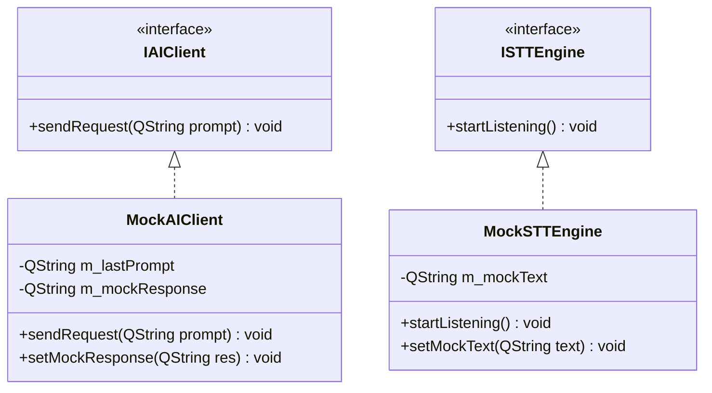

# 単体試験仕様書 (Unit Test Specification)

## 1. 概要
本仕様書は、詳細設計書（`DetailedDesign.md`）で定義された各クラスのメソッドの単体機能、およびスレッドをまたぐ直前のロジックを検証するための自動試験項目を定義する。
本試験は、Google Test (GTest) または Qt Test (QTest) を用いて自動実行（`python run_full_tests.py`）する。画面操作を伴うGUIそのものの検証は手動とし、GUIのアクションスロットから呼び出されるビジネスロジックの開始点から、外部送信の直前までを自動テストのスコープとする。

### 1.1 全件リグレッションテスト実施原則
- **網羅的回帰検証の義務付け**: 修正や機能追加の対象外である既存モジュールであっても、過去に合格したすべての単体試験スイート（全29スイート・148項目以上）を毎回全件自動実行し、テスト成功率 100.0%（0件失敗）であることを確認しなければならない。
- **サイドエフェクト検知**: 検索エンジンのコンソールアプリ化等による修正が、他のAIプロバイダ、レートリミット監視、ナレッジエンジン、音声・翻訳処理等に影響を与えていないことを保証する。

---

## 2. 自動テストのためのモック・スタブ設計

自動テスト時、実際のネットワーク通信や音声デバイス操作をバイパスするため、以下のスタブ（Mock）クラスを作成する。



### 2.1 `MockAIClient` (AI APIのスタブ)
- **責務:** 外部のAIサーバー（Mistral API）に実際にリクエストを送らず、テスト側で指定した応答テキストをシグナル `requestFinished` を通じて即時（非同期）に返却する。
- **検証可能項目:** コアからのリクエストが正しい形式でAIモジュールに到達したか（送信直前のpromptが期待通りか）。

### 2.2 `MockSTTEngine` (音声認識のスタブ)
- **責務:** マイク入力やWhisperの処理を行わず、テスト側で指定した文字列を `transcriptionFinished` シグナルを通じて返却する。
- **検証可能項目:** 音声認識が完了した後のコアおよびUIの動作フロー。

---

## 3. 単体試験項目一覧

### 3.1 `CoreModule` の単体試験 (GTest/QTest)

| 試験ID | 対象メソッド/シグナル | 試験条件 | 期待される結果 (アサート項目) |
| :--- | :--- | :--- | :--- |
| **UT-CORE-01** | `on_startSTTRequested()` | コールバック/スロットが呼び出される。 | コアから `requestSTTStart()` シグナルが発火すること。 |
| **UT-CORE-02** | `on_directInputSubmitted()` | 引数に `"こんにちは"` を渡して呼び出す。 | 1. `notifyEventToUI` シグナルが `EventType::DirectInputSubmitted` で発火すること。<br>2. `requestAI("こんにちは")` シグナルが発火すること。 |
| **UT-CORE-03** | `on_notify_events()` | `EventType::VoiceInputCompleted` (text: `"テスト命令"`) のイベントを受信する。 | 1. 内部ステータスが思考中になること。<br>2. `notifyEventToUI` が `EventType::AIRequestSent` で発火すること。<br>3. `requestAI("テスト命令")` シグナルが発火すること。 |

---

### 3.1.1 段階的タスク実行パイプライン (`AIClientManager`) の単体試験 (GTest/QTest)

| 試験ID | 対象メソッド/機能 | 試験条件 | 期待される結果 (アサート項目) |
| :--- | :--- | :--- | :--- |
| **UT-TASK-01** | `analyzeAndDecomposeTasks()` | 複合メッセージ `"鉄の剣の素材と大阪の天気を教えて"` を渡す。 | 返却された `QList<ExecutionTask>` のサイズが `2` であり、Task1が `KnowledgeSearch` (query: `"鉄の剣"`), Task2が `WebSearchRAG` (query: `"大阪 天気"`) であること。 |
| **UT-TASK-02** | `executeTaskPipeline()` | 分解された `ExecutionTask` リストを渡す。 | C++ ローカル処理 (`MarkdownTableEngine`, `SearchManager`) がミリ秒単位で順次実行され、全ての Task の `isCompleted` が `true` かつ `extractedData` が格納されること。 |
| **UT-TASK-03** | `formatCombinedPrompt()` | 実行完了した Task リストを渡す。 | 生成されたプロンプト文字列に全 Task の結果テキストが `【参考情報】` 内に漏れなく構造化されて包含されていること。 |

---

### 3.2 `STTManager` の単体試験 (GTest/QTest)

| 試験ID | 対象クラス・メソッド | 試験条件 | 期待される結果 (アサート項目) |
| :--- | :--- | :--- | :--- |
| **UT-STT-01** | `STTManager` (エンジン切り替え) | `setEngine("whisper")` を実行後、`on_startListening()` を呼ぶ。 | `WhisperEngine` の `startListening()` が呼ばれること。 |
| **UT-STT-02** | `STTManager` (エンジン切り替え) | `setEngine("sapi")` を実行後、`on_startListening()` を呼ぶ。 | `SAPIEngine` の `startListening()` が呼ばれること。 |
| **UT-STT-03** | `STTManager` & `MockSTTEngine` | `MockSTTEngine` に `"音声入力テキスト"` をセットし、`on_startListening()` を実行する。 | `STTManager::notifyEvent` シグナルが `EventType::VoiceInputCompleted` (text: `"音声入力テキスト"`) で発火すること。 |
| **UT-STT-04** | `AvatarWindow` PTT (長押し/離す) | `m_sttButton` に対して `pressed` シグナルおよび `released` シグナルを直接・疑似発火する。 | 1. `pressed` 時に `startSTTRequested()` が発火し、ボタン表示が `🎤 録音中...` になること。<br>2. `released` 時に `stopSTTRequested()` が発火し、ボタン表示が `音声` に戻ること。 |
| **UT-STT-05** | `CoreModule` 音声AI自動ルーティング (ウェイクワード検出・表記ゆれ補正) | 待機状態 (Idle) で `VoiceInputCompleted` (text: `"ぶるたろう、こんにちは"`) または同音異字・長音表記ゆれ (text: `"プル太郎、こんにちは"`, `"ブルタロー テスト"`, `"プルタロー テスト"`) を `CoreModule::on_notify_events` に投入する。 | 1. アバター名が除去された `requestAI` (text: `"こんにちは"`, `"テスト"`) が発火すること。<br>2. 会話状態が Active に遷移し、無音タイマーが開始されること。 |
| **UT-STT-06** | ネットワーク STT 注入 API | ローカル HTTP エンドポイント `/stt` に `{"text": "ぶるたろう、外部認識テキスト"}` を POST 送信する。 | `CoreModule` を経由して `requestAI` (text: `"外部認識テキスト"`) が自動発火すること。 |
| **UT-STT-07** | `CoreModule` 待機状態非ウェイクワード無視 | 待機状態 (Idle) で `VoiceInputCompleted` (text: `"テスト発想です"`) を投入する。 | アバター名が含まれないため `requestAI` シグナルが発火せず、無視・破棄されること。 |
| **UT-STT-08** | `CoreModule` 無音タイムアウト復帰 | Active 状態で 1000ms（設定値）経過させタイマーを満了させる。 | 状態が Idle に自動復帰し、続くアバター名なし発言が無視されること。 |
| **UT-STT-09** | 設定ファイル自動補完 (`voice_silence_timeout_ms`) | `voice_silence_timeout_ms` が存在しない設定ファイルをロードする。 | デフォルト値 `1000` が読み込まれ、ファイルにコメント付きで自動補完されること。 |


---

### 3.3 `AIClientManager` の単体試験 (GTest/QTest)

| 試験ID | 対象クラス・メソッド | 試験条件 | 期待される結果 (アサート項目) |
| :--- | :--- | :--- | :--- |
| **UT-AI-01** | `AIClientManager` & `MockAIClient` | `on_requestAI("AIへの問いかけ")` を呼び出す。 | 1. `AIClientManager::notifyEvent` が `EventType::AIRequestSent` で発火すること。<br>2. `MockAIClient` の `sendRequest` が引数 `"AIへの問いかけ"` で呼ばれること。 |
| **UT-AI-02** | `AIClientManager` & `MockAIClient` | `MockAIClient` に応答 `"AIの答え"` をセットし、`on_requestAI()` を呼ぶ。 | `AIClientManager::notifyEvent` シグナルが `EventType::AIResponseReceived` (text: `"AIの答え"`) で発火すること。 |
| **UT-AI-03** | `AIClientManager` (翻訳コマンド) | `on_requestAI("!ai trans en Hello")` および `on_requestAI("trans こんにちは")`, `on_requestAI("/ai trans ja Hello")` を呼び出す。 | 1. プレフィックスの有無・表記ゆれに関わらず翻訳コマンドとしてパースされ `AIRequestSent` および `AIResponseReceived` が発生し、翻訳結果のみが返ること。<br>2. 対話履歴（`m_chatHistory`）に追加されず、履歴の非汚染が保証されること。 |
| **UT-AI-04** | `AIClientManager` (ニックネーム本人/配信主登録) | 申請者 alice、対象者 alice、ニックネーム「ありちゃん」で `handleNicknameUpdateRequest` を実行する。 | 1. 戻り値が成功（`Success:`）であること。<br>2. `Config/user_names.json` の `users.alice.preferred` が「ありちゃん」に登録・保存されること。 |
| **UT-AI-05** | `AIClientManager` (ニックネーム他者保留登録) | 申請者 bob、対象者 alice、ニックネーム「ありんこ」で `handleNicknameUpdateRequest` を実行する。 | 1. 戻り値が保留通知（`Notification:`）であること。<br>2. `Config/user_names.json` の `pending_requests` に bob からの申請が追加され記憶されること。<br>3. `users` には bob からの申請は適用されないこと（承認前のため）。 |
| **UT-AI-06** | `AIClientManager` (配信主承認/却下) | 手動で保留リクエストを注入した状態で、配信主が `approveNicknameRequest` または `rejectNicknameRequest` を呼び出す。 | 1. 承認時は `users` セクションにニックネームが移動され、保留リストから消去されること。<br>2. 却下時は登録されず保留リストから消去されること。 |
| **UT-AI-07** | `AIClientManager` (スラッシュコマンド判定) | Direct Input（`user` が空）で `/open_folder` または `/cancel` を実行する。 | 1. `MockAIClient::sendRequest` は呼び出されないこと（LLMバイパス）。<br>2. `/open_folder` の場合は 10分タイマーが開始し、状態が `AwaitingFileAndExplanation` になること。<br>3. `/cancel` の場合はタイマーが停止し、状態が `Idle` になること。<br>4. 不正なコマンド（`/invalid`）は即座にエラーイベントが通知されること。 |
| **UT-AI-08** | `AIClientManager` (10分タイムアウト) | `AwaitingFileAndExplanation` 状態で、10分タイマーがタイムアウト（`onImportTimeout`）する。 | 1. 状態が `CancelConfirmation` に遷移すること。<br>2. ユーザーへキャンセル確認の通知イベントが発生すること。 |
| **UT-AI-09** | `AIClientManager` (一時ファイル確認と読込) | `AwaitingFileAndExplanation` 状態で、一時フォルダに `test.md` を配置し、チャットで「test.mdの説明」を入力する。 | 1. 10分タイマーが停止すること。<br>2. `test.md` の内容が読み込まれ、メンバ変数 `m_importingFileContent` に保持されること。<br>3. 状態が `QandAMode` に遷移し、AI要求（ファイル内容＋説明）が送信されること。 |
| **UT-AI-10** | `AIClientManager` (ナレッジ本登録とメタデータ) | `QandAMode` 状態で、本登録ツール `finalizeKnowledgeImport("タイトル", "説明", キーワードリスト)` を実行する。 | 1. 一時フォルダのファイルが `log/knowledge/` にコピー・リネームされること。<br>2. `knowledge_metadata.json` にメタデータ（タイトル、説明、キーワード、ファイル名）が正しく追加保存されること。<br>3. 状態が `Idle` に戻り、UI更新シグナル `knowledgeMetadataUpdated` が発火すること。 |
| **UT-AI-11** | `AIClientManager` (セキュリティ制限) | Twitch/Discord（`user` が非空）から、`/open_folder` やナレッジ登録関連の入力を行う。 | 1. コマンド判定がバイパスされ、AIクライアントへのツール追加や実行が拒否・無視されること（Twitch/Discordからはナレッジ操作不可）。 |
| **UT-AI-12** | `AIClientManager` (システム固定自動応答) | プロンプト「version」や「アバターが使っているAIは？」、「マイクラのバージョン教えて」で `on_requestAI` を実行する。 | 1. バージョン単体やアバター指定のバージョン/AI問い合わせに対して、AIクライアントが呼ばれず（バイパス）、即座に `EventType::AIResponseReceived` が発生し、プロバイダ名に加えアクティブなモデル名を含んだ固定テキストが返ること。<br>2. アバターを修飾しない無関係な対象のバージョン（「マイクラのバージョン」など）や、無関係なAIの問い合わせはバイパスされず、通常のAI処理へ送られること。 |
| **UT-AI-13** | `HuggingFaceAIClient` (動的モデル取得 & エラー診断) | `/v1/models` エンドポイントからの動的モデルリスト取得、および HTTP 400 エラーレスポンスを受信する。 | 1. 利用可能な `Instruct/Chat` モデルが自動抽出・選択されること。<br>2. `detail` や `error` オブジェクトから具体的なエラーテキストが抽出されること。 |
| **UT-AI-14** | `OpenRouterAIClient` (動的モデル取得 & `:free` 補正) | `/v1/models` を呼び出し、および HTTP 400/404 エラーを受信する。 | 1. 現在利用可能な `:free` 無料枠モデルが動的に選出・適用されること。<br>2. `error.message` 等の詳細が解読され画面イベントに反映されること。 |
| **UT-AI-15** | `AIClientManager` (疑似ファンクションタグ解析・消去) | AI応答テキストに `<function=update_nickname>{"nickname": "\u3055\u3093\u3054", "target_user": "kobanzame_igc"}</function>` が含まれる状態で受信する。 | 1. `handleNicknameUpdateRequest` が発火し、`kobanzame_igc` のニックネームに「さんご」が登録されること。<br>2. 応答テキストから該当タグが完全消去され、会話本文のみが吹き出しイベントに渡されること。 |
| **UT-AI-16** | `AIClientManager` (会話履歴ユーザー名解読) | `[Twitch] blue002` や `buchiushi] blue002: テスト` の形式を含む対話ログを読み込む。 | `parseSenderAndMessage` により `blue002 (Twitch)` 等の送信者名と綺麗に整形されたメッセージ文が抽出され、会話履歴エントリに設定されること。 |
| **UT-AI-17** | `AIClientManager` (送信元タグ解読・小文字照合インジェクション) | 小文字 `aaaa` に優先呼び名「AAA」を登録した状態で、`[Twitch] Aaaa` や `[Twitch:channel] Aaaa` の大文字混じり・プレフィックス付きユーザー名で `on_requestAI` を呼び出す。 | 1. プレフィックスタグが正しく除去され、アカウント名 `aaaa` として辞書引きされること。<br>2. 大文字小文字の違い（`Aaaa` ⇄ `aaaa`）が吸収され、インジェクトされるシステム指示に「AAAさん」が含まれること。 |
| **UT-AI-18** | `AIClientManager` (さくらAI限定 Manager AI 代理ルーティング) | 選択中プロバイダを `sakura` とし、「今日の天気は？」等 Web 検索を要するクエリで `on_requestAI` を実行する。 | 1. さくらAIの代わりに Manager AI (`m_managerClient`) の `sendRequest` が呼び出されること。<br>2. 他プロバイダ（`groq`, `openrouter` 等）選択時は本代理ルーティングがトリガーされず、選択中クライアント自身が呼ばれること。 |
| **UT-AI-19** | `AIClientManager` (応答完了時の宛先・発言者状態変数初期化) | Twitch/Discordからのリクエスト完了後、`m_currentTwitchChannel`, `m_currentDiscordChannelId`, `m_currentRequester` の状態を確認する。 | `on_clientRequestFinished` の実行完了時に全状態変数が `.clear()` され、空文字列（`""`）へ完全初期化されること。 |
| **UT-AI-20** | `AIClientManager` (UI直接入力・音声入力の返信宛て分離) | `user = ""`（UI直接入力または音声入力）で `on_requestAI` を呼ぶ。 | 1. `m_currentTwitchChannel` および `m_currentDiscordChannelId` が空（`""`）のまま保持されること。<br>2. 発火される `AIResponseReceived` の `extraData` に `twitch_channel` や `channel_id` が含まれず、`source` が `"UI"` であること。<br>3. Twitch チャット送信および Discord メッセージ送信関数が呼び出されないこと。 |
| **UT-UI-ROUTING-01** | `AvatarWindow::onEventReceived` (UI入力時のOBS非中継) | `AppEvent.type = EventType::AIResponseReceived` かつ `source = "UI"` のイベントを受信する。 | 1. アプリ画面上の吹き出しおよびレスポンスペインに応答テキストが描画されること。<br>2. `broadcastToOBS()` が呼び出されず、OBS への WebSocket/HTTP 配信が行われないこと。 |
| **UT-UI-ROUTING-02** | `AvatarWindow::onEventReceived` (Twitch入力時のOBS中継) | `AppEvent.type = EventType::AIResponseReceived` かつ `source = "Twitch"` のイベントを受信する。 | 1. アプリ画面上の吹き出しおよびレスポンスペインに応答テキストが描画されること。<br>2. `broadcastToOBS()` が呼び出され、OBS オーバーレイへ応答テキストが配信されること。 |
| **UT-UI-ROUTING-03** | `AvatarWindow::onEventReceived` (Discord入力時のOBS非中継) | `AppEvent.type = EventType::AIResponseReceived` かつ `source = "Discord"` のイベントを受信する。 | 1. アプリ画面上の吹き出しおよびレスポンスペインに応答テキストが描画されること。<br>2. `broadcastToOBS()` が呼び出されず、OBS への WebSocket/HTTP 配信が行われないこと。 |
| **UT-UI-ROUTING-04** | `AvatarWindow::onEventReceived` (UIテキスト専用Web配信) | `AppEvent.type = EventType::AIResponseReceived` かつ `source = "UI"` のイベントを受信する。 | 1. アプリ画面上の吹き出しに応答テキストが描画されること。<br>2. `type = "UIResponse"` の JSON オブジェクトが WebSocket 経由でブロードキャスト配信され、独立した `/ui_text` Web画面でリアルタイム受信可能であること（必要に応じてOBSソース指定も可）。<br>3. `avatar_obs.html` (Twitch配信アバター画面) 側では本データの表示がスキップされること。 |
| **UT-NICK-01** | `AIClientManager` (プラットフォームID手動対応付け保存) | `updateUserMapping("profile_1", "AAA", "twitch_alice", "alice_discord")` を実行する。 | 1. `Config/user_names.json` に `twitch_id` および `discord_id` が保存されること。<br>2. `userNamesUpdated` シグナルが発火し、UIに通知されること。 |
| **UT-NICK-02** | `AIClientManager` (重複レコード自動マージ・統合) | レコード1 (`twitch_id`: `aaaa`) と レコード2 (`discord_id`: `bbbb`) がある状態で、レコード1の `discord_id` に `bbbb` を設定する。 | 1. レコード2が自動検出され、レコード1に統合（マージ）されること。<br>2. レコード2が削除され、JSONが同期保存されること。 |
| **UT-NICK-03** | `AIClientManager` (優先呼び名未設定時の自然言語省略応答指示) | `preferred` が空で `twitch_id`: `john_t`, `discord_id`: `john_d` が設定されたプロファイルで、Twitch および Discord から `on_requestAI` を呼ぶ。 | 1. システム指示に `john_t` / `john_d` のアカウント名が含まれ、冒頭での強制的な名前呼びかけを行わず自然な文章で直接回答する指示が含まれること（推測カタカナ変換なし・省略応答許可）。<br>2. マルチユーザー環境での過去の会話相手との誤認防止指示が含まれること。 |
| **UT-NICK-04** | `AvatarWindow` (UIテーブル5列構造と管理ID列排除) | 「ニックネーム」管理タブを表示し `m_usersTable` のヘッダー列数とラベルを検証する。 | 1. 列数が 5 列であること。<br>2. ヘッダー名が `{"優先呼び名", "Twitch ID", "Discord 名", "愛称リスト", "操作"}` と一致し、「管理ID」列が存在しないこと。 |


---


### 3.4 `AvatarWindow` (UIロジック) の単体試験

※画面上のピクセル描画自体ではなく、透過と位置計算ロジックのみを対象とする。

| 試験ID | 対象メソッド | 試験条件 | 期待される結果 (アサート項目) |
| :--- | :--- | :--- | :--- |
| **UT-UI-01** | `applyTransparency` | テスト用の白背景画像と、透過座標 `(0,0)` を渡す。 | 1. 出力された `QPixmap` の外側背景部分がすべて透過（アルファ 0）になること。<br>2. キャラクター内部（白で囲まれた目の部分）のピクセルは不透過（アルファ 255）のままであること。 |
| **UT-UI-02** | `updateWindowPosition` | `idle` (anchorX: 100, anchorY: 150) の設定で、目標位置 `(500, 500)` を指定する。 | `AvatarWindow::geometry()` の座標が `(400, 350)` に移動（`move()`）すること。 |
| **UT-UI-03** | `updateWindowPosition` | `thinking` (anchorX: 105, anchorY: 152) に切り替える（目標位置 `(500, 500)` は維持）。 | `AvatarWindow::geometry()` の座標が `(395, 348)` に自動移動すること。 |

---

### 3.5 セキュリティ検証 (TrustChain) の単体試験

| 試験ID | 対象クラス・メソッド | 試験条件 | 期待される結果 (アサート項目) |
| :--- | :--- | :--- | :--- |
| **UT-SEC-01** | `extractCopyrightFromFile` | 有効な `BinMarkManager` 署名（`[BM_START]\nPlain=AiAssistantAvatar, Copyright...\n[BM_END]`）が末尾にあるダミーファイルを渡す。 | 署名から `Plain=` 部分の値が正しく抽出され、改行文字や空白がトリミングされて返されること。 |
| **UT-SEC-02** | `extractCopyrightFromFile` | 署名が存在しない空の、または無効なダミーファイルを渡す。 | 返り値として空文字列（`QString()`）が返ること。 |
| **UT-SEC-03** | `applyWatermark` | `AuthStatus::Watermarked` 状態で QMainWindow とともに呼び出す。 | 1. ウィンドウのタイトルバーに `AiAssistantAvatar` を含むコピーライトが設定されること。<br>2. ステータスバーが表示され、コピーライトメッセージと特定のスタイルが適用されること。 |
| **UT-SEC-04** | `AIClientManager` (履歴更新通知) | 新しい応答を受信し、対話履歴を追加する。 | 1. 対話履歴リストに新しいやり取りが追加されること。<br>2. `chatHistoryUpdated` シグナルが最新履歴を伴って発火すること。 |
| **UT-SEC-05** | `AIClientManager::resetSession` (手動) | `resetSession(true)` を呼び出す。 | 1. `log/` ディレクトリ配下に `session_backup_...enc` が生成されること。<br>2. メモリの履歴がクリア（直近1往復分を除く）されること。<br>3. `notifyEvent` シグナルが UI 通知用として発火すること。 |
| **UT-SEC-06** | `AIClientManager::resetSession` (自動) | `resetSession(false)` を呼び出す。 | 1. 暗号化バックアップファイルが生成されること。<br>2. メモリの履歴がクリア（直近1往復分を除く）されること。<br>3. UI通知用シグナルは一切発火しないこと。 |
| **UT-SEC-07** | `AIClientManager::importSessionBackup` | 有効な `.enc` バックアップファイルを指定してインポートを実行する。 | 1. メモリ上の履歴が復号されたデータで正しく上書きされること。<br>2. `chatHistoryUpdated` シグナルが発火すること。 |
| **UT-SEC-08** | `AIClientManager::exportSessionBackup` | 有効な `.enc` バックアップファイルを指定し、エクスポート先の `.txt` ファイルパスを指定してエクスポートを実行する。 | 1. 指定された `.txt` ファイルに会話履歴が平文のテキスト形式で正しく書き出されること。<br>2. 完了時に通知イベントが発火すること。 |
| **UT-SEC-09** | WebSocket配信用初期化 | `QWebSocketServer` を起動し、ダミーの WebSocket クライアントを接続させる。 | 接続確立直後に `Init` タイプの JSON データ（現在の状態とテキスト）がプッシュ送信されること。 |
| **UT-SEC-10** | 設定動的適用 | `local_settings.json` の内容を書き換えた後、`on_settingsUpdated()` を呼び出す。 | 各モジュール（AIClientManager、TwitchReader）が設定ファイルを再読み込みし、プロバイダやウェイクワード設定が動的に更新されること。 |

---

### 3.6 Web検索モジュール (`WebSearcher.exe` / `SearchManager`) の単体試験

| 試験ID | 対象クラス・メソッド | 試験条件 | 期待される結果 (アサート項目) |
| :--- | :--- | :--- | :--- |
| **UT-SEARCH-01** | `DuckDuckGoSearchEngine` | DuckDuckGo HTML版のダミー結果HTMLを入力とする。 | HTMLタグやエンティティ（`&amp;`等）が正しくデコードされ、上位のタイトルとスニペットからノイズが除去された整形テキストとしてパースされること。 |
| **UT-SEARCH-02** | `SearchManager` (フォールバック) | Tavily検索実行時に接続エラー、HTTP 401/429/500、またはタイムアウトを発生させる。 | 自動的かつサイレントに `DuckDuckGoSearchEngine` が起動し、DDGの検索結果が得られること。 |
| **UT-SEARCH-03** | `SearchManager` (全系失敗) | Tavily および DuckDuckGo の双方でエラー・通信失敗を発生させる。 | 「Web検索不可: 検索結果を取得できませんでした。」が返却され、終了コード 1 で終了すること。 |
| **UT-SEARCH-04** | `SearchClientWrapper` (CLI連携) | メインアプリから `WebSearcher.exe` を `QProcess` でサブプロセス起動する。 | 標準出力からクレンジング済み検索テキストが正常に取得され、タイムアウト時にも安全にプロセスが終了すること。 |

---

## 4. 自動テスト用コードのサンプルイメージ

GTestを用いた `CoreModule` のテストコード実装例：

```cpp
#include <gtest/gtest.h>
#include <QSignalSpy>
#include "core_module.h"

TEST(CoreModuleTest, DirectInputTriggersAIRequest) {
    CoreModule core;
    
    // シグナルのスパイを設定
    QSignalSpy spyUI(&core, &CoreModule::notifyEventToUI);
    QSignalSpy spyAI(&core, &CoreModule::requestAI);
    
    // 直接入力を擬似送信
    core.on_directInputSubmitted("こんにちは");
    
    // アサート: 適切なシグナルが発火したか
    ASSERT_EQ(spyUI.count(), 1);
    QList<QVariant> argumentsUI = spyUI.takeFirst();
    AppEvent event = argumentsUI.at(0).value<AppEvent>();
    EXPECT_EQ(event.type, EventType::DirectInputSubmitted);
    EXPECT_EQ(event.text, "こんにちは");
    
    ASSERT_EQ(spyAI.count(), 1);
    QList<QVariant> argumentsAI = spyAI.takeFirst();
    EXPECT_EQ(argumentsAI.at(0).toString(), "こんにちは");
}
```

---

### 3.7 GroqAIClient の単体試験

| 試験ID | 対象クラス・メソッド | 試験条件 | 期待される結果 |
| :--- | :--- | :--- | :--- |
| **UT-GROQ-01** | `GroqAIClient::setApiKey` | 有効なキーを設定後 `sendRequest` を呼ぶ。 | `Authorization: Bearer <key>` ヘッダーが付与されてリクエストが送信されること。 |
| **UT-GROQ-02** | `GroqAIClient::sendRequest` | APIキーが空の状態で `sendRequest` を呼ぶ。 | `requestFinished(false)` が発火し、エラーメッセージが返ること。 |
| **UT-GROQ-03** | `GroqAIClient::clientId` | `clientId()` を呼ぶ。 | `"groq"` を返すこと。 |
| **UT-GROQ-04** | `GroqAIClient::defaultStatus` | `defaultStatus()` を呼ぶ。 | `rpmMax=30`, `rpdMax=14400`, `contextWindow=131072`, `toolCall=true`, `cost=0.0` であること。 |
| **UT-GROQ-05** | `GroqAIClient::setModel` | 空文字を渡して `setModel` を呼ぶ。 | モデルが変更されず `"llama-3.1-8b-instant"` のままであること。 |

---

### 3.8 RateLimitTracker の単体試験

| 試験ID | 対象クラス・メソッド | 試験条件 | 期待される結果 |
| :--- | :--- | :--- | :--- |
| **UT-RLT-01** | `registerClient` | Groqのデフォルト `ProviderStatus` を登録する。 | `statusOf("groq").rpmMax == 30` かつ `available == true` であること。 |
| **UT-RLT-02** | `updateFromReply` | `x-ratelimit-remaining-requests: 5` を含むモックレスポンスを渡す。 | `statusOf("groq").rpmRemaining == 5` に更新されること。 |
| **UT-RLT-03** | `isAvailable` | `rpmRemaining = 0` に設定後 `isAvailable("groq")` を呼ぶ。 | `false` を返すこと。 |
| **UT-RLT-04** | `isAvailable` | `rpmRemaining = 1` の状態で `isAvailable("groq")` を呼ぶ。 | `true` を返すこと。 |
| **UT-RLT-05** | `earliestResetTime` | 全クライアントが `available=false`、GroqのresetAtが最も近い場合。 | `ResetInfo.clientId == "groq"` かつ `resetAt` が最小値であること。 |
| **UT-RLT-06** | `formatWaitMessage` | RPM制限で2分後リセットの `ResetInfo` を渡す。 | 「最短で2分後に使用可能になります（Groq RPM制限解除）。」形式の文字列が返ること。 |
| **UT-RLT-07** | `recordLatency` | 5回分のレイテンシ（100, 200, 300, 400, 500ms）を記録する。 | `latencyMs` が移動平均（300ms）であること。 |
| **UT-RLT-08** | `saveToFile / loadFromFile` | 保存後に別インスタンスでロードする。 | `rpdRemaining`・`tpdRemaining` が保存値と一致すること。 |
| **UT-RLT-09** | `loadFromFile` | `day_start` が前日のファイルをロードする。 | `rpdRemaining` がデフォルト値にリセットされること。 |
| **UT-RLT-10** | `recordLocalConsumption` | ヘッダー非対応時にプロンプト長・応答長を指定してローカル消費を記録する。 | `rpmRemaining` が -1 減算され、推定トークン数に応じて `tpmRemaining` が減算されること。 |
| **UT-RLT-11** | `adaptOnHttp429` | HTTP 429 エラー発生時のシグナルを渡す。 | `available=false` となり、消費安全係数 $\alpha$ が自律的に上方修正されること。 |
| **UT-RLT-12** | `calibrateFromHeader` | ヘッダー実測値と推定値の差分をフィードバックする。 | EMA にて消費安全係数 $\alpha$ が適応修正され、次回推算の精度が向上すること。 |

---


### 3.9 AIRouter の単体試験

| 試験ID | 対象クラス・メソッド | 試験条件 | 期待される結果 |
| :--- | :--- | :--- | :--- |
| **UT-ROUT-01** | `AIRouter::selectClient` | 全クライアント `available=true`、優先度 `["groq","mistral"]`。 | `"groq"` を返すこと。 |
| **UT-ROUT-02** | `AIRouter::selectClient` | Groqが `available=false`、Mistralが `available=true`。 | `"mistral"` を返すこと。 |
| **UT-ROUT-03** | `AIRouter::selectClient` | 全クライアントが `available=false`。 | 空文字 `""` を返すこと。 |
| **UT-ROUT-04** | `AIRouter::selectClient` | 優先度リストが空の場合。 | 空文字 `""` を返すこと。 |

---

### 3.10 接続時挨拶設定の単体試験

| 試験ID | 対象クラス・メソッド | 試験条件 | 期待される結果 (アサート項目) |
| :--- | :--- | :--- | :--- |
| **UT-GREET-01** | `TwitchReader::loadSettings` | `Config/local_settings.json` （テスト隔離パス）に `"twitch_greeting_enabled": true` が設定されている。 | 内部フラグ `m_greetingEnabled` が `true` に設定されること。 |
| **UT-GREET-02** | `TwitchReader::loadSettings` | `Config/local_settings.json` に `"twitch_greeting_enabled"` は存在せず、旧キー `"greeting_enabled": true` が存在する。 | フォールバックが働き、`m_greetingEnabled` が `true` に設定されること。 |
| **UT-GREET-03** | `DiscordReader::loadSettings` | `Config/local_settings.json` に `"discord_greeting_enabled": true` が設定されている。 | 内部フラグ `m_greetingEnabled` が `true` に設定されること。 |
| **UT-GREET-04** | `DiscordReader::loadSettings` | `Config/local_settings.json` に `"discord_greeting_enabled"` は存在せず、旧キー `"greeting_enabled": true` が存在する。 | フォールバックが働き、`m_greetingEnabled` が `true` に設定されること. |
| **UT-GREET-05** | `AvatarWindow::loadSettingsToUI` | `Config/local_settings.json` に `"twitch_greeting_enabled": true` が設定されている。 | UI上の `m_twitchGreetingCheckbox` のチェック状態が `true` に設定復元されること。 |
| **UT-GREET-06** | `AvatarWindow::saveSettingsFromUI` | UI上の `m_twitchGreetingCheckbox` のチェックを変更して保存を実行する。 | `Config/local_settings.json` の `"twitch_greeting_enabled"` にチェック状態が正しく反映保存されること。 |
| **UT-UI-SAVE-01** | `AvatarWindow::saveSettingsFromUI` | コメント行（`#` 行）および `"twitch_client_id": "test_client_id"` が含まれる `Config/local_settings.json` （テスト隔離パス）が存在する状態で GUI から保存を実行する。 | コメント行を含む JSON のパースが正常に行われ、`twitch_client_id` の既存値が空文字に消去されることなく正しく保持保存されること。 |
| **UT-TWITCH-REAUTH-01** | `TwitchReader::on_twitchReauthRequested` | `Config/local_settings.json` 内に `"twitch_client_id": "test_client_123"` が設定された状態で `on_twitchReauthRequested()` を呼び出す。 | 認証開始直前に `Config/local_settings.json` から設定が同期再読み込みされ、`m_clientId` が `"test_client_123"` に即座に更新された上で OAuth ローカルサーバーの起動が開始されること。 |

---

### 3.11 外部スケジュール API 連携機能の単体試験

| 試験ID | 対象クラス・メソッド | 試験条件 | 期待される結果 (アサート項目) |
| :--- | :--- | :--- | :--- |
| **UT-SCHED-01** | `AIClientManager::fetchSchedules` | ローカルに保存したテスト用の擬似 JSON レスポンスファイル（`schedules_response.json`）をロードして復号処理を実行。 | `TransCipher` によりタイトル `"joPsj/8IBE..."` が `"【非公開】WebHook用HTML"` などの正しい日本語文字列に復号されること。 |
| **UT-SCHED-02** | `AIClientManager::on_requestAI` | Discord 経由（`"[Discord:123] streamer"`）または UI直接入力（`""`）で「予定教えて」と入力する。 | トリガーが検知され、システムプロンプト（`additionalSystemPrompt`）の末尾にスケジュール連携コンテキストが自動でインジェクションされること。 |
| **UT-SCHED-03** | `AIClientManager::on_requestAI` | Twitch 経由（`"[Twitch] streamer"`）でウェイクワード等を含み「予定教えて」と入力する。 | 全入力ソース対応によりトリガーが検知され、Twitch コメント入力時であってもスケジュール API から最新データを取得しシステムプロンプトにインジェクションされること。 |

---

### 3.12 レイド・クリエイター自動紹介機能 (F-22) の単体試験

| 試験ID | 対象クラス・メソッド | 試験条件 | 期待される結果 (アサート項目) |
| :--- | :--- | :--- | :--- |
| **UT-RAID-01** | `TwitchReader::on_messageReceived` | Twitch IRC から `USERNOTICE` (`msg-id=raid`, `msg-param-displayName=RaiderUser`) を受信する。 | `AppEvent(EventType::TwitchRaidReceived)` が発火し、`RaiderUser` のユーザー名・表示名が格納されて通知されること。 |
| **UT-RAID-02** | `AIClientManager::handleRaidShoutout` | レイド受信イベントが発生し、`TwitchHelixClient` のモックレスポンス（Bio: "ゲーム配信者", Game: "Minecraft", Title: "建築配信"）をセット。 | 1. Twitch Helix API から情報を正しく取得・パースすること。<br>2. クリエイター情報を含んだ紹介文生成プロンプトが組み立てられ、AIクライアントに送信されること。 |
| **UT-RAID-03** | `AIClientManager::parseBioUrls` | Bio テキスト `"公式Twitter: https://twitter.com/example_user 不正URL: http://unknown.site"` を入力して解析実行。 | 公式 Twitter/X / YouTube などの公開URLのみが抽出され、不確実なキーワード検索を行わずに情報が補完されること。 |
| **UT-RAID-04** | `AIClientManager::sendShoutoutMessage` | `shoutout_use_announce = true`, `shoutout_announce_color = "random"` で紹介コメント送信処理を呼ぶ。 | `/announce [blue|green|orange|purple]` のランダム指定付きでチャット投稿コマンドが生成・送信されること。 |
| **UT-RAID-05** | `AIClientManager::handleRaidShoutout` | `shoutout_use_command = true`, クールタイム外の状態でレイドを受信する。 | 1. `TwitchHelixClient::sendShoutout` 経由で Twitch Helix REST API (`POST /helix/channels/shoutouts`) リクエストが送信されること（IRC `PRIVMSG` への `/shoutout` 直接埋め込みなし）。<br>2. 120 秒のタイマー `m_shoutoutCooldownTimer` が開始すること。 |
| **UT-RAID-06** | `AIClientManager::handleRaidShoutout` | `/shoutout` クールタイム（120秒以内）中に連続してレイド/紹介要求が発生する。 | 1. AIによる紹介文のチャット投稿（/announce含む）・アバター吹き出し・TTSイベント通知は即時実行されること。<br>2. `/shoutout` コマンドが待機キュー (`m_shoutoutQueue`) に追加されること。<br>3. UIにキュー一覧更新通知 (`ShoutoutQueueUpdated`) が届き、待機中ユーザーと残り秒数が表示されること。<br>4. 120秒経過時のタイマータイムアウト時にキュー先頭の `/shoutout` が自動遅延送信されること。 |
| **UT-RAID-07** | `AIClientManager::on_shoutoutSuccessReceived` | Twitch から `/shoutout` 成功 NOTICE (`msg-id=shoutout_success`) を受信し、`shoutout_follow_msg_enabled = true` の状態。 | テンプレート `{name}` が置換されたフォロー呼びかけコメント（例: `"ぜひ RaiderUser さんをフォローしてね！"`）がチャットへ追加投稿されること。 |

---

### 3.13 アバタースキン切替・ディレクトリ管理機能 (F-23) の単体試験

| 試験ID | 対象クラス・メソッド | 試験条件 | 期待される結果 (アサート項目) |
| :--- | :--- | :--- | :--- |
| **UT-SKIN-01** | `AvatarWindow::scanSkins` | `pic/` 配下に `FishEatCatSkin/`, `CustomSkin/` ディレクトリが存在する状態でスキャンを実行。 | スキン選択 QComboBox (`m_comboAvatarSkin`) に両方のフォルダ名が選択肢として一覧取得・追加されること。 |
| **UT-SKIN-02** | `AvatarWindow::on_skinChanged` | スキンを `FishEatCatSkin` に変更・保存する。 | 1. `local_settings.json` の `"avatar_skin"` が `"FishEatCatSkin"` で保存されること。<br>2. `ObsHttpServer` の Document Root が `pic/FishEatCatSkin/` に即座に一括更新されること。 |

---

### 3.14 アバター画像指定3モード ＆ 状態タイマー制御 (F-24) の単体試験

| 試験ID | 対象クラス・メソッド | 試験条件 | 期待される結果 (アサート項目) |
| :--- | :--- | :--- | :--- |
| **UT-ANIM-01** | `AvatarSettingsParser::parse` | `"mode": "single"` の設定項目（位置・透過含む）を読み込む。 | 単一ファイル名、`anchorX/Y`, `transparentX/Y` が正確にパースされること。 |
| **UT-ANIM-02** | `AvatarSettingsParser::parse` | `"mode": "random"` の設定項目を読み込む。 | 画像リスト `files` が取得され、抽選呼び出し時にリスト内から1枚がランダム選択されること。 |
| **UT-ANIM-03** | `AvatarSettingsParser::parse` | `"mode": "sequence"` の設定項目（`frame_interval_ms: 100`）を読み込む。 | 画像フレーム配列およびコマ送り速度が正しくパース・保持されること。 |
| **UT-ANIM-04** | `AvatarAnimationScheduler` | 入力受信/AI処理/AI応答イベントが発生する。 | `listening` ➔ `thinking` ➔ `speaking` の順にそれぞれの `duration_ms` タイマーが起動し、完了後に自動で `idle` 状態へ復帰すること。 |

---

### 3.15 アバタースキン自動生成・GUI編集機能 (F-25) の単体試験

| 試験ID | 対象クラス・メソッド | 試験条件 | 期待される結果 (アサート項目) |
| :--- | :--- | :--- | :--- |
| **UT-BUILDER-01** | `AvatarSkinBuilder::generateSkinDir` | 新規スキン名 `"MyCustomSkin"` を指定して保存処理を実行。 | `pic/MyCustomSkin/` ディレクトリが生成され、指定された画像ファイルが正常にコピー配置されること。 |
| **UT-BUILDER-02** | `AvatarSkinBuilder::generateSettingsJson` | GUI上で設定された各状態のモード・ファイルリスト・座標・時間を渡して生成。 | 正しい構造の `avatar_settings.json` が `pic/MyCustomSkin/` 内にパースエラー無く書き出されること。 |
| **UT-BUILDER-03** | `AvatarSkinBuilder::generateObsHtml` | 新規スキンの保存処理を実行。 | `pic/MyCustomSkin/avatar_obs.html` がテンプレートから正常に生成・配置されること。 |

---

### 3.16 多層スコア判定・文脈保護・中立検索連携フィルタリング機能 (F-26) の単体試験

| 試験ID | 対象クラス・メソッド | 試験条件 | 期待される結果 (アサート項目) |
| :--- | :--- | :--- | :--- |
| **UT-MODERATION-01** | `ScoreModerationEngine::evaluate` | 危険単語を含む文章（「覚醒剤」）を渡す。 | カテゴリスコア (+40) が正しく加算され、スコアが正確に算出されること。 |
| **UT-MODERATION-02** | `ScoreModerationEngine::evaluate` | ゲームタイトル・文脈を含む文章（「Elinで薬物を売った」）を渡す。 | `game_context` による減算 (-40) が適用され、最終スコア 0点 (SAFE) と判定されること。 |
| **UT-MODERATION-03** | `ScoreModerationEngine::evaluate` | 直前がゲーム文脈かつ危険教意思図を含む文章（「覚醒剤の作り方を教えて」）を渡す。 | `instruction` (+50) が検知され、過去履歴減算がキャンセルされて 90点 (BLOCK) と判定されること。 |

---

### 3.17 AI向けランダム値取得 I/F (F-27) の単体試験

| 試験ID | 対象クラス・メソッド | 試験条件 | 期待される結果 (アサート項目) |
| :--- | :--- | :--- | :--- |
| **UT-RANDOM-01** | `AIRandomUtils::getRandom` | `getRandom(1, 6)` を 100 回試行する（正常系・標準ダイス）。 | 返却値がすべて $1 \le x \le 6$ の範囲内であること。 |
| **UT-RANDOM-02** | `AIRandomUtils::getRandom` | `getRandom(5, 5)` を呼ぶ（境界値・最小最大同一）。 | 返却値が常に `5` であること。 |
| **UT-RANDOM-03** | `AIRandomUtils::getRandom` | `getRandom(10, 1)` を呼ぶ（異常系・引数逆転）。 | 自動的に引数が反転補正され、返却値が $1 \le x \le 10$ の範囲内であること。 |
| **UT-RANDOM-04** | `AIRandomUtils::getRandomList` | `getRandomList(10, 3)` を呼ぶ（正常系・重複なし抽出）。 | 1. 返却リストの要素数が `3` であること。<br>2. 全要素が $0 \le x \le 10$ の範囲内であること。<br>3. リスト内の全要素に重複がないこと（相異なる）。 |
| **UT-RANDOM-05** | `AIRandomUtils::getRandomList` | `getRandomList(5, 10)` を呼ぶ（境界値・要求個数オーバー）。 | 候補数 $5+1=6$ 個を超える要求に対し、取得可能な上限個数 `6` 個の重複なしリストが返ること。 |
| **UT-RANDOM-06** | `AIRandomUtils::getRandomList` | `getRandomList(10, 0)` および `getRandomList(10, -2)` を呼ぶ（異常系・無効な個数）。 | 空のリスト (`QList<int>()`) が返ること。 |
| **UT-RANDOM-07** | `AIRandomUtils::parseAndEvaluate` | 文字列 `"結果: Random(1, 6) リスト: RandomList(5, 3)"` をパース評価する（文字列マクロ置換）。 | 1. `"Random(1, 6)"` 部分が抽出結果の数値（1〜6）に置換されること。<br>2. `"RandomList(5, 3)"` 部分がカンマ区切りの非重複数値リスト（例: `"1, 3, 5"`）に置換されること。 |

---

### 3.18 Twitch コメント受信サイレント切断自動復旧 Watchdog (F-28) の単体試験

| 試験ID | 対象クラス・メソッド | 試験条件 | 期待される結果 (アサート項目) |
| :--- | :--- | :--- | :--- |
| **UT-WATCHDOG-01** | `TwitchReader::onTextMessageReceived` | テキストメッセージ（PING / PRIVMSG）を受信する。 | 内部変数 `m_lastDataReceivedTime` が呼び出し時の最新日時へ即座に更新されること。 |
| **UT-WATCHDOG-02** | `TwitchReader::checkWatchdog` | 通信正常時（`m_lastDataReceivedTime` が 10 秒前）。 | Watchdog がスルーされ、自動再接続（`connectToTwitch`）が発火しないこと。 |
| **UT-WATCHDOG-03** | `TwitchReader::checkWatchdog` | サイレント切断偽装（`m_lastDataReceivedTime` を 200 秒前に擬似設定）。 | 1. Watchdog により 180 秒超過の無通信・ゾンビ接続が探知されること。<br>2. 古い WebSocket インスタンスが安全に閉鎖・破棄され、`connectToTwitch()` によるバックグラウンド自動再接続が正常に発火すること。 |

---

### 3.19 マークダウン汎用データストレージ ＆ インデックス抽出 (F-29) の単体試験

| 試験ID | 対象クラス・メソッド | 試験条件 | 期待される結果 (アサート項目) |
| :--- | :--- | :--- | :--- |
| **UT-TABLEDB-01** | `MarkdownTableEngine::scanDirectory` | テスト用フォルダ `test_knowledge/Elin/装備/片手剣.md` を生成して読み込む。 | 情報グループ `"Elin"`, カテゴリ `"装備"`, テーブル名 `"片手剣"` が正確に認識されインデックス化されること。 |
| **UT-TABLEDB-02** | `MarkdownTableEngine::queryColumn` | `queryColumn("Elin", "装備", "片手剣", "鉄の剣", "必要素材")` を実行。 | 返却文字列が `"鉄鉱石x3, 木材x1"` と完全一致すること。 |
| **UT-TABLEDB-03** | `MarkdownTableEngine::selectRandomColumn` | `selectRandomColumn("Elin", "装備", "片手剣", "武器名")` を複数回呼び出す。 | テーブル内のいずれかの武器名（例: `"鉄の剣"` や `"炎の小剣"`）がランダムに取得されること。 |
| **UT-TABLEDB-04** | `MarkdownTableEngine::isPathSafe` | `isPathSafe("../../../windows/system32")` 等の相対パス抜け出しをテスト。 | 判定結果 `false` となり、`knowledge/` 外部へのアクセスが安全に遮断されること。 |
| **UT-TABLEDB-05** | `MarkdownTableEngine::parseAndEvaluate` | 文章 `"装備: TableSearch(Elin, 装備, 片手剣, 鉄の剣, 攻撃力)"` を評価。 | `"TableSearch(...)"` 部分が `"15"` に置換され、文章全体が正しく展開されること。 |
| **UT-TABLEDB-06** | `MarkdownTableEngine::searchRelevantContext` | 自然文クエリ `"鉄の剣の必要素材を教えて"` を入力して検索。 | 該当するテーブルレコード行が抽出され、AIプロンプトインジェクション用コンテキスト文字列が自動生成されること。 |

---

### 3.20 レイド自動紹介・シャウトアウト・アナウンスルーティング単体試験

| 試験ID | 対象クラス・メソッド | 試験条件 | 期待される結果 (アサート項目) |
| :--- | :--- | :--- | :--- |
| **UT-SHOUTOUT-01** | `AIClientManager::on_AIResponseReceived` | `m_isShoutoutRequest = true`, `m_shoutoutUseAnnounce = true` の状態で AIレスポンスを受信する。 | 応答テキストの先頭に `/announce <color>` プレフィックスが正常に自動付与されること。 |
| **UT-SHOUTOUT-02** | `TwitchReader::on_requestTwitchSend` | `on_requestTwitchSend("channel", "/announce blue test message")` を呼び出す。 | `/announce` プレフィックスが文字消去されず、そのまま `PRIVMSG #channel :/announce blue test message` として送信されること。 |
| **UT-SHOUTOUT-03** | `AIClientManager::handleRaidShoutout` | `handleRaidShoutout("targetuser")` を実行し、`/shoutout` イベントを生成する。 | 1. 発行されるイベントの `extraData` に `twitch_channel` が含まれること。<br>2. `CoreModule` 経由で `requestTwitchSend` へ確実にルーティングされること。 |

---

### 3.21 アバター共通・基本設定UI化およびOBS用アバターURL化 (F-30) の単体試験

| 試験ID | 対象クラス・メソッド | 試験条件 | 期待される結果 (アサート項目) |
| :--- | :--- | :--- | :--- |
| **UT-UISETTING-01** | `AvatarWindow::initSettingsTab` | 設定画面を生成し、グループボックス構造およびポート非表示化を検証する。 | 1. 「アバター共通・基本設定」にアバター名・スキンのみが集約され、名前反応・ウェイクワードが削除されていること。<br>2. 「OBS / 描画設定」から WebSocket/HTTP ポート入力欄が削除されていること。 |
| **UT-UISETTING-02** | `AvatarWindow::saveSettingsFromUI` / `loadSettingsToUI` | UI非表示化パラメータの保護および復元動作を検証する。 | `local_settings.json` の名前反応・OBSポート・ウェイクワード設定値がUI非表示状態で正常に保護・維持・保存されること。 |
| **UT-DISCORD-01** | `AvatarWindow::rebuildDiscordLayout` | `[+ チャンネル追加]` および `[-]` 削除ボタンによるレイアウト変更を検証する。 | チャンネルセットが動的に画面追加・削除され、最低1チャンネル表示が維持保証されること。 |
| **UT-DISCORD-02** | `AvatarWindow::saveSettingsFromUI` / `loadSettingsToUI` | Discord 複数チャンネルのJSON配列相互変換を検証する。 | `discord_channels` 配列との間で複数チャンネル設定（チャンネルID、挨拶フラグ）が正常に保存・復元されること。 |


---

### 3.22 TaskFlow(予定管理システム) 独立連携 ＆ 全プラットフォーム対応 (F-31) の単体試験

| 試験ID | 対象クラス・メソッド | 試験条件 | 期待される結果 (アサート項目) |
| :--- | :--- | :--- | :--- |
| **UT-TASKFLOW-01** | `AIClientManager::on_requestAI` | `m_taskFlowEnabled = true` で、Twitch入力およびUIダイレクト入力より「今日の予定は？」と送信する。 | 1. `getTaskFlowSchedulesContext` が呼び出され、TaskFlow から予定が取得されること。<br>2. 取得したスケジュール情報がシステムプロンプトへ追加されAIに渡されること。 |
| **UT-TASKFLOW-02** | `AIClientManager::on_requestAI` | `m_taskFlowEnabled = false` の状態で「今日の予定は？」と送信する。 | TaskFlow API へのコンテキスト取得・注入が発生しないこと。 |

---

### 3.23 新規 AI プロバイダ統合 (F-32: HuggingFace / OpenRouter / さくらAI) の単体試験

| 試験ID | 対象クラス・メソッド | 試験条件 | 期待される結果 (アサート項目) |
| :--- | :--- | :--- | :--- |
| **UT-PROVIDER-01** | `HuggingFaceAIClient::request` | `huggingface` プロバイダを選択し、プロンプト要求を送信する。 | OpenAI 互換 Chat Completions API (`https://router.huggingface.co/v1/chat/completions`) に対し、指定した API キーおよびモデル名でリクエストが正しく構築・送信され、レスポンスが正常パースされること。 |
| **UT-PROVIDER-02** | `OpenRouterAIClient::request` | `openrouter` プロバイダを選択し、プロンプト要求を送信する。 | OpenRouter エンドポイント (`https://openrouter.ai/api/v1/chat/completions`) に対し、リファラヘッダーを含めてリクエストが構築・送信され、レスポンスがパースされること。 |
| **UT-PROVIDER-03** | `SakuraAIClient::sendRequest` / `on_searchFinished` | `sakura` プロバイダ選択時に天気等の検索クエリを送信する。 | 1. 事前 Tavily 検索が起動すること。<br>2. 検索テキストから URL リストやメタデータノイズが除外・スリム化されること。<br>3. 抽出された参考テキストが `system` メッセージではなく `user` ロールメッセージとして質問の直前に挿入されて送信されること。 |
| **UT-PROVIDER-04** | `AIClientManager::loadSettingsFromJsonObject` | `local_settings.json` から 3 プロバイダの API Key および Model 設定 (`huggingface_model`, `openrouter_model`, `sakura_model`) をロードする。 | `m_huggingfaceKey`, `m_openrouterKey`, `m_sakuraKey` および `m_huggingfaceModel`, `m_openrouterModel`, `m_sakuraModel` がすべて漏れなくパース・読み込まれ、各クライアントに設定されること。 |
| **UT-PROVIDER-05** | `AIClientManager` / `AvatarWindow` (Save/Load ラウンドトリップ) | JSON オブジェクトに保存されたモデル設定を `loadSettingsFromJsonObject` で読み込むラウンドトリップ試験を実施。 | 保存されたモデル文字列と読み込み後のモデル文字列が 100% 一致し、Save と Load の完全同期がアサート検証されること。 |

---

### 3.23b フォールバック継続動作・自然言語エラー通知 (F-33) の単体試験

| 試験ID | 対象クラス・メソッド | 試験条件 | 期待される結果 (アサート項目) |
| :--- | :--- | :--- | :--- |
| **UT-FALLBACK-01** | `AIClientManager::buildHumanReadableError` | HTTP 429 エラー、`metadata.provider_name` = `"Google AI Studio"` を含む JSON を入力。 | 返却文字列に「レート制限」「自動切り替え」等の自然言語表現が含まれ、生の数値コード `429` のみの表示でないこと。 |
| **UT-FALLBACK-02** | `AIClientManager::buildHumanReadableError` | HTTP 401 エラー JSON を入力。 | 「API キー」「確認」等の自然言語が含まれ、フォールバック候補が提示されないこと。 |
| **UT-FALLBACK-03** | `AIClientManager::buildHumanReadableError` | HTTP 404 エラー JSON を入力。 | 「モデル名」「AI設定タブ」等の自然言語が含まれること。 |
| **UT-FALLBACK-04** | `AIClientManager::on_clientRequestFinished` (モック) | 選択プロバイダが 429 を返し、他に API キー設定済みプロバイダが存在する。 | 元プロンプトを保持したまま次プロバイダへ再送が行われ、UI への自然言語警告シグナルが発行されること。 |
| **UT-FALLBACK-05** | `AIClientManager::on_clientRequestFinished` (モック) | 全プロバイダが 429 を返す。 | 最終エラーとして自然言語の終了メッセージが UI へ通知されること。 |
| **UT-FALLBACK-06** | ログ出力確認 | HTTP 429 エラー時のログ出力を確認。 | ログに `error.message`, `provider_name`, `raw`, `provider_error_code` が全て出力されること。UI 向け自然言語メッセージとは別ルートで出力されること。 |

---

### 3.24 ナレッジベース拡張 (F-29: インデックス・トリガー優先度・エラー診断) の単体試験


| 試験ID | 対象クラス・メソッド | 試験条件 | 期待される結果 (アサート項目) |
| :--- | :--- | :--- | :--- |
| **UT-KNOWLEDGE-INDEX-01** | `MarkdownTableEngine::buildIndexAndValidate` | `knowledge/` 配下に複数 Markdown ファイルが存在する状態でスキャン・インデックス構築を実行する。 | `knowledge_index.json` が生成され、各ファイルのタイトル・トリガー・優先度が構造化データとして正常取得されること。 |
| **UT-KNOWLEDGE-PRIORITY-02** | `MarkdownTableEngine::resolveBestEntryForTrigger` | 同一のトリガーキーワード（例: 「占い」）を保持する優先度 100 と 50 の 2 ファイルが存在する状態で呼び出す。 | 優先度 100 のファイルが一義的に選択・解決され、インデックスおよびログに採用結果が記録されること。 |
| **UT-KNOWLEDGE-VALIDATE-03** | `MarkdownTableEngine::buildIndexAndValidate` | テーブルの列数（`|`）が途中で欠落した壊れた Markdown ファイルを配置してスキャンを実行する。 | 1. 壊れたファイルはロード対象から除外（スキップ）されること。<br>2. 該当ファイル名とエラー発生行・内容が `diagnostics` リストへ登録され、UI上にレポートとして可視化されること。 |

---

### 3.25 右クリックメニュー廃止 ＆ ページネーション対応会話履歴ビューア (F-30) の単体試験

| 試験ID | 対象クラス・メソッド | 試験条件 | 期待される結果 (アサート項目) |
| :--- | :--- | :--- | :--- |
| **UT-HISTORY-PAGINATION-01** | `HistoryViewerDialog::onPageSizeChanged` | 会話ログ全 150 件のデータが存在する状態で、表示件数を `10件` / `50件` / `100件` へ変更する。 | 総ページ数がそれぞれ `15` / `3` / `2` ページと正しく再計算され、表示ログ範囲が正確に制御されること。 |
| **UT-HISTORY-STATUS-02** | `HistoryViewerDialog::updateView` | サマリ化済ログ 138 件、未サマリ生ログ 12 件が含まれる会話履歴データを読込み表示する。 | 1. ステータスラベルに「未サマリ: 12件 / 全150件」が表示されること。<br>2. 各メッセージの先頭に `[サマリ化済]` または `[未サマリ]` の状態タグが付与されて描画されること。 |
| **UT-HISTORY-EXPORT-03** | `HistoryViewerDialog::onExportText` | 会話ログが存在する状態でエクスポート処理を実行する。 | UIスレッドフリーズを生じさせず、テキストファイル (.txt) にすべての会話ログが平文で正確に保存されること。 |
| **UT-HISTORY-SUMMARIZE-04** | `HistoryViewerDialog::onForceSummarize` | 未サマリログが存在する状態で「今すぐサマリ化」ボタンを押下する。 | `AIClientManager::forceSummarizeHistory()` が正常発火し、未サマリログが直ちに圧縮統合されて画面上の未サマリ件数が `0` に更新されること。 |

---

### 3.26 段階的タスクパイプライン (F-16-7: 多重 TaskPlanner ＆ Validator 層) の単体試験

| 試験ID | 対象クラス・メソッド | 試験条件 | 期待される結果 (アサート項目) |
| :--- | :--- | :--- | :--- |
| **UT-TASK-04** | `AIClientManager::generateRefinedQuery` | 長文指示文（「今日の神奈川の天気を調べて、雨なら散歩したいんだけど...」）を入力する。 | 不要な条件文（散歩、釣り等）がカットされ、`"神奈川県 2026年7月31日 天気"` 形式の検索キーワードが抽出・生成されること。 |
| **UT-TASK-05** | `AIClientManager::on_requestAI` | マネージャー層で事前 RAG 検索が完了したプロンプトを全 AI クライアント (`IAIClient`) へ転送する。 | 下流の全 AI クライアント内部での二重 Web 検索（`needsSearch` / `executeSearch`）が発火せず、マネージャーによる 1 回の検索のみで直ちに LLM へリクエストが送信されること。 |
| **UT-TASK-06** | `AIClientManager::analyzeAndDecomposeTasks` | 複数要求文（「明日の横浜の天気と潮汐を調べたうえで、釣りに行くタイミングを知りたい」）を入力する。 | `Task 1: 天気` と `Task 2: 潮汐` の 2 つの独立検索タスクが `QList<ExecutionTask>` に分解・抽出されること。 |
| **UT-TASK-07** | `AIClientManager::validateExtractedData` | 潮汐要求があるが検索結果に「干潮・満潮」のデータが含まれない場合。 | 「潮汐データ未取得のため数値を推測・捏造せず回答せよ」というガード制約がプロンプトに追加注入されること。 |
| **UT-ROUTER-03** | `AIClientManager::selectAndPrepareClient` | Release ビルド (`#ifndef QT_DEBUG`) で `provider` に `"dummy"` または空文字列（全選択解除）が指定された場合。 | `DummyAIClient` が選択されず、登録プロバイダの中から利用可能な最適な AI クライアントが選定されること。 |
| **UT-ROUTER-04** | `AIRouter::selectBestAvailableClient` | 全プロバイダが利用可能で、プロバイダ A の RPM 残容量が 30、プロバイダ B の RPM 残容量が 100 の場合。 | 使用枠・残容量が最も多いプロバイダ B が自動選定されること。 |
| **UT-ROUTER-05** | `AIClientManager::on_requestAI` | 登録された全プロバイダの API キーが空（未設定）の状態でプロンプトを送信する。 | 外部 API リクエストが送信されず、「APIキーが設定されていません。設定画面で設定してください。」という案内通知が即座に生成されること。 |
| **UT-ROUTER-06** | `AIClientManager::selectAndPrepareClient` | 設定済みプロバイダが全枯渇し、未設定プロバイダが存在する場合。 | 「全設定プロバイダが上限到達中。解除まで【約〇分〇秒】。未設定の[〇〇]キーを登録するとすぐ使えます」と案内が生成されること。 |
| **UT-ROUTER-07** | `AIClientManager::selectAndPrepareClient` | 全プロバイダのキーが設定済みで、全プロバイダが枯渇している場合。 | 「すべてのAIプロバイダが上限到達中。解除まで【約〇分〇秒】ほどお待ちください」と案内が生成されること。 |
| **UT-TASKFLOW-01** | `AIClientManager::fetchSchedules` | `m_taskFlowApiUrl` が未設定（空）の状態で `fetchSchedules` を実行する。 | 特定個人ドメインへの HTTP リクエストが発生せず、即時に空文字列が返却されること。 |
| **UT-SHOUTOUT-03** | `AIClientManager::on_clientRequestFinished` | レイド紹介文の生成完了時 (`m_isShoutoutRequest == true`) に IRC 送信テキストを検証する。 | IRC へ送信されるイベントテキストの先頭に `/announce` や `/shoutout` コマンド文字列が含まれず、純粋なテキストコメントとして生成されること。 |
| **UT-TASK-08** | `AIClientManager::analyzeAndDecomposeTasks` | 「今日の予定は？」という文章を入力してタスク分解を実行する。 | 「今日」単体で `WebSearchRAG` タスクが発生せず、TaskFlow スケジュール検索インテントとして正しく識別されること。 |
| **UT-TASK-09** | `AIClientManager::formatRoleSeparatedPrompt` | 参考情報およびタスクデータが存在する状態でプロンプト生成を実行する。 | `User` ロールプロンプトへ `【参考情報】` が連結されず、`systemInstruction` 領域へ `[WebSearch]` / `[TaskFlow]` ブロックとして分離注入されること。 |
| **UT-RATELIMIT-08** | `RateLimitTabWidget::updateUI` | 動的な `ProviderRateLimitState` (動的項目リスト `quotaItems`) を読み込んで UI 描画を実行する。 | `N/A` や `-` などの曖昧表示が発生せず、各プロバイダに存在する制限項目のみが動的にプログレスバー化して描画されること。 |
### 3.27 チャットコメント 500 文字自動分割 ＆ スローモード遅延キュー制御 (F-1 / F-5 / F-3) の単体試験

| 試験ID | 対象クラス・メソッド | 試験条件 | 期待される結果 (アサート項目) |
| :--- | :--- | :--- | :--- |
| **UT-COMMENT-SPLIT-01** | `splitTextForComment` | 500 文字以内のテキスト（例: 200文字のAI回答）を渡す。 | 1 要素の `QStringList` が返り、分割が発生しないこと。 |
| **UT-COMMENT-SPLIT-02** | `splitTextForComment` | 750 文字（句読点 `。` を含む）の長文AI回答を渡す。 | 500 文字以内の自然な文の区切り（`。` または改行）で 2 つの要素（`QStringList`）に綺麗に分割されること。 |
| **UT-COMMENT-SPLIT-03** | `splitTextForComment` | 1200 文字（句読点なしの長文）を渡す。 | 各要素が 500 文字を超えないサイズに正確に強制分割（3要素）されること。 |
| **UT-SLOWMODE-QUEUE-04** | `CommentQueueManager` | 3 つに分割されたコメント文言を連続で送信キューへ投入する。 | 設定された送出インターバル（例: 1500ms）ごとに 1 メッセージずつ順次 `requestTwitchSend` / `requestDiscordSend` シグナルが発火し、スローモードに抵触せず順次送信されること。 |
| **UT-RLT-13** | `RateLimitTracker::updateAvailable` | `forceRateLimit` で 5 秒後にリセット設定した状態で 6 秒経過後に `isAvailable` を呼ぶ。 | `rpmRemaining` が `rpmMax` に再補充され `available == true` に自動復帰すること。 |
| **UT-RLT-14** | `RateLimitTabWidget::updateProviderCard` | `nextResetAt` が UTC で設定されたステータスを渡し、UTC 現在時間で差分（`secsTo`）を計算する。 | ローカルタイムゾーンに関わらず正確な残り時間（秒数）が算出され、0秒到達時に `🟢 利用可能` へ動的更新されること。 |
| **UT-SYS-03** | `SystemResponseManager::processPrompt` | 「レートリミット表示して」「レートリミットの更新して」と入力する。 | レートリミット表示機能が実装されている旨を正しく案内し、「レートリミット」タブから確認できるメッセージが返却されること。 |
| **UT-HTTP-STT-01** | `ObsHttpServer::handleRequest` | `/stt` エンドポイントに対し HTTP GET `?text=テスト` または JSON POST を送信する。 | 404 エラーとならず `sttTextReceived` シグナルが発火し、`200 OK` JSON レスポンスが返却されること。 |
| **UT-WEBSTT-01** | `ObsHttpServer::handleRequest` | パラメータなしで `GET /stt` リクエストを送信する。 | `text/html` の Content-Type で WebSTT 音声入力 ＆ ウェイクワード常時監視 Web ページ (HTML) が返却されること。 |
| **UT-DELAY-01** | `AIClientManager::on_requestAI` | 連続で 2 つのリクエストを `on_requestAI` へ投入する。 | 1 秒未満（約 600ms）の送出遅延（時差）が保持され、API サーバーへの急激な高頻度リクエストが防がれること。 |
| **UT-MGR-PRIO-01** | `AIClientManager::buildFallbackProviderList` | マネージャー AI に `groq` を設定し、`buildFallbackProviderList` を実行する。 | `groq` がフォールバック優先順位の最下位（末尾）に組み替えられること。 |
| **UT-MISTRAL-RPM-01** | `MistralAIClient::getStatus` | `MistralAIClient::getStatus()` を呼び出す。 | 初期 `rpmMax` が 1 ではなく `30` に設定されていること。 |
| **UT-SPEAKER-CTX-01** | `AIClientManager::formatSpeakerTaggedPrompt` | 発言者 "userA" (配信コメント), 宛先 "blue002", プロンプト "テスト" を指定してタグ整形を呼び出す。 | `[発言者: userA (配信コメント) | 宛先: blue002] テスト` の識別タグ付きプロンプトが生成されること。 |
| **UT-JSON-COMMENT-01** | `JsonCommentRemover::stripHashComments` | `#` コメント行や行末コメント、および `"key": "val#1"` などの文字列を含む JSON 文字列を渡す。 | コメント行および行末コメントが正常除去され、クォーテーション内の `#` が保持されて正しく JSON パース（`QJsonDocument::fromJson`）できること。 |
| **UT-JSON-COMMENT-02** | `JsonCommentRemover::updateExistingJsonText` | `#` コメント行を含む既存 JSON テキストに対し特定キー（例: `"ai_provider": "groq"`）の値変更 `QJsonObject` を適用する。 | 既存のすべての `#` コメント行やフォーマットが完全に保護保持され、該当キーの値のみがピンポイントで書き換わること。 |


| **UT-RLT-15** | `RateLimitTracker::updateAvailable` | `rpmMax = -1` (HuggingFace等) のプロバイダを `forceRateLimit` で 1 秒後にリセット設定し、2 秒経過後に `updateAvailable` を呼ぶ。 | `s.nextResetAt` がクリアされ、`s.rpmRemaining` が `-1` となり `s.available == true`（🟢 利用可能）に復帰すること。 |
| **UT-RLT-16** | `RateLimitTracker::recordLocalConsumption` | `rpmMax = 30` (Mistral) のプロバイダに対し 1 回 `recordLocalConsumption` を呼び出す。 | `rpmRemaining` が 29 に減算され、`nextResetAt` が 60 秒後に設定され、`available == true`（🟢 利用可能）が維持されること。 |
| **UT-RLT-17** | `RateLimitTabWidget::updateProviderCard` | 残り枠 30% 未満（例: `rpmRemaining = 3 / 30`）および 0 回（`0 / 30`）のステータスを渡してカード描画を行う。 | 前者では `🟡 もうすぐ上限 (残り 3 回)` (オレンジ色), 後者では `🔴 レートリミット到達中` (赤色) に描画されること。 |
| **UT-RLT-18** | `RateLimitTracker::updateAvailable` | `tpmMax = 100000`, `tpmRemaining = -1` (HuggingFace/Sakura等初期状態) のプロバイダの `isAvailable` を呼び出す。 | `tpmOk == true` に評価され、`available == true`（🟢 利用可能）が得られること。 |
| **UT-WM-01** | `WakewordMatcher::matchAndStrip` | "ブルタロー 攻略法を教えて" や "プルタロー テスト" 等の長音・表記ゆれテキストを投入する。 | `match == true` と判定され、アバター名が除去された本文 ("攻略法を教えて", "テスト") が正しく抽出されること。 |
| **UT-STT-NORM-01** | `STTTextNormalizer::normalizePhonetics` | 四つ仮名 ("ぶぢたろう", "みづ"), 音素類似子音 ("ぶちたろう", "ぶすたろう") を含む認識テキストを投入する。 | 1. 四つ仮名が `じ`/`ず` へ自動統一されること。<br>2. 編集距離類似度判定により類似度 75% 以上でウェイクワードおよび発話本文として補正評価できること。 |
| **UT-BOUYOMI-01** | `BouyomiChanClient::sendText` | `enabled = true`, `baseUrl = "http://localhost:50080/talk"` で日本語テキスト "こんにちは" を渡す。 | HTTP GET リクエスト URL が `"http://localhost:50080/talk?text=%E3%81%93%E3%82%93%E3%81%AB%E3%81%A1%E3%81%AF"` と正確にエンコード生成され非同期送信されること。 |
| **UT-BOUYOMI-02** | `AvatarWindow::saveSettingsFromUI` | `"bouyomichan_url"` が含まれない設定 JSON をロードする。 | 自動補完処理によりコメント付きで `"bouyomichan_enabled": false`, `"bouyomichan_url": "http://localhost:50080/talk"` がファイルに追記・保存されること。 |
| **UT-DAILY-MACRO-01** | `MarkdownTableEngine::parseAndEvaluate` | `{Date}` および `{User}` を含むテキストを渡す。 | `{Date}` が今日の日付（`YYYY-MM-DD`）、`{User}` が指定ユーザー名に正確に置換されること。 |
| **UT-DAILY-MACRO-02** | `AIRandomUtils::getDailyRandom` | 同一のシード文字列（例: `"2026-08-15_Taro"`）で `getDailyRandom(1, 10, seed)` を複数回呼び出す。 | 常に同一の整数値が返却され、異なるシード文字列（別日・別ユーザー）では期待通り値が変動すること。 |
| **UT-DAILY-MACRO-03** | `MarkdownTableEngine::selectDailyColumn` | `Omikuji/Ranks` テーブルから同一シードで `selectDailyColumn` を複数回呼び出す。 | 常に同一の運勢（行）が抽出され、異なるシードでは別行が決定論的に取得されること。 |
| **UT-KNOWLEDGE-FOLDERS-01** | `MarkdownTableEngine::reload` | `knowledge/Omikuji/` および `knowledge/Zodiac/` が配置された状態で `reload()` を実行する。 | 各フォルダが独立グループとしてスキャンされ、トリガーおよびテーブル行数が正確にインデックスされること。 |
| **UT-DETAIL-MODE-01** | `AIClientManager::determineResponseDetailMode` | 通常の質問「何で台風は不規則な動きをするの？」を渡す。 | デフォルトの `ResponseDetailMode::Short` が判定されること。 |
| **UT-DETAIL-MODE-02** | `AIClientManager::determineResponseDetailMode` | 「何で台風は不規則な動きをするの？詳しく教えて」を渡す。 | `ResponseDetailMode::Detailed` が正しく判定されること。 |
| **UT-DETAIL-MODE-03** | `AIClientManager::determineResponseDetailMode` | 「台風の仕組みを一言で教えて」を渡す。 | 簡潔指示語に基づき `ResponseDetailMode::Short` が正しく判定されること。 |
| **UT-DETAIL-MODE-04** | `AIClientManager::formatResponseInstruction` | `Short` モード時のシステムプロンプト指示ブロックを生成する。 | 「1〜3文程度」「簡潔」の制約文言が含まれるプロンプト指示が生成されること。 |
| **UT-DETAIL-MODE-05** | `AIClientManager::determineResponseDetailMode` | 「説明が細かすぎるよ」「詳しすぎてわかりにくい」などの指摘を渡す。 | 粒度縮小トリガーとして検知され、`ResponseDetailMode::Short` かつ言い直し指示が有効化されること。 |
| **UT-KNOWLEDGE-TRIGGER-SCORE-01** | `MarkdownTableEngine::resolveBestEntryForTrigger` | 「山羊座の今日の運勢は？」を入力してエントリ選定を実行する。 | 同一優先度（100）の `Omikuji/Ranks` ではなく、星座名「山羊座」にマッチした `Zodiac/Signs` が最良エントリとして正しく選定されること。 |
| **UT-KNOWLEDGE-TRIGGER-SCORE-02** | `MarkdownTableEngine::resolveBestEntryForTrigger` | 「おみくじ引いて」を入力してエントリ選定を実行する。 | 「おみくじ」にマッチした `Omikuji/Ranks` が最良エントリとして正しく選定されること。 |
| **UT-OBS-01** | `CommunityObserver` (ログ記録・追記) | `--record --user "userA" --text "こんにちは"` を実行する。 | `Config/observer_logs/twitch_userA.json` に発言レコードが追加され、件数が正確にカウントアップされること。 |
| **UT-OBS-02** | `CommunityObserver` (通常判定 `Normal`) | 普段から雑談中心のユーザーが「このゲーム面白いね」と発言し `--eval` を実行する。 | JSON 出力の `status` が `"Normal"` であり、`directive` が空文字であること。 |
| **UT-OBS-03** | `CommunityObserver` (乖離判定 `DrasticChange`) | 普段はポジティブなユーザーが「〇〇さん本当に苦手で無理」と発言し `--eval` を実行する。 | `status` が `"DrasticChange"` となり、「何かあった？」と優しく話を聞き出す傾聴ディレクティブが返却されること。 |
| **UT-OBS-04** | `CommunityObserver` (継続性判定 `PersistentConcern`) | 過去ログに同一対象への不満が複数回記録されている状態で再度不満発言を渡し `--eval` を実行する。 | `status` が `"PersistentConcern"` となり、「前にも気にしてたみたいだけど」と状況説明を促すディレクティブが返却されること。 |
| **UT-OBS-05** | `CommunityObserver` (ログローテーション) | 100件を超えるレコードを蓄積、または60日以前の古いログが存在する状態で `--vacuum` を実行する。 | 最大保持件数（100件以内）に古いログが破棄され、人物ラベリング等の不当な属性情報が存在しないこと。 |
| **UT-OBS-06** | `AIClientManager` (Observer プロセス連携 ＆ タイムアウト) | `AIClientManager::evaluateWithObserver` を実行する。 | 正常時はディレクティブがシステムプロンプトに注入され、CLIプロセス障害・タイムアウト時（50ms超過）は安全に通常応答へフォールバックすること。 |
| **UT-RAID-ROUTING-01** | `AIClientManager::handleRaidShoutout` | レイド受信イベントが発生しシャウトアウト応答が生成される。 | 応答イベントの `source` が `"Twitch"` となり、`extraData["twitch_channel"]` がセットされて Twitch チャットへ中継されること。 |
| **UT-RAID-PROMPT-01** | `AIClientManager::handleRaidShoutout` | レイド紹介文生成プロンプトを構築する。 | 「相手が当配信へレイドして来てくれた」「リスナーの皆さんを歓迎」「相手の配信を見に行くような逆転誤認表現の禁止」の文脈指示が含まれていること。 |
| **UT-RAID-LOGIN-PARSE-01** | `TwitchReader::onTextMessageReceived` | `USERNOTICE` で `msg-param-login=ferrely_leo;msg-param-displayName=フェレリーレオ` を受信する。 | `login` と `displayName` が分離抽出され、Helix API 用に英数字ログイン名が渡されること。 |

---

## 4. Regression / Behavior Integrity テスト観点

本セクションは、過去に発生した不具合や仕様乖離の再発防止、および機能間の振る舞い整合性を継続的に保証するための試験観点を定義する。
新たな不具合修正・機能追加のたびに、関連する観点を本セクションへ追記すること。

### 4.1 シャウトアウト・クリエイター紹介ルーティング整合性

> **背景**: F-36 対応（2026-08-18）。`handleRaidShoutout` がレイド・会話の両方から呼ばれ、
> 会話トリガー時もソースが Twitch 固定になる問題を修正。再発防止のため以下を継続検証する。

| 試験ID | 観点 | 試験条件 | 期待される結果 |
| :--- | :--- | :--- | :--- |
| **UT-REG-SHOUTOUT-01** | 会話紹介がソースを引き継ぐこと | UIソースから `on_requestAI("ferrely_leoさんを紹介して", "", "UI")` を実行する。 | AI応答イベントの `source` が `"UI"` であり `"Twitch"` に固定されないこと。 |
| **UT-REG-SHOUTOUT-02** | レイド紹介がTwitchに固定されること | `handleRaidShoutout("ferrely_leo", {login: "ferrely_leo"})` を実行する。 | AI応答イベントの `source` が `"Twitch"` に固定されること。 |
| **UT-REG-SHOUTOUT-03** | 会話紹介プロンプトがレイド文脈を含まないこと | `buildConversationShoutoutPrompt()` を任意のクリエイター情報で呼び出す。 | プロンプトに「レイドして来てくれた」「リスナーの皆さんを引き連れて」等のレイド固有文脈が含まれないこと。 |
| **UT-REG-SHOUTOUT-04** | レイド紹介プロンプトが逆転誤認防止を含むこと | `buildRaidShoutoutPrompt()` を任意のクリエイター情報で呼び出す。 | プロンプトに「逆の立場と絶対に誤認しないでください」の禁止指示が含まれること。 |
| **UT-REG-SHOUTOUT-05** | `/shoutout` コマンドが会話ルートを使うこと | UIから `/shoutout username` を送信する。 | `handleConversationShoutout` が呼ばれ、`handleRaidShoutout` は呼ばれないこと。 |

---

### 4.1.1 入力ソース → 応答出力先 ルーティング整合性

> 入力ソースごとに、AI 応答が正しい出力先へルーティングされることを保証する。
> 仕様として、応答は常に **UI（アバター画面）に表示** され、
> かつ入力元が Twitch / Discord の場合は **それぞれのチャットへも中継** される。

**ルーティング仕様早見表**

| 入力元 (source) | `event.source` | `extraData["twitch_channel"]` | `extraData["channel_id"]` | 出力先 |
|---|---|---|---|---|
| Twitch | `"Twitch"` | ✅ セット | — | UI 表示 ＋ Twitch チャット送信 |
| Discord | `"Discord"` | — | ✅ セット | UI 表示 ＋ Discord チャンネル送信 |
| UI | `"UI"` | — | — | UI 表示のみ |

**試験項目**

| 試験ID | 観点 | 試験条件 | 期待される結果 |
| :--- | :--- | :--- | :--- |
| **UT-REG-ROUTING-01** | Twitch 入力 → UI ＆ Twitch 出力 | `on_requestAI("こんにちは", "[Twitch:my_channel]viewer", "")` を実行し AI 応答を受け取る。 | `event.source == "Twitch"` かつ `extraData["twitch_channel"] == "my_channel"` が設定されること。`channel_id` は設定されないこと。 |
| **UT-REG-ROUTING-02** | Discord 入力 → UI ＆ Discord 出力 | `on_requestAI("こんにちは", "[Discord:123456789]User#0001", "")` を実行し AI 応答を受け取る。 | `event.source == "Discord"` かつ `extraData["channel_id"] == "123456789"` が設定されること。`twitch_channel` は設定されないこと。 |
| **UT-REG-ROUTING-03** | UI 入力 → UI のみ出力 | `on_requestAI("こんにちは", "", "UI")` を実行し AI 応答を受け取る。 | `event.source == "UI"` かつ `extraData` に `"twitch_channel"` も `"channel_id"` も含まれないこと。 |
| **UT-REG-ROUTING-04** | ソース切り替え後の汚染がないこと | Twitch リクエスト後、続けて UI リクエストを実行して AI 応答を受け取る。 | 2件目の `event.source` が `"UI"` であり、`extraData["twitch_channel"]` が前回の値のまま残留しないこと。 |


### 4.2 Helix API クリエイター情報取得整合性

> **背景**: F-37 対応（2026-08-18）。`fetchCreatorInfo` が `/helix/users` → `/helix/channels` → `/helix/videos` の
> 3段階連鎖非同期で実行されるようになった。チェーンが途中で切れると情報が欠落するリスクがある。

| 試験ID | 観点 | 試験条件 | 期待される結果 |
| :--- | :--- | :--- | :--- |
| **UT-REG-HELIX-01** | `recentGames` がプロンプトに反映されること | `buildRaidShoutoutPrompt()` に `recentGames = {"RPG", "アクション"}` を渡す。 | 生成プロンプトに「RPG」「アクション」の両文字列が含まれること。 |
| **UT-REG-HELIX-02** | `recentGames` が空の場合のフォールバック | `buildRaidShoutoutPrompt()` に `recentGames = {}` を渡す。 | 「情報なし」と表示され、クラッシュや空欄がないこと。 |
| **UT-REG-HELIX-03** | 会話紹介プロンプトにも `recentGames` が反映されること | `buildConversationShoutoutPrompt()` に `recentGames = {"格闘ゲーム"}` を渡す。 | 生成プロンプトに「格闘ゲーム」が含まれること。 |

---

### 4.3 SNS・リンク情報抽出整合性

> **背景**: F-38 対応（2026-08-18）。`extractSnsInfo()` の正規表現を拡張。
> 対象: Twitter(X) / YouTube / TikTok / Instagram / discord.gg / linktr.ee。

| 試験ID | 観点 | 試験条件 | 期待される結果 |
| :--- | :--- | :--- | :--- |
| **UT-REG-SNS-01** | Twitter / YouTube は引き続き抽出されること | Bio に `https://twitter.com/user` と `https://youtube.com/user` を含む文字列を渡す。 | 両 URL が抽出されること。 |
| **UT-REG-SNS-02** | TikTok / Instagram が新たに抽出されること | Bio に `https://tiktok.com/@user` と `https://instagram.com/user` を含む文字列を渡す。 | 両 URL が抽出されること。 |
| **UT-REG-SNS-03** | discord.gg / linktr.ee が抽出されること | Bio に `https://discord.gg/server` と `https://linktr.ee/user` を含む文字列を渡す。 | 両 URL が抽出されること。 |
| **UT-REG-SNS-04** | 無関係 URL が誤抽出されないこと | Bio に `https://example.com/user` を含む文字列を渡す。 | `extractSnsInfo()` の結果が空文字であること。 |
| **UT-REG-SNS-05** | Bio が空の場合のフォールバック | Bio に空文字を渡す。 | `extractSnsInfo()` が空文字を返しクラッシュしないこと。 |

---

### 4.4 日付依存マクロの決定論的整合性

> **背景**: `SearchManagerTest.DailyMacroAndKnowledgeFoldersTest` にて、固定シード日付と
> `parseAndEvaluate` の `{Date}` 展開（実行日）が乖離し、日付をまたぐとテストが失敗する
> 既存バグを修正（2026-08-18）。再発防止のため以下を継続検証する。

| 試験ID | 観点 | 試験条件 | 期待される結果 |
| :--- | :--- | :--- | :--- |
| **UT-REG-DAILY-01** | 同一シードで同一結果が返ること | `selectDailyColumn()` を同一シード `"2026-08-15_Alice"` で2回呼ぶ。 | 両結果が完全に一致すること。 |
| **UT-REG-DAILY-02** | マクロ評価の期待値を実行日シードで算出すること | `DailyTableSelect` マクロを `parseAndEvaluate()` で評価する際、期待値を今日の日付シードで事前算出して比較する。 | `DailyTableSelect` が展開され、今日のシードによる行選択結果と一致すること。 |
| **UT-REG-DAILY-03** | 異なるシードで異なる（または同一の）結果が許容されること | 異なるユーザー名シード `"Alice"` / `"Bob"` で `getDailyRandom()` を実行する。 | どちらも `[1, 100]` の範囲内に収まること（値の一致は問わない）。 |

---

### 4.5 汎用リグレッション観点チェックリスト

新機能追加・バグ修正の際に、以下の観点を必ずレビューすること。

| # | 観点 | 確認内容 |
|---|---|---|
| 1 | **ソースルーティング不変性** | AI応答の `source` が呼び出し元に正しく対応しているか。Twitch / Discord / UI の混在がないか。 |
| 2 | **プロンプト文脈分離** | レイド・会話・コマンドそれぞれで異なる意図のプロンプトが混在していないか。 |
| 3 | **非同期チェーン完結** | 非同期 API 呼び出し（Helix, AI API 等）の全チェーンが完結し、途中失敗時にフォールバックがあるか。 |
| 4 | **日付・時刻依存テスト** | テストが特定の日付に依存していないか。固定シードと実行日シードを使い分けているか。 |
| 5 | **空値・null ガード** | QString / QStringList の `.isEmpty()` チェック、空コールバック、空メタデータを安全に処理しているか。 |
| 6 | **自己シャウトアウト禁止** | Twitch 仕様上、自分自身への `/shoutout` が誤って送信されないか。 |
| 7 | **クールタイム・キュー整合性** | シャウトアウトのクールタイム中に追加リクエストが来た場合にキューが正しく機能するか。 |

---

### 3.8 `TwitchHelixClient` の単体試験 (GTest/QTest)

| 試験ID | 対象クラス・メソッド | 試験条件 | 期待される結果 (アサート項目) |
| :--- | :--- | :--- | :--- |
| **UT-HELIX-01** | `setCredentials` | `oauthToken` に `"oauth:abcd1234efgh"`, `clientId` に `"my_client_id"` を渡す。 | 1. 内部 `m_oauthToken` が `"abcd1234efgh"`（プレフィックス除去済み）となること。<br>2. 大文字 `"OAUTH:xyz"` の場合も正しくプレフィックスが除去されること。 |
| **UT-HELIX-02** | `sendShoutout` (リクエスト構築) | `fromBroadcasterId="100"`, `toBroadcasterId="200"`, `moderatorId="100"` を渡して実行。 | 1. QNetworkRequest の `Authorization` ヘッダーが `"Bearer <token>"`（`oauth:` 不含）であること。<br>2. `Client-ID` ヘッダーが正しくセットされること。<br>3. URL クエリに `from_broadcaster_id=100`, `to_broadcaster_id=200`, `moderator_id=100` が正確に含まれること。 |
| **UT-HELIX-03** | `sendChatAnnouncement` (リクエスト構築) | `message="Hello"`, `color="blue"` を渡して実行。 | 1. QNetworkRequest の `Authorization` ヘッダーが `"Bearer <token>"` であること。<br>2. JSON ボディに `{"message":"Hello","color":"blue"}` が格納されること。 |

---

### 3.9 レイドシャウトアウト E2E フロー (`AIClientManager`) の単体試験 (GTest/QTest)

| 試験ID | 対象クラス・メソッド | 試験条件 | 期待される結果 (アサート項目) |
| :--- | :--- | :--- | :--- |
| **UT-RAID-FLOW-01** | `handleRaidShoutout` 正常系 | レイドイベント（`login: "raider1"`, `displayName: "レイド太郎"`, `viewerCount: 15`）を受信。モック Helix クライアントが情報取得成功を即時コールバック。 | 1. レイド歓迎プロンプトが正しく生成され AI クライアントの `sendRequest` が呼ばれること。<br>2. `m_currentSource` が `"Twitch"`、`m_currentTwitchChannel` が設定値となること。<br>3. `m_isShoutoutRequest` が `true` にセットされること。<br>4. モック Helix クライアントの `sendShoutoutToUser` が `"raider1"` 対象で呼び出されること。 |
| **UT-RAID-FLOW-02** | `handleRaidShoutout` 応答完了と Twitch 送信 | AI から紹介文応答を受信。 | 1. `notifyEventToUI` / `CoreModule` 宛に `EventType::AIResponseReceived`（`source: "Twitch"`, `extraData["twitch_channel"]` あり）が発火すること。<br>2. 生成されたテキストに `/announce` や `/shoutout` 等の IRC 禁止文字列が含まれず、純粋なチャットテキストであること。 |
| **UT-RAID-FLOW-03** | レイド `/shoutout` クールタイムと待機キュー | 1回目のレイド（User A）処理直後（クールタイム 120 秒内）に 2回目のレイド（User B）を受信。 | 1. User A に対する `sendShoutoutToUser` が即時発火すること。<br>2. User B は即時送信されず、待機キュー `m_shoutoutQueue` に追加（サイズ 1）されること。<br>3. `processNextShoutoutInQueue()` 呼び出し時に User B のシャウトアウトが自動トリガーされること。 |
| **UT-RAID-FLOW-04** | 自己レイド・自己シャウトアウト除外 | 配信主自身（`login == m_twitchChannel`）のレイドイベントを受信。 | 1. AI 歓迎メッセージ生成は実行されること。<br>2. Twitch 公式 `/shoutout` API（`sendShoutoutToUser`）は Twitch 仕様制限のためスキップされること。 |
| **UT-RAID-FLOW-05** | `/shoutout` 成功時のフォロー推奨メッセージ | `on_shoutoutSuccessReceived("raider1")` を呼び出す（`m_shoutoutFollowMsgEnabled = true`）。 | 1. `{name}` が置換されたフォロー推奨メッセージ（例:「ぜひ raider1 さんをフォローしてね！」）が生成されること。<br>2. Twitch 宛に `EventType::AIResponseReceived` として自動送出されること。 |
| **UT-RAID-FLOW-06** | Helix API 失敗時の安全なフォールバック | Helix API（クリエイター情報取得や `/shoutout`）がネットワークエラーを返却。 | 1. アプリがクラッシュせず、フォールバック表示名等を用いて AI 歓迎メッセージの生成およびチャット投稿が最後まで継続完了すること。 |

---

### 3.10 `MarkdownTableEngine` 除外トリガー・占い想起の単体試験 (GTest/QTest)

| 試験ID | 対象クラス・メソッド | 試験条件 | 期待される結果 (アサート項目) |
| :--- | :--- | :--- | :--- |
| **UT-KNOWLEDGE-TRIGGER-01** | 「うらない」（ひらがな）想起 | 入力 `"うらない"` または `"今日のうらない教えて"` を `resolveBestEntryForTrigger` に投入。 | `Omikuji`（おみくじ）エントリが最高スコアでマッチし、`isValid == true` となること。 |
| **UT-KNOWLEDGE-TRIGGER-02** | 「占い」（漢字）想起 | 入力 `"占い"` または `"今日の占い"` を投入。 | `Omikuji` エントリがマッチし、`isValid == true` となること。 |
| **UT-KNOWLEDGE-TRIGGER-03** | 他占い（タロット/手相等）の除外 | 入力 `"タロット占いして"`, `"手相占いできる？"`, `"四柱推命で占って"` を投入。 | Omikuji の除外トリガーに引っかかり、Omikuji エントリが想起対象から完全に除外（`isValid == false` または他エントリ判定）されること。 |
| **UT-KNOWLEDGE-TRIGGER-04** | 星座指定占いの優先想起 | 入力 `"ふたご座のうらないして"`, `"牡羊座の今日の運勢"` を投入。 | 1. Omikuji 側は除外（「座」検出）されること。<br>2. `Zodiac`（星座占い）エントリが正確にマッチし、`isValid == true` となること。 |
| **UT-KNOWLEDGE-TRIGGER-05** | 除外トリガーの大文字・小文字・部分一致網羅 | ナレッジ定義 `# 除外トリガー` に大文字/小文字・日本語混在ワードを設定し検証。 | 大文字小文字に関わらず正確に除外判定が行われること。 |

---

### 3.11 `TwitchIntroGenerator` コンソールアプリおよび連携の単体試験 (GTest/QTest)

| 試験ID | 対象機能・シナリオ | 試験条件 | 期待される結果 (アサート項目) |
| :--- | :--- | :--- | :--- |
| **UT-INTRO-GEN-01** | コマンドライン引数パース | `--user testuser --mode raid --length short --tone "元気よく"` を指定して起動。 | 各引数が正しくパースされ、モード・長さ・トーン設定に反映されること。 |
| **UT-INTRO-GEN-02** | レイド用プロンプト構築 | `--mode raid` を指定してクリエイター情報（Bio, ゲーム履歴, SNS）を渡す。 | 相手がレイドして来てくれた状況（迎え入れ・感謝）を指示するプロンプトが生成されること。 |
| **UT-INTRO-GEN-03** | 会話紹介用プロンプト構築 | `--mode conversation` を指定してクリエイター情報を渡す。 | チャット欄で相手を紹介する文脈のプロンプトが生成されること。 |
| **UT-INTRO-GEN-04** | 標準出力テキスト形式出力 | `--format text` で紹介文を生成。 | 余計なヘッダーやデバッグログを含まず、生成された紹介文テキストのみが標準出力（stdout）に出力されること。 |
| **UT-INTRO-GEN-05** | JSON 形式出力 | `--format json` で紹介文を生成。 | `status`, `username`, `displayName`, `text` を含む有効な JSON が標準出力に出力されること。 |
| **UT-INTRO-GEN-06** | メインアプリ非同期呼出しとフォールバック | `AIClientManager` から `QProcess` で呼び出し、タイムアウトまたは異常終了を模擬。 | タイムアウト時にプロセスが安全に kill され、フォールバック紹介コメントが Twitch 送信用イベントとして発行されること。 |
| **UT-INTRO-GEN-07** | `--mode raid` 指定時の `/shoutout` REST API 送信 | `--mode raid` かつ `shoutout_use_command = true` で起動。 | クリエイター情報取得・紹介文生成と並行して、Twitch 公式 `/shoutout` REST API が送信されること。 |
| **UT-INTRO-GEN-08** | `--mode conversation` 指定時の `/shoutout` 抑止 | `--mode conversation` で起動。 | クリエイター紹介文は生成されるが、Twitch 公式 `/shoutout` REST API は**一切送信されない**こと。 |
| **UT-INTRO-GEN-09** | 自己レイド時の `/shoutout` スキップ | 配信者自身のユーザーIDを対象に `--mode raid` で起動。 | 自己宛の `/shoutout` API 送信が安全にスキップされ、エラーなく紹介文生成のみが実行されること。 |

---

### 3.12 コンソールアプリ `tools/` パス探索・プロセス起動の単体試験 (GTest/QTest)

| 試験ID | 対象機能・シナリオ | 試験条件 | 期待される結果 (アサート項目) |
| :--- | :--- | :--- | :--- |
| **UT-TOOLS-PATH-01** | `tools/` サブフォルダ優先探索 | `appDir + "/tools/WebSearcher.exe"` および `appDir + "/WebSearcher.exe"` が存在。 | `tools/` 配下のパスが最優先で選択・返却されること。 |
| **UT-TOOLS-PATH-02** | 同一フォルダフォールバック探索 | `tools/` 配下に存在せず、`appDir + "/WebSearcher.exe"` のみ存在。 | 同一フォルダ配下のパスが正常に選択・返却されること。 |
| **UT-TOOLS-PATH-03** | 開発環境 `build/` フォルダ探索 | `appDir + "/build/WebSearcher.exe"` のみ存在。 | 開発環境パスが正常に選択・返却されること。 |
| **UT-TOOLS-PATH-04** | プロセス環境変数 `PATH` への `appDir` 前置注入 | `configureProcessEnvironment(process)` を実行。 | `process.processEnvironment().value("PATH")` の先頭に `appDir` が追加されていること。 |

---

### 3.13 Google Gemini プロバイダ ＆ `GeminiChatter` コンソールアプリの単体試験 (GTest/QTest)

| 試験ID | 対象機能・シナリオ | 試験条件 | 期待される結果 (アサート項目) |
| :--- | :--- | :--- | :--- |
| **UT-GEMINI-01** | `GeminiAIClient` 基本プロパティとモデル自動選定 | `GeminiAIClient` を初期化。 | クライアントIDが `"gemini"` であり、デフォルトモデルが自動的に最良無料枠の `"gemini-2.0-flash"` となること。モデル手動指定時に反映されること。 |
| **UT-GEMINI-02** | `GeminiAIClient` APIキー未設定時エラー | APIキー未設定で `sendRequest` を呼び出す。 | 即座にエラー通知シグナルが発行され、「Gemini APIキーが設定されていません」を含むメッセージが返ること。 |
| **UT-GEMINI-03** | `RateLimitTracker` Gemini 初期値検証 | トラッカーを初期化。 | Gemini の無料枠（RPM: 15, RPD: 1500, TPM: 1,000,000, コスト: 0.0）が正しく初期設定されること。 |
| **UT-GEMINI-04** | `AIClientManager` での Gemini 統合・フォールバック順序 | `setAIProvider("gemini")` を実行。 | 優先プロバイダ順序の先頭が `"gemini"` となり、フォールバックリストに正常に含まれること。 |
| **UT-GEMINI-05** | `buildHumanReadableError` による自然言語エラー変換 | HTTP 429 / 401 / 404 エラーを受信。 | それぞれ「レート制限」「API キーが正しくありません」「モデル名が見つかりません」を含む自然言語メッセージが返ること。 |
| **UT-GEMINI-06** | `AvatarWindow` 設定永続化とモデルファイル保存 | `local_settings.json` に設定を書き込み `loadSettingsToUI` / `saveSettingsFromUI` を実行。 | UIにモデルコンボボックスが存在せずAPIキーのみが表示されること。設定ファイルの `"gemini_model"` が保持され、手動編集値が正しく読み込まれること。 |
| **UT-GEMINI-07** | `RateLimitTabWidget` Gemini カード表示 | レートリミットステータス更新シグナルを受信。 | `RateLimitTabWidget` 内に `GEMINI プロバイダ` カードが生成・表示され、RPM/RPD プログレスバーが反映されること。 |

---

### 3.14 Manager AI プロバイダ動的選定の単体試験 (GTest/QTest)

| 試験ID | 対象機能・シナリオ | 試験条件 | 期待される結果 (アサート項目) |
| :--- | :--- | :--- | :--- |
| **UT-MGR-PROVIDER-01** | 設定済みAPIキーに基づくManager AIプロバイダ一覧の動的抽出 | `gemini_api_key` および `groq_api_key` のみが設定された状態で `loadSettingsToUI` を実行。 | `m_managerProviderCombo` に `gemini` と `groq` がリストアップされ、未設定のプロバイダは除外されること。 |
| **UT-MGR-PROVIDER-02** | 全キー未設定時のデフォルト全プロバイダフォールバック | すべてのAPIキーが空の状態で初期化。 | `m_managerProviderCombo` にデフォルトの全プロバイダ一覧（`groq`, `gemini`, `sakura`, `mistral`, `openrouter`, `huggingface`）が表示されること。 |
| **UT-MGR-PROVIDER-03** | Manager AIプロバイダ変更時の推奨モデル一覧更新 | `m_managerProviderCombo` を `gemini` に切り替える。 | `m_managerModelCombo` に `gemini-2.0-flash (推奨)` 等のGemini推奨モデル一覧が表示されること。 |

---

### 3.15 複数ユーザー会話文脈判定・指示語・聞き返しの単体試験 (GTest/QTest)

| 試験ID | 対象機能・シナリオ | 試験条件 | 期待される結果 (アサート項目) |
| :--- | :--- | :--- | :--- |
| **UT-CTX-01** | 会話ログからの候補コンテキスト抽出 | 複数ユーザー（A, B, C）の発言履歴が存在する状態で `extractContextCandidates` を実行。 | 一定時間以内の発言やAI参加発言が `ContextCandidate` リストとして正しく抽出され、時系列順に並ぶこと。 |
| **UT-CTX-02** | 情報伝達 (`INFORMATION`) に対するリアクション生成 | 「〇〇さんが××だって言ってるよ」を Manager AI に判定させる。 | `speech_act` が `"INFORMATION"`、`response_action` が `"ACKNOWLEDGE"` と判定され、質問解説ではなく相槌・リアクション指示が Worker AI へ注入されること。 |
| **UT-CTX-03** | 過去発言訂正 (`CORRECTION`) に対する誤り受容プロンプト | 「そこは静岡だよ！」を Manager AI に判定させる。 | `speech_act` が `"CORRECTION"`、`response_action` が `"CORRECT_APOLOGY"` と判定され、一般論や励ましが禁止され、誤りを認めて簡潔に返答する指示が Worker AI へ注入されること。 |
| **UT-CTX-04** | 指示語（それ・そこ）の参照先特定 | 富士山の位置に関する過去AI発言が存在する状態で「そこ違うよ」を入力。 | 過去の富士山発言の `message_id` が `reference_message_id` として特定され、高確信度（$\ge 0.75$）が算出されること。 |
| **UT-CTX-05** | 低確信度時の短い聞き返し (`ASK_CLARIFICATION`) | 関連候補が複数存在し文脈が曖昧な状態で「それ違うよ」を入力。 | `response_action` が `"ASK_CLARIFICATION"` と判定され、「それってどれのこと？」等の 1 文の短い聞き返しが選定されること。 |
| **UT-CTX-06** | 聞き返し状態 (`PendingClarification`) の保持と文脈復元 | 聞き返し後にユーザーが「それ！」と返答。 | 直前の `PendingClarification` 状態から対象トピックが引き継がれ、文脈を解決して回答が生成されること。 |
| **UT-CTX-07** | 複数候補競合・絞り込み不能時の未特定 ＆ 聞き返し選定 | 複数の関連候補が存在し、確信を持って 1 つに特定できない状態で指示語を含む発言を入力。 | 無理に 1 つの `message_id` を選択せず、`refMessageId` が空（未特定）、確信度が低く判定され、`responseAction` が `"ASK_CLARIFICATION"` となること。 |
| **UT-CTX-08** | 挨拶代行指示 (`COMMAND`) の文脈判定と指示生成 | 「配信終了のご挨拶をして」を入力。 | `speech_act` が `"COMMAND"`、`response_action` が `"GREET_ON_BEHALF"` と判定され、個人労いではなく視聴者全体への挨拶指示が生成されること。 |
| **UT-CTX-09** | 共通システムプロンプトにおける名乗り抑制・質問即応指示の検証 | 各 AI クライアント（Sakura, Gemini, Groq, Mistral, OpenRouter, HuggingFace）のプロンプトを生成。 | 毎回名乗ることを禁止する指示および定型挨拶での誤魔化しを禁止する指示が含まれていること。 |
| **UT-CTX-10** | 未来・予告情報伝達 (`INFORMATION`) に対する時制適正化 | 「〇〇が配信終わるって」を入力。 | `speech_act` が `"INFORMATION"`、`response_action` が `"ACKNOWLEDGE"` と判定され、過去形（終わった）への誤認を抑止する指示が注入されること。 |


