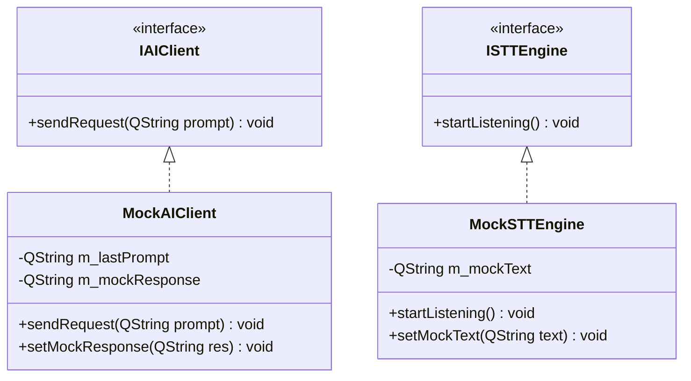

# 単体試験仕様書 (Unit Test Specification)

## 1. 概要
本仕様書は、詳細設計書（`DetailedDesign.md`）で定義された各クラスのメソッドの単体機能、およびスレッドをまたぐ直前のロジックを検証するための自動試験項目を定義する。
本試験は、Google Test (GTest) または Qt Test (QTest) を用いて自動実行する。画面操作を伴うGUIそのものの検証は手動とし、GUIのアクションスロットから呼び出されるビジネスロジックの開始点から、外部送信の直前までを自動テストのスコープとする。

---

## 2. 自動テストのためのモック・スタブ設計

自動テスト時、実際のネットワーク通信や音声デバイス操作をバイパスするため、以下のスタブ（Mock）クラスを作成する。



### 2.1 `MockAIClient` (AI APIのスタブ)
- **責務:** 外部のAIサーバー（Mistral API）に実際にリクエストを送らず、テスト側で指定した応答テキストをシグナル `requestFinished` を通じて即時（非同期）に返却する。
- **検証可能項目:** コアからのリクエストが正しい形式でAIモジュールに到達したか（送信直前のpromptが期待通りか）。

### 2.2 `MockSTTEngine` (音声認識のスタブ)
- **責務:** マイク入力やWhisperの処理を行わず、テスト側で指定した文字列を `transcriptionFinished` シグナルを通じて返却する。
- **検証可能項目:** 音声認識が完了した後のコアおよびUIの動作フロー。

---

## 3. 単体試験項目一覧

### 3.1 `CoreModule` の単体試験 (GTest/QTest)

| 試験ID | 対象メソッド/シグナル | 試験条件 | 期待される結果 (アサート項目) |
| :--- | :--- | :--- | :--- |
| **UT-CORE-01** | `on_startSTTRequested()` | コールバック/スロットが呼び出される。 | コアから `requestSTTStart()` シグナルが発火すること。 |
| **UT-CORE-02** | `on_directInputSubmitted()` | 引数に `"こんにちは"` を渡して呼び出す。 | 1. `notifyEventToUI` シグナルが `EventType::DirectInputSubmitted` で発火すること。<br>2. `requestAI("こんにちは")` シグナルが発火すること。 |
| **UT-CORE-03** | `on_notify_events()` | `EventType::VoiceInputCompleted` (text: `"テスト命令"`) のイベントを受信する。 | 1. 内部ステータスが思考中になること。<br>2. `notifyEventToUI` が `EventType::AIRequestSent` で発火すること。<br>3. `requestAI("テスト命令")` シグナルが発火すること。 |

---

### 3.2 `STTManager` の単体試験 (GTest/QTest)

| 試験ID | 対象クラス・メソッド | 試験条件 | 期待される結果 (アサート項目) |
| :--- | :--- | :--- | :--- |
| **UT-STT-01** | `STTManager` (エンジン切り替え) | `setEngine("whisper")` を実行後、`on_startListening()` を呼ぶ。 | `WhisperEngine` の `startListening()` が呼ばれること。 |
| **UT-STT-02** | `STTManager` (エンジン切り替え) | `setEngine("sapi")` を実行後、`on_startListening()` を呼ぶ。 | `SAPIEngine` の `startListening()` が呼ばれること。 |
| **UT-STT-03** | `STTManager` & `MockSTTEngine` | `MockSTTEngine` に `"音声入力テキスト"` をセットし、`on_startListening()` を実行する。 | `STTManager::notifyEvent` シグナルが `EventType::VoiceInputCompleted` (text: `"音声入力テキスト"`) で発火すること。 |

---

### 3.3 `AIClientManager` の単体試験 (GTest/QTest)

| 試験ID | 対象クラス・メソッド | 試験条件 | 期待される結果 (アサート項目) |
| :--- | :--- | :--- | :--- |
| **UT-AI-01** | `AIClientManager` & `MockAIClient` | `on_requestAI("AIへの問いかけ")` を呼び出す。 | 1. `AIClientManager::notifyEvent` が `EventType::AIRequestSent` で発火すること。<br>2. `MockAIClient` の `sendRequest` が引数 `"AIへの問いかけ"` で呼ばれること。 |
| **UT-AI-02** | `AIClientManager` & `MockAIClient` | `MockAIClient` に応答 `"AIの答え"` をセットし、`on_requestAI()` を呼ぶ。 | `AIClientManager::notifyEvent` シグナルが `EventType::AIResponseReceived` (text: `"AIの答え"`) で発火すること。 |
| **UT-AI-03** | `AIClientManager` (翻訳コマンド) | `on_requestAI("trans en Hello")` および `on_requestAI("trans こんにちは")` を呼び出す。 | 1. コマンド判定により `AIRequestSent` および `AIResponseReceived` が発生し、翻訳結果のみが返ること。<br>2. 対話履歴（`m_chatHistory`）に追加されず、履歴の非汚染が保証されること。 |
| **UT-AI-04** | `AIClientManager` (ニックネーム本人/配信主登録) | 申請者 alice、対象者 alice、ニックネーム「ありちゃん」で `handleNicknameUpdateRequest` を実行する。 | 1. 戻り値が成功（`Success:`）であること。<br>2. `user_names.json` の `users.alice.preferred` が「ありちゃん」に登録・保存されること。 |
| **UT-AI-05** | `AIClientManager` (ニックネーム他者保留登録) | 申請者 bob、対象者 alice、ニックネーム「ありんこ」で `handleNicknameUpdateRequest` を実行する。 | 1. 戻り値が保留通知（`Notification:`）であること。<br>2. `user_names.json` の `pending_requests` に bob からの申請が追加され記憶されること。<br>3. `users` には bob からの申請は適用されないこと（承認前のため）。 |
| **UT-AI-06** | `AIClientManager` (配信主承認/却下) | 手動で保留リクエストを注入した状態で、配信主が `approveNicknameRequest` または `rejectNicknameRequest` を呼び出す。 | 1. 承認時は `users` セクションにニックネームが移動され、保留リストから消去されること。<br>2. 却下時は登録されず保留リストから消去されること。 |
| **UT-AI-07** | `AIClientManager` (スラッシュコマンド判定) | Direct Input（`user` が空）で `/open_folder` または `/cancel` を実行する。 | 1. `MockAIClient::sendRequest` は呼び出されないこと（LLMバイパス）。<br>2. `/open_folder` の場合は 10分タイマーが開始し、状態が `AwaitingFileAndExplanation` になること。<br>3. `/cancel` の場合はタイマーが停止し、状態が `Idle` になること。<br>4. 不正なコマンド（`/invalid`）は即座にエラーイベントが通知されること。 |
| **UT-AI-08** | `AIClientManager` (10分タイムアウト) | `AwaitingFileAndExplanation` 状態で、10分タイマーがタイムアウト（`onImportTimeout`）する。 | 1. 状態が `CancelConfirmation` に遷移すること。<br>2. ユーザーへキャンセル確認の通知イベントが発生すること。 |
| **UT-AI-09** | `AIClientManager` (一時ファイル確認と読込) | `AwaitingFileAndExplanation` 状態で、一時フォルダに `test.md` を配置し、チャットで「test.mdの説明」を入力する。 | 1. 10分タイマーが停止すること。<br>2. `test.md` の内容が読み込まれ、メンバ変数 `m_importingFileContent` に保持されること。<br>3. 状態が `QandAMode` に遷移し、AI要求（ファイル内容＋説明）が送信されること。 |
| **UT-AI-10** | `AIClientManager` (ナレッジ本登録とメタデータ) | `QandAMode` 状態で、本登録ツール `finalizeKnowledgeImport("タイトル", "説明", キーワードリスト)` を実行する。 | 1. 一時フォルダのファイルが `log/knowledge/` にコピー・リネームされること。<br>2. `knowledge_metadata.json` にメタデータ（タイトル、説明、キーワード、ファイル名）が正しく追加保存されること。<br>3. 状態が `Idle` に戻り、UI更新シグナル `knowledgeMetadataUpdated` が発火すること。 |
| **UT-AI-11** | `AIClientManager` (セキュリティ制限) | Twitch/Discord（`user` が非空）から、`/open_folder` やナレッジ登録関連の入力を行う。 | 1. コマンド判定がバイパスされ、AIクライアントへのツール追加や実行が拒否・無視されること（Twitch/Discordからはナレッジ操作不可）。 |
| **UT-AI-12** | `AIClientManager` (システム固定自動応答) | プロンプト「version」や「アバターが使っているAIは？」、「マイクラのバージョン教えて」で `on_requestAI` を実行する。 | 1. バージョン単体やアバター指定のバージョン/AI問い合わせに対して、AIクライアントが呼ばれず（バイパス）、即座に `EventType::AIResponseReceived` が発生し、正しい固定テキストが返ること。<br>2. アバターを修飾しない無関係な対象のバージョン（「マイクラのバージョン」など）や、無関係なAIの問い合わせはバイパスされず、通常のAI処理へ送られること。 |


---

### 3.4 `AvatarWindow` (UIロジック) の単体試験

※画面上のピクセル描画自体ではなく、透過と位置計算ロジックのみを対象とする。

| 試験ID | 対象メソッド | 試験条件 | 期待される結果 (アサート項目) |
| :--- | :--- | :--- | :--- |
| **UT-UI-01** | `applyTransparency` | テスト用の白背景画像と、透過座標 `(0,0)` を渡す。 | 1. 出力された `QPixmap` の外側背景部分がすべて透過（アルファ 0）になること。<br>2. キャラクター内部（白で囲まれた目の部分）のピクセルは不透過（アルファ 255）のままであること。 |
| **UT-UI-02** | `updateWindowPosition` | `idle` (anchorX: 100, anchorY: 150) の設定で、目標位置 `(500, 500)` を指定する。 | `AvatarWindow::geometry()` の座標が `(400, 350)` に移動（`move()`）すること。 |
| **UT-UI-03** | `updateWindowPosition` | `thinking` (anchorX: 105, anchorY: 152) に切り替える（目標位置 `(500, 500)` は維持）。 | `AvatarWindow::geometry()` の座標が `(395, 348)` に自動移動すること。 |

---

### 3.5 セキュリティ検証 (TrustChain) の単体試験

| 試験ID | 対象クラス・メソッド | 試験条件 | 期待される結果 (アサート項目) |
| :--- | :--- | :--- | :--- |
| **UT-SEC-01** | `extractCopyrightFromFile` | 有効な `BinMarkManager` 署名（`[BM_START]\nPlain=AiAssistantAvatar, Copyright...\n[BM_END]`）が末尾にあるダミーファイルを渡す。 | 署名から `Plain=` 部分の値が正しく抽出され、改行文字や空白がトリミングされて返されること。 |
| **UT-SEC-02** | `extractCopyrightFromFile` | 署名が存在しない空の、または無効なダミーファイルを渡す。 | 返り値として空文字列（`QString()`）が返ること。 |
| **UT-SEC-03** | `applyWatermark` | `AuthStatus::Watermarked` 状態で QMainWindow とともに呼び出す。 | 1. ウィンドウのタイトルバーに `AiAssistantAvatar` を含むコピーライトが設定されること。<br>2. ステータスバーが表示され、コピーライトメッセージと特定のスタイルが適用されること。 |
| **UT-SEC-04** | `AIClientManager` (履歴更新通知) | 新しい応答を受信し、対話履歴を追加する。 | 1. 対話履歴リストに新しいやり取りが追加されること。<br>2. `chatHistoryUpdated` シグナルが最新履歴を伴って発火すること。 |
| **UT-SEC-05** | `AIClientManager::resetSession` (手動) | `resetSession(true)` を呼び出す。 | 1. `log/` ディレクトリ配下に `session_backup_...enc` が生成されること。<br>2. メモリの履歴がクリア（直近1往復分を除く）されること。<br>3. `notifyEvent` シグナルが UI 通知用として発火すること。 |
| **UT-SEC-06** | `AIClientManager::resetSession` (自動) | `resetSession(false)` を呼び出す。 | 1. 暗号化バックアップファイルが生成されること。<br>2. メモリの履歴がクリア（直近1往復分を除く）されること。<br>3. UI通知用シグナルは一切発火しないこと。 |
| **UT-SEC-07** | `AIClientManager::importSessionBackup` | 有効な `.enc` バックアップファイルを指定してインポートを実行する。 | 1. メモリ上の履歴が復号されたデータで正しく上書きされること。<br>2. `chatHistoryUpdated` シグナルが発火すること。 |
| **UT-SEC-08** | `AIClientManager::exportSessionBackup` | 有効な `.enc` バックアップファイルを指定し、エクスポート先の `.txt` ファイルパスを指定してエクスポートを実行する。 | 1. 指定された `.txt` ファイルに会話履歴が平文のテキスト形式で正しく書き出されること。<br>2. 完了時に通知イベントが発火すること。 |
| **UT-SEC-09** | WebSocket配信用初期化 | `QWebSocketServer` を起動し、ダミーの WebSocket クライアントを接続させる。 | 接続確立直後に `Init` タイプの JSON データ（現在の状態とテキスト）がプッシュ送信されること。 |
| **UT-SEC-10** | 設定動的適用 | `local_settings.json` の内容を書き換えた後、`on_settingsUpdated()` を呼び出す。 | 各モジュール（AIClientManager、TwitchReader）が設定ファイルを再読み込みし、プロバイダやウェイクワード設定が動的に更新されること。 |

---

### 3.6 Web検索モジュールおよび Function Calling の単体試験

| 試験ID | 対象クラス・メソッド | 試験条件 | 期待される結果 (アサート項目) |
| :--- | :--- | :--- | :--- |
| **UT-SEARCH-01** | `DuckDuckGoSearchProvider` | DuckDuckGo HTML版のダミー結果HTMLを入力とする。 | HTMLタグやエンティティ（`&amp;`等）が正しくデコードされ、上位3〜5件のタイトルとスニペットが整形テキストとしてパースされること。 |
| **UT-SEARCH-02** | `SearchManager` (フォールバック) | Tavily検索実行時に接続エラーまたはHTTPエラーをモックする。 | 自動的かつサイレントに `DuckDuckGoSearchProvider` が起動し、DDGの検索結果が得られること。 |
| **UT-SEARCH-03** | `MistralAIClient` (Function Calling) | API応答JSONとして `tool_calls` (web_search) を含むレスポンスを入力する。 | `web_search` ツール呼び出しを検出し、引数 `query` を抽出して `SearchManager::executeSearch` を呼び出すこと。 |

---

## 4. 自動テスト用コードのサンプルイメージ

GTestを用いた `CoreModule` のテストコード実装例：

```cpp
#include <gtest/gtest.h>
#include <QSignalSpy>
#include "core_module.h"

TEST(CoreModuleTest, DirectInputTriggersAIRequest) {
    CoreModule core;
    
    // シグナルのスパイを設定
    QSignalSpy spyUI(&core, &CoreModule::notifyEventToUI);
    QSignalSpy spyAI(&core, &CoreModule::requestAI);
    
    // 直接入力を擬似送信
    core.on_directInputSubmitted("こんにちは");
    
    // アサート: 適切なシグナルが発火したか
    ASSERT_EQ(spyUI.count(), 1);
    QList<QVariant> argumentsUI = spyUI.takeFirst();
    AppEvent event = argumentsUI.at(0).value<AppEvent>();
    EXPECT_EQ(event.type, EventType::DirectInputSubmitted);
    EXPECT_EQ(event.text, "こんにちは");
    
    ASSERT_EQ(spyAI.count(), 1);
    QList<QVariant> argumentsAI = spyAI.takeFirst();
    EXPECT_EQ(argumentsAI.at(0).toString(), "こんにちは");
}
```

---

### 3.7 GroqAIClient の単体試験

| 試験ID | 対象クラス・メソッド | 試験条件 | 期待される結果 |
| :--- | :--- | :--- | :--- |
| **UT-GROQ-01** | `GroqAIClient::setApiKey` | 有効なキーを設定後 `sendRequest` を呼ぶ。 | `Authorization: Bearer <key>` ヘッダーが付与されてリクエストが送信されること。 |
| **UT-GROQ-02** | `GroqAIClient::sendRequest` | APIキーが空の状態で `sendRequest` を呼ぶ。 | `requestFinished(false)` が発火し、エラーメッセージが返ること。 |
| **UT-GROQ-03** | `GroqAIClient::clientId` | `clientId()` を呼ぶ。 | `"groq"` を返すこと。 |
| **UT-GROQ-04** | `GroqAIClient::defaultStatus` | `defaultStatus()` を呼ぶ。 | `rpmMax=30`, `rpdMax=14400`, `contextWindow=131072`, `toolCall=true`, `cost=0.0` であること。 |
| **UT-GROQ-05** | `GroqAIClient::setModel` | 空文字を渡して `setModel` を呼ぶ。 | モデルが変更されず `"llama-3.1-8b-instant"` のままであること。 |

---

### 3.8 RateLimitTracker の単体試験

| 試験ID | 対象クラス・メソッド | 試験条件 | 期待される結果 |
| :--- | :--- | :--- | :--- |
| **UT-RLT-01** | `registerClient` | Groqのデフォルト `ProviderStatus` を登録する。 | `statusOf("groq").rpmMax == 30` かつ `available == true` であること。 |
| **UT-RLT-02** | `updateFromReply` | `x-ratelimit-remaining-requests: 5` を含むモックレスポンスを渡す。 | `statusOf("groq").rpmRemaining == 5` に更新されること。 |
| **UT-RLT-03** | `isAvailable` | `rpmRemaining = 0` に設定後 `isAvailable("groq")` を呼ぶ。 | `false` を返すこと。 |
| **UT-RLT-04** | `isAvailable` | `rpmRemaining = 1` の状態で `isAvailable("groq")` を呼ぶ。 | `true` を返すこと。 |
| **UT-RLT-05** | `earliestResetTime` | 全クライアントが `available=false`、GroqのresetAtが最も近い場合。 | `ResetInfo.clientId == "groq"` かつ `resetAt` が最小値であること。 |
| **UT-RLT-06** | `formatWaitMessage` | RPM制限で2分後リセットの `ResetInfo` を渡す。 | 「最短で2分後に使用可能になります（Groq RPM制限解除）。」形式の文字列が返ること。 |
| **UT-RLT-07** | `recordLatency` | 5回分のレイテンシ（100, 200, 300, 400, 500ms）を記録する。 | `latencyMs` が移動平均（300ms）であること。 |
| **UT-RLT-08** | `saveToFile / loadFromFile` | 保存後に別インスタンスでロードする。 | `rpdRemaining`・`tpdRemaining` が保存値と一致すること。 |
| **UT-RLT-09** | `loadFromFile` | `day_start` が前日のファイルをロードする。 | `rpdRemaining` がデフォルト値にリセットされること。 |

---

### 3.9 AIRouter の単体試験

| 試験ID | 対象クラス・メソッド | 試験条件 | 期待される結果 |
| :--- | :--- | :--- | :--- |
| **UT-ROUT-01** | `AIRouter::selectClient` | 全クライアント `available=true`、優先度 `["groq","cerebras","mistral"]`。 | `"groq"` を返すこと。 |
| **UT-ROUT-02** | `AIRouter::selectClient` | Groqが `available=false`、Cerebrasが `available=true`。 | `"cerebras"` を返すこと。 |
| **UT-ROUT-03** | `AIRouter::selectClient` | 全クライアントが `available=false`。 | 空文字 `""` を返すこと。 |
| **UT-ROUT-04** | `AIRouter::selectClient` | 優先度リストが空の場合。 | 空文字 `""` を返すこと。 |

---

### 3.10 接続時挨拶設定の単体試験

| 試験ID | 対象クラス・メソッド | 試験条件 | 期待される結果 (アサート項目) |
| :--- | :--- | :--- | :--- |
| **UT-GREET-01** | `TwitchReader::loadSettings` | `local_settings.json` に `"twitch_greeting_enabled": true` が設定されている。 | 内部フラグ `m_greetingEnabled` が `true` に設定されること。 |
| **UT-GREET-02** | `TwitchReader::loadSettings` | `local_settings.json` に `"twitch_greeting_enabled"` は存在せず、旧キー `"greeting_enabled": true` が存在する。 | フォールバックが働き、`m_greetingEnabled` が `true` に設定されること。 |
| **UT-GREET-03** | `DiscordReader::loadSettings` | `local_settings.json` に `"discord_greeting_enabled": true` が設定されている。 | 内部フラグ `m_greetingEnabled` が `true` に設定されること。 |
| **UT-GREET-04** | `DiscordReader::loadSettings` | `local_settings.json` に `"discord_greeting_enabled"` は存在せず、旧キー `"greeting_enabled": true` が存在する。 | フォールバックが働き、`m_greetingEnabled` が `true` に設定されること. |

---

### 3.11 外部スケジュール API 連携機能の単体試験

| 試験ID | 対象クラス・メソッド | 試験条件 | 期待される結果 (アサート項目) |
| :--- | :--- | :--- | :--- |
| **UT-SCHED-01** | `AIClientManager::fetchSchedules` | ローカルに保存したテスト用の擬似 JSON レスポンスファイル（`schedules_response.json`）をロードして復号処理を実行。 | `TransCipher` によりタイトル `"joPsj/8IBE..."` が `"【非公開】WebHook用HTML"` などの正しい日本語文字列に復号されること。 |
| **UT-SCHED-02** | `AIClientManager::on_requestAI` | Discord 経由（`"[Discord:123] streamer"`）または UI直接入力（`""`）で「予定教えて」と入力する。 | トリガーが検知され、システムプロンプト（`additionalSystemPrompt`）の末尾にスケジュール連携コンテキストが自動でインジェクションされること。 |
| **UT-SCHED-03** | `AIClientManager::on_requestAI` | Twitch 経由（`"[Twitch] streamer"`）でウェイクワード等を含み「予定教えて」と入力する。 | 全入力ソース対応によりトリガーが検知され、Twitch コメント入力時であってもスケジュール API から最新データを取得しシステムプロンプトにインジェクションされること。 |

---

### 3.12 レイド・クリエイター自動紹介機能 (F-22) の単体試験

| 試験ID | 対象クラス・メソッド | 試験条件 | 期待される結果 (アサート項目) |
| :--- | :--- | :--- | :--- |
| **UT-RAID-01** | `TwitchReader::on_messageReceived` | Twitch IRC から `USERNOTICE` (`msg-id=raid`, `msg-param-displayName=RaiderUser`) を受信する。 | `AppEvent(EventType::TwitchRaidReceived)` が発火し、`RaiderUser` のユーザー名・表示名が格納されて通知されること。 |
| **UT-RAID-02** | `AIClientManager::handleRaidShoutout` | レイド受信イベントが発生し、`TwitchHelixClient` のモックレスポンス（Bio: "ゲーム配信者", Game: "Minecraft", Title: "建築配信"）をセット。 | 1. Twitch Helix API から情報を正しく取得・パースすること。<br>2. クリエイター情報を含んだ紹介文生成プロンプトが組み立てられ、AIクライアントに送信されること。 |
| **UT-RAID-03** | `AIClientManager::parseBioUrls` | Bio テキスト `"公式Twitter: https://twitter.com/example_user 不正URL: http://unknown.site"` を入力して解析実行。 | 公式 Twitter/X / YouTube などの公開URLのみが抽出され、不確実なキーワード検索を行わずに情報が補完されること。 |
| **UT-RAID-04** | `AIClientManager::sendShoutoutMessage` | `shoutout_use_announce = true`, `shoutout_announce_color = "random"` で紹介コメント送信処理を呼ぶ。 | `/announce [blue|green|orange|purple]` のランダム指定付きでチャット投稿コマンドが生成・送信されること。 |
| **UT-RAID-05** | `AIClientManager::handleRaidShoutout` | `shoutout_use_command = true`, クールタイム外の状態でレイドを受信する。 | 1. `/shoutout [ユーザー名]` コマンドがチャットへ送信されること。<br>2. 120 秒のタイマー `m_shoutoutCooldownTimer` が開始すること。 |
| **UT-RAID-06** | `AIClientManager::handleRaidShoutout` | `/shoutout` クールタイム（120秒以内）中に連続してレイド/紹介要求が発生する。 | 1. AIによる紹介文のチャット投稿（/announce含む）・アバター吹き出し・TTSイベント通知は即時実行されること。<br>2. `/shoutout` コマンドが待機キュー (`m_shoutoutQueue`) に追加されること。<br>3. UIにキュー一覧更新通知 (`ShoutoutQueueUpdated`) が届き、待機中ユーザーと残り秒数が表示されること。<br>4. 120秒経過時のタイマータイムアウト時にキュー先頭の `/shoutout` が自動遅延送信されること。 |
| **UT-RAID-07** | `AIClientManager::on_shoutoutSuccessReceived` | Twitch から `/shoutout` 成功 NOTICE (`msg-id=shoutout_success`) を受信し、`shoutout_follow_msg_enabled = true` の状態。 | テンプレート `{name}` が置換されたフォロー呼びかけコメント（例: `"ぜひ RaiderUser さんをフォローしてね！"`）がチャットへ追加投稿されること。 |

---

### 3.13 アバタースキン切替・ディレクトリ管理機能 (F-23) の単体試験

| 試験ID | 対象クラス・メソッド | 試験条件 | 期待される結果 (アサート項目) |
| :--- | :--- | :--- | :--- |
| **UT-SKIN-01** | `AvatarWindow::scanSkins` | `pic/` 配下に `FishEatCatSkin/`, `CustomSkin/` ディレクトリが存在する状態でスキャンを実行。 | スキン選択 QComboBox (`m_comboAvatarSkin`) に両方のフォルダ名が選択肢として一覧取得・追加されること。 |
| **UT-SKIN-02** | `AvatarWindow::on_skinChanged` | スキンを `FishEatCatSkin` に変更・保存する。 | 1. `local_settings.json` の `"avatar_skin"` が `"FishEatCatSkin"` で保存されること。<br>2. `ObsHttpServer` の Document Root が `pic/FishEatCatSkin/` に即座に一括更新されること。 |

---

### 3.14 アバター画像指定3モード ＆ 状態タイマー制御 (F-24) の単体試験

| 試験ID | 対象クラス・メソッド | 試験条件 | 期待される結果 (アサート項目) |
| :--- | :--- | :--- | :--- |
| **UT-ANIM-01** | `AvatarSettingsParser::parse` | `"mode": "single"` の設定項目（位置・透過含む）を読み込む。 | 単一ファイル名、`anchorX/Y`, `transparentX/Y` が正確にパースされること。 |
| **UT-ANIM-02** | `AvatarSettingsParser::parse` | `"mode": "random"` の設定項目を読み込む。 | 画像リスト `files` が取得され、抽選呼び出し時にリスト内から1枚がランダム選択されること。 |
| **UT-ANIM-03** | `AvatarSettingsParser::parse` | `"mode": "sequence"` の設定項目（`frame_interval_ms: 100`）を読み込む。 | 画像フレーム配列およびコマ送り速度が正しくパース・保持されること。 |
| **UT-ANIM-04** | `AvatarAnimationScheduler` | 入力受信/AI処理/AI応答イベントが発生する。 | `listening` ➔ `thinking` ➔ `speaking` の順にそれぞれの `duration_ms` タイマーが起動し、完了後に自動で `idle` 状態へ復帰すること。 |

---

### 3.15 アバタースキン自動生成・GUI編集機能 (F-25) の単体試験

| 試験ID | 対象クラス・メソッド | 試験条件 | 期待される結果 (アサート項目) |
| :--- | :--- | :--- | :--- |
| **UT-BUILDER-01** | `AvatarSkinBuilder::generateSkinDir` | 新規スキン名 `"MyCustomSkin"` を指定して保存処理を実行。 | `pic/MyCustomSkin/` ディレクトリが生成され、指定された画像ファイルが正常にコピー配置されること。 |
| **UT-BUILDER-02** | `AvatarSkinBuilder::generateSettingsJson` | GUI上で設定された各状態のモード・ファイルリスト・座標・時間を渡して生成。 | 正しい構造の `avatar_settings.json` が `pic/MyCustomSkin/` 内にパースエラー無く書き出されること。 |
| **UT-BUILDER-03** | `AvatarSkinBuilder::generateObsHtml` | 新規スキンの保存処理を実行。 | `pic/MyCustomSkin/avatar_obs.html` がテンプレートから正常に生成・配置されること。 |

---

### 3.16 多層スコア判定・文脈保護・中立検索連携フィルタリング機能 (F-26) の単体試験

| 試験ID | 対象クラス・メソッド | 試験条件 | 期待される結果 (アサート項目) |
| :--- | :--- | :--- | :--- |
| **UT-MODERATION-01** | `ScoreModerationEngine::evaluate` | 危険単語を含む文章（「覚醒剤」）を渡す。 | カテゴリスコア (+40) が正しく加算され、スコアが正確に算出されること。 |
| **UT-MODERATION-02** | `ScoreModerationEngine::evaluate` | ゲームタイトル・文脈を含む文章（「Elinで薬物を売った」）を渡す。 | `game_context` による減算 (-40) が適用され、最終スコア 0点 (SAFE) と判定されること。 |
| **UT-MODERATION-03** | `ScoreModerationEngine::evaluate` | 直前がゲーム文脈かつ危険教意思図を含む文章（「覚醒剤の作り方を教えて」）を渡す。 | `instruction` (+50) が検知され、過去履歴減算がキャンセルされて 90点 (BLOCK) と判定されること。 |

---

### 3.17 AI向けランダム値取得 I/F (F-27) の単体試験

| 試験ID | 対象クラス・メソッド | 試験条件 | 期待される結果 (アサート項目) |
| :--- | :--- | :--- | :--- |
| **UT-RANDOM-01** | `AIRandomUtils::getRandom` | `getRandom(1, 6)` を 100 回試行する（正常系・標準ダイス）。 | 返却値がすべて $1 \le x \le 6$ の範囲内であること。 |
| **UT-RANDOM-02** | `AIRandomUtils::getRandom` | `getRandom(5, 5)` を呼ぶ（境界値・最小最大同一）。 | 返却値が常に `5` であること。 |
| **UT-RANDOM-03** | `AIRandomUtils::getRandom` | `getRandom(10, 1)` を呼ぶ（異常系・引数逆転）。 | 自動的に引数が反転補正され、返却値が $1 \le x \le 10$ の範囲内であること。 |
| **UT-RANDOM-04** | `AIRandomUtils::getRandomList` | `getRandomList(10, 3)` を呼ぶ（正常系・重複なし抽出）。 | 1. 返却リストの要素数が `3` であること。<br>2. 全要素が $0 \le x \le 10$ の範囲内であること。<br>3. リスト内の全要素に重複がないこと（相異なる）。 |
| **UT-RANDOM-05** | `AIRandomUtils::getRandomList` | `getRandomList(5, 10)` を呼ぶ（境界値・要求個数オーバー）。 | 候補数 $5+1=6$ 個を超える要求に対し、取得可能な上限個数 `6` 個の重複なしリストが返ること。 |
| **UT-RANDOM-06** | `AIRandomUtils::getRandomList` | `getRandomList(10, 0)` および `getRandomList(10, -2)` を呼ぶ（異常系・無効な個数）。 | 空のリスト (`QList<int>()`) が返ること。 |
| **UT-RANDOM-07** | `AIRandomUtils::parseAndEvaluate` | 文字列 `"結果: Random(1, 6) リスト: RandomList(5, 3)"` をパース評価する（文字列マクロ置換）。 | 1. `"Random(1, 6)"` 部分が抽出結果の数値（1〜6）に置換されること。<br>2. `"RandomList(5, 3)"` 部分がカンマ区切りの非重複数値リスト（例: `"1, 3, 5"`）に置換されること。 |

---

### 3.18 Twitch コメント受信サイレント切断自動復旧 Watchdog (F-28) の単体試験

| 試験ID | 対象クラス・メソッド | 試験条件 | 期待される結果 (アサート項目) |
| :--- | :--- | :--- | :--- |
| **UT-WATCHDOG-01** | `TwitchReader::onTextMessageReceived` | テキストメッセージ（PING / PRIVMSG）を受信する。 | 内部変数 `m_lastDataReceivedTime` が呼び出し時の最新日時へ即座に更新されること。 |
| **UT-WATCHDOG-02** | `TwitchReader::checkWatchdog` | 通信正常時（`m_lastDataReceivedTime` が 10 秒前）。 | Watchdog がスルーされ、自動再接続（`connectToTwitch`）が発火しないこと。 |
| **UT-WATCHDOG-03** | `TwitchReader::checkWatchdog` | サイレント切断偽装（`m_lastDataReceivedTime` を 200 秒前に擬似設定）。 | 1. Watchdog により 180 秒超過の無通信・ゾンビ接続が探知されること。<br>2. 古い WebSocket インスタンスが安全に閉鎖・破棄され、`connectToTwitch()` によるバックグラウンド自動再接続が正常に発火すること。 |

---

### 3.19 マークダウン汎用データストレージ ＆ インデックス抽出 (F-29) の単体試験

| 試験ID | 対象クラス・メソッド | 試験条件 | 期待される結果 (アサート項目) |
| :--- | :--- | :--- | :--- |
| **UT-TABLEDB-01** | `MarkdownTableEngine::scanDirectory` | テスト用フォルダ `test_knowledge/Elin/装備/片手剣.md` を生成して読み込む。 | 情報グループ `"Elin"`, カテゴリ `"装備"`, テーブル名 `"片手剣"` が正確に認識されインデックス化されること。 |
| **UT-TABLEDB-02** | `MarkdownTableEngine::queryColumn` | `queryColumn("Elin", "装備", "片手剣", "鉄の剣", "必要素材")` を実行。 | 返却文字列が `"鉄鉱石x3, 木材x1"` と完全一致すること。 |
| **UT-TABLEDB-03** | `MarkdownTableEngine::selectRandomColumn` | `selectRandomColumn("Elin", "装備", "片手剣", "武器名")` を複数回呼び出す。 | テーブル内のいずれかの武器名（例: `"鉄の剣"` や `"炎の小剣"`）がランダムに取得されること。 |
| **UT-TABLEDB-04** | `MarkdownTableEngine::isPathSafe` | `isPathSafe("../../../windows/system32")` 等の相対パス抜け出しをテスト。 | 判定結果 `false` となり、`knowledge/` 外部へのアクセスが安全に遮断されること。 |
| **UT-TABLEDB-05** | `MarkdownTableEngine::parseAndEvaluate` | 文章 `"装備: TableSearch(Elin, 装備, 片手剣, 鉄の剣, 攻撃力)"` を評価。 | `"TableSearch(...)"` 部分が `"15"` に置換され、文章全体が正しく展開されること。 |
| **UT-TABLEDB-06** | `MarkdownTableEngine::searchRelevantContext` | 自然文クエリ `"鉄の剣の必要素材を教えて"` を入力して検索。 | 該当するテーブルレコード行が抽出され、AIプロンプトインジェクション用コンテキスト文字列が自動生成されること。 |

---

### 3.20 レイド自動紹介・シャウトアウト・アナウンスルーティング単体試験

| 試験ID | 対象クラス・メソッド | 試験条件 | 期待される結果 (アサート項目) |
| :--- | :--- | :--- | :--- |
| **UT-SHOUTOUT-01** | `AIClientManager::on_AIResponseReceived` | `m_isShoutoutRequest = true`, `m_shoutoutUseAnnounce = true` の状態で AIレスポンスを受信する。 | 応答テキストの先頭に `/announce <color>` プレフィックスが正常に自動付与されること。 |
| **UT-SHOUTOUT-02** | `TwitchReader::on_requestTwitchSend` | `on_requestTwitchSend("channel", "/announce blue test message")` を呼び出す。 | `/announce` プレフィックスが文字消去されず、そのまま `PRIVMSG #channel :/announce blue test message` として送信されること。 |
| **UT-SHOUTOUT-03** | `AIClientManager::handleRaidShoutout` | `handleRaidShoutout("targetuser")` を実行し、`/shoutout` イベントを生成する。 | 1. 発行されるイベントの `extraData` に `twitch_channel` が含まれること。<br>2. `CoreModule` 経由で `requestTwitchSend` へ確実にルーティングされること。 |

---

### 3.21 アバター共通・応答設定UIの独立グループボックス化 (F-30) の単体試験

| 試験ID | 対象クラス・メソッド | 試験条件 | 期待される結果 (アサート項目) |
| :--- | :--- | :--- | :--- |
| **UT-UISETTING-01** | `AvatarWindow::initSettingsTab` | 設定画面を生成し、グループボックス構造を検証する。 | 「アバター共通・応答設定」グループボックスが存在し、アバター名・名前反応・ウェイクワード・判定項目が正常に組み込まれていること。 |
| **UT-UISETTING-02** | `AvatarWindow::saveSettingsFromUI` / `loadSettingsToUI` | 「アバター共通・応答設定」で入力したアバター名・ウェイクワード等の値を保存・復元する。 | `local_settings.json` との間でデータの保存・読み込みおよび `TwitchReader` / `AIClientManager` への反映が正常に行われること。 |


