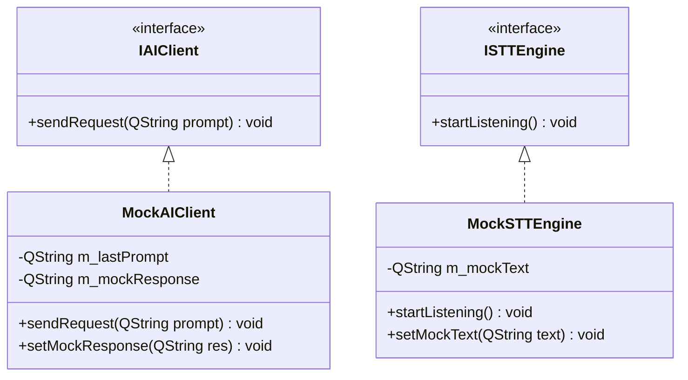

# 単体試験仕様書 (Unit Test Specification)

## 1. 概要
本仕様書は、詳細設計書（`DetailedDesign.md`）で定義された各クラスのメソッドの単体機能、およびスレッドをまたぐ直前のロジックを検証するための自動試験項目を定義する。
本試験は、Google Test (GTest) または Qt Test (QTest) を用いて自動実行する。画面操作を伴うGUIそのものの検証は手動とし、GUIのアクションスロットから呼び出されるビジネスロジックの開始点から、外部送信の直前までを自動テストのスコープとする。

---

## 2. 自動テストのためのモック・スタブ設計

自動テスト時、実際のネットワーク通信や音声デバイス操作をバイパスするため、以下のスタブ（Mock）クラスを作成する。



### 2.1 `MockAIClient` (AI APIのスタブ)
- **責務:** 外部のAIサーバー（Mistral API）に実際にリクエストを送らず、テスト側で指定した応答テキストをシグナル `requestFinished` を通じて即時（非同期）に返却する。
- **検証可能項目:** コアからのリクエストが正しい形式でAIモジュールに到達したか（送信直前のpromptが期待通りか）。

### 2.2 `MockSTTEngine` (音声認識のスタブ)
- **責務:** マイク入力やWhisperの処理を行わず、テスト側で指定した文字列を `transcriptionFinished` シグナルを通じて返却する。
- **検証可能項目:** 音声認識が完了した後のコアおよびUIの動作フロー。

---

## 3. 単体試験項目一覧

### 3.1 `CoreModule` の単体試験 (GTest/QTest)

| 試験ID | 対象メソッド/シグナル | 試験条件 | 期待される結果 (アサート項目) |
| :--- | :--- | :--- | :--- |
| **UT-CORE-01** | `on_startSTTRequested()` | コールバック/スロットが呼び出される。 | コアから `requestSTTStart()` シグナルが発火すること。 |
| **UT-CORE-02** | `on_directInputSubmitted()` | 引数に `"こんにちは"` を渡して呼び出す。 | 1. `notifyEventToUI` シグナルが `EventType::DirectInputSubmitted` で発火すること。<br>2. `requestAI("こんにちは")` シグナルが発火すること。 |
| **UT-CORE-03** | `on_notify_events()` | `EventType::VoiceInputCompleted` (text: `"テスト命令"`) のイベントを受信する。 | 1. 内部ステータスが思考中になること。<br>2. `notifyEventToUI` が `EventType::AIRequestSent` で発火すること。<br>3. `requestAI("テスト命令")` シグナルが発火すること。 |

---

### 3.2 `STTManager` の単体試験 (GTest/QTest)

| 試験ID | 対象クラス・メソッド | 試験条件 | 期待される結果 (アサート項目) |
| :--- | :--- | :--- | :--- |
| **UT-STT-01** | `STTManager` (エンジン切り替え) | `setEngine("whisper")` を実行後、`on_startListening()` を呼ぶ。 | `WhisperEngine` の `startListening()` が呼ばれること。 |
| **UT-STT-02** | `STTManager` (エンジン切り替え) | `setEngine("sapi")` を実行後、`on_startListening()` を呼ぶ。 | `SAPIEngine` の `startListening()` が呼ばれること。 |
| **UT-STT-03** | `STTManager` & `MockSTTEngine` | `MockSTTEngine` に `"音声入力テキスト"` をセットし、`on_startListening()` を実行する。 | `STTManager::notifyEvent` シグナルが `EventType::VoiceInputCompleted` (text: `"音声入力テキスト"`) で発火すること。 |

---

### 3.3 `AIClientManager` の単体試験 (GTest/QTest)

| 試験ID | 対象クラス・メソッド | 試験条件 | 期待される結果 (アサート項目) |
| :--- | :--- | :--- | :--- |
| **UT-AI-01** | `AIClientManager` & `MockAIClient` | `on_requestAI("AIへの問いかけ")` を呼び出す。 | 1. `AIClientManager::notifyEvent` が `EventType::AIRequestSent` で発火すること。<br>2. `MockAIClient` の `sendRequest` が引数 `"AIへの問いかけ"` で呼ばれること。 |
| **UT-AI-02** | `AIClientManager` & `MockAIClient` | `MockAIClient` に応答 `"AIの答え"` をセットし、`on_requestAI()` を呼ぶ。 | `AIClientManager::notifyEvent` シグナルが `EventType::AIResponseReceived` (text: `"AIの答え"`) で発火すること。 |

---

### 3.4 `AvatarWindow` (UIロジック) の単体試験

※画面上のピクセル描画自体ではなく、透過と位置計算ロジックのみを対象とする。

| 試験ID | 対象メソッド | 試験条件 | 期待される結果 (アサート項目) |
| :--- | :--- | :--- | :--- |
| **UT-UI-01** | `applyTransparency` | テスト用の白背景画像と、透過座標 `(0,0)` を渡す。 | 1. 出力された `QPixmap` の外側背景部分がすべて透過（アルファ 0）になること。<br>2. キャラクター内部（白で囲まれた目の部分）のピクセルは不透過（アルファ 255）のままであること。 |
| **UT-UI-02** | `updateWindowPosition` | `idle` (anchorX: 100, anchorY: 150) の設定で、目標位置 `(500, 500)` を指定する。 | `AvatarWindow::geometry()` の座標が `(400, 350)` に移動（`move()`）すること。 |
| **UT-UI-03** | `updateWindowPosition` | `thinking` (anchorX: 105, anchorY: 152) に切り替える（目標位置 `(500, 500)` は維持）。 | `AvatarWindow::geometry()` の座標が `(395, 348)` に自動移動すること。 |

---

### 3.5 セキュリティ検証 (TrustChain) の単体試験

| 試験ID | 対象クラス・メソッド | 試験条件 | 期待される結果 (アサート項目) |
| :--- | :--- | :--- | :--- |
| **UT-SEC-01** | `extractCopyrightFromFile` | 有効な `BinMarkManager` 署名（`[BM_START]\nPlain=AiAssistantAvatar, Copyright...\n[BM_END]`）が末尾にあるダミーファイルを渡す。 | 署名から `Plain=` 部分の値が正しく抽出され、改行文字や空白がトリミングされて返されること。 |
| **UT-SEC-02** | `extractCopyrightFromFile` | 署名が存在しない空の、または無効なダミーファイルを渡す。 | 返り値として空文字列（`QString()`）が返ること。 |
| **UT-SEC-03** | `applyWatermark` | `AuthStatus::Watermarked` 状態で QMainWindow とともに呼び出す。 | 1. ウィンドウのタイトルバーに `AiAssistantAvatar` を含むコピーライトが設定されること。<br>2. ステータスバーが表示され、コピーライトメッセージと特定のスタイルが適用されること。 |
| **UT-SEC-04** | `AIClientManager` (履歴更新通知) | 新しい応答を受信し、対話履歴を追加する。 | 1. 対話履歴リストに新しいやり取りが追加されること。<br>2. `chatHistoryUpdated` シグナルが最新履歴を伴って発火すること。 |
| **UT-SEC-05** | `AIClientManager::resetSession` (手動) | `resetSession(true)` を呼び出す。 | 1. `log/` ディレクトリ配下に `session_backup_...enc` が生成されること。<br>2. メモリの履歴がクリア（直近1往復分を除く）されること。<br>3. `notifyEvent` シグナルが UI 通知用として発火すること。 |
| **UT-SEC-06** | `AIClientManager::resetSession` (自動) | `resetSession(false)` を呼び出す。 | 1. 暗号化バックアップファイルが生成されること。<br>2. メモリの履歴がクリア（直近1往復分を除く）されること。<br>3. UI通知用シグナルは一切発火しないこと。 |
| **UT-SEC-07** | `AIClientManager::importSessionBackup` | 有効な `.enc` バックアップファイルを指定してインポートを実行する。 | 1. メモリ上の履歴が復号されたデータで正しく上書きされること。<br>2. `chatHistoryUpdated` シグナルが発火すること。 |
| **UT-SEC-08** | `AIClientManager::exportSessionBackup` | 有効な `.enc` バックアップファイルを指定し、エクスポート先の `.txt` ファイルパスを指定してエクスポートを実行する。 | 1. 指定された `.txt` ファイルに会話履歴が平文のテキスト形式で正しく書き出されること。<br>2. 完了時に通知イベントが発火すること。 |


---

## 4. 自動テスト用コードのサンプルイメージ

GTestを用いた `CoreModule` のテストコード実装例：

```cpp
#include <gtest/gtest.h>
#include <QSignalSpy>
#include "core_module.h"

TEST(CoreModuleTest, DirectInputTriggersAIRequest) {
    CoreModule core;
    
    // シグナルのスパイを設定
    QSignalSpy spyUI(&core, &CoreModule::notifyEventToUI);
    QSignalSpy spyAI(&core, &CoreModule::requestAI);
    
    // 直接入力を擬似送信
    core.on_directInputSubmitted("こんにちは");
    
    // アサート: 適切なシグナルが発火したか
    ASSERT_EQ(spyUI.count(), 1);
    QList<QVariant> argumentsUI = spyUI.takeFirst();
    AppEvent event = argumentsUI.at(0).value<AppEvent>();
    EXPECT_EQ(event.type, EventType::DirectInputSubmitted);
    EXPECT_EQ(event.text, "こんにちは");
    
    ASSERT_EQ(spyAI.count(), 1);
    QList<QVariant> argumentsAI = spyAI.takeFirst();
    EXPECT_EQ(argumentsAI.at(0).toString(), "こんにちは");
}
```
